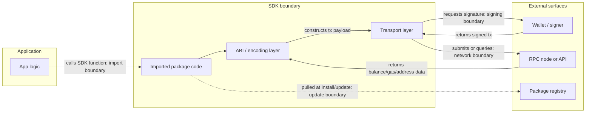
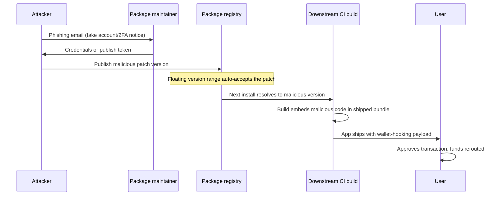
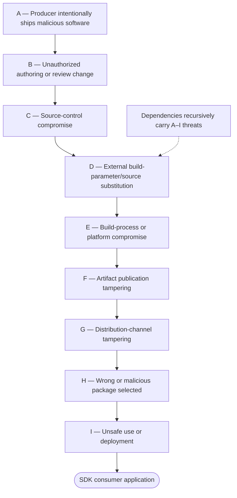

# Part 1: Foundations

[Back to Handbook contents](index.md) | [Series index](../index.md)

This part fixes the vocabulary this handbook uses throughout: what an **software development kit** (**SDK**) is in a Web3 context, the four types this handbook treats separately, and the trust boundaries an SDK crosses between application code, a wallet, and a network. It then builds the threat model, actor by actor and threat by threat, that every later testing chapter assumes the reader already has in mind.

---

## 1. Introduction to SDK Security

### 1.1 Why SDK Security Matters in Web3

A **software development kit** (**SDK**) is a packaged set of libraries, tools, and interfaces that lets an application talk to a specific system, in Web3's case a wallet, a smart contract, or a blockchain node, without the application team writing that integration from scratch. `ethers.js`, `viem`, the WalletConnect SDK, and Solana's `@solana/web3.js` are all SDKs in this sense: a developer imports one, and from that point forward the SDK's code, not the developer's own, constructs transactions, manages remote calls, or brokers the signing request. That delegation is the entire point of an SDK, and it is also the entire risk. Application code decides *what* to do; SDK code decides *how* the bytes that leave the browser or backend are actually shaped, and neither a wallet nor a smart contract has any way to distinguish a legitimate SDK call from a compromised one.

The **blast radius** of an SDK compromise dwarfs a typical application bug, because a single publish reaches every downstream consumer at once. The Ledger Connect Kit compromise of December 2023 is the reference case for this handbook: a phishing attack against a former Ledger employee's npm account let an attacker push a malicious update to a widely embedded wallet-connection SDK, and every dApp that pulled the update without pinning or verifying it served the tampered bundle to its own users, draining funds from wallets that never interacted with Ledger's own infrastructure directly ([Ledger's incident letter](https://www.ledger.com/blog/a-letter-from-ledger-chairman-ceo-pascal-gauthier-regarding-ledger-connect-kit-exploit)). Nearly two years later, the same pattern repeated at even greater scale. In September 2025, attackers phished the maintainer of `chalk`, `debug`, and sixteen other foundational npm packages with a combined two billion weekly downloads, then injected code that hooks `window.ethereum` and rewrites transaction payloads in the browser ([Socket](https://socket.dev/blog/npm-author-qix-compromised-in-major-supply-chain-attack), [Aikido](https://www.aikido.dev/blog/npm-debug-and-chalk-packages-compromised)). Neither `chalk` nor `debug` is itself a wallet SDK; both are transitive dependencies pulled in by SDKs that are. Socket's 2025 tracking found that roughly three-quarters of the blockchain-related malicious packages it identified were published to npm ([OWASP Web3 Attack Vectors Top 15](https://scs.owasp.org/sctop10/Web3-Attack-Vectors-Top15/)), the registry nearly every Web3 front end and Node-based backend depends on somewhere in its dependency graph.

### 1.2 Types of SDKs (Wallet, Contract, Front-End, Mobile)

SDKs used across a Web3 stack differ enough in what they touch that a single control set does not fit all of them. Four categories cover the practical landscape this handbook tests against.

**Wallet SDKs** manage or broker access to private keys and signing: WalletConnect, the Ledger and Trezor connector libraries, MetaMask's **SDK**, and Coinbase Wallet SDK. These sit closest to the money; a compromise here can sign or approve a transaction directly, or silently substitute the recipient address a user believes they are approving.

**Contract-interaction SDKs** encode function calls, manage application binary interfaces (ABIs), and submit transactions to a network through remote procedure call (RPC) nodes: `ethers.js`, `viem`, `web3.js`, and Solana's `@solana/web3.js` and Anchor client libraries. They rarely hold keys themselves, but they build the exact bytes a wallet blindly signs, so a corrupted encoding step, a swapped parameter order, a rewritten recipient, produces a technically valid, cryptographically sound transaction that does the wrong thing, with no error for the user to catch.

**Front-end SDKs** are UI and integration libraries bundled into the browser application: RainbowKit, wagmi hooks, and chain-abstraction toolkits. They overlap with the delivery-layer concerns of the CDN and Front-End Supply Chain Security Handbook (01), but the concern here is the package itself, not the CDN that later serves it.

**Mobile SDKs** ship inside native iOS and Android apps, including wallet apps, and carry risks specific to app-store distribution: a compiler-level compromise, Xcode itself was weaponized in the [XcodeGhost](https://en.wikipedia.org/wiki/XcodeGhost) campaign, which silently injected malicious code into thousands of iOS apps compiled with a tampered toolchain downloaded from unofficial mirrors, or a legitimate-looking ad or analytics SDK that turns out to exfiltrate data, as with the Android.Spy.SpinOk module found embedded in 101 apps with over 421 million combined installs before it was cleaned up ([Doctor Web](https://news.drweb.com/show/?i=14705)).

| SDK Type | Representative Examples | What It Touches | Blast Radius if Compromised |
|----------|-------------------------|------------------|------------------------------|
| Wallet | WalletConnect, MetaMask SDK, Ledger Connect Kit | Signing requests, key material, approval UI | Direct fund theft, silent approval hijack |
| Contract-interaction | ethers.js, viem, web3.js, Anchor client | ABI encoding, transaction construction, RPC submission | Valid-looking transactions with corrupted payloads |
| Front-end | wagmi, RainbowKit, chain-abstraction kits | Browser bundle, UI state, wallet connection flow | Phishing UI injection, connection hijack |
| Mobile | Wallet-app SDKs, ad/analytics SDKs, compiler toolchains | Device storage, clipboard, app binary at compile time | Bulk credential/seed exfiltration across app-store installs |

### 1.3 Relationship to SCSVS, SCSTG, SCWE

The OWASP smart contract standards were built around the assumption that the code under review is the code the team wrote. SDKs break that assumption: the vulnerability lives in a `package.json` entry, not a Solidity file, and this handbook exists to extend each standard to that boundary. The [Smart Contract Security Verification Standard (SCSVS)](https://scs.owasp.org/) states verifiable requirements an application must satisfy across categories such as **access control**, cryptography, and communications; the **SDK** test cases in Part 2 are how a team confirms a third-party dependency does not quietly undermine those requirements before it ships inside the application's trust boundary. The [Smart Contract Security Testing Guide (SCSTG)](https://scs.owasp.org/) documents testing methodology for contract systems; Part 2 extends that methodology outward into static analysis, dependency composition analysis, and behavioral testing of SDK code that a contract-focused guide never reaches. The [Smart Contract Weakness Enumeration (SCWE)](https://scs.owasp.org/) catalogs weaknesses in contract code; the SDK and dependency layer is a class of weakness the enumeration does not cover, and this handbook fills that gap.

The [OWASP Web3 Attack Vectors Top 15](https://scs.owasp.org/sctop10/Web3-Attack-Vectors-Top15/) frames three of its fifteen categories directly around this handbook's scope: WA02 (supply chain attacks against npm, PyPI, and other open-source registries), WA14 (wallet software, extension, and app compromises), and WA15 (nation-state infiltration through fake hiring and malicious open-source contributions). Companion handbooks own the adjacent pieces of this picture: Handbook 01 covers the CDN and front-end delivery layer that hosts an SDK's bundled output, Handbook 03 (Employee Lifecycle Security) covers the insider and fake-hire vectors behind WA15, Handbook 06 (**Incident Response**) owns the response process that this handbook's disclosure guidance in Chapter 12 feeds into, Handbook 07 (Infrastructure Security) covers the CI/CD and registry infrastructure an SDK's own build depends on, and Handbook 10 (Web3 Attack Vectors Mapping) maps the full Top 15 in detail.

### 1.4 How to Use This Handbook

Read this Part once to fix the vocabulary: what an **SDK** is, the four types treated separately, and the trust-boundary and **threat model** every later chapter assumes. After that, treat the handbook as a reference shelf rather than a cover-to-cover read. Testing a candidate wallet SDK before integration starts at Chapter 6. Wiring dependency scanning into a pipeline is Chapter 9. Preparing an SDK a team maintains for external review is Chapter 11. Handling a disclosed vulnerability in a dependency already shipped is Chapter 12.

Part 2 (Chapters 3 through 8) is the testing methodology core, organized first by concern, supply chain and dependency testing in Chapter 4, application programming interface (API) and interface security in Chapter 5, and then by SDK type across Chapters 6 through 8, each closing with a checklist meant to be run directly against a candidate package rather than read and set aside. Part 3 (Chapters 9 through 12) moves from testing to process: CI/CD integration, third-party SDK evaluation before adoption, review preparation, and responsible disclosure. Part 4 holds the glossary, a consolidated checklist that pulls every chapter's individual list into one document, and the full bibliography. Cross-references throughout point to sibling handbooks, 01, 03, 06, 07, and 10, wherever a topic crosses into delivery infrastructure, personnel risk, **incident response**, or infrastructure hardening rather than the SDK itself.

---

## 2. Threat Model for SDKs

### 2.1 Trust Boundaries and Data Flow

A **trust boundary** marks the point where data crosses from one level of assumed trust to another, and a useful **threat model** requires the boundaries to be drawn before a single vulnerability class is considered. An SDK crosses four such boundaries in a typical Web3 application, and treating any one of them as trusted by default is where nearly every incident in this Part begins.

The first boundary is the **import boundary**: application code trusts that the SDK package declared in a manifest file is the code that actually gets installed, at the version and with the behavior a developer reviewed. The second is the **update boundary**: because most projects declare a version range rather than an exact pin, the application implicitly re-extends that same trust to every future patch release the registry serves, without a human reviewing it again. The third is the **signing boundary**: a wallet trusts that the transaction payload an SDK hands it for signature reflects the user's actual intent, with no independent way to verify that the SDK's encoding step did not substitute a value along the way. The fourth is the **network boundary**: the SDK trusts data returned by an RPC node or API endpoint, balances, gas estimates, contract addresses, and frequently passes that data back to the application or wallet without re-validation.



*Figure 1. The four trust boundaries an SDK crosses. Each arrow is a point where a defender should ask what happens if the data crossing it is wrong.*

### 2.2 Threat Actors (Malicious Package, Compromised Dependency, User Error)

Not every SDK-layer incident has the same actor behind it, and the categories worth separating call for different controls.

A **malicious package publisher** sets out from the start to deceive: a typosquatted name (`web3js` instead of `web3`), a convincing but fake fork of a popular library, or a brand-new package designed to look like tooling a developer would plausibly need. [MITRE ATT&CK's](https://attack.mitre.org/techniques/T1195/) (Adversarial Tactics, Techniques, and Common Knowledge) T1195 Supply Chain Compromise sub-technique T1195.001, Compromise Software Dependencies and Development Tools, catalogs this pattern generically across platforms. MITRE also maintains a sibling framework, [AADAPT](https://aadapt.mitre.org/) (Adversarial Actions in Digital Asset Payment Technologies), which applies the same tactic-and-technique structure specifically to blockchain and digital-asset systems and is worth cross-referencing alongside ATT&CK when threat-modeling a wallet **SDK**.


*Figure. A typosquatting example in a browser address bar: a misspelled destination that looks close enough to the intended one to fool a quick glance. The same technique drives typosquatted package names such as `web3js` in place of `web3`. Source: [Wikimedia Commons](https://commons.wikimedia.org/wiki/File:Typosquatting_(Firefox_74).svg), CC0 1.0 Universal Public Domain Dedication.*

A **compromised dependency maintainer** is a legitimate, previously trustworthy account taken over by an attacker, usually through credential phishing rather than a code-level exploit. The September 2025 compromise of the `chalk` and `debug` maintainer began with an email spoofing npm's own domain, warning of an imminent account lockout over outdated authentication and linking to a credential-harvesting page ([Aikido](https://www.aikido.dev/blog/npm-debug-and-chalk-packages-compromised)). The 2018 `event-stream` incident took a slower route: an attacker earned co-maintainer status on a legitimate, popular package through ordinary open-source contribution, then added an encrypted payload as a new dependency, `flatmap-stream`, that activated only when it detected the Copay bitcoin wallet in the surrounding dependency tree ([GitHub issue #116](https://github.com/dominictarr/event-stream/issues/116)).

**User error** is the quieter category, and the one entirely within a development team's own control: installing a package without checking its download history, ignoring a lockfile and letting a floating version range pull an unreviewed patch, or granting a wallet-connected dApp broader signing scope than an interaction requires. None of the incidents above required a defender mistake to succeed, but most were survivable by a team that pinned versions and reviewed diffs before upgrading, which is why Chapter 4 treats dependency hygiene as a control, not an afterthought.

| Actor | Access Path | Objective | Representative Incident |
|-------|-------------|-----------|--------------------------|
| Malicious package publisher | Typosquat, fake fork, or new deceptive package | Immediate credential or key theft on install or first run | Ongoing typosquat campaigns (WA02) |
| Compromised dependency maintainer | Phished credentials or long-term social engineering into commit access | Wallet-draining code shipped in a trusted, high-download package | `chalk`/`debug` (Sept 2025); `event-stream` (2018) |
| Nation-state actor | Fake hiring, long-horizon open-source contribution, targeted CI compromise | Espionage, sanctioned-state revenue generation | WA15 patterns; long-horizon maintainer trust-building |
| User/developer error | Unpinned versions, disabled lockfiles, over-scoped wallet permissions | Not intentional; amplifies every row above | Present in nearly every major incident's spread |

### 2.3 Supply Chain and Dependency Tampering (Build, Registry, Dependency Updates)

Dependency tampering happens at three distinct points, and each has a different defensive answer.

**Build-time tampering** alters what a package does during its own installation or compilation, before any application code runs. An npm `postinstall` script, a Python package's `setup.py`, or a similar lifecycle hook executes arbitrary code the moment a package manager installs it, with no import statement required. A defender reviewing a new dependency should treat any lifecycle script as a first-class thing to read, not skip:

```json
{
  "scripts": {
    "postinstall": "node ./scripts/postinstall.js"
  }
}
```

That single line is not itself malicious, but it is the exact mechanism class the [tj-actions/changed-files compromise (CVE-2025-30066)](https://www.cisa.gov/news-events/alerts/2025/03/18/supply-chain-compromise-third-party-tj-actionschanged-files-cve-2025-30066-and-reviewdogaction) used at the continuous integration and continuous deployment (CI/CD) level: a widely used GitHub Action, invoked by more than 23,000 repositories, had its version tag repointed to a commit that dumped runner memory into build logs, exposing secrets to anyone who could read the log.

**Registry-time tampering** compromises the account or infrastructure that publishes a package, so the malicious code never touches the project's source repository at all, only the artifact the registry actually serves. This is the pattern behind both the `event-stream` and `chalk`/`debug` incidents from Section 2.2: the package a build tool pulled differed from what a reviewer would have found by reading the project's public source repository.

**Dependency-update tampering** exploits how most projects consume dependencies: a caret or tilde version range (`^5.3.0`) rather than an exact pin, which lets a CI pipeline or a fresh install silently pull a newer, malicious patch release with no code review at all. A related but distinct vector is dependency confusion, where an attacker publishes a public package sharing the name of an organization's private internal package; because public registries are often resolved ahead of private ones by default, the build silently resolves to the attacker's version. [Alex Birsan's original 2021 disclosure](https://medium.com/@alex.birsan/dependency-confusion-4a5d60fec610) demonstrated this technique against more than 35 companies, including Apple, Microsoft, and PayPal, and drew bounty payouts up to $40,000 per company.



*Figure 2. A registry-level compromise propagates to every downstream consumer on the next install, with no code review in the path.*

### 2.4 STRIDE and Attack Scenarios for SDKs

Spoofing, Tampering, Repudiation, Information disclosure, Denial of service, Elevation of privilege (STRIDE) applied to the **SDK** layer surfaces scenarios a generic application **threat model** tends to miss, because the vulnerable component is neither the front end nor the contract: it is the code connecting them.

| STRIDE Category | SDK Scenario | Primary Control |
|------------------|---------------|------------------|
| **S**poofing | Typosquatted package name (`ehters.js`, `web3-js`) mimics a real SDK in search results and install commands | Download-count and publisher verification, lockfile pinning |
| **T**ampering | A legitimate, previously clean package version is republished with injected code | Hash pinning, signed provenance verification (Chapter 6) |
| **R**epudiation | No signed record of who published a given version, so a malicious release cannot be attributed after the fact | Signed commits, provenance attestations, transparency logs |
| **I**nformation disclosure | SDK telemetry, error reporting, or a build-time script exfiltrates keys, seed phrases, or environment secrets | Network egress review, secret scanning, disabling unneeded telemetry |
| **D**enial of service | SDK hardcodes or silently defaults to a single RPC endpoint that becomes unavailable or rate-limits under load | Provider redundancy, configurable endpoints, circuit breakers |
| **E**levation of privilege | SDK requests broader wallet permissions than the interaction needs (a blanket signing method instead of a scoped one) | Least-privilege signing method choice, permission review (Chapter 6) |

A worked scenario ties the row to the earlier sections. A contract-interaction SDK adds a convenience method that silently falls back to a public, unauthenticated RPC endpoint whenever a developer's configured provider times out. Spoofing risk: nothing in a typical dependency review catches that fallback endpoint being swapped for a malicious one in a later release. Tampering risk: an attacker controlling that fallback endpoint returns a manipulated token balance or gas estimate to the application. Elevation risk: because the SDK, not the application, decides which endpoint to trust, the application has no visibility into the substitution at all. The controls that close every branch here are the same ones the rest of this Part builds toward: pin exact versions, verify provenance before upgrading, and never let an SDK make a trust decision, which endpoint, which permission scope, that the application cannot see or override.

### 2.5 Supply Chain and Distribution Risks

Section 2.3 covered how a single package gets tampered with. This section covers the infrastructure that distributes packages at scale, where a single point of failure reaches every consumer simultaneously regardless of how carefully any one team reviews its own dependencies.

Registry account security is the weakest link most often exploited, because a maintainer with commit access to a package carrying hundreds of millions of weekly downloads is a target disproportionate to any protection most individual volunteers have in place. The phishing email used against the `chalk`/`debug` maintainer in September 2025 spoofed npm's own domain and exploited exactly this asymmetry: one successful phish against one volunteer maintainer propagated to every project that had that package anywhere in its dependency tree ([Aikido](https://www.aikido.dev/blog/npm-debug-and-chalk-packages-compromised)). Registry infrastructure itself is a second layer of risk: npm, PyPI, and mobile app stores each run their own vetting and takedown processes, and response time varies widely. The SpinOk Android **SDK** spyware remained distributed inside legitimate apps on Google Play for an extended period after independent researchers first flagged it, reaching over 421 million cumulative installs before a cleaned-up version shipped ([Doctor Web](https://news.drweb.com/show/?i=14705)).

Web3 tooling specifically skews toward one registry, which concentrates the risk further. Socket's 2025 tracking found that roughly three-quarters of the blockchain-related malicious packages it identified were published to npm ([OWASP Web3 Attack Vectors Top 15, WA02](https://scs.owasp.org/sctop10/Web3-Attack-Vectors-Top15/)), reflecting how much of the Web3 front-end and tooling ecosystem sits on the JavaScript package graph regardless of which chain a project targets. Distribution risk also overlaps with the CDN layer covered in Handbook 01: an SDK's bundled output is frequently served from the same third-party CDN infrastructure as any other front-end asset, so a CDN compromise and an SDK registry compromise can produce the identical user-facing failure, a tampered script running in a browser, by two entirely different supply-chain paths.

### 2.6 SLSA Threat Model and Mitigations (slsa.dev)

[SLSA](https://slsa.dev/spec/v1.2/) (Supply-chain Levels for Software Artifacts) is the cross-industry framework for describing, in verifiable and incremental terms, how confident a consumer can be that a software artifact was built the way its publisher claims. Originally released as v1.0, the specification has since progressed to v1.2, and v1.0 is now formally retired in its favor; the core structure both share is a Build Track describing how trustworthy an artifact's provenance is, joined in the current version by a Source Track describing how trustworthy the source repository itself is ([SLSA v1.2 specification](https://slsa.dev/spec/v1.2/)).

The Build Track runs four levels. **Level 0** is no guarantee at all, the default for an unmanaged local build. **Level 1** requires a consistent build process and distributed provenance, but places no authenticity or accuracy requirements on that provenance. **Level 2** adds authentic provenance generated by a hosted build platform. **Level 3** requires unforgeable provenance and isolated builds, materially raising the cost of interference by a tenant-controlled build step ([SLSA v1.2 Build requirements](https://slsa.dev/spec/v1.2/build-requirements)). These levels describe provenance integrity and build-platform properties; they do not certify that the source code is non-malicious.

**SLSA**'s **threat model** names threats across source, build, distribution, and consumption; mapping the earlier sections of this chapter onto them shows where each incident type sits. Unauthorized changes and source-repository compromise cover a maintainer account takeover like `event-stream` or `chalk`/`debug`; compromised dependencies cover the transitive-pull problem from Section 2.3; build-process compromise and modified-package upload cover the tj-actions pattern; registry and package compromise cover the distribution risks from Section 2.5 ([SLSA v1.2 threats and mitigations](https://slsa.dev/spec/v1.2/threats-overview)).



*Figure 3. SLSA v1.2's A–I threat locations across producer intent, source, build, publication, distribution, selection, and use. Dependency chains recursively contain the same threat set. SLSA does not claim to mitigate every row—for example, it does not make an intentionally malicious producer trustworthy. Source model: [SLSA v1.2 supply-chain threats](https://slsa.dev/spec/v1.2/threats-overview).*

For an **SDK** consumer, the practical output of this model is a per-dependency decision, not a single project-wide policy:

| SDK Criticality Tier | Example | Minimum Build Level to Require | Verification Step |
|-----------------------|---------|----------------------------------|---------------------|
| Signs or holds keys | Wallet connector SDKs | SLSA Build L3 plus signed provenance | Verify provenance attestation before every upgrade (Chapter 6) |
| Constructs transactions | Contract-interaction SDKs | SLSA Build L2 minimum | Diff released source against the published package before pinning |
| UI/front-end only | Component and hook libraries | SLSA Build L1, acceptable with hash pinning | Hash-pin in the lockfile, monitor for unexpected updates |
| Build-time/dev-only | Linters, test tooling | SLSA Build L1 | Standard dependency review, isolate from production build secrets |

---

**Key controls for Part 1**

- Classify every SDK in an application by type (wallet, contract-interaction, front-end, mobile) before assessing it; each carries a different **blast radius**.
- Draw the four trust boundaries (import, update, signing, network) explicitly for any SDK a team relies on, rather than assuming the boundary is safe by default.
- Track the actor behind a given risk, malicious publisher, compromised maintainer, nation-state, or internal error, because the control that stops one rarely stops another.
- Run the STRIDE scenarios in Section 2.4 against any SDK handling signing, funds, or sensitive data before adoption.
- Require a minimum SLSA Build Track level proportional to what the SDK touches, and verify provenance attestations rather than trusting a registry listing alone.

