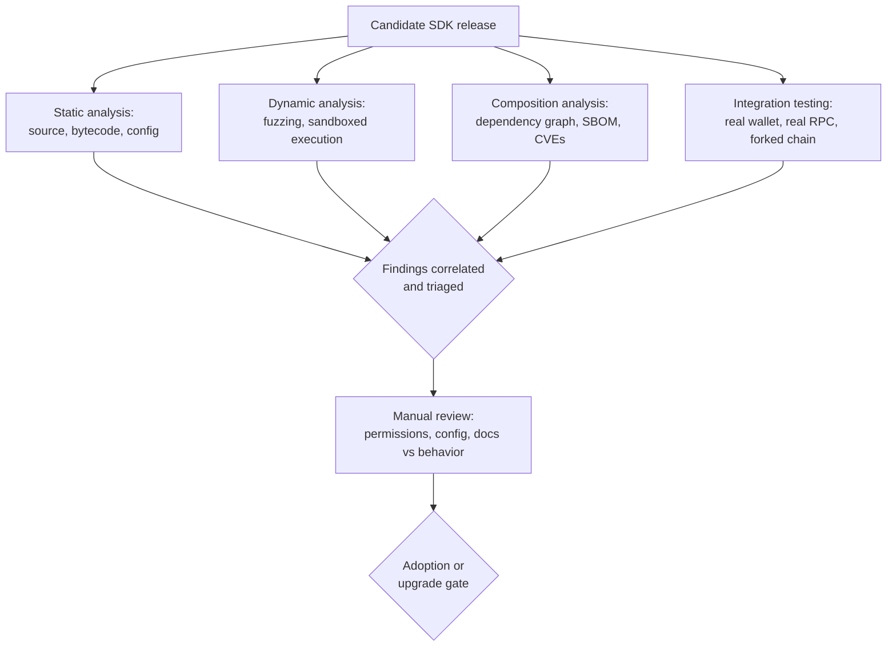
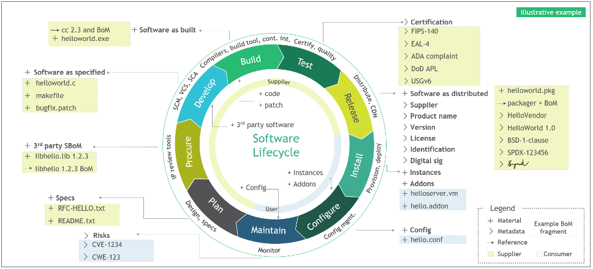
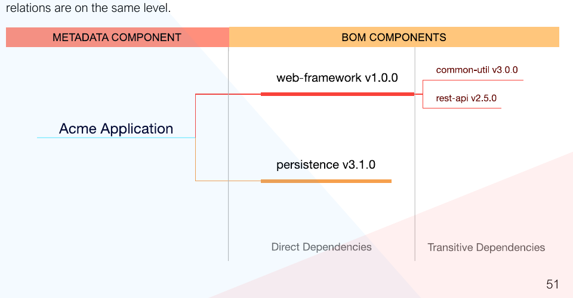
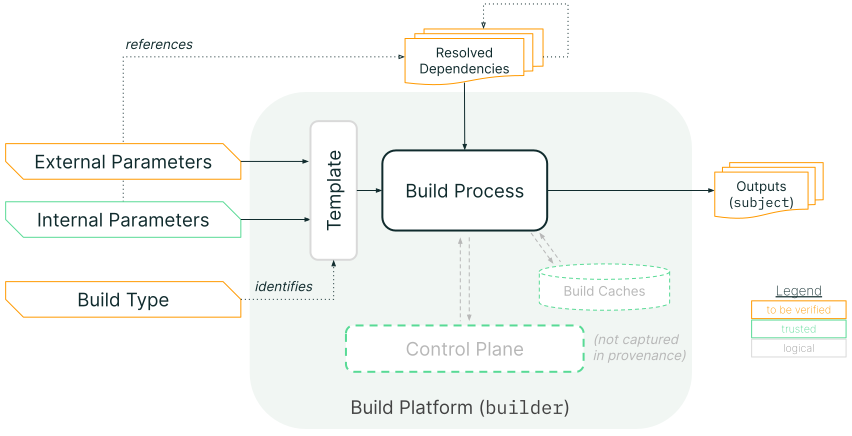
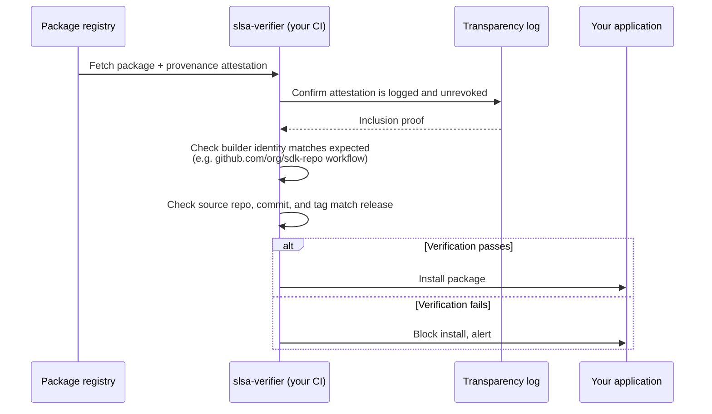
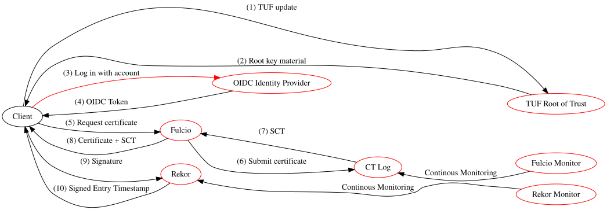
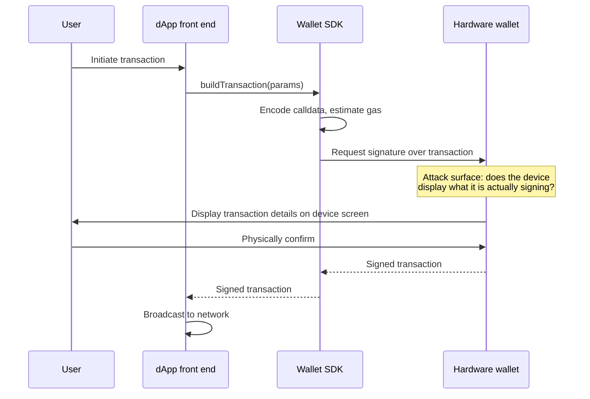

# Part II: Testing Methodology

[Back to Handbook contents](index.md) | [Series index](../index.md)

This part is the working reference for testing a **software development kit** (**SDK**) before it ships inside your application's trust boundary. It moves from a general testing framework through supply chain verification, API and interface hardening, and into the three SDK families a Web3 team is most likely to integrate: wallet and key-handling SDKs, contract interaction SDKs, and front-end or mobile SDKs. Each chapter ends with the checklist a reviewer runs against a candidate package.

---

## 3. Testing Framework Overview

An **SDK** is code you did not write, running with the access your application grants it. No single technique covers that risk on its own, so this chapter lays out four complementary testing lanes and where each one catches what the others miss.



*Figure 1. The four testing lanes converge on a manual review gate before an SDK version is adopted or upgraded. No lane substitutes for another: static analysis cannot see runtime network calls, and dynamic testing cannot see a typosquatted transitive dependency that never executes during the test run.*

### 3.1 Static and Dynamic Testing

**Static analysis** examines the **SDK**'s source or compiled artifact without executing it. For JavaScript and TypeScript SDKs, this means running a linter and a security-focused static analyzer such as Semgrep or ESLint security plugins against the package's shipped source (not just its published `d.ts` types), looking for dangerous sinks: `eval`, dynamic `require`, unchecked `child_process` calls, and network calls to hosts not documented in the SDK's own README. For compiled or bundled artifacts, decompile or at minimum diff the published bundle against the tagged source release; a mismatch between the two is itself a finding, since it means the artifact you would ship is not the artifact anyone reviewed.

**Dynamic analysis** executes the SDK under controlled conditions and observes what it actually does: which hosts it contacts, what it writes to disk or browser storage, and how it behaves under malformed input. Run the SDK's own test suite under a network-monitoring proxy (mitmproxy or a similar intercepting proxy) and diff the observed egress against the documented API surface; an unexpected call to a telemetry or analytics endpoint is a common and easy first finding. Where the SDK exposes parsing or decoding functions (ABI decoders, QR-code parsers, deep-link handlers), fuzz them with malformed and boundary-value input rather than only the examples in the SDK's own documentation.

| Technique | Catches | Misses | Representative tooling |
|---|---|---|---|
| Static source analysis | Dangerous sinks, hardcoded secrets, insecure defaults | Runtime-only behavior, obfuscated or minified logic | Semgrep, CodeQL, ESLint security plugins |
| Static bytecode/binary diff | Published-artifact-vs-source tampering | Behavior that only triggers under live network conditions | `diff`, reproducible-build tooling (Section 4.6) |
| Dynamic network monitoring | Undocumented egress, telemetry, exfiltration | Logic-only bugs with no network side effect | mitmproxy, Burp Suite, OS-level pcap |
| Fuzzing of parsers/decoders | Crashes, malformed-input handling, injection via decoded values | Business-logic flaws that require valid, well-formed input | Jazzer.js, AFL-style fuzzers, property-based testing (fast-check) |

### 3.2 Composition and Dependency Analysis

Composition analysis asks a different question than static or dynamic testing: not "is this code safe" but "what is this package actually made of." An **SDK**'s own source can be clean while a transitive dependency three levels down carries a known vulnerability or an active backdoor, which is precisely the shape of the [`@solana/web3.js` compromise of December 2024](https://socket.dev/blog/supply-chain-attack-solana-web3-js-library), where a compromised maintainer account on npm pushed malicious versions 1.95.6 and 1.95.7 that exfiltrated **private key** material to a hardcoded wallet address, exposed to roughly 350,000 weekly downloads before removal ([Socket.dev](https://socket.dev/blog/supply-chain-attack-solana-web3-js-library)).

Generate a full dependency inventory before you generate the **SBOM** the rest of this chapter builds on:

```bash
# Node.js/npm: full transitive tree, including dev dependencies
npm ls --all --json > dependency-tree.json

# Rust/Cargo: transitive tree with duplicate-version detection
cargo tree --duplicates

# Python: installed package graph
pip install pipdeptree && pipdeptree --json-tree > dependency-tree.json

# Go: full module graph
go mod graph > dependency-graph.txt
```

Feed the tree into a composition scanner (Section 4.5) and flag three patterns specifically: packages with a single maintainer and no recent commit activity, packages whose version jumped by more than a minor release with no corresponding changelog entry, and any dependency resolved from a registry other than the one your lockfile expects. Composition analysis is only as good as the depth it reaches; a scanner that stops at direct dependencies would have missed the compromised package sitting two hops into a wallet-adapter's own dependency tree.

### 3.3 Integration and Behavioral Testing

Static and composition analysis tell you what the **SDK** could do; integration testing tells you what it does when wired into something that resembles production. Stand the SDK up against a forked mainnet or testnet (Foundry's `anvil --fork-url`, Hardhat's `hardhat_reset` with a `forking` block, or a Solana `test-validator` cloned from mainnet state) and drive it through its full lifecycle: initialization, a signing operation, a contract call, and teardown. Behavioral testing extends this by asserting on side effects the SDK does not document: does closing the SDK instance clear key material from memory, does a failed transaction leave a stale nonce lock, does a network timeout retry silently or surface to the caller.

Pair this with a mocked-provider harness so you can test failure paths that a live fork cannot easily reproduce: a wallet provider that rejects every signature request, an RPC endpoint that returns malformed JSON, a **hardware wallet** transport that disconnects mid-transaction. An SDK that throws an unhandled promise rejection or, worse, silently swallows the error and returns a default value under any of these conditions has failed integration testing even if every unit test in its own suite passes, because the failure mode is exactly the one an attacker or a flaky network will trigger in production.

### 3.4 Manual Review and Configuration Testing

Automated tooling finds what it is programmed to look for; manual review finds what the tooling was never told to expect. A reviewer reads the **SDK**'s default configuration and asks whether each default is secure by default: does the SDK default to verifying TLS certificates, does it default to the safest signing mode available (typed data over raw hex), does it default to a minimal permission or scope request. Cross-check the SDK's documented behavior against its actual behavior line by line for the security-relevant claims specifically (key storage location, network endpoints contacted, data retained between sessions); a documentation gap here is itself a finding, because a security team cannot review a control the vendor never disclosed.

Configuration testing walks every exposed option the SDK accepts and asks what happens at each extreme: an empty API key, a malformed chain ID, a negative gas limit, a callback URL pointing at `localhost`. Record findings against this checklist:

- [ ] Every documented default is the secure option, not the permissive one
- [ ] Undocumented configuration options do not exist, or are flagged as internal/unstable
- [ ] TLS verification cannot be silently disabled by a single boolean without a corresponding warning log
- [ ] Debug or verbose logging modes do not print secrets, seed phrases, or full transaction payloads to stdout
- [ ] The SDK fails closed (rejects the operation) rather than fails open (proceeds with defaults) on invalid configuration

---

## 4. Supply Chain and Dependency Testing

The previous chapter's composition analysis identifies what an **SDK** depends on; this chapter defines the evidence formats and verification chain that let you trust what you found, rather than merely list it. Supply chain risk in the OWASP Top 10:2025 is significant enough to warrant its own top-level category, A03 **Software Supply Chain** Failures, ahead of injection and authentication failures in the current ranking ([OWASP Top 10:2025](https://owasp.org/Top10/2025/)).

### 4.1 Identifying Direct and Transitive Dependencies

Direct dependencies are the packages an **SDK**'s manifest names explicitly; transitive dependencies are everything those packages pull in, recursively, and this second set is both far larger and far less scrutinized. A typical wallet-adapter SDK might declare a dozen direct dependencies and resolve to several hundred transitive ones, and the [Ledger Connect Kit compromise of December 2023](https://www.ledger.com/blog/a-letter-from-ledger-chairman-ceo-pascal-gauthier-regarding-ledger-connect-kit-exploit) demonstrated that the depth of the tree does not correlate with the depth of the damage: a single compromised package, however deep, propagated to every dApp that imported it without pinning. A compromise three hops deep (an image parser pulled in by a QR decoder pulled in by a wallet adapter) has the same **blast radius** as a compromise in a direct dependency, because every consumer of the top-level SDK inherits it regardless of depth.

Testing at this level means generating the tree (Section 3.2 commands), then explicitly walking every leaf node that has write access to disk, network access, or that runs during install (`postinstall` scripts are a disproportionately common attack vector and should be enumerated separately: `npm ls --all --json | jq` filtered for packages with lifecycle scripts, or `npm config set ignore-scripts true` as a default posture with explicit allowlisting).

### 4.2 SBOM: CycloneDX 1.6, SPDX 3.0, VEX (Vulnerability Exploitability)

A software bill of materials (**SBOM**) is a machine-readable inventory of everything a piece of software is built from: every direct and transitive dependency, its version, its license, and increasingly its build provenance. Two formats dominate current practice. [CycloneDX](https://cyclonedx.org/docs/1.6/json/), maintained under OWASP, reached version 1.6 in April 2024 and was standardized as ECMA-424 1st Edition, extending coverage beyond software components to hardware, services, cryptographic assets, and AI models, with build formulation and assembly-completeness fields relevant to verifying an **SDK**'s own build. [SPDX 3.0](https://spdx.dev/), an ISO/IEC 5962 lineage standard released in April 2024, restructured the format around a Resource Description Framework (RDF) model with eight independent profiles (Core, Software, Security, Build, AI, Dataset, Licensing, and Lite), letting a consumer request only the Security profile of an SBOM without parsing the rest.

Neither format alone tells you whether a listed vulnerability actually affects the SDK as integrated. That is the job of VEX (Vulnerability Exploitability eXchange), a companion document format that annotates each SBOM entry's known vulnerabilities with an exploitability status, defined by the [CISA VEX working group](https://www.cisa.gov/) and implemented in profiles such as [OpenVEX](https://github.com/openvex/spec): `affected`, `not_affected`, `fixed`, or `under_investigation`. Without VEX, a security scanner flags every CVE in the dependency tree regardless of whether the vulnerable code path is reachable, producing the false-positive volume that makes teams stop reading scanner output altogether.

```json
{
  "vulnerability": "CVE-2024-XXXXX",
  "product": "pkg:npm/example-wallet-sdk@2.4.1",
  "status": "not_affected",
  "justification": "vulnerable_code_not_in_execute_path",
  "impact_statement": "Vulnerable function is only reachable via a legacy XML import path removed in this build configuration."
}
```

Require an SBOM in CycloneDX 1.6 or SPDX 3.0 as a condition of SDK adoption (Section 10 of Part III), and require VEX statements for any Critical or High severity vulnerability the SBOM's own composition scan surfaces, rather than accepting a bare "we're aware of it."


*Figure. NIST's SBOM assembly-line model shows why a single package list at release time is incomplete: materials, metadata, and references accumulate throughout procurement, development, build, testing, release, installation, and configuration. An SDK assessment should preserve those relationships, not flatten them into names and versions. Source: [NIST, Software Security in Supply Chains, Appendix F Figure 2](https://www.nist.gov/image/appendix-f-figure-2), public domain (U.S. government work).*


*Figure. CycloneDX preserves dependency relationships instead of treating an SBOM as a flat package inventory. That graph is essential when a vulnerable component is present but only reachable through a particular SDK or build path. Source: [OWASP CycloneDX, Authoritative Guide to SBOM](https://www.cyclonedx.org/guides/OWASP_CycloneDX-Authoritative-Guide-to-SBOM-en.pdf), reproduced with attribution to the OWASP CycloneDX project.*

### 4.3 SLSA v1.2: Build and Source Tracks, Provenance, and Verification

Supply-chain Levels for Software Artifacts (SLSA, pronounced "salsa") defines graduated requirements for establishing verifiable properties of software source and builds. [SLSA v1.2](https://slsa.dev/spec/v1.2/) is the current approved specification and supersedes the retired v1.0 material. It has two independent tracks relevant to SDK assurance: the **Build Track** (L0–L3), which measures provenance integrity and build-platform isolation, and the **Source Track** (L0–L4), which measures version control, history and source provenance, continuous technical controls, and two-party review. An SDK evaluation should record both tracks rather than using “SLSA level” as an ambiguous single score.

Provenance is metadata **about** the artifact: a structured statement binding an output digest to source, builder, and build parameters. It is not the package itself and does not prove that the source is benign. Verification is the consumer-side act of authenticating that statement, confirming the subject digest matches the artifact about to be installed, checking builder/source identities and policy, and rejecting an absent, malformed, unexpected, or unverifiable attestation rather than trusting its claims at face value.


*Figure. The SLSA provenance model separates caller-controlled external parameters from builder-resolved dependencies and binds both to the output artifact. Reviewers should verify the provenance predicate and builder identity, not merely check that an attestation file exists. Source: [SLSA Build Provenance](https://slsa.dev/spec/v1.2-rc2/build-provenance), Community Specification License 1.0.*



*Figure 2. Consumer-side SLSA verification gate. The check runs in your own CI/CD before the SDK is installed, not once at initial adoption, so a later malicious release with unmatched or absent provenance is caught on every build.*

Bake this verification step into the CI/CD pipeline that pulls in the **SDK** (Part III, Chapter 9), not just into a one-time vendor assessment: a package that shipped SLSA-compliant provenance at version 2.0.0 can still ship a compromised, unattested version 2.0.1 if nothing checks every install.

#### 4.3.1 Build L0–L3 and Source L0–L4 in v1.2

The Build Track retains L0 through L3 in v1.2. The Source Track added in v1.2 is separately assessed from L0 through L4; its L4 requires two trusted persons to agree to changes to protected branches. A producer can therefore be Build L3 but Source L1, or Source L4 but Build L0. Neither track should be inferred from repository badges or CI-provider marketing—verify the attestations and the platform assessment against policy.

| Level | Requirement | What it proves | Typical SDK posture |
|---|---|---|---|
| **L0** | None | Nothing; development or test builds only | A maintainer's laptop `npm publish` with no CI involvement |
| **L1** | Consistent build process; provenance exists and is distributed | The output is digest-bound to descriptive provenance, but the specification imposes no authenticity or accuracy requirement at this level | CI emits provenance that the consumer treats as informational |
| **L2** | All L1, plus authentic provenance generated by a hosted build platform | A verifier can authenticate the attestation and identify the platform/control plane that issued it | An assessed hosted builder with policy-verified identity and signed provenance |
| **L3** | All L2, plus unforgeable provenance and isolated builds | Tenant-controlled build steps cannot forge provenance or influence another build under the assessed platform model | A documented SLSA Build L3 platform and generator, verified against its assessment |

Treat L2 as the practical minimum bar for a wallet or contract-interaction **SDK** your team ships to end users, and treat the absence of any provenance at all (effectively L0) as a finding to raise during SDK evaluation (Part III, Chapter 10), not a detail to note in passing.

| Source level | Required property | SDK-consumer evidence |
|---|---|---|
| **L0** | No Source Track claim | No trustworthy Source VSA |
| **L1** | Source is version controlled | Source VSA identifies an immutable revision |
| **L2** | Continuous history and source provenance | Source provenance records who/what changed protected references and preserves ancestry |
| **L3** | Continuous enforcement of declared technical controls | Attestations show branch/tag protections and organization-defined controls remained in force |
| **L4** | Two-party review for protected-branch changes | Evidence binds the final revision to approval by at least two trusted persons |

For high-impact SDKs, pair Build L2 or L3 with Source L3 or L4. Build provenance cannot compensate for unilateral, malicious source changes, while reviewed source cannot compensate for a compromised or non-verifiable build path.

### 4.4 Signed Provenance and Sigstore (Fulcio, Rekor, Cosign)

Provenance is only trustworthy if it is signed by an identity you can verify, and signed by a key that was not itself sitting in a CI secret waiting to be exfiltrated. [Sigstore](https://docs.sigstore.dev/) solves this with keyless signing: a CI job authenticates to an OpenID Connect (OIDC) identity provider (proving it is, for example, the specific GitHub Actions workflow at a specific commit), [Fulcio](https://docs.sigstore.dev/) issues a short-lived certificate binding a freshly generated, ephemeral key to that identity, [Cosign](https://docs.sigstore.dev/) uses the ephemeral key to sign the artifact and then discards it, and [Rekor](https://docs.sigstore.dev/) records the signing event in a public, append-only transparency log. No long-lived **private key** exists for an attacker to steal, and every signature is independently auditable against the log.


*Figure. Sigstore's signing trust model makes the independent verification points explicit: workload identity, short-lived certificate issuance, transparency-log inclusion, registry integrity, and verifier policy. A pipeline that validates only the signature but not the expected OIDC identity leaves the central authorization question unanswered. Source: [Sigstore Threat Model](https://docs.sigstore.dev/about/threat-model/), official Sigstore project documentation, Apache-2.0.*

For an **SDK** you consume, verification is a single command run in CI before install, checking both the signature and the identity that produced it:

```bash
# Verify an SDK release was signed by the expected CI workflow identity,
# and that the signing event is present in the public transparency log
cosign verify \
  --certificate-identity-regexp "^https://github.com/example-org/wallet-sdk/.github/workflows/release.yml@refs/tags/v.*$" \
  --certificate-oidc-issuer "https://token.actions.githubusercontent.com" \
  ghcr.io/example-org/wallet-sdk:2.4.1
```

A verification failure here (wrong identity, missing signature, or an artifact absent from Rekor) should hard-fail the build, the same posture as an **SLSA** provenance mismatch. The two checks are complementary: SLSA provenance describes what was built and how; Sigstore proves who attested to it and that the attestation has not been silently altered since.


*Figure. The traditional certificate-issuance model a public key infrastructure (PKI) formalizes: an identity is vetted, then a certification authority issues a certificate binding that identity to a key. Sigstore's Fulcio automates this same role for CI workflows, issuing a short-lived certificate bound to an OIDC identity instead of a long-term key a maintainer must protect. Source: [Wikimedia Commons](https://commons.wikimedia.org/wiki/File:Public-Key-Infrastructure.svg), CC BY-SA 3.0.*

### 4.5 Vulnerability Databases and Continuous SCA

**Software composition analysis** (**SCA**) is only as current as the vulnerability data it queries against, so treat the database choice as part of the control, not an implementation detail. [OSV.dev](https://osv.dev/), maintained by Google's Open Source Security team, aggregates ecosystem-specific advisories (npm, PyPI, crates.io, Go, and more) in a schema designed for automated tooling rather than human reading. The [GitHub Security Advisory (GHSA) database](https://github.com/advisories) feeds directly into `npm audit` and Dependabot for packages hosted on GitHub-adjacent registries. The [National Vulnerability Database (NVD)](https://nvd.nist.gov/), maintained by NIST, provides the canonical Common Vulnerabilities and Exposures (CVE) records that both feed and are fed by the others.

Run composition analysis as a continuous CI gate, not a point-in-time audit, since a dependency that was clean at integration time can have a CVE published against it the following week:

```bash
# OSV-Scanner against a lockfile, machine-readable output for CI gating
osv-scanner --lockfile=package-lock.json --format=json > osv-results.json

# Fail the build on any Critical or High finding without a VEX "not_affected" statement
jq '[.results[].packages[].vulnerabilities[]? |
     select(.severity[]?.score >= 7.0)] | length > 0' osv-results.json
```

Schedule a second, independent run on a cron trigger (daily is typical) against the dependency tree of every **SDK** already in production, not only at build time, so that a newly disclosed vulnerability in a package you integrated eighteen months ago surfaces without waiting for your next dependency bump.

### 4.6 Reproducible Builds and Integrity

A **reproducible build** is one where building the same source, with the same declared toolchain and inputs, produces byte-for-byte identical output regardless of who runs the build or when ([Reproducible Builds project](https://reproducible-builds.org/)). This closes a gap that signing alone leaves open: signing proves an identity attested to an artifact, but says nothing about whether that artifact actually corresponds to the public source it claims to be built from. A malicious insider with legitimate signing access, or a compromised build server, can sign a tampered artifact and pass every provenance and Sigstore check described above.

Reproducibility turns that gap into something independently checkable: any third party can pull the tagged source, run the documented build, and compare the resulting hash against the one the vendor published and signed.

```bash
# Rebuild an SDK release from tagged source and diff against the published artifact
git clone --branch v2.4.1 https://github.com/example-org/wallet-sdk
cd wallet-sdk && npm ci && npm run build

sha256sum dist/wallet-sdk.min.js
# Compare against the hash published in the release notes / provenance attestation
```

Web3 tooling already has a working precedent for this discipline in contract verification: [Sourcify](https://sourcify.dev/) and Etherscan's bytecode-matching verification both depend on a deterministic Solidity compilation producing bytecode that matches what was deployed on chain, and the same rebuild-and-diff logic applies directly to an **SDK**'s JavaScript bundle or native binary. Where an SDK vendor cannot reproduce their own published build, treat that as a supply chain finding: it means neither you nor they can prove the shipped artifact matches the reviewed source.

### 4.7 Version Pinning, Private Registry, and Sourcing Policies

Every control in this chapter assumes you know exactly which version of an **SDK** is running, which means floating version ranges (`^2.4.0`, `latest`, or an unpinned Git branch reference) undermine all of them at once: a caret range can silently resolve to a compromised patch release the moment it publishes, before your next scheduled **SBOM** or SLSA check even runs. Pin exact versions in the manifest and commit the lockfile (`package-lock.json`, `Cargo.lock`, `poetry.lock`) so that every install, in every environment, resolves identically:

```json
{
  "dependencies": {
    "wallet-sdk": "2.4.1"
  }
}
```

For SDKs that handle keys or construct transactions, consider mirroring the exact pinned version, plus its verified SBOM and provenance, into a private registry (a self-hosted Verdaccio instance, or a scoped Artifactory/Nexus repository) rather than resolving directly from the public registry on every build. This does two things: it makes a later upstream removal or a targeted "some versions only" compromise (where an attacker serves malicious bytes only to specific IP ranges or on a specific time window, as seen in the Polyfill.io case referenced in Handbook 01) unable to reach your build pipeline at all, and it gives you a single point to enforce the version-pinning and provenance-verification policy rather than relying on every engineer's local environment to do so correctly.

A sourcing policy formalizes this as a written gate: no SDK is added to the dependency tree without a documented owner, a minimum **SLSA** level, and a named individual responsible for tracking its advisories, mirroring the vendor evaluation criteria detailed in Part III, Chapter 10.

---

## 5. API and Interface Security

Once an **SDK**'s supply chain is verified, its runtime interface becomes the next surface: every parameter it accepts, every credential it handles, and every error it surfaces is a place where the SDK's own implementation, not a compromised dependency, can be the vulnerability.

### 5.1 Input Validation and Sanitization

An **SDK** sits between untrusted external input (user-supplied addresses, amounts, RPC responses, deep-link parameters) and your application's **trust boundary**, and it is not automatically safe to assume the SDK validates that input before acting on it. Test every public method with boundary and malformed values specifically: a negative or fractional token amount where only positive integers are valid, an address string with mixed case that fails EIP-55 checksum validation, a chain ID that does not match any network the SDK claims to support, and an oversized payload (a multi-megabyte string passed where a 42-character address is expected).

```javascript
// Minimal harness for boundary-value input testing against an SDK method
const boundaryInputs = [
  "", null, undefined, "0x", "-1", "1.5",
  "0".repeat(10000),                      // oversized
  "0xZZ...",                              // invalid hex
  "0x" + "f".repeat(39),                  // one char short
];
for (const input of boundaryInputs) {
  try {
    const result = await sdk.transferTo(input, 1n);
    console.log(`ACCEPTED (check if this should have been rejected): ${input}`);
  } catch (e) {
    console.log(`Rejected: ${input} -> ${e.message}`);
  }
}
```

An SDK that accepts any of these without a clear, typed rejection is pushing the validation burden onto your application code silently, and if your application also assumes the SDK validated it, the gap is invisible until an attacker finds it.

### 5.2 Authentication and Secret Handling in SDK

SDKs that call an API on the developer's behalf (price oracles, indexing services, relayer networks) need a credential, and how that credential is requested, stored, and scoped is a direct security property of the **SDK**. Review whether the SDK's initialization API accepts a scoped, revocable API key or demands a broad credential; whether it will accept the key as a plain constructor argument that ends up in client-side bundles (a critical failure for any front-end-facing SDK, since a key shipped to the browser is public) versus requiring it be injected server-side; and whether the SDK ever logs the credential, even at debug verbosity.

| Anti-pattern | Why it's dangerous | Secure alternative |
|---|---|---|
| API key hardcoded in SDK constructor call within front-end bundle | Key is extractable from any user's browser dev tools | Server-side proxy; browser SDK receives a short-lived, scoped session token |
| SDK logs full request/response including auth headers at `debug` level | Logs shipped to third-party observability tools leak credentials | Redact auth headers unconditionally, even in debug mode |
| Single API key with full account privileges, no scoping | Compromise of the key compromises everything the account can do | Per-integration, least-privilege keys with read/write scope split |
| No key rotation mechanism exposed by the SDK | Rotation requires a full redeploy, so it happens rarely if ever | SDK supports hot-swapping credentials without reinitialization |

Confirm the SDK supports credential rotation without requiring a full application restart; an SDK that caches a credential for the life of the process makes timely revocation operationally painful, which in practice means it happens late or not at all.

### 5.3 Error Handling and Information Disclosure

Errors are a rich, frequently overlooked information-disclosure channel. Trigger every failure path you can reach (network timeout, malformed RPC response, insufficient balance, contract revert, rate limiting) and inspect exactly what the **SDK**'s error object contains: a well-behaved SDK returns a typed, minimal error; a poorly behaved one returns the full underlying HTTP request including any authorization header, the raw RPC endpoint URL (which may itself be a paid, rate-limited endpoint you did not intend to expose), or a stack trace referencing internal file paths and package versions useful for an attacker fingerprinting your stack.

```javascript
// Bad: SDK error leaks the underlying RPC endpoint and full request context
try {
  await sdk.sendTransaction(tx);
} catch (e) {
  console.error(e);
  // e.message: "Request to https://mainnet.infura.io/v3/9f8a...c21 failed: 429"
}

// What a well-scoped SDK error should expose
try {
  await sdk.sendTransaction(tx);
} catch (e) {
  console.error(e.code, e.message);
  // e.code: "RATE_LIMITED", e.message: "Transaction submission rate limited, retry after 2s"
}
```

Where the SDK's error handling is too verbose to fix quickly, wrap every call at your own application boundary and re-throw a sanitized error, but log the finding against the SDK regardless: an information-disclosure gap in a widely used SDK affects every application that has not built the same wrapper.

### 5.4 Versioning and Breaking Changes

An **SDK**'s versioning discipline is a security control, not just a developer-experience concern, because a team that cannot tell a security patch from a breaking change from a routine feature bump either upgrades too slowly (staying exposed to a known, published vulnerability) or upgrades blindly (absorbing an unreviewed behavioral change into a production signing path). Confirm the SDK follows semantic versioning strictly: patch releases contain only backward-compatible fixes, minor releases add functionality without breaking existing calls, and major releases are the only place breaking changes are permitted, each with a changelog entry explaining the change and, where security-relevant, a corresponding CVE or advisory.

Build a versioning review into your upgrade process:

- [ ] Read the changelog for every version between your current pin and the target, not only the target version's own notes
- [ ] Treat any patch release with a security advisory as a required, expedited upgrade, decoupled from routine feature upgrades
- [ ] Re-run the full test suite in Chapter 3 against every major version bump before it lands in production, since a major release is exactly where an SDK's default security posture is most likely to change
- [ ] Confirm deprecated APIs the SDK still exposes carry an explicit sunset date, so your integration does not silently depend on code the vendor has stopped maintaining or testing

---

## 6. Wallet and Key-Handling SDKs

Wallet and key-handling SDKs carry the highest **blast radius** of any **SDK** category in this handbook: a flaw here does not leak data, it moves funds. This chapter treats key generation, hardware wallet interaction, and phishing resistance as the three properties a wallet SDK must get right, in that order of difficulty to verify.



*Figure 3. The wallet SDK signing path. The single highest-value verification point is whether the data displayed on the hardware wallet's own screen matches the data actually being signed; a compromised SDK or a compromised front end can construct one transaction while displaying another if this link is not independently enforced.*

### 6.1 Key Generation, Storage, and Signing

Test a wallet **SDK**'s key generation against the strength of its underlying randomness source before anything else, because a flaw here is silent and total: it does not cause a crash or a visible error, it simply produces predictable keys that an attacker can reproduce offline. The [Profanity vanity address generator](https://www.halborn.com/blog/post/explained-the-profanity-address-generator-hack-september-2022) is the canonical cautionary case: it seeded its pseudo-random number generator with a 32-bit unsigned integer, a space of roughly 4.3 billion possible seeds, small enough that a modest GPU cluster could brute-force the **private key** behind any address the tool generated. Market maker Wintermute had used a Profanity-generated vanity address for an operational wallet and lost approximately $160 million when attackers reconstructed its private key on September 20, 2022 ([The Hacker News](https://thehackernews.com/2022/09/crypto-trading-firm-wintermute-loses.html)).

Verify that a candidate SDK sources randomness from the platform's cryptographically secure generator (`crypto.getRandomValues` in browsers, `crypto/rand` in Go, `os.urandom`/`secrets` in Python) and never from a seeded, deterministic, or user-suppliable source unless explicitly and clearly labeled as a test-only mode. For storage, confirm private key material is held in the platform's dedicated secure storage (OS keychain, Trusted Execution Environment, hardware secure element) rather than plain memory, browser `localStorage`, or an application-level variable that a debugger or a separate malicious script on the same page could read. Signing itself should be tested for confirmation that the SDK never has access to a raw, unencrypted private key when a **hardware wallet** or secure enclave is in use; the SDK's role in that path should be limited to constructing and forwarding the transaction, never holding the key.

### 6.2 Interaction with Hardware and External Wallets

Hardware wallets and external wallet applications (MetaMask, Phantom, and similar browser-extension or mobile wallets) are separate trust domains from the **SDK** itself, communicating over well-defined transports: WebUSB and WebHID for direct browser-to-device communication, or an injected provider object (`window.ethereum`, the [EIP-1193](https://eips.ethereum.org/EIPS/eip-1193) provider interface) for browser-extension wallets. Test that the SDK correctly handles a wallet that is present but locked, a wallet extension that is absent entirely (the SDK should detect this and fail informatively, not throw an unhandled exception), and a wallet that returns a user-rejected error, which should propagate as a distinct, catchable error type rather than being conflated with a network failure.

A subtler test targets provider spoofing: on a page with multiple wallet extensions installed, does the SDK correctly identify and bind to the specific provider the user selected, or does it default to whichever extension registered `window.ethereum` last, a race condition that a malicious browser extension could exploit to intercept signing requests intended for a legitimate wallet. For SDKs supporting [WalletConnect](https://walletconnect.network/)-style remote pairing, verify the pairing QR code or deep link encodes a session-specific, short-lived token rather than a static or predictable identifier, and that the SDK validates the relay server's TLS certificate rather than accepting any relay that responds.

### 6.3 Phishing and UI Redress Risks

The most consequential wallet **SDK** incident to date targeted this exact category. On February 21, 2025, attackers stole more than $1.4 billion, including 401,347 ETH, from Bybit's cold wallet, in what remains one of the largest cryptocurrency thefts on record. The root cause traced back to a compromised developer machine at Safe{Wallet}, whose **multisig** front end Bybit used to manage the cold wallet: the attacker injected malicious JavaScript into the Safe web interface that detected when an authorized Bybit signer initiated a routine transaction, silently swapped in a malicious transaction that granted control of the wallet's logic to the attacker, and then restored the original-looking transaction data so the signer's confirmation appeared normal ([NCC Group technical analysis](https://www.nccgroup.com/research/in-depth-technical-analysis-of-the-bybit-hack/)). Every signer who approved the transaction was, in effect, blind-signing: confirming a signature over data their device or interface did not accurately represent.

This is UI redress applied to the signing path rather than to a login form, and it defeats a **hardware wallet**'s physical confirmation step entirely if the front end feeding it is compromised, because the device faithfully displays whatever calldata it is handed. The primary mitigation is structured, human-readable signing rather than raw hex: [EIP-712](https://eips.ethereum.org/EIPS/eip-712) typed structured data lets a wallet or hardware device render the actual fields being signed (recipient, amount, nonce) rather than an opaque byte string, and a wallet SDK should be tested for whether it defaults to EIP-712 or a chain-equivalent typed-signing standard for every transaction type it supports, falling back to raw signing only when the target contract genuinely offers no structured alternative. Test also whether the SDK surfaces a warning when a dApp requests a signature over unusually broad permissions (an unlimited token approval, a `setOwner`-style call, a proxy upgrade) rather than treating every signature request identically.

### 6.4 Test Cases and Checklist for Wallet SDKs

| Test case | Pass condition |
|---|---|
| Key generation entropy source | Uses platform CSPRNG exclusively; no seeded or predictable fallback path exists in any code path, including error handling |
| Key material never leaves secure storage in plaintext | Confirmed via memory inspection or documented architecture that the SDK cannot export raw private keys when hardware/enclave signing is configured |
| Absent wallet handling | SDK returns a typed, catchable error; does not throw an unhandled exception or hang indefinitely |
| Multi-wallet provider disambiguation | SDK binds to the user-selected provider deterministically, not by registration order |
| Default signing mode | Defaults to EIP-712 or equivalent typed/structured signing wherever the target supports it |
| Broad-permission signature warning | SDK surfaces a distinct warning UI hook for unlimited approvals, ownership transfers, and upgrade calls |
| Session/pairing token strength | WalletConnect or equivalent pairing tokens are session-specific, short-lived, and not predictable |
| Signing request replay | SDK includes and validates a nonce or equivalent anti-replay field on every signing request it constructs |

---

## 7. Contract Interaction SDKs

Contract interaction SDKs translate a developer's high-level call into the raw bytes a blockchain executes, and every step of that translation, encoding, gas estimation, and network selection, is a place where the **SDK**'s correctness is directly your application's correctness.

### 7.1 ABI Encoding, Decoding, and Calldata

The Application Binary Interface (ABI) defines how a function call and its arguments are encoded into the raw calldata a contract receives, and an **SDK**'s encoder is trusted to get this exactly right, because a subtly wrong encoding does not usually fail loudly; it calls a different function, or the intended function with corrupted arguments. Test the SDK's encoder against known-answer vectors first: encode a call with a fixed set of arguments and compare the output byte-for-byte against a reference implementation (`ethers.js` against `web3.py`, or either against `cast calldata` from Foundry), across the full type surface the SDK claims to support: dynamic arrays, nested structs/tuples, and multi-dimensional arrays specifically, since these are where hand-rolled encoders most often diverge from the specification.

```bash
# Cross-check an SDK's encoded calldata against a reference implementation
cast calldata "transfer(address,uint256)" 0x1234...abcd 1000000000000000000
# Compare byte-for-byte against the SDK's own encodeFunctionData() output
# for the same function signature and arguments
```

Function selector collisions are a related, narrower risk: the selector is only the first four bytes of the Keccak-256 hash of the function signature, so two differently named functions can (rarely, but not impossibly for an adversary willing to search) collide. Confirm the SDK resolves selectors from a full, verified ABI rather than from a bare selector-to-name lookup table it maintains independently, since a stale or incomplete lookup table can silently misroute a call. On the decoding side, fuzz the SDK's event-log and return-value decoders with truncated, oversized, and type-mismatched calldata; a decoder that throws an uncaught exception on malformed input from a malicious or non-standard contract can crash an application's transaction-monitoring pipeline.

### 7.2 Gas Estimation and Transaction Construction

Gas estimation sits on the path between "the **SDK** thinks this will succeed" and "the network actually executes it," and an SDK that gets this wrong either wastes user funds on failed transactions or, more subtly, underestimates gas in a way that succeeds during testing but fails intermittently in production under network congestion. Test estimation against contracts with state-dependent gas costs specifically (a mapping write that costs more on first use than on update, a loop whose iteration count depends on caller-supplied input) and confirm the SDK's estimate includes a safety margin rather than the network's bare minimum estimate, since `eth_estimateGas` itself can under-report for transactions whose gas cost depends on state that changes between estimation and execution.

Verify the SDK correctly implements [EIP-1559](https://eips.ethereum.org/EIPS/eip-1559) fee fields (`maxFeePerGas`, `maxPriorityFeePerGas`) rather than only legacy `gasPrice`, and that it does not silently clamp a user-specified priority fee to zero on networks where that would cause the transaction to be deprioritized indefinitely rather than rejected outright. Nonce management deserves its own explicit test: submit two transactions from the same account in rapid succession and confirm the SDK either serializes them correctly (second transaction uses `nonce + 1`, not a stale cached nonce) or clearly documents that concurrent submission is the caller's responsibility. An SDK that silently reuses a nonce under concurrent calls produces one of the two transactions failing with a confusing "nonce too low" error that gives no indication of the actual cause.

### 7.3 Network and RPC Security

Every contract interaction **SDK** depends on a Remote Procedure Call (RPC) endpoint to reach the blockchain, and that endpoint is itself a **trust boundary** the SDK either protects or exposes. Test that the SDK enforces TLS on every RPC endpoint by default and either rejects or clearly warns on a plaintext HTTP endpoint, since an RPC response is the source of truth the SDK builds transactions and gas estimates from; a network-position attacker who can tamper with an unencrypted RPC response can feed the SDK a manipulated balance, nonce, or gas price. Confirm the SDK validates that the connected network's chain ID matches what the calling application expects before broadcasting, guarding against the class of attack where a malicious or misconfigured RPC endpoint added via [EIP-3085](https://eips.ethereum.org/EIPS/eip-3085) (`wallet_addEthereumChain`) silently returns responses for a different chain than the one it claims to be, tricking a user into signing a transaction they believe applies to one network when it broadcasts to another.

Where an SDK supports custom or user-suppliable RPC endpoints (common in wallet and multi-chain SDKs), test the failover and fallback behavior when a configured endpoint is unreachable, rate-limited, or returns internally inconsistent data (a block number that decreases between calls, a chain ID that changes mid-session): a well-built SDK detects this and either fails closed with a clear error or falls back to a secondary, independently verified endpoint, rather than silently continuing to build transactions against unreliable state.

### 7.4 Test Cases and Checklist for Contract SDKs

| Test case | Pass condition |
|---|---|
| ABI encoding correctness | Byte-for-byte match against a reference encoder across dynamic arrays, tuples, and nested structs |
| Selector resolution source | Resolved from full verified ABI, not an independently maintained selector table |
| Malformed calldata decoding | Decoder raises a typed, catchable error; does not crash the host process on truncated or type-mismatched input |
| Gas estimation safety margin | Includes a documented buffer over the network's bare `eth_estimateGas` response |
| EIP-1559 fee field support | Correctly sets `maxFeePerGas`/`maxPriorityFeePerGas`; does not silently clamp priority fee to zero |
| Concurrent nonce handling | Serializes concurrent submissions correctly, or explicitly documents caller responsibility |
| RPC transport security | Rejects or clearly warns on plaintext HTTP RPC endpoints by default |
| Chain ID validation before broadcast | Confirms connected chain ID matches expected chain before signing/broadcast is permitted |
| RPC failover behavior | Fails closed or falls back to a verified secondary endpoint on unreachable/inconsistent primary |

---

## 8. Front-End and Mobile SDKs

Front-end and mobile SDKs bring the risks already covered in the CDN and Front-End Supply Chain Security Handbook (01) into the **SDK**'s own delivery and runtime, then add the platform-specific storage and sandboxing concerns of iOS and Android.

### 8.1 Embedded Content and Script Integrity

An **SDK** distributed as a CDN-hosted script tag, rather than an npm package bundled at build time, inherits every risk detailed in Handbook 01's content-delivery chapters, and testing here means confirming the SDK's own documentation recommends, and its own release process supports, Subresource Integrity (SRI). Fetch the SDK's recommended embed snippet from its own documentation and check for an `integrity` attribute with a SHA-384 or SHA-512 hash pinned to an immutable, versioned URL, not a floating `latest` alias; an SDK vendor that documents `<script src=".../sdk.js">` without an SRI hash is asking every integrator to trust its CDN indefinitely, the exact posture that let the [Ledger Connect Kit compromise](https://www.ledger.com/blog/a-letter-from-ledger-chairman-ceo-pascal-gauthier-regarding-ledger-connect-kit-exploit) propagate to every dApp that had embedded it without pinning.

Where the SDK itself loads secondary content at runtime (an iframe for a hosted checkout or KYC flow, a dynamically injected sub-script for a specific feature), verify that content is similarly integrity-checked or served from an origin the SDK's own Content Security Policy guidance explicitly allowlists, rather than an arbitrary, SDK-controlled third-party domain the integrating team has no visibility into.

### 8.2 Storage and Session Handling

Front-end SDKs frequently cache session tokens, cached balances, or user preferences in browser storage, and the choice of storage mechanism determines the **blast radius** of a cross-site scripting flaw elsewhere on the same page. Test what the **SDK** writes to `localStorage`, `sessionStorage`, and cookies, and flag any session token, API key, or key-derivation material stored in `localStorage` specifically, since it is readable by any script running in the same origin, persists indefinitely, and is not subject to the `HttpOnly` and `SameSite` protections available to cookies.

```javascript
// Runtime storage audit: what does the SDK actually persist, and where
const before = { ...localStorage }, beforeCookies = document.cookie;
await sdk.initialize({ apiKey: "test-key" });
await sdk.connectWallet();
const after = { ...localStorage }, afterCookies = document.cookie;

// Diff and inspect every new key for tokens, keys, or session identifiers
Object.keys(after).filter(k => !(k in before))
  .forEach(k => console.log(`New localStorage key: ${k} = ${after[k]}`));
```

For mobile SDKs, the equivalent test targets the platform's local database and shared preferences files rather than browser storage: confirm session material is written to the platform's encrypted, sandboxed storage (iOS Keychain, Android Keystore-backed encrypted storage) rather than a plain SQLite database or `SharedPreferences` file that is trivially readable on a rooted or jailbroken device, or via a backup extraction.

### 8.3 Platform-Specific (Web, iOS, Android) Considerations

Each platform carries distinct sandboxing guarantees and distinct ways an **SDK** can undermine them. On the web, verify the SDK does not require disabling the browser's same-origin policy or a restrictive CSP to function, and that any `postMessage` channel it opens (common for iframe-based wallet or checkout integrations) validates the `origin` of incoming messages rather than accepting any origin. On iOS and Android, the [OWASP Mobile Application Security Verification Standard (MASVS)](https://mas.owasp.org/MASVS/) provides the structured verification categories to test an SDK against directly: MASVS-STORAGE (does the SDK use platform-provided encrypted storage), MASVS-NETWORK (does it enforce certificate pinning or at minimum TLS validation on every request), MASVS-PLATFORM (does it request only the permissions it documents needing, with no undocumented background location, contacts, or clipboard access), and MASVS-CODE (is the SDK's release build stripped of debug symbols and does it avoid dynamic code loading at runtime).

| Platform | Primary risk | Test |
|---|---|---|
| Web | Storage exposed to XSS; CDN/script integrity | localStorage audit (8.2); SRI presence (8.1); CSP compatibility |
| iOS | Plaintext data in app sandbox or backups | Keychain usage; MASVS-STORAGE compliance; backup exclusion flags on sensitive files |
| Android | Data exposure via `SharedPreferences`, backups, or clipboard | Keystore-backed encrypted storage; `allowBackup` manifest flag; clipboard access audit |
| Both mobile platforms | Excessive or undocumented permission requests | Diff requested permissions against SDK documentation; flag any undocumented permission |

Clipboard access deserves a specific mention on mobile: an SDK that reads the clipboard without an explicit, documented reason (some wallet SDKs do this to support paste-to-fill address fields) should be tested for whether it clears or avoids caching clipboard contents, since clipboard-monitoring malware that swaps a copied wallet address for an attacker's own is an established mobile attack pattern independent of the SDK itself.

### 8.4 Test Cases and Checklist

| Test case | Pass condition |
|---|---|
| SRI on CDN-hosted embed snippet | Vendor documentation recommends an `integrity` attribute pinned to an immutable, versioned URL |
| Sensitive data in `localStorage`/`sessionStorage` | No session tokens, API keys, or key material found in a runtime storage audit |
| `postMessage` origin validation | Any SDK-opened message channel validates sender origin before processing |
| iOS: Keychain usage for secrets | Confirmed via static review or documented architecture; no plaintext secrets in app sandbox files |
| Android: Keystore-backed storage | Confirmed; `allowBackup` disabled for components handling sensitive data, or sensitive files excluded from backup |
| Permission requests match documentation | Every requested platform permission has a corresponding, documented feature use |
| Clipboard access, if present | Documented reason exists; clipboard contents are not cached or logged beyond the immediate paste action |
| CSP compatibility | SDK functions under a nonce-based, `strict-dynamic` CSP without requiring `unsafe-inline` or `unsafe-eval` |

---

**Key controls for Part 2**

- Run all four testing lanes (static, dynamic, composition, integration) before manual review gates adoption; no single lane is sufficient on its own.
- Require a CycloneDX 1.6 or SPDX 3.0 **SBOM**, paired with VEX exploitability statements for any Critical/High finding, as a condition of **SDK** adoption.
- Verify **SLSA** provenance (minimum Build L2) and Sigstore signatures for every SDK release your CI installs, not only at initial vendor evaluation.
- Pin exact SDK versions with committed lockfiles; mirror security-sensitive SDKs into a private registry under a documented sourcing policy.
- Default wallet SDKs to structured, typed signing (EIP-712 or equivalent) and treat any blind-signing fallback as a flagged exception, not a default path.
- Validate ABI encoding against a reference implementation and enforce chain ID checks before any transaction broadcast.
- Audit front-end and mobile storage for secrets in unencrypted locations; require platform-native secure storage (Keychain, Keystore) for anything session- or key-related.

