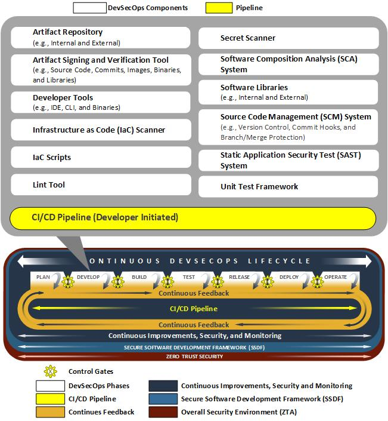
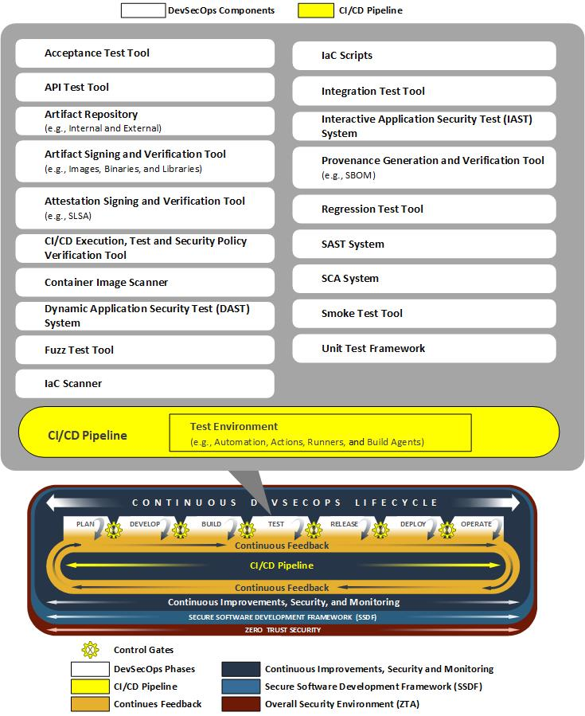
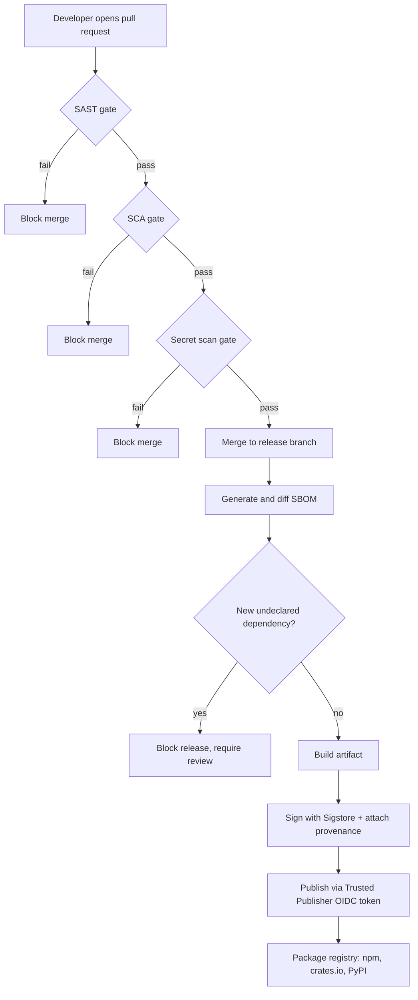
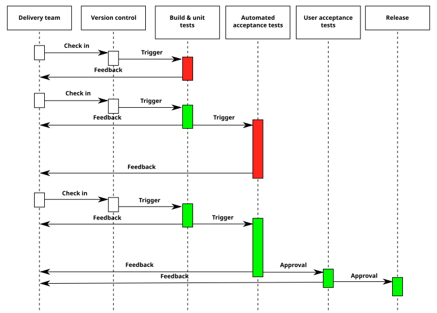
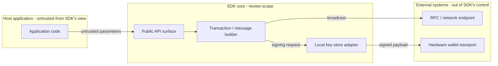
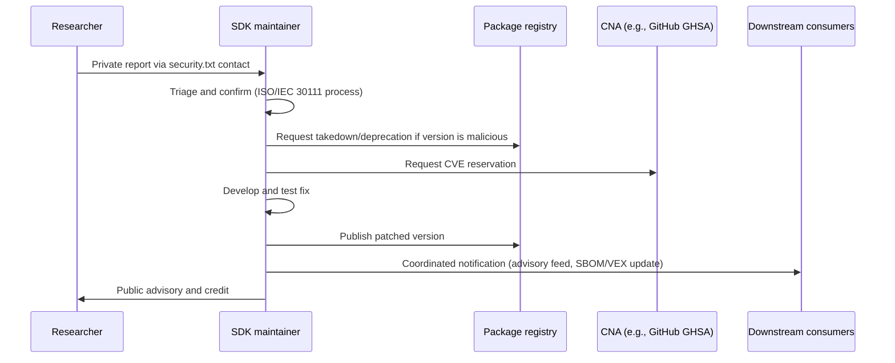

# Part III: Implementation and Operations

[Back to Handbook contents](index.md) | [Series index](../index.md)

Part III moves from methodology to operations: how **software development kit** (**SDK**) security testing becomes a permanent, automated stage of the delivery lifecycle instead of a one-time exercise. It covers gating a pipeline on dependency and secret findings, the criteria for vetting a third-party SDK before it ever lands in a lockfile, how to prepare an SDK codebase for external review, and how to run coordinated disclosure once a vulnerability surfaces in code that hundreds of downstream applications already depend on.

---

## 9. Integrating SDK Testing into CI/CD

Continuous integration and continuous delivery (CI/CD) is the actual control surface for **SDK** security, not the audit report that precedes a release. An SDK sits between a protocol and every application that imports it, so a regression that reaches a tagged version does not stay contained to one team: it ships to every consumer who runs `npm install`, `cargo add`, or `pip install` that week. Treating security testing as a manual pre-release checklist means the check runs once, on one commit, while the pipeline runs on every commit forever. The goal of this chapter is to make the pipeline the enforcement point.


*Figure. NIST's Develop phase places security controls beside authoring and review rather than at the release boundary. For SDKs, source review, secret scanning, dependency policy, and secure defaults begin here, before an artifact exists to sign. Source: [NIST NCCoE DevSecOps Notational Reference Model](https://pages.nist.gov/nccoe-devsecops/notational-reference-model.html), U.S. government work, public domain.*

**Gate placement.** Structure the pipeline as a sequence of gates an artifact must pass before it becomes publishable, not a single "security scan" step appended at the end. Each gate maps to a distinct class of defect and a distinct tool category, and each should be capable of failing the build independently:

| Gate | Tool category (examples) | Blocks on | Runs on |
|------|---------------------------|-----------|---------|
| Static analysis (SAST) | Semgrep, CodeQL | New high-confidence findings vs. baseline | Every PR |
| Software composition analysis (SCA) | OSV-Scanner, Trivy, Grype, `npm audit` | New Critical/High advisory in direct or transitive dependency | Every PR and nightly |
| Software bill of materials (SBOM) generation and diff | Syft, CycloneDX CLI | Undeclared new dependency, license violation | Every merge to release branch |
| Secret scanning | GitHub secret scanning, Gitleaks, TruffleHog | Any committed credential, API key, or private key pattern | Every push |
| Provenance and signing | `npm publish --provenance`, Sigstore Cosign | Missing or invalid attestation at publish time | Publish step only |


*Figure. The Test phase is an evidence-producing gate, not one scanner. Static, dynamic, composition, integration, and manual results converge on an explicit risk decision; failures return the same immutable candidate for remediation rather than being waived invisibly. Source: [NIST NCCoE DevSecOps Notational Reference Model](https://pages.nist.gov/nccoe-devsecops/notational-reference-model.html), U.S. government work, public domain.*

A minimal GitHub Actions job chain that enforces the **SCA**, **SBOM**, and secret-scanning gates for an SDK repository looks like this:

```yaml
name: sdk-security-gates
on: [pull_request, push]
jobs:
  sca:
    runs-on: ubuntu-latest
    steps:
      - uses: actions/checkout@v4
      - name: Scan dependencies for known vulnerabilities
        uses: google/osv-scanner-action@v2
        with:
          scan-args: |-
            --lockfile=./package-lock.json
            --fail-on-vuln=true
  sbom:
    runs-on: ubuntu-latest
    steps:
      - uses: actions/checkout@v4
      - name: Generate CycloneDX SBOM
        run: syft dir:. -o cyclonedx-json=sbom.json
      - uses: actions/upload-artifact@v4
        with: { name: sbom, path: sbom.json }
  secrets:
    runs-on: ubuntu-latest
    steps:
      - uses: actions/checkout@v4
      - uses: gitleaks/gitleaks-action@v2
```

**Isolate the test environment from the network the way you isolate production.** SDK test suites, especially wallet and contract-interaction SDKs, frequently need to talk to an RPC endpoint or a signing device. Do not let CI runners reach live mainnet RPC or hold real credentials during test execution: use recorded fixtures, a local devnet, or a mocked provider, and restrict outbound network egress on the runner to only what the test explicitly declares. This matters for two reasons. It removes test flakiness caused by a third-party RPC outage, and it removes the exact **blast radius** that a compromised CI runner would otherwise have. The [tj-actions/changed-files compromise (CVE-2025-30066)](https://www.cisa.gov/news-events/alerts/2025/03/18/supply-chain-compromise-third-party-tj-actionschanged-files-cve-2025-30066-and-reviewdogaction) showed what an attacker does with an unrestricted runner: it dumped CI memory to steal secrets exposed in workflow logs across more than 23,000 repositories that referenced the action by a mutable tag.

**Publish-time controls close the gap SAST cannot.** No static analyzer catches a legitimate maintainer publishing malicious code with valid, currently-authorized credentials, and that is precisely how the field's two most consequential SDK compromises happened (both examined in depth in Chapter 10). The pipeline defense is to remove long-lived publish credentials entirely. [npm provenance statements](https://docs.npmjs.com/generating-provenance-statements) bind a published package to the exact source commit and build workflow that produced it, signed through Sigstore's short-lived certificate chain, so a consumer can verify where a release actually came from. [npm Trusted Publishers](https://docs.npmjs.com/trusted-publishers), an OpenID Connect (OIDC) based mechanism following the same [OpenSSF trusted-publishing standard](https://docs.npmjs.com/trusted-publishers) already adopted by PyPI and RubyGems, goes further: it issues a short-lived, workflow-specific token for each publish instead of a static npm token sitting in a CI secret store, so there is no long-lived credential left to phish.



*Figure 1. SDK CI/CD pipeline as a chain of independently enforced gates. Each block that can fail the build is a control an attacker who compromises only the CI runner, or only a maintainer's credentials, still cannot bypass alone.*


*Figure. The general continuous delivery flow that the gate chain above extends with security-specific checks: a change moves through build and automated testing before it becomes a release candidate, and each stage is a point where a pipeline can fail closed. Source: [Wikimedia Commons](https://commons.wikimedia.org/wiki/File:Continuous_Delivery_process_diagram.svg), CC BY-SA 4.0.*

---

## 10. Selecting and Evaluating Third-Party SDKs

Adopting a third-party **SDK** is a decision to inherit its entire trust surface. Every dependency it pulls in, every account with publish rights to it, and every incident in its history becomes part of your application's **attack surface** the moment the import line lands in a lockfile. Popularity and an official-looking name are not evidence of safety: both of the SDK compromises examined below were published under the correct, official package name, by a real maintainer account, and downloaded hundreds of thousands of times before detection.

**Evaluate before you adopt, and re-evaluate on every major version bump.** A useful evaluation is not a single yes/no gate but a weighted scorecard applied at intake and revisited whenever the SDK's maintainer set, publish process, or dependency tree changes materially.

| Criterion | What to check | Why it matters |
|-----------|---------------|-----------------|
| Publisher provenance | Does the registry entry show npm provenance or an equivalent signed attestation? | Confirms the package matches a specific, auditable source commit, not just a claimed source repository |
| Maintainer bus factor | How many accounts hold publish rights; is any account without hardware-backed MFA? | A single-maintainer package is one phishing email from compromise |
| Supply chain hygiene score | [OpenSSF Scorecard](https://securityscorecards.dev/) result: branch protection, pinned dependencies, signed releases, fuzzing/SAST in CI (18 automated checks total) | Gives a repeatable, comparable score instead of an impression |
| Disclosure policy | Is there a `security.txt` ([RFC 9116](https://www.rfc-editor.org/rfc/rfc9116)) or documented vulnerability reporting channel? | Determines whether you can privately report a finding at all |
| SBOM availability | Does the project publish a machine-readable software bill of materials (CycloneDX or SPDX)? | Lets you diff dependency changes release over release without manually reading every commit |
| Permission footprint | Does the SDK request network egress, filesystem access, or native code execution beyond what its stated purpose requires? | Bounds the damage of a future compromise of that specific package |
| Incident history | Has the package, or its maintainers, been involved in a prior compromise? | Past compromise correlates with future targeting; verify remediation, not just the patch version |

**Case studies: official does not mean uncompromisable.** Two incidents from the SDK layer of the Web3 stack illustrate why version pinning with hash verification, not package-name trust, is the load-bearing control.

| | [@solana/web3.js](https://socket.dev/blog/supply-chain-attack-solana-web3-js-library) | [xrpl.js](https://xrpl.org/blog/2025/vulnerabilitydisclosurereport-bug-apr2025) |
|---|---|---|
| Date | December 2, 2024 | April 21-22, 2025 |
| Malicious versions | 1.95.6, 1.95.7 | 4.2.1-4.2.4, 2.14.2 |
| Attack vector | Publish-access npm account compromised via phishing targeting a maintainer with `@solana` org publish rights ([The Hacker News](https://thehackernews.com/2024/12/researchers-uncover-backdoor-in-solanas.html)) | Ripple employee's npm credentials compromised via phishing |
| Malicious payload | Injected `addToQueue` function exfiltrated private keys to `sol-rpc[.]xyz`, funneling funds to a single attacker wallet | Injected `checkValidityOfSeed` function exfiltrated wallet secret key material to an attacker-controlled endpoint |
| Detection to remediation | Discovered and disclosed within roughly 20 hours by Anza; clean 1.95.8 released same week | Discovered by [Aikido Security](https://www.aikido.dev/blog/xrp-supplychain-attack-official-npm-package-infected-with-crypto-stealing-backdoor) at 8:14 AM UTC April 22; fully mitigated by 12:34 PM UTC the same day |
| Tracking ID | CVE-2024-54134 | CVE-2025-32965 (CVSS 9.3) |
| Reported impact | Estimated $130,000-$160,000 in stolen assets | Rotation advised for any key used with affected versions |

Both packages were, and remain, the correct official choice for their respective ecosystems. The lesson is not "avoid official SDKs," it is that a package's name and reputation describe its intent, not the current integrity of every byte published under that name. The concrete control this motivates: pin exact versions with lockfile integrity hashes (`package-lock.json` `integrity` fields, `Cargo.lock` checksums, `poetry.lock` hashes), route every dependency bump, including a bump of an already-trusted SDK, through the **SCA** gate from Chapter 9, and subscribe to the registry's advisory feed (GitHub Security Advisories, `npm audit`, RustSec) rather than relying on manual awareness of vendor incidents.

---

## 11. Manual Review and External Security Review Preparation

Automated pipeline gates catch what a rule can express. External review supplies an adversarial, unhurried perspective a gate cannot, but only if the codebase handed to reviewers is complete, scoped, and reproducible before the engagement starts. Weak preparation is the most common reason a paid review spends its first days on discovery instead of analysis.

### 11.1 Documentation, Scope, and Commit Hash; Structural Diagrams

Freeze the review target before reviewers start reading code. Agree an exact commit hash as the fixed point of the engagement, and treat any change to that commit during the review window as a formal scope amendment, not a silent update; reviewers working against a moving target cannot give you a report you can trust against the code you actually ship. [Trail of Bits' audit-preparation guidance](https://blog.trailofbits.com/2018/04/06/how-to-prepare-for-a-security-audit/) frames this as four concrete deliverables: state explicit review objectives (what questions should the engagement answer), clean the codebase of dead code, stale branches, and unused dependencies before reviewers arrive, hand over complete build instructions with pinned tool versions, and include the history of prior findings and fixes so reviewers spend time on what has not already been examined.

A documentation package that satisfies this in practice includes:

| Deliverable | Content | Why reviewers need it |
|-------------|---------|------------------------|
| Scope statement | Exact commit hash, in-scope files/packages, explicitly out-of-scope components | Prevents wasted effort and disputed findings after delivery |
| Architecture and threat model | Component diagram, trust boundaries, prior STRIDE analysis | Orients reviewers to intended behavior before they look for deviations |
| Structural diagrams | Data-flow and dependency diagrams for the in-scope surface | Shows where untrusted input enters and where signing or key material lives |
| Build and test instructions | Exact toolchain versions, reproducible build steps, test coverage report | Lets reviewers reproduce your own test suite before writing new tests |
| Prior findings | Previous audit reports, unresolved issues, self-identified risks | Directs attention to genuinely unexamined surface |



*Figure 2. A structural diagram scoped for an external review of a wallet SDK. Marking the trust boundary between the host application, the SDK core, and external systems tells reviewers exactly which inputs are attacker-reachable and where the signing boundary sits.*

### 11.2 Vulnerability Checklists and Offensive Code-Path Analysis

A checklist alone finds the vulnerability classes the checklist's author already anticipated. Pair it with offensive code-path analysis: trace every entry point an attacker (a malicious dependency, a compromised host application, or a hostile RPC response) can reach, follow it forward to the sensitive operation it can influence, and ask what constraint is missing at each hop. This is the same discipline [MITRE ATT&CK](https://attack.mitre.org/) applies to enterprise intrusions and [MITRE AADAPT](https://aadapt.mitre.org/) applies specifically to digital asset and payment technology threats: catalog the technique, then verify the control that should stop it is actually present, rather than assuming it is because the design document says so.

<!-- pdf-table: fit -->
| Entry point | Example in an SDK | Sink | Offensive check |
|-------------|--------------------|------|-------------------|
| Public API parameter | `transfer(amount, recipient)` | Transaction builder | Can a malformed or boundary-value `amount`/`recipient` produce an unintended transaction before signing? |
| Deserialized RPC response | JSON-RPC result parsed into an SDK object | Balance/state cache | Can a malicious or MITM'd RPC endpoint inject a value that changes signing logic downstream? |
| Configuration/plugin loading | Dynamically loaded provider or plugin module | Native code execution | Can an untrusted plugin path escalate to arbitrary code in the host process? |
| Error and logging paths | Exception messages, debug logs | Log sink, telemetry endpoint | Does an error path leak private key material, seed phrases, or session tokens? |
| Dependency callback | Third-party library invoked during signing | Signing key access | Does a compromised transitive dependency have a reachable path to key material? |

Apply the [OWASP SCSTG](https://scs.owasp.org/) verification structure as the checklist backbone (input validation, **access control**, cryptographic handling, error handling), then use the entry-point-to-sink trace above as the offensive layer on top of it. Findings that only a checklist item would catch and findings that only a trace would catch are both real; a review that runs only one of the two methodologies systematically misses the other's blind spot.

---

## 12. Responsible Disclosure for SDK Vulnerabilities

An **SDK** vulnerability has a wider and less controllable **blast radius** than an application vulnerability, because the SDK is embedded, not deployed: a single fix has to propagate through every downstream application's own release cycle before users are actually protected, and during that gap the vulnerable version keeps shipping to new installs. Disclosure policy for SDK maintainers has to account for that lag explicitly, not just for the maintainer's own patch timeline.

**Publish a machine-readable disclosure channel before you need one.** A `security.txt` file at `/.well-known/security.txt`, defined by [RFC 9116](https://www.rfc-editor.org/rfc/rfc9116), gives researchers a `Contact` field, an `Expires` timestamp so the file cannot silently go stale, and optionally a `Policy` link and an `Encryption` key for sensitive reports. The [OWASP Vulnerability Disclosure Cheat Sheet](https://cheatsheetseries.owasp.org/cheatsheets/Vulnerability_Disclosure_Cheat_Sheet.html) adds the policy content that file should point to: defined scope, a safe-harbor clause so a researcher testing in good faith is not threatened with legal action, and a stated timeline for acknowledgment, triage, and resolution.

**Follow a coordinated vulnerability disclosure (CVD) process, not an ad hoc one.** [ISO/IEC 29147](https://www.iso.org/standard/72311.html) defines how a vendor receives and responds to a vulnerability report; the companion [ISO/IEC 30111](https://www.iso.org/standard/69725.html) defines the internal handling process once a report arrives (triage, remediation development, release coordination). For public tracking, request a CVE identifier through a CVE Numbering Authority (CNA); GitHub operates as a CNA for repositories that use [GitHub Security Advisories (GHSA)](https://github.com/advisories), which is how both incidents in Chapter 10 received public CVE IDs alongside their fix.

**Timeline benchmarks exist, and web3 SDKs often need something faster.** [Google Project Zero's disclosure policy](https://projectzero.google/vulnerability-disclosure-faq.html) is the industry's most cited reference point: a 90-day deadline to public disclosure from initial report, with a 14-day grace period if a fix is imminent, justified by the observation that attackers frequently find the same bugs independently, so silence past a reasonable window protects vendors more than users. That model assumes the bug is *discovered before* exploitation. A key-exfiltrating SDK compromise discovered *during* active exploitation, like both cases in Chapter 10, cannot wait 90 days: the xrpl.js incident went from public detection to a shipped, deprecated-version fix in under five hours precisely because the maintainer, the registry, and the CNA process moved in parallel rather than sequentially. Build your own runbook around two tracks: a standard CVD timeline for vulnerabilities found through review or **fuzzing**, and an incident-response track (cross-reference the Incident Response Handbook, 06) for anything discovered mid-exploitation, where the first action is pulling the malicious version from the registry, not drafting an advisory.

<!-- pdf-table: fit -->
| Phase | Standard CVD target | Active-exploitation target |
|-------|---------------------|------------------------------|
| Acknowledge report | Within 3 business days | Within 1 hour |
| Confirm and triage | Within 10 business days | Within 4 hours |
| Registry takedown of malicious version | N/A (no malicious release yet) | Immediate, before further comms |
| Fix developed and released | Within 90 days (or 90+14 with committed fix date) | Same day where feasible |
| CVE reserved and published | At or before public disclosure | Concurrent with fix release |
| Downstream notification (SBOM/VEX consumers, registry advisory feed) | At public disclosure | Concurrent with fix release |
| Public advisory | 30 days after fix, or at 90/104-day deadline | Concurrent with fix release |



*Figure 3. Coordinated vulnerability disclosure flow for an SDK. Registry takedown and downstream notification run in parallel with fix development rather than waiting for it, because the embedded nature of an SDK means every day a malicious or vulnerable version stays installable is a day it keeps reaching new applications.*

**Use severity classification consumers can act on.** [Immunefi's framework](https://immunefi.com/learn/), used across most web3 bug bounty programs, classifies impact on a five-level scale from Critical to None; adopt an equivalent scale in your own advisory so a downstream application maintainer reading it can immediately judge whether to hotfix or schedule a routine update. Where a bounty program is warranted for an SDK specifically (as opposed to the protocol it talks to), Immunefi and HackenProof both support SDK- and library-scoped programs distinct from the smart contract bounty, which keeps report volume and severity calibration appropriate to the SDK's actual blast radius.

---

**Key controls for Part 3**

- Gate every merge and every publish on SAST, **SCA**, **SBOM** diff, and secret scanning; make each gate independently capable of blocking the build.
- Eliminate long-lived publish credentials with npm provenance and OIDC-based trusted publishing; both major SDK compromises examined here were credential compromises, not code defects.
- Score third-party SDKs before adoption (provenance, OpenSSF Scorecard, bus factor, disclosure policy, SBOM availability) and re-score on every major version bump, not just at first intake.
- Freeze review scope to an exact commit hash and hand reviewers a complete documentation package, including structural and trust-boundary diagrams, before the engagement starts.
- Run offensive entry-point-to-sink tracing alongside checklist review; each catches vulnerability classes the other misses.
- Publish a `security.txt` and a written CVD policy before you need one, and maintain a separate, faster runbook for vulnerabilities discovered during active exploitation.

