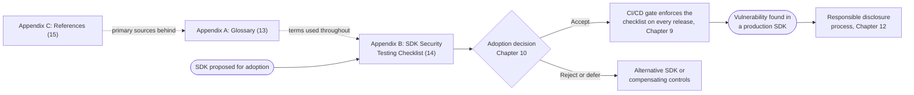
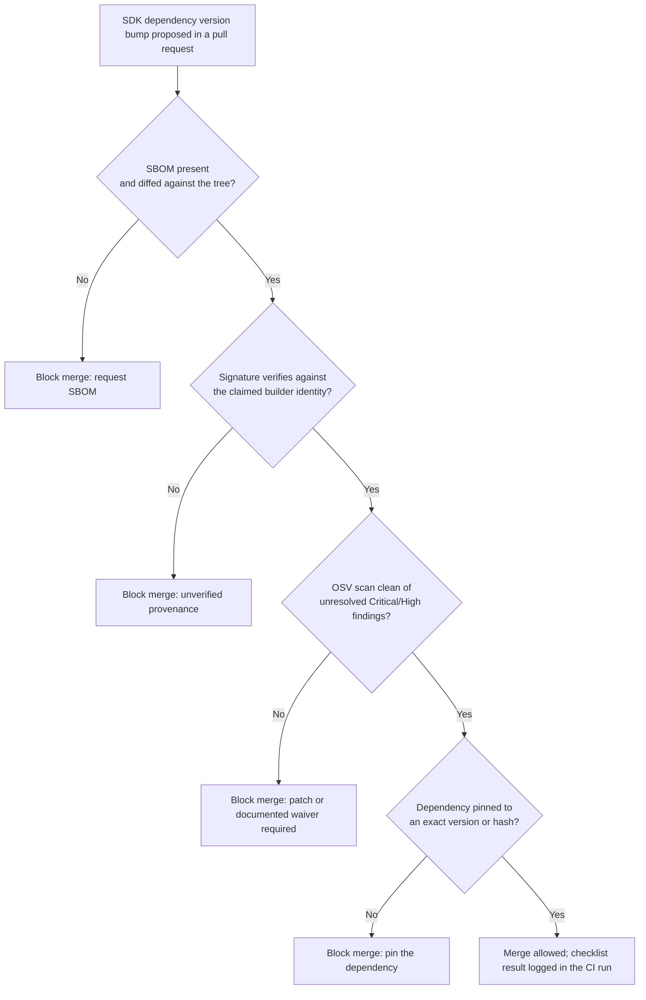

# Part 4: Appendices

[Back to Handbook contents](index.md) | [Series index](../index.md)

This part is the handbook's reference layer: a place to look up a term, run a checklist, or trace a citation, rather than a narrative meant to be read start to finish. Appendix A fixes the vocabulary used across Parts 1 through 3 in a single glossary. Appendix B turns nine chapters of testing methodology into copy-ready checklists a reviewer can run against a candidate **SDK** before it enters a codebase, and Appendix C points to the full bibliography behind every standard and incident cited along the way.



*Figure 1. How the appendices connect to the SDK lifecycle described in Parts 1 through 3: vetting feeds the checklist, the checklist gates CI/CD, and a production finding feeds back into disclosure.*

---

## 13. Appendix A: Glossary

The terms below are defined the way this handbook uses them, not in the generic sense a dictionary would give. Each entry expands its acronym on first mention and, where useful, references back to the section that puts the term into practice, so a reader arriving here from a search result can trace a definition to the place it actually matters rather than stopping at an abstract answer. Alphabetical order is used throughout; where two related terms exist, the more specific one carries the fuller definition and the other cross-references it.

**AADAPT.** MITRE's Adversarial Actions in Digital Asset Payment Technologies knowledge base, a project structured like [ATT&CK](https://attack.mitre.org/) but scoped to tactics and techniques specific to cryptocurrency and digital-asset systems. Cited alongside ATT&CK when threat-modeling SDK-facing attack scenarios (2.4).

**ABI (Application Binary Interface).** The typed description of a smart contract's callable functions, their argument encoding, and their return types, which a contract-interaction **SDK** consumes to build a transaction's calldata. Malformed or stale ABI handling is a primary defect class covered in Chapter 7 (7.1).

**Blind signing.** Approving a transaction from a wallet interface's rendered summary without independently verifying the raw calldata that summary claims to describe. A wallet SDK that cannot render a human-readable preview of a nonstandard call forces this on the user by default (6.1, 6.3).

**Breaking change.** A change to an SDK's public interface, return type, or default behavior that is not backward compatible with the prior minor or patch release, and that therefore requires a major version bump under semantic versioning (5.4).

**Calldata.** The raw, ABI-encoded byte string a transaction carries to invoke a contract function, distinct from the plain-language summary a wallet's signing interface renders for the user. Contract-interaction SDKs construct it; wallet SDKs are responsible for making it inspectable before signature (7.1, 6.1).

**Cosign.** [Sigstore](https://docs.sigstore.dev/)'s command-line tool for signing and verifying software artifacts, container images, and Software Bills of Materials using short-lived, identity-bound certificates instead of a long-lived **private key** a maintainer has to protect indefinitely (4.4).

**CycloneDX.** An OWASP-originated Software Bill of Materials standard, now also standardized as ECMA-424, whose [1.6 release in April 2024](https://cyclonedx.org/docs/1.6/json/) added machine-learning-model and cryptographic-asset component types alongside the traditional software inventory. The reference **SBOM** format used throughout Chapter 4 (4.2).

**Dependency confusion.** An attack that tricks a package manager into resolving an internal, unpublished package name to a higher-versioned malicious package of the same name on a public registry, demonstrated at scale in [Alex Birsan's February 2021 research](https://medium.com/@alex.birsan/dependency-confusion-4a5d60fec610) against more than 35 organizations including Apple, Microsoft, and PayPal. A named risk in both the **threat model** (2.3) and the sourcing-policy guidance (4.7).

**Fulcio.** [Sigstore](https://docs.sigstore.dev/)'s certificate authority, which issues a short-lived code-signing certificate, valid on the order of minutes, bound to a verified OpenID Connect identity rather than a long-term key a signer must safeguard (4.4).

**Malicious package.** A package published to a public registry that is intentionally harmful, whether typosquatted, dependency-confused, or a previously legitimate package taken over through a compromised maintainer account, the pattern behind the Ledger Connect Kit compromise of December 2023. The primary threat-actor category opened in Chapter 2 (2.2).

**MITRE ATT&CK.** A globally accessible knowledge base of adversary tactics and techniques whose Enterprise matrix lists Supply Chain Compromise as [technique T1195](https://attack.mitre.org/techniques/T1195/) under Initial Access, with sub-techniques for compromising software dependencies and development tools (T1195.001), the **software supply chain** broadly (T1195.002), and hardware (T1195.003). The reference framework behind Chapter 2's STRIDE and scenario mapping (2.4).

**npm provenance.** A feature of the npm registry that lets a publisher attach a [Sigstore-backed attestation](https://docs.npmjs.com/generating-provenance-statements) linking a published package to the exact source commit and public build workflow that produced it, surfaced as a verified badge on the package's registry page. A concrete, freely available instance of SLSA-aligned build provenance (4.4).

**OSV (Open Source Vulnerability database).** A distributed, machine-readable vulnerability database maintained by [Google](https://osv.dev/) that aggregates advisories from GitHub Security Advisories, PyPA, RustSec, and other ecosystem-specific sources, queryable by package version or commit hash through its API and the `osv-scanner` command-line tool. A recommended source for continuous **Software Composition Analysis** (4.5).

**Provenance.** Verifiable metadata describing how, where, and from what source an artifact was built: which repository, which commit, which build platform, and which workflow produced it. The deliverable every **SLSA** build level above L0 exists to generate (4.3, 4.4).

**Reproducible build.** A build process that, given the same source and build environment, produces bit-for-bit identical output every time, letting an independent party rebuild a released artifact and confirm it matches what the vendor published. Distinct from **signed provenance**, which proves who built something rather than that anyone else can rebuild it identically (4.6).

**Rekor.** [Sigstore](https://docs.sigstore.dev/)'s public, append-only transparency log recording every signing event, so an artifact owner can monitor the log for signatures issued under their identity that they never requested (4.4).

**RPC (Remote Procedure Call) endpoint.** The network interface, typically JSON-RPC over HTTPS or WebSocket, through which a contract-interaction SDK submits transactions and queries chain state. A malicious or misconfigured endpoint can misreport gas prices, censor a transaction, or profile the user's address and activity (7.3).

**SBOM (Software Bill of Materials).** A structured, machine-readable inventory of every component, direct and transitive, in a piece of software, expressed in a format such as CycloneDX or SPDX. The baseline artifact Chapter 4 asks every SDK consumer to generate and every SDK vendor to publish (4.2).

**SCA (Software Composition Analysis).** Automated identification of the open-source components inside a codebase and their known vulnerabilities, run continuously rather than as a one-time scan. The testing discipline behind Chapter 3's composition analysis and Chapter 4's continuous-scanning guidance (3.2, 4.5).

**SCSVS / SCSTG / SCWE.** The Smart Contract Security Verification Standard, the Smart Contract Security Testing Guide, and the Smart Contract Weakness Enumeration, the three [OWASP Smart Contract Security Project](https://scs.owasp.org/) standards this handbook extends to the SDK layer (1.3).

**Semantic versioning (semver).** A version-numbering scheme, `MAJOR.MINOR.PATCH`, in which a major bump signals a breaking change, a minor bump signals backward-compatible new functionality, and a patch signals a backward-compatible fix. The convention Chapter 5 expects an SDK to honor before a consumer trusts a caret or tilde version range (5.4).

**Sigstore.** A Linux Foundation project providing keyless signing and verification for software artifacts through three components: [Fulcio](https://docs.sigstore.dev/) (certificate authority), Rekor (transparency log), and Cosign (signing and verification client) (4.4).

**SLSA (Supply-chain Levels for Software Artifacts).** The current [v1.2 specification](https://slsa.dev/spec/v1.2/) defines two independently assessed tracks: Build L0–L3 for provenance integrity and build-platform isolation, and Source L0–L4 for version control, history/provenance, continuous technical controls, and two-party review. A claim must name its track and level; “SLSA Level 3” alone is ambiguous (2.6, 4.3).

**SPDX.** The System Package Data Exchange format, an ISO/IEC 5962:2021 international standard for expressing SBOMs. SPDX 3.0, released in April 2024, moved to an RDF-based data model with eight specialized profiles (Core, Software, Security, Build, AI, Dataset, Licensing, Lite), replacing the flatter document structure of SPDX 2.x (4.2).

**STRIDE.** A threat-modeling mnemonic, Spoofing, Tampering, Repudiation, Information disclosure, Denial of service, Elevation of privilege, applied to SDK-specific attack scenarios in Chapter 2 (2.4).

**Trust boundary.** A point in a system where data or control passes from one level of trust to another: from an SDK's internal state into the calling application, or from a remote registry into a local build. Enumerating every **trust boundary** an SDK crosses is the first step of Chapter 2's threat model (2.1).

**Typosquatting.** Publishing a malicious package under a name that is a common misspelling or visual near-match of a popular package, betting that a developer's typo or a copy-paste error installs the wrong one. A named registry-level threat in Chapter 2 (2.2, 2.3).

**UI redress.** An attack that visually or structurally disguises a malicious interface element as a legitimate one, including clickjacking, to trick a user into approving an action, such as a wallet-connect request, they did not intend. Treated as a wallet-SDK risk distinct from pure credential phishing (6.3).

**VEX (Vulnerability Exploitability eXchange).** A companion document to an SBOM stating whether a known vulnerability in a listed component is actually exploitable in the product's specific configuration, using status values including affected, not affected, fixed, and under investigation, as defined in [CISA's minimum requirements for VEX](https://www.cisa.gov/sites/default/files/2023-04/minimum-requirements-for-vex-508c.pdf). Lets an SDK vendor tell consumers which CVEs in their dependency tree actually matter (4.2).

**Version pinning.** Locking a dependency to an exact version or exact content hash rather than a floating range, so a build resolves to identical code every time until a human deliberately updates it. The default sourcing policy Chapter 4 recommends for any SDK with signing or key-handling responsibility (4.7).

---

## 14. Appendix B: SDK Security Testing Checklist

This checklist consolidates Parts 2 and 3 into one printable document a reviewer can run against a specific **SDK**, at a specific version, before it is adopted and again at every subsequent release. Run one full copy at first adoption and the "Supply Chain and Dependency Testing" and "CI/CD Gate" groups on every version bump after that; a checklist that is completed once at adoption and never rerun does not catch a maintainer takeover that happens eighteen months later, which is exactly the shape the Ledger Connect Kit and Polyfill.io compromises took. Mark any inapplicable line N/A with a stated reason rather than leaving it blank, since an empty line and a deliberately skipped one look identical to a later reviewer.

Assign a risk tier before applying a minimum bar. An SDK that touches **private key** material carries different consequences from an SDK that only renders a marketing banner, and a single blanket requirement either overburdens the second case or underprotects the first.

**SDK record**

- **SDK name and version under review:** ______________________
- **Registry / source URL:** ______________________
- **Risk tier (see table below):** ______________________
- **Reviewer:** ______________________  Date: ______________________
- **Adoption decision:** Accept ☐  Accept with compensating controls ☐  Reject ☐

| Risk tier | Example SDK type | Minimum SLSA build level | Signing / SBOM bar | Review cadence |
|-----------|-------------------|---------------------------|---------------------|-----------------|
| Tier 1: Key custody | Wallet SDK, signing library | L3 | Sigstore-signed release plus SBOM with VEX | Every release, plus a quarterly re-vet regardless of new releases |
| Tier 2: Value-moving | Contract-interaction SDK, RPC client | L2 minimum, L3 preferred | Signed release plus SBOM | Every release |
| Tier 3: Rendering / UX | Front-end embed, mobile UI kit | L1 minimum | SBOM required, signing preferred | Every minor version |
| Tier 4: Non-critical utility | Logging or analytics wrapper | L0 acceptable if SRI and CSP compensating controls are in place | SBOM optional | Annual |

**SDK adoption and vetting (Chapter 10)**

- [ ] Maintainer identity and publishing history reviewed; no anonymous or freshly created account holds publish rights
- [ ] Package ownership and maintainer-transfer history checked for an unexplained handoff
- [ ] Risk tier assigned from the table above and the matching minimum **SLSA** level confirmed against the vendor's actual release (4.3)
- [ ] License terms confirmed compatible for the SDK and its transitive dependencies
- [ ] At least one alternative SDK compared, and the adoption decision and rationale recorded

**Supply chain and dependency testing (Chapter 4)**

- [ ] Full dependency tree resolved, direct and transitive, and diffed against the **SBOM** the vendor publishes (4.1, 4.2)
- [ ] SBOM generated or obtained in CycloneDX or SPDX format; VEX statements reviewed for every known CVE in the tree (4.2)
- [ ] Build provenance verified against the claimed SLSA level: signature present, builder identity matches, source repository matches (4.3, 4.4)
- [ ] Sigstore (or equivalent) signature verified before first use and again on every update (4.4)
- [ ] Dependency tree scanned against OSV or an equivalent database; no unresolved Critical or High severity findings (4.5)
- [ ] Build reproducibility spot-checked where the project supports it (4.6)
- [ ] Every dependency pinned to an exact version or content hash; no floating range survives in the lockfile (4.7)
- [ ] Registry source confirmed as the intended public or private registry, not an unofficial mirror (4.7)

**API and interface security (Chapter 5)**

- [ ] Every SDK input, addresses, amounts, ABI fragments, callback URLs, validated and sanitized before use (5.1)
- [ ] No API key, private key, or secret accepted as a plain constructor argument or written to a log in cleartext (5.2)
- [ ] Error messages reviewed for stack traces, internal file paths, or secret material leaking to the caller or console (5.3)
- [ ] Declared version range tested against the actually installed version for undocumented breaking-change drift (5.4)

**Wallet and key-handling SDKs (Chapter 6)**

- [ ] Key generation uses a cryptographically secure random source, verified against the platform's documented CSPRNG (6.1)
- [ ] Private key material never leaves the device or **hardware wallet** unencrypted (6.1, 6.2)
- [ ] Hardware and external wallet connectors (WalletConnect, browser-extension bridge) verified against the vendor's current, signed release (6.2)
- [ ] Transaction and message previews render enough decoded calldata that **blind signing** is not the only option available to the user (6.1, 6.3)
- [ ] Connection and approval prompts tested for UI redress and origin-spoofing resistance (6.3)

**Contract interaction SDKs (Chapter 7)**

- [ ] ABI encoding and decoding tested against boundary cases: zero values, maximum uint, empty arrays, malformed fragments (7.1)
- [ ] Gas estimation tested under simulated network congestion and against a stale gas oracle (7.2)
- [ ] RPC failover and response validation tested; the SDK does not silently trust an unverified single RPC response (7.3)
- [ ] Chain ID and network context checked before every transaction to prevent cross-chain replay (7.3)

**Front-end and mobile SDKs (Chapter 8)**

- [ ] Any script or asset the SDK loads at runtime is served from an immutable URL and pinned with Subresource Integrity where the platform supports it (8.1)
- [ ] Local storage, session storage, and mobile keychain/keystore usage reviewed for sensitive data held at rest (8.2)
- [ ] Platform-specific permissions (iOS Keychain access groups, Android Keystore, browser storage partitioning) reviewed against **least privilege** (8.3)

**CI/CD gate (Chapter 9)**

- [ ] SBOM generation, signature verification, and dependency scanning run as blocking pipeline steps, not advisory ones (9)
- [ ] A version or hash bump in a pinned SDK dependency requires an explicit, reviewed pull request, never an automatic floating update (9, 4.7)
- [ ] Pipeline fails closed: a scan or verification tool timeout blocks the merge rather than defaulting to pass (9)

**Pre-external-review preparation (Chapter 11)**

- [ ] Scope document lists the exact commit hash, files, and SDK version under review (11.1)
- [ ] Architecture and data-flow diagrams updated to match the commit under review (11.1)
- [ ] Known-issue and out-of-scope list prepared so reviewer time is not spent re-discovering accepted risk (11.2)

**Responsible disclosure (Chapter 12)**

- [ ] Security contact and disclosure policy published and current, for example a `security.txt` file per [RFC 9116](https://www.rfc-editor.org/rfc/rfc9116) (12)
- [ ] Triage and emergency patch-release process rehearsed with a dry run before it is needed for real (12)
- [ ] Downstream consumer notification plan defined for a confirmed SDK-level vulnerability (12)

Once the CI/CD gate is wired in, the pipeline should enforce the supply chain group mechanically rather than depending on a human to remember it on every dependency bump:

```bash
# Minimum verification bundle before a new SDK version enters the dependency tree.
# Every step below is a blocking check, not an advisory one (Chapter 9).

npm audit signatures                                      # confirm npm provenance/registry signatures

cosign verify-blob \
  --certificate-identity-regexp '^https://github.com/ORG/REPO/' \
  --certificate-oidc-issuer 'https://token.actions.githubusercontent.com' \
  --signature sdk-release.sig sdk-release.tgz              # verify Sigstore signature and builder identity

osv-scanner --lockfile package-lock.json                  # scan the resolved dependency tree against OSV

syft packages sdk-release.tgz -o cyclonedx-json > sbom.json  # generate an SBOM if the vendor did not publish one
```



*Figure 2. The CI/CD gate from Chapter 9 expressed as a fail-closed decision sequence. Every "No" branch blocks the merge; nothing in this chain is advisory, matching the checklist item above it.*

---

## 15. Appendix C: References and Further Reading

The full, deduplicated bibliography for this handbook lives in a separate file, [`references.md`](references.md), kept apart from the narrative parts so the source list can be maintained and re-verified on its own schedule. Every inline citation across Parts 1 through 3, and in Appendix A above, points to a primary source: a standard's own specification page, a vendor's or researcher's incident disclosure, or a named tool's documentation, never a secondary summary of one. `references.md` groups those sources so a reader chasing one kind of citation, a standard's version history, or a specific incident's timeline, does not have to re-scan three parts of prose to find it.

| Category | What it holds | Representative sources |
|----------|----------------|--------------------------|
| Standards and Frameworks | The specifications and control frameworks this handbook's testing methodology traces back to | SLSA v1.2 Build and Source Tracks, CycloneDX 1.6 / ECMA-424, SPDX 3.0, Sigstore (Fulcio, Rekor, Cosign), OWASP Top 10:2025 (A03 Software Supply Chain Failures), SCSVS, SCSTG, MITRE ATT&CK T1195, MITRE AADAPT, RFC 9116 |
| Incidents and Case Studies | Named SDK and supply chain compromises cited as evidence for a control | Ledger Connect Kit (December 2023), Polyfill.io (June 2024), tj-actions/changed-files CVE-2025-30066 (March 2025), the XZ Utils backdoor (2024), Alex Birsan's dependency confusion disclosures (2021) |
| Tools | Vendor and project documentation for named tools referenced in the checklist and CLI examples | Cosign, OSV-Scanner, Syft, npm provenance documentation, GitHub Security Advisories |
| Further Reading | Cross-references to companion OWASP SCS handbooks | CDN and Front-End Supply Chain Security (01), Incident Response (06), Web3 Attack Vectors Mapping (10) |

Treat `references.md` as the place to verify a claim before repeating it outside this handbook, particularly an incident's figures: public reporting on an active or recent compromise is routinely revised as forensic detail matures, and a number cited here reflects what was known at the time of writing.

---

**Key controls for Part 4**

- Keep Appendix A within reach for any reader, new to Web3 **SDK** security or not, who lands on a chapter mid-stream and needs a term defined in context rather than in the abstract.
- Run one full Appendix B checklist at SDK adoption, and rerun the supply chain and CI/CD groups at every subsequent release, not only at the first integration.
- Assign a risk tier before applying a minimum **SLSA** level or signing bar; a key-handling SDK and a logging wrapper do not warrant the same gate.
- Verify signatures and SBOMs with the CLI bundle in Appendix B directly, rather than trusting a badge or claim on a vendor's landing page.
- Route to `references.md` before repeating an incident's figures externally, since active investigations are revised after initial disclosure.

---

This is the final part of the OWASP SCS SDK Security Testing Handbook. [Back to Handbook contents](index.md) | [Series index](../index.md)
