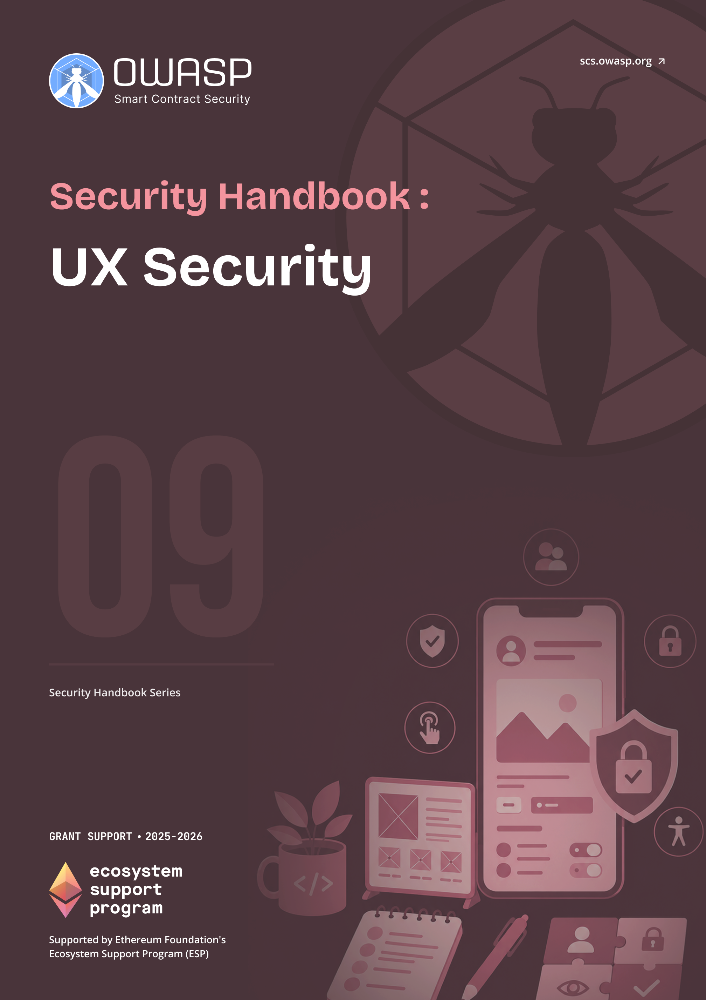

# OWASP SCS UX Security Handbook

  
  

    <a class="handbook-series-link" href="../">← All handbooks</a>
    
Handbook 09 · 82 PDF pages

    
Design safer wallet connections, signing flows, permissions, warnings, recovery paths, and measurable user-facing controls.

    

      <a href="../pdfs/09-ux-security.pdf" target="_blank" rel="noopener">Open PDF</a>
      <a href="../pdfs/09-ux-security.pdf" download>Download PDF</a>
    

  

**OWASP Smart Contract Security Project**

Part of the [OWASP SCS Handbook Series](../index.md). Built to the series [conventions](../index.md#about-the-series).

## Purpose and Scope

This handbook treats the user interface as a security control, not a coat of paint over a smart contract. It covers **user experience** (UX) security for Web3 applications and decentralized applications (dApps): reducing user error, preventing phishing through domain spoofing and malicious dApp impersonation, defending against approval and allowance abuse (unlimited allowances, drainer patterns, Permit2 and granular time-limited permissions), and closing the gap that **blind signing** and multisig user-interface spoofing open, the pattern behind the February 2025 Bybit theft and the front-end compromises that hit Safe-style multisig operators. The scope aligns with the OWASP Smart Contract (SC) Top 10 and the Web3 Attack Vectors taxonomy's "beyond smart contracts" category, where the vulnerable component is the screen the user trusts, not the bytecode the chain executes.

A contract can pass every audit and still cost its users their funds, because a user never approves calldata: they approve whatever the **wallet** or dApp shows them on screen, and an attacker who controls that screen controls the outcome regardless of what the contract itself does correctly. This handbook gives design and development teams a concrete **UX Security** Scoring Matrix and a set of actionable best practices to close that gap, from wallet and signing flows through connection UX, allowance management, notifications, and onboarding.

## Target Audience

Product and UX designers, front-end developers, and security practitioners responsible for dApp and **wallet** interfaces. Wallet teams building signing flows and hardware confirmation screens, and auditors extending contract-level reviews to the interface layer, will find the scoring matrix in Part II and the checklist in the appendices the fastest path to actionable output.

## How to Use This Handbook

Start with Part I to establish why UX and security are interdependent and to walk the UX-specific **threat model**: phishing, allowance abuse, **blind signing**, and the mismatch between what a transaction's calldata says and what the interface displays. Part II is the handbook's core reference, a scoring matrix with dimensions for clarity, confirmation, revocability, consistency, and error handling, each with concrete criteria a team can apply to a real product or feature. Part III turns the matrix into practice with best practices for wallet, connection, allowance, notification, and onboarding UX. Part IV covers integrating these controls into a development lifecycle and re-auditing with the matrix over time. Teams under deadline pressure can jump straight to the scoring criteria in Part II and the quick-wins checklist in Appendix C.

## Relationship to SCSVS, SCSTG, and SCWE

The Smart Contract Security Verification Standard (SCSVS) defines the properties a secure system must satisfy at the contract layer; the UX controls in this handbook are the interface-layer counterpart, because a verified contract still fails its users if the **signing flow** that invokes it is deceptive. The Smart Contract Security Testing Guide (SCSTG) describes how to test contract behavior; Part IV extends that discipline to interface review by turning the scoring matrix into a repeatable audit and iteration process. The Smart Contract Weakness Enumeration (SCWE) catalogs weaknesses in contract code; the phishing, allowance-abuse, and blind-signing failure modes in Part I fill the space the enumeration leaves at the human-computer boundary, where the weakness is in what a user was shown rather than in what the contract executed. The companion Web3 Attack Vectors Mapping Handbook (10) places these interface risks in the broader attack-vector taxonomy, and the CDN and Front-End Supply Chain Security Handbook (01) owns the delivery-layer integrity controls, such as Subresource Integrity and Content Security Policy, that keep the interface this handbook evaluates from being tampered with before it ever reaches the user.

## Contents

### Part I: Foundations
- [1. Introduction to UX Security](part1-foundations.md#1-introduction-to-ux-security)
- [2. Threat Model for UX](part1-foundations.md#2-threat-model-for-ux)

### Part II: UX Security Scoring Matrix
- [3. Scoring Matrix Overview](part2-ux-security-scoring-matrix.md#3-scoring-matrix-overview)
- [4. Dimension: Transaction and Action Clarity](part2-ux-security-scoring-matrix.md#4-dimension-transaction-and-action-clarity)
- [5. Dimension: Confirmation and Consent](part2-ux-security-scoring-matrix.md#5-dimension-confirmation-and-consent)
- [6. Dimension: Revocability and Recovery](part2-ux-security-scoring-matrix.md#6-dimension-revocability-and-recovery)
- [7. Dimension: Consistency and Predictability](part2-ux-security-scoring-matrix.md#7-dimension-consistency-and-predictability)
- [8. Dimension: Warnings and Error Handling](part2-ux-security-scoring-matrix.md#8-dimension-warnings-and-error-handling)
- [9. Additional Dimensions (Expandable)](part2-ux-security-scoring-matrix.md#9-additional-dimensions-expandable)

### Part III: Best Practices
- [10. Wallet and Signing UX](part3-best-practices.md#10-wallet-and-signing-ux)
- [11. dApp and Connection UX](part3-best-practices.md#11-dapp-and-connection-ux)
- [12. Approval and Allowance UX](part3-best-practices.md#12-approval-and-allowance-ux)
- [13. Notification and Alert UX](part3-best-practices.md#13-notification-and-alert-ux)
- [14. Onboarding and Education](part3-best-practices.md#14-onboarding-and-education)

### Part IV: Implementation and Evaluation
- [15. Integrating UX Security into Development](part4-implementation-and-evaluation.md#15-integrating-ux-security-into-development)
- [16. Review and Audit Using the Matrix](part4-implementation-and-evaluation.md#16-review-and-audit-using-the-matrix)
- [17. Iteration and User Feedback](part4-implementation-and-evaluation.md#17-iteration-and-user-feedback)

### Part V: Appendices
- [18. Appendix A: Glossary](part5-appendices.md#18-appendix-a-glossary)
- [19. Appendix B: UX Security Scoring Matrix (Reference)](part5-appendices.md#19-appendix-b-ux-security-scoring-matrix-reference)
- [20. Appendix C: Checklist and Quick Wins](part5-appendices.md#20-appendix-c-checklist-and-quick-wins)
- [21. Appendix D: References and Further Reading](references.md)
