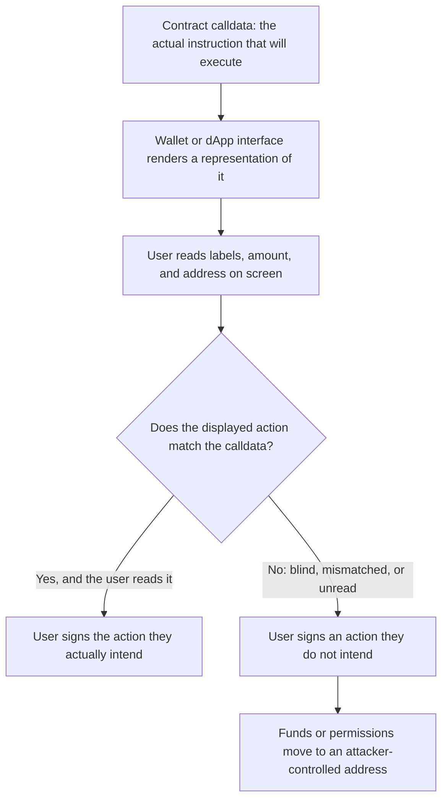
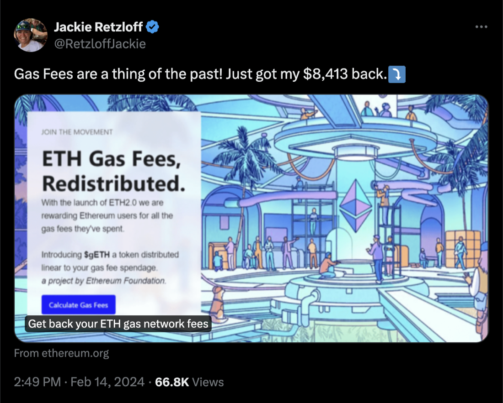
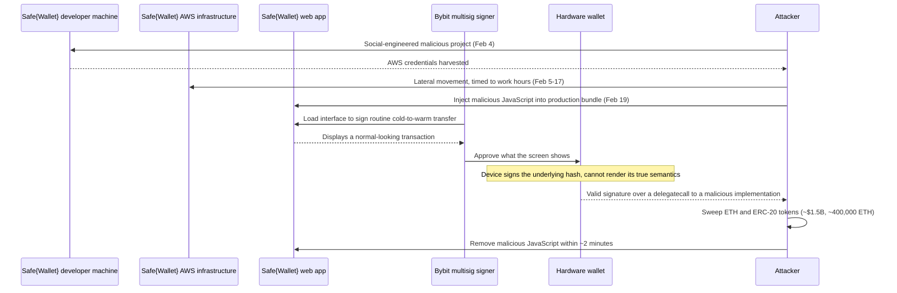

# Part 1: Foundations

[Back to Handbook contents](index.md) | [Series index](../index.md)

This part establishes why the interface, not only the bytecode, decides whether a Web3 user keeps their funds. It defines the vocabulary this handbook uses for **user experience** (UX) security, then builds the **threat model**: the phishing, allowance-abuse, blind-signing, and calldata-mismatch patterns that later parts turn into a scoring matrix and concrete design practice. Every attack technique named here is paired with a detection signal and a mitigation, because a defender needs the mechanism only to the depth required to threat-model, design against, and instrument for it.

---

## 1. Introduction to UX Security

### 1.1 Why UX and Security Are Interdependent

No user ever approves calldata. A user approves whatever the **wallet** or the decentralized application (dApp) draws on screen: a recipient, an amount, a button labeled "Confirm." The Ethereum Virtual Machine executes the calldata regardless of whether it matches that label, and once a signature exists, the transaction is final. This is the structural fact this handbook is built on: security in Web3 is not only "does the contract behave correctly," it is also "does the interface tell the truth about what the contract will do." A contract can pass every audit line by line and still cost its users everything if the screen between the user and that contract lies.

The gap between what a transaction actually does and what a user believes it does is the **attack surface** this handbook maps. That gap can open at several points: a wallet that shows a raw hex string instead of a decoded action (**blind signing**), an interface that renders correct information but was itself served from a compromised host (front-end tampering, the subject of the CDN and Front-End Supply Chain Security Handbook, 01), or a design that shows accurate information in a way a rushed user will not read (a confirmation dialog buried in low-contrast text below a large green button). All three produce the same outcome: a signature the user did not mean to give.



*Figure 1. The signing chain. Every control in this handbook exists to keep the path from calldata to user intent unbroken, and to close it fast when it breaks.*

Irreversibility raises the stakes on every point where this chain can fail. A mis-clicked confirmation in a Web2 banking app can usually be reversed with a phone call; a signed Ethereum transaction cannot. That asymmetry is why UX defects that would be minor annoyances elsewhere (a confusing settings page, an unclear error message) become fund-loss events in Web3, and why this handbook treats interface design as a security control with the same rigor the rest of the OWASP Smart Contract Security (SCS) Project applies to code.

### 1.2 Common UX-Related Security Failures in Web3

Failures in this category share a shape: the underlying contract logic can be entirely correct, and the user still loses funds because of what the interface asked them to sign, or failed to warn them about. The table below anchors each recurring failure mode to a concrete, cited incident so the pattern is not abstract.

| Failure mode | Mechanism | Representative incident |
|---|---|---|
| Blind signing on hardware wallets | Device shows a raw hash or truncated data instead of a decoded action, so the signer cannot verify intent | Bybit/Safe{Wallet} incident, February 2025, [FBI/IC3 PSA250226](https://www.ic3.gov/PSA/2025/PSA250226) (Section 2.4) |
| Unlimited or standing token approvals | `approve()` calls request unbounded spending rights that outlive the transaction that needed them | Drainer-as-a-service campaigns tracked industry-wide; [Scam Sniffer 2025 phishing report](https://www.scamsniffer.io/) (Section 2.2) |
| DNS and front-end hijack | A cloned interface is served from a hijacked domain and prompts a malicious approval | Curve Finance DNS hijack, August 2022, [$573,000 lost](https://www.cryptotimes.io/2022/08/10/curve-finance-loses-570k-due-to-dns-compromise/) (Section 2.1) |
| Fake interview and remote-access social engineering | Attacker poses as an employer or partner, delivers malware through a video-call or hiring pretext | Cataloged as WA05 in the [OWASP Web3 Attack Vectors Top 15](https://scs.owasp.org/sctop10/Web3-Attack-Vectors-Top15/) (Section 2.6) |
| Calldata-to-display mismatch | Interface renders a benign summary while the signature actually authorizes a different, attacker-chosen action | Root cause of the Bybit/Safe incident and the general class OWASP catalogs as WA06, UI/UX Spoofing and Approval Phishing (Section 2.7) |

None of these failures require a bug in the target contract's Solidity. Each one is closed, in whole or in part, by an interface decision: whether to decode calldata before display, whether to default an approval to a bounded amount, whether to verify a domain before rendering a connect prompt, whether to make a warning unmissable rather than merely present. Part 2 turns these decisions into scored, auditable criteria.

### 1.3 Relationship to SCSVS, SCSTG, SCWE

The OWASP Smart Contract Security Verification Standard ([SCSVS](https://scs.owasp.org/)) states the verifiable requirements a contract-layer system must satisfy. This handbook is the interface-layer complement: a system is not secure because the SCSVS checklist is green if the **wallet** screen that invokes the verified contract shows the user a lie. The Smart Contract Security Testing Guide ([SCSTG](https://scs.owasp.org/)) describes procedures for testing contract behavior; Part 4 of this handbook extends that testing discipline outward, turning the **UX Security** Scoring Matrix (Part 2) into a repeatable interface audit that a team runs the same way it runs a contract test suite. The Smart Contract Weakness Enumeration ([SCWE](https://scs.owasp.org/)) catalogs weaknesses in contract code; the phishing, allowance-abuse, blind-signing, and calldata-mismatch failure modes in this Part fill the space that catalog leaves open, because the weakness in each case is not in what the contract executed but in what the user was shown before they authorized it.

| Reference standard | What it governs | Where this handbook attaches |
|---|---|---|
| SCSVS | Verifiable contract-layer security requirements | Adds interface-layer requirements (Part 2 matrix) alongside the contract checklist |
| SCSTG | Contract testing procedures | Part 4 extends the same testing discipline to interface review and re-audit |
| SCWE | Catalog of contract-code weaknesses | This Part's threat model fills the human-computer boundary the catalog does not reach |
| [OWASP Web3 Attack Vectors Top 15](https://scs.owasp.org/sctop10/Web3-Attack-Vectors-Top15/) | Non-contract attack taxonomy ("beyond smart contracts") | WA01, WA04, WA05, WA06, WA08, WA13, and WA14 map directly onto Sections 2.1 through 2.7 |

The [OWASP Smart Contract Top 10: 2026](https://scs.owasp.org/sctop10/) makes the same point at the headline level: its authors note that the largest 2025 losses in Web3 came disproportionately from off-chain and operational failures rather than contract bugs alone, drawing on an analysis of 122 incidents totaling roughly $905.4 million. UX security is one of the largest components of that off-chain surface, alongside the front-end supply chain (Handbook 01) and operational security (Handbook 11).

### 1.4 How to Use This Handbook

Read Part 1 once, in order, to internalize the **threat model**: it is the shared vocabulary every later chapter assumes. After that, treat the handbook as a reference you return to by role and task rather than a document you read cover to cover.

| Part | Best read by | When to use it |
|---|---|---|
| Part 1: Foundations | Everyone touching a wallet or dApp interface | Once, before any scoring or design work, to fix the threat model |
| Part 2: UX Security Scoring Matrix | Product owners, security leads, auditors | When evaluating a specific product, feature, or flow against concrete criteria |
| Part 3: Best Practices | Designers, front-end and wallet engineers | When implementing wallet, connection, allowance, notification, or onboarding UX |
| Part 4: Implementation and Evaluation | Engineering leads, auditors | When wiring the matrix into a development lifecycle and running repeat audits |
| Part 5: Appendices | Everyone | As a quick-reference glossary, matrix reference, and quick-wins checklist |

A team under deadline pressure can jump straight to the scoring criteria in Part 2 and the quick-wins checklist in Appendix C, but the shortcut only works once the reader has internalized why each criterion exists, which is the job of this Part. **Wallet** teams building signing flows should pay particular attention to Sections 2.3 and 2.4 and to Chapter 10 in Part 3; teams building a dApp front end that requests approvals should prioritize Sections 2.2 and 2.5 and Chapter 12.

---

## 2. Threat Model for UX

### 2.1 Phishing and Impersonation (Malicious dApps, Domain Spoofing)

Phishing in Web3 inherits every Web2 technique (typosquatted domains, malicious search and social ads, compromised support channels) and adds one that has no Web2 equivalent in severity: a successful phish does not steal a password that can be reset, it extracts a signature that moves value irreversibly. OWASP catalogs this as WA08, general phishing and **social engineering**, and as WA06, UI/UX spoofing and approval phishing, in the [Web3 Attack Vectors Top 15](https://scs.owasp.org/sctop10/Web3-Attack-Vectors-Top15/).

Domain-level attacks are the most common entry point. An attacker can register a look-alike domain, buy a search ad that outranks the legitimate result, or, in the more severe case, hijack the legitimate domain's DNS records so that the real URL itself resolves to a cloned front end. The August 2022 [Curve Finance DNS hijack](https://www.cryptotimes.io/2022/08/10/curve-finance-loses-570k-due-to-dns-compromise/) is the reference incident for the last pattern: an attacker altered curve.fi's DNS so the domain pointed to a cloned interface, which prompted visitors to grant a malicious contract spending approval. Eight victims lost roughly $573,000 in stablecoins before the team redirected users to an alternate domain and urged mass approval revocation.

| Vector | How it works | Detection signal | Primary mitigation |
|---|---|---|---|
| Typosquatted or look-alike domain | Registers a domain one character or one transposition off the real one | URL differs on close visual inspection; bookmark or password manager does not autofill | Domain and registrar lock, DNSSEC (Handbook 02); bookmark canonical URLs, never follow search results |
| Malicious search or social ads | Buys ad placement above the organic legitimate result | Sponsored-result label; URL in the ad does not match the brand's known domain | User education; brand monitoring and ad-network takedown requests |
| DNS hijack of the real domain | Compromises registrar or DNS provider so the legitimate URL serves attacker content | Unexpected wallet-connect prompt or approval request on a previously trusted page | Registrar lock, DNSSEC, monitoring for DNS record changes (Handbook 02) |
| Malicious dApp mimicking a known brand | Clones a legitimate dApp's interface pixel-for-pixel on unrelated infrastructure | Wallet flags the origin as unverified or unknown | Domain verification at connection time, such as the [WalletConnect Verify API](https://docs.walletconnect.network/wallet-sdk/web/verify) |


*Figure. A real Web3-specific deception pattern: verified-looking identity, impossible benefit, borrowed Ethereum branding, and a call to action that moves the victim from a social feed to attacker-controlled transaction UX. Reviewers should test the entire trust path, not merely the final wallet dialog. Source: [ethereum.org, Security and scam prevention](https://ethereum.org/security/), CC BY 4.0.*

The [WalletConnect Verify API](https://docs.walletconnect.network/wallet-sdk/web/verify) is the concrete control worth naming here because it operationalizes domain trust at the connection step rather than leaving it to the user's memory. It checks the requesting domain against a registry and security-partner scanners, then returns one of four states to the **wallet**: VALID (the domain matches a registered, unflagged application), INVALID (the domain does not match registered records but is not known malicious), UNKNOWN (unverified, no detected threat), or a Threat state that sets `isScam` true. The wallet surfaces this as a warning the user must acknowledge before connecting. The project's own documentation is honest about its limits: it is "not designed to be bulletproof but to make the impersonation attack harder," which is the correct way to reason about any single anti-phishing control in this handbook. It raises cost, it does not remove risk, so it belongs alongside domain hardening (Handbook 02) and user-facing warnings (Section 2.5), not in place of them.

### 2.2 Approval and Allowance Abuse (Unlimited Allowances, Drainer Patterns)

The ERC-20 token standard's `approve` and `allowance` functions ([EIP-20](https://eips.ethereum.org/EIPS/eip-20)) let a token owner authorize a spender, typically a contract, to move up to a specified amount on their behalf. This is legitimate and necessary: a decentralized exchange cannot swap a user's tokens without permission to move them. The UX failure is not the mechanism, it is the default. Interfaces routinely request the maximum possible allowance, `2^256 - 1`, framed to the user as convenience: approve once, never see the prompt again.

```solidity
// The pattern that appears in the vast majority of dApp "Approve" buttons.
// The user is told this saves gas on future transactions.
// The user is not told the approval never expires and is not capped to the trade amount.
IERC20(token).approve(spender, type(uint256).max);
```

The risk that default creates is durational, not transactional. A one-time swap leaves a standing, unlimited allowance on that token indefinitely, for every spender the user has ever approved, until manually revoked. A drainer, malicious code distributed as a phishing-site payload or a compromised dApp update, does not need to steal a **private key**: it only needs the user to sign one more approval or `Permit` message, then it calls `transferFrom` against every allowance it can find. This is the mechanism the [Scam Sniffer 2025 phishing report](https://www.scamsniffer.io/) tracks at scale: the firm reports 2025 phishing losses of roughly $84 million, an 83 percent year-over-year decline it attributes partly to wider adoption of the defenses this section describes, against a detection pipeline that scanned 47 million URLs and identified 705,000 scams. OWASP catalogs the packaged toolkits behind this activity as WA04, Drainer Malware and Drainer-as-a-Service, in the [Web3 Attack Vectors Top 15](https://scs.owasp.org/sctop10/Web3-Attack-Vectors-Top15/).

A user (or an auditor reviewing a **wallet**'s exposure) can check a standing allowance directly against the chain rather than trusting any dashboard:

```bash
# Query the current allowance a wallet has granted to a spender contract
cast call $TOKEN_ADDRESS "allowance(address,address)(uint256)" $OWNER_ADDRESS $SPENDER_ADDRESS --rpc-url $RPC_URL

# Revoke it by setting the allowance back to zero
cast send $TOKEN_ADDRESS "approve(address,uint256)" $SPENDER_ADDRESS 0 --rpc-url $RPC_URL --private-key $PK
```

[EIP-20](https://eips.ethereum.org/EIPS/eip-20) itself flags a related race condition and recommends that "clients SHOULD make sure to create user interfaces in such a way that they set the allowance first to 0 before setting it to another value for the same spender," because a spender who observes a pending increase-allowance transaction can front-run it and spend both the old and new amounts. The design implication for interfaces is threefold: default to the exact amount a transaction needs rather than an unbounded maximum, surface existing standing allowances prominently rather than burying them in a settings page, and make revocation a one-click action rather than a multi-step chain-explorer exercise. Part 3, Chapter 12 turns these into scored criteria.

### 2.3 Permit2 and Signature-Based Approvals vs. Legacy Allowances

[Permit2](https://developers.uniswap.org/contracts/permit2/overview), a contract Uniswap Labs published and other protocols have since adopted as a shared primitive, was designed specifically to close the durational risk Section 2.2 describes. It unifies two mechanisms in a single contract: `SignatureTransfer`, which authorizes a one-time transfer through an off-chain signature whose permission "only lasts for the duration of the transaction that the one-time signature is spent," and `AllowanceTransfer`, which grants a spender permission for a specified amount over an explicitly bounded duration rather than indefinitely.

The security-relevant difference from legacy `approve` is not cosmetic. A legacy approval is an on-chain transaction that persists as contract state until a second on-chain transaction revokes it; nothing about the token contract enforces an expiry. A Permit2 `SignatureTransfer` authorization is a signed message, not a state change, and it is spent, not standing: once used or once its deadline passes, there is nothing left for a drainer to find. A Permit2 `AllowanceTransfer` grant does persist, but with a duration baked into the grant itself, so an abandoned approval ages out instead of remaining exploitable indefinitely.

| Dimension | Legacy `approve` (EIP-20) | Permit2 `SignatureTransfer` | Permit2 `AllowanceTransfer` |
|---|---|---|---|
| Authorization mechanism | On-chain transaction | Off-chain signature, consumed on use | Off-chain signature grants a bounded on-chain allowance |
| Default duration | Indefinite until revoked | Single transaction | Explicit, bounded expiration |
| Standing risk after use | Persists at whatever amount was approved | None; nothing remains to reuse | Persists only until the stated expiry |
| Revocation | Separate on-chain transaction required | Not applicable, nothing to revoke | Separate on-chain transaction, or natural expiry |
| Phishing surface | A single signed approval can be reused indefinitely by anything with spender rights | A stolen signature is worthless after first use or deadline | A stolen signature grants only a time-boxed, capped allowance |

This does not make signature-based approval risk-free, and the UX implication for this handbook cuts both ways. A `Permit` or Permit2 signature request looks, on most **wallet** screens, exactly like any other message to sign: it does not trigger the same visual weight as an on-chain transaction, so an interface that fails to decode and clearly label what is being authorized can make a Permit2 phish look like an innocuous "sign in" prompt. The mitigation is the same one this handbook returns to throughout Part 2: the signing interface must render the spender, the amount, and the expiry from the structured [EIP-712](https://eips.ethereum.org/EIPS/eip-712) message in plain language, not just confirm that a signature was requested. Section 2.4 covers what happens when that rendering step is itself compromised.

### 2.4 Blind Signing and Multisig UI Spoofing (Bybit/Safe-Style Risks)

**Blind signing** means approving a transaction the signing device cannot render in human-readable form, typically because the device shows only a raw hash or an unparsed data blob rather than a decoded function call. [Ledger's own guidance](https://shop.ledger.com/pages/clear-signing) describes the risk directly: users approving data "you can't fully read or instantly understand" are, in effect, signing a blank check, and it states that "billions of dollars have been siphoned from unsuspecting users this way." The countermeasure the industry has converged on is Clear Signing, formalized for the Ethereum Virtual Machine ecosystem as [ERC-7730](https://eips.ethereum.org/EIPS/eip-7730), a JSON-based standard that lets a **wallet** or dApp supply the metadata needed to translate calldata and [EIP-712](https://eips.ethereum.org/EIPS/eip-712) typed data into a display like "Send 100 USDC to alice.eth" instead of a hex string, with the file also encoding constraints that bind the display to the correct contract and chain.

The February 2025 theft from Bybit is the reference incident for what happens when this gap is exploited deliberately rather than merely tolerated by default. The [FBI's Internet Crime Complaint Center](https://www.ic3.gov/PSA/2025/PSA250226) attributed the theft, roughly $1.5 billion in virtual assets, to North Korea, identifying the operation as TraderTraitor and noting the funds were rapidly converted and laundered across thousands of addresses. Independent investigation by the incident-response firm Sygnia and reporting that followed it reconstructed the mechanism: attackers compromised a [Safe{Wallet}](https://www.sygnia.co/blog/sygnia-investigation-bybit-hack/) developer's workstation through a social-engineered malicious project, then used harvested AWS credentials to move inside Safe{Wallet}'s cloud infrastructure for roughly two weeks before injecting malicious JavaScript into the production web application.

| Date | Event |
|---|---|
| Feb 4, 2025 | Safe{Wallet} developer's macOS workstation compromised via a social-engineered malicious Docker project |
| Feb 5-17, 2025 | Attacker operates inside Safe{Wallet}'s AWS infrastructure, timing activity to the developer's working hours and routing through VPN infrastructure to evade detection |
| Feb 19, 2025 | Attacker modifies JavaScript in Safe{Wallet}'s production S3-hosted bundle, targeting Bybit's cold-wallet transaction specifically |
| Feb 21, 2025 | Bybit signers execute a routine cold-to-warm transfer; malicious code replaces the transaction payload with a delegatecall to an attacker contract exposing `sweepETH` and `sweepERC20` |
| Within ~2 minutes of execution | Attacker removes the malicious JavaScript from the production interface, restoring its normal appearance |



*Figure 2. The Bybit/Safe{Wallet} attack sequence. The compromise never touched a smart contract; it touched the interface layer that decides what a signer believes they are approving. Sources: [FBI IC3 PSA250226](https://www.ic3.gov/PSA/2025/PSA250226), [Sygnia investigation](https://www.sygnia.co/blog/sygnia-investigation-bybit-hack/).*

The specific technical trick, replacing the transaction payload with a `delegatecall` that swapped in a malicious implementation exposing sweep functions, worked because the signers were relying on the web interface to tell them what they were approving, and hardware wallets in the loop displayed the resulting hash rather than a decoded, semantically meaningful summary. This is precisely the blind-signing gap ERC-7730 targets and precisely the multisig-hijacking pattern OWASP catalogs as WA01 in the [Web3 Attack Vectors Top 15](https://scs.owasp.org/sctop10/Web3-Attack-Vectors-Top15/), describing attackers who manipulate signing interfaces through "blind signing, UI spoofing, and malicious JavaScript injected into wallet frontends." Bybit remained solvent by securing bridge financing from Galaxy Digital, FalconX, and Wintermute and replacing roughly 447,000 ETH within 72 hours, but that recovery was a balance-sheet response, not a control that would have prevented the loss. The controls that would have are the ones this handbook develops: clear signing on the hardware device, independent verification of calldata against display (Section 2.7), and **multisig** operational practices covered in Handbook 11.

### 2.5 Confusion and Misleading Flows

Not every **UX security** failure requires an attacker at all. A confusing flow can produce the same fund-loss outcome as a phish, purely through design that a rushed or unfamiliar user misreads, and a flow can also be confusing by deliberate design, following the same manipulative patterns known in consumer interface design as deceptive or dark patterns. The [Deceptive Design taxonomy](https://www.deceptive.design/types) (curated by Harry Brignull, whose 2010 coinage of "dark patterns" the field still uses) names the recurring forms; several map directly onto **wallet** and dApp flows.

| Deceptive pattern | Wallet/dApp instance | Security consequence |
|---|---|---|
| Sneaking | A "max approval" or "unlimited allowance" checkbox is pre-selected, or bundled invisibly into a "Continue" flow | User grants standing risk (Section 2.2) without deliberate choice |
| Fake urgency | "This price expires in 10 seconds, sign now" pressures a rushed signature | User skips reading the transaction summary or hardware-device display |
| Trick wording | A button labeled "Approve" or "Continue" is the only visible label for what is actually an unlimited-allowance grant | User cannot distinguish a bounded action from an unbounded one |
| Visual interference | Approval amount, spender address, or expiry rendered in small, low-contrast text below a prominent confirm button | Critical details are present but practically unreadable |
| Forced action | A page gates unrelated content (an airdrop claim, a "mint" reveal) behind a wallet connection or signature | User signs to unblock content, not because they evaluated the request |


*Figure. Deceptive Design's canonical pop-up example, annotated with the same manipulative techniques that show up in wallet and dApp flows: pressure to act fast, an opt-out buried in low-contrast text, and wording that hides what a click actually commits to. Source: [Wikimedia Commons](https://commons.wikimedia.org/wiki/File:Dark_patterns_example.svg), CC BY-SA 4.0.*

The defense against confusion is structurally different from the defense against phishing, because there is no external domain or spoofed brand to detect; the interface asking for the signature is the legitimate one. The remedy is design discipline: put the security-relevant facts (amount, recipient, expiry, revocability) in the most visually prominent position in the flow, never the least, use consistent terminology for the same action across every screen so a user's learned pattern-matching stays reliable, and never gate content behind a signature that is not required to render that content. Part 2, Chapter 7 (Consistency and Predictability) and Chapter 4 (Transaction and Action Clarity) turn these principles into the scored criteria a team can apply to a specific flow. NIST's usable-security research reaches the same conclusion from the defender's side of the equation: a security decision a user cannot parse in the time they are willing to spend on it is not a decision, it is a coin flip weighted toward whatever the interface makes easiest.

### 2.6 Information Disclosure and Social Engineering

**UX security** failures are not limited to signature theft. An interface can leak information that itself enables an attack, or it can be the delivery surface for **social engineering** that never touches a signing prompt directly. OWASP's [Web3 Attack Vectors Top 15](https://scs.owasp.org/sctop10/Web3-Attack-Vectors-Top15/) catalogs both patterns: WA08 covers general phishing and social engineering targeting seed phrases and credentials, increasingly assisted by AI-generated content, and WA05 covers a specific and now well-documented pattern of fake interview and video-call social engineering, in which an attacker poses as an employer or business contact, moves the conversation to a video call, and abuses remote-desktop or file-sharing features to install malware that steals wallet material. This pretext is closely associated with North Korea-linked activity against cryptocurrency-industry employees and job seekers, consistent with the FBI's broader public warnings about state-linked social engineering against the sector.

Interface-level information disclosure compounds this risk even without malware. Common leaks include: error messages or "insufficient balance" states that confirm a **wallet** address holds funds before an attacker commits to targeting it; transaction-history views that expose a user's full counterparty graph to anyone who loads the page, not only the account owner; browser autofill or clipboard-history integration that can surface a **seed phrase** fragment typed into the wrong field; and support-chat widgets that route to third-party services without disclosing that routing, creating a channel an attacker can spoof.

A practical checklist for reviewing a flow against this section:

- Does any user-facing error or state message reveal wallet contents or activity to an unauthenticated viewer?
- Does the interface ever ask for a seed phrase, **private key**, or full mnemonic in any field, including "support" or "verification" flows? (The correct answer is always no; a legitimate wallet or dApp never asks.)
- Are support channels (chat, Discord, Telegram) clearly labeled as official, and does the interface warn users that support staff will never DM first or ask for keys?
- Does any onboarding or KYC step request more personal information than the stated purpose requires, creating a target for downstream doxxing or SIM-swap-enabled attacks?
- Are remote-access or screen-sharing requests ever presented as a normal part of a legitimate support or partnership flow? (They should not be; this is the WA05 pretext.)

### 2.7 Transaction Calldata vs. UI Mismatch (Verify Independently)

Every failure mode in this chapter converges on one final question: does the transaction the user is about to sign actually do what the screen says it does? Sections 2.3 and 2.4 showed that the interface itself, whether through a phished Permit2 message or a compromised Safe{**Wallet**} front end, can be the source of a mismatch between display and reality. The defense is to treat the on-screen summary as a claim to be verified, not a fact to be trusted, whenever the value at stake justifies the extra step, which for a **multisig** treasury transaction or a large approval should be always.

Independent verification means checking the raw calldata against an independent source before signing, not re-reading the same interface that might be compromised. A user or reviewer can decode calldata directly rather than trusting the dApp's rendering:

```bash
# Decode a function selector to confirm what a transaction is actually calling
cast 4byte 0xa9059cbb
# => transfer(address,uint256)

# Decode the full calldata of a pending transaction against the known ABI
cast calldata-decode "transfer(address,uint256)" 0xa9059cbb000000000000000000000000...

# Cross-check the recipient contract's verified source on a block explorer
# to confirm it matches the implementation you expect, not a swapped-in one
```

This checklist operationalizes calldata-versus-display verification for a high-value signature:

- Decode the calldata independently (via `cast`, a block explorer's "Decode Input Data" view, or an [ERC-7730](https://eips.ethereum.org/EIPS/eip-7730)-aware **hardware wallet** display) rather than trusting only the requesting interface's summary.
- Compare the recipient or spender address character-by-character against a known-good source, not just the first and last few characters; address-poisoning attacks specifically target the truncated-address habit.
- For a contract call, confirm the target contract's verified source matches the implementation you expect, especially for any proxy or Safe-style account where the "same address" can point to a swapped implementation, exactly as in the Bybit case.
- For a signature request (`Permit`, `Permit2`, or any [EIP-712](https://eips.ethereum.org/EIPS/eip-712) typed message), read the decoded spender, amount, and expiry fields specifically; a signature request that looks like "just logging in" is the highest-risk disguise because it carries none of the visual weight of an on-chain transaction.
- Treat a hardware wallet screen showing only a hash, rather than decoded fields, as a stop condition, not a formality to click through; that is **blind signing**, and Section 2.4 is what it costs when exploited deliberately.
- Where available, use wallet or browser-extension transaction-simulation and preview features as a second, independent rendering of intent, since a simulation that disagrees with the dApp's own summary is a strong signal something is wrong.

None of these steps require trusting the interface that generated the transaction in the first place, which is the entire point: the mismatch this section defends against is, by definition, a case where that interface cannot be trusted to accurately describe its own request.

---

**Key controls for Part 1**

- Treat the interface as a **security boundary** equal in weight to the contract it invokes; a correct contract behind a lying screen still costs users their funds.
- Verify domains and dApp origins at connection time (for example, the WalletConnect Verify API) rather than relying on user memory alone.
- Default approvals to the exact amount needed and a bounded duration; prefer Permit2-style time-boxed or single-use authorization over indefinite legacy allowances.
- Treat any hardware-wallet screen showing an undecoded hash as a stop condition; require clear signing (ERC-7730 or equivalent) for any signature moving meaningful value.
- Put security-relevant facts (recipient, amount, expiry, revocability) in the most visually prominent position in a flow, and never gate unrelated content behind an unnecessary signature.
- Independently decode and verify calldata for high-value or multisig transactions rather than trusting a single interface's summary, and treat a decode-versus-display mismatch as a stop condition.

