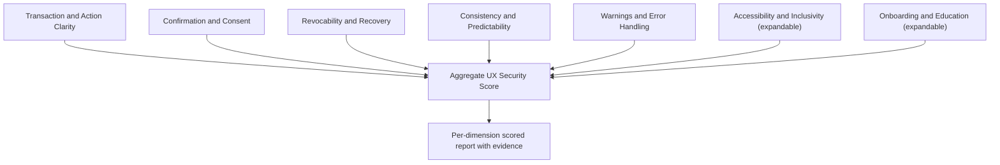
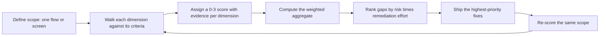
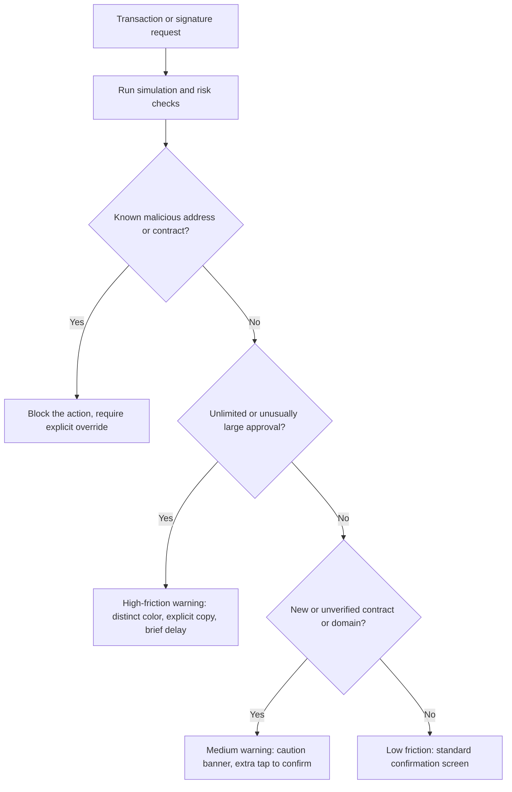
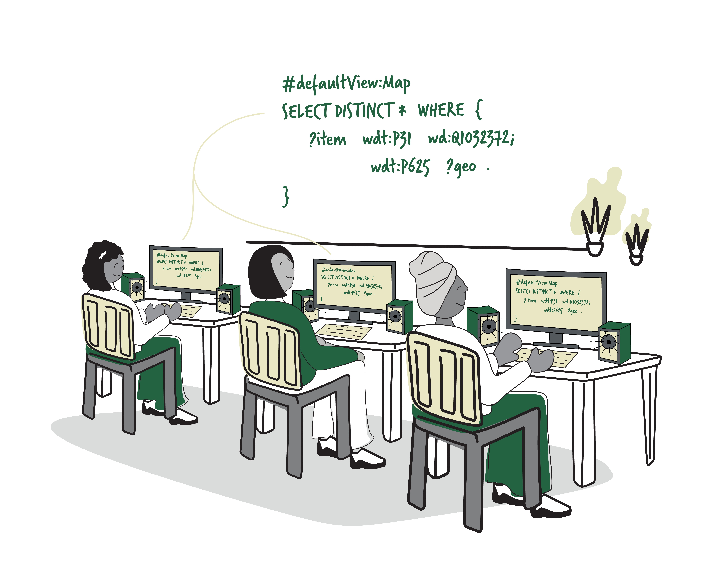
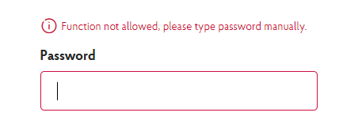
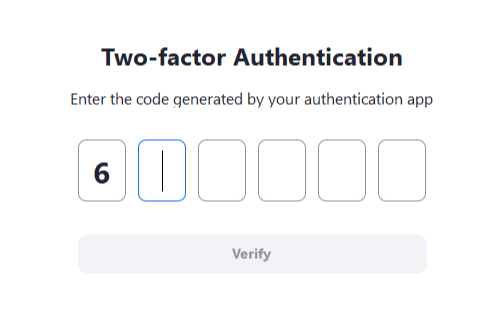
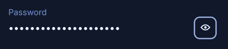

# Part 2: UX Security Scoring Matrix

[Back to Handbook contents](index.md) | [Series index](../index.md)

Part I named the failure modes: phishing, allowance abuse, **blind signing**, calldata that does not match what the screen shows. This Part turns those failure modes into an instrument. The **UX Security** Scoring Matrix gives a product, design, or security team a repeatable way to walk a wallet or decentralized application (dApp, an application whose backend logic runs on a blockchain rather than a controlled server) screen, assign an evidence-backed score to each dimension of risk, and compare that score across releases instead of arguing from intuition about whether a flow "feels safe."

---

## 3. Scoring Matrix Overview

This chapter defines what the matrix is for, what it measures, how scores are assigned, and how a team runs it against a real product surface. Chapters 4 through 9 then work through each dimension in depth with its own rubric.

### 3.1 Purpose and Use of the Matrix

A statement like "the approval flow feels risky" does not survive a sprint-planning meeting. A statement like "Confirmation and Consent scored 1 of 3 because the unlimited-approval toggle defaults to on" does. The matrix exists to convert the **threat model** from Part I into scores a team can track release over release, compare across competing products, and use to prioritize engineering time against the dimensions that most directly cause fund loss.

The matrix is deliberately narrower than a general usability audit. Jakob Nielsen's ten usability heuristics ([Nielsen Norman Group](https://www.nngroup.com/articles/ten-usability-heuristics/)) ask whether an interface is learnable, efficient, and forgiving of ordinary mistakes. A screen can score well on every one of those heuristics and still walk a user into signing an unlimited token allowance for an attacker-controlled contract, because heuristic usability and security-relevant clarity are different properties. The matrix in this Part scores the second property specifically: whether the interface accurately represents risk, forces deliberate consent for irreversible or high-value actions, and gives the user a path back out.

Three groups use it in practice. Product and design teams run it against a mock or a staging build before a feature ships, treating a low score the same way they would treat a failed accessibility check: a release blocker, not a backlog item. Security reviewers and auditors run it against a shipped product as an extension of a contract-level audit, since a UX gap can turn a technically sound contract into a practical drain vector. Comparative researchers run it across competing wallets or dApps to benchmark the market and identify which pattern deserves to become the default.

### 3.2 Dimensions (Clarity, Confirmation, Revocability, Consistency, etc.)

The matrix has five core dimensions, each covered in its own chapter, plus two expandable dimensions that a team scores when the product surface makes them relevant. Every dimension asks a distinct security question; none substitutes for another, and a strong score in one does not compensate for a weak score in another. The Consistency dimension in particular does not multiply into the aggregate at full weight, because a predictable interface only reduces **attack surface** indirectly, by making it harder for a spoofed screen to blend in (Section 9.3 gives the weighting).

| Dimension | Chapter | Core security question | Representative failure |
|---|---|---|---|
| Transaction and Action Clarity | 4 | Can the user see, in plain language, exactly what they are about to sign? | Raw calldata hex with no recipient, amount, or asset decoded |
| Confirmation and Consent | 5 | Does the interface force a deliberate, informed step before an irreversible or high-value action? | Unlimited approval bundled silently into a one-click "connect" flow |
| Revocability and Recovery | 6 | Can the user see and undo what they granted, and recover safely if something goes wrong? | No in-app approvals dashboard; official-looking support channel accepts direct messages |
| Consistency and Predictability | 7 | Does the same action always look the same and lead to the same outcome? | "Approve" on the web app, "Allow" on iOS, "Enable" in a modal, for the identical grant |
| Warnings and Error Handling | 8 | Does displayed risk scale with actual danger, and do errors explain what to do next? | Generic "Transaction failed" with no reason and no remediation step |
| Accessibility and Inclusivity (expandable) | 9.1 | Can users with disabilities perceive and act on the same security-critical information as everyone else? | A truncated address read by a screen reader as one unannounced token |
| Onboarding and Education (expandable) | 9.2 | Does the product teach security concepts at the moment they become relevant? | Seed-phrase warning shown once at signup, never surfaced again |



*Figure 1. The seven dimensions of the matrix. Five core dimensions and two expandable dimensions each contribute an independent score; none is a proxy for another.*

### 3.3 Scoring Levels and Criteria

Every dimension is scored on the same four-point scale, 0 through 3, so scores are comparable across dimensions and across products. The scale borrows its structure from Jakob Nielsen's severity-rating method for usability problems ([Nielsen Norman Group, "How to Rate the Severity of Usability Problems"](https://www.nngroup.com/articles/how-to-rate-the-severity-of-usability-problems/)), which combines frequency, impact, and persistence into a single 0-4 judgment. This matrix recasts those three factors for a security context: instead of frequency, ask how easily an attacker can steer a user into the gap (exploitability); instead of impact, ask how much value or scope is exposed if the gap is exploited (**blast radius**); instead of persistence, ask whether the user can undo the damage afterward (recoverability). A dimension scores low when it is easy to exploit, exposes a large blast radius, and leaves the user with no way back.

| Level | Name | General criteria | Typical evidence |
|---|---|---|---|
| 0 | Absent or actively harmful | The control is missing, or the design actively steers the user toward the riskiest option | No confirmation screen before signing; unlimited approval pre-selected as the default |
| 1 | Minimal or ad hoc | Some protection exists, but it is inconsistent, easy to miss, or trivially bypassed | A warning is present but styled identically to routine informational text |
| 2 | Adequate baseline | Meets what a security-conscious user would expect for the common path through the flow | Plain-language summary shown for a standard swap; revoke option exists but is several taps deep |
| 3 | Exemplary, defense-in-depth | Independent layers catch the failure of any single one; matches or exceeds current best practice | Simulation-derived plain language, risk-scaled friction, and a one-tap revoke path all present together |

A reviewer assigns a score by citing the specific evidence in the row above, not by impression. Two reviewers scoring the same screen from the same evidence should converge on the same number; where they do not, the criteria description in the chapter's `.3` section (for example, 4.3 for Clarity) is the tie-breaker.

### 3.4 How to Apply to a Product or Feature

Run the matrix as a loop, not a one-time report. Six steps make it repeatable across a team and across releases.

1. **Define scope.** Pick one flow or one screen, such as "the token approval step of the swap flow," rather than an entire application at once. Scoring the whole app in one pass produces vague scores that nobody can act on.
2. **Walk each dimension against its criteria.** Use the rubric in the matching `.3` section (4.3, 5.3, 6.3, 7.3, 8.3, and 9.1 to 9.3 for the expandable dimensions).
3. **Assign a 0-3 score with evidence.** Record the specific screen state, copy, or code path that justifies the number, not a paraphrase of the level description.
4. **Compute the weighted aggregate** using the weights in Section 9.3.
5. **Rank gaps by risk times remediation effort**, prioritizing dimensions where a 0 or 1 score exposes a large **blast radius** and the fix is cheap.
6. **Ship fixes and re-score the same scope.** The re-score, not the original score, is what goes in the release record.



*Figure 2. The apply-and-re-score loop. Scoring a static snapshot once has limited value; the matrix earns its keep as a recurring check tied to the release process.*

A worked example against a hypothetical token-swap confirmation screen shows the output format:

| Dimension | Score (0-3) | Evidence |
|---|---|---|
| Transaction and Action Clarity | 2 | Token amounts and a fiat-equivalent value are shown; no flag for an unverified counterparty contract |
| Confirmation and Consent | 1 | The unlimited-approval option is the pre-selected default toggle state |
| Revocability and Recovery | 1 | No in-app link to an approvals dashboard; user must find a third-party tool unaided |
| Consistency and Predictability | 2 | Copy matches between the web app and browser extension; the mobile app uses a different button label for the same action |
| Warnings and Error Handling | 1 | A failed simulation returns a generic revert message with no plain-language cause |
| **Weighted aggregate (core dimensions)** | **7 of 15 (47%)** | Priority fixes: change the approval default to an exact amount, add a one-tap revoke link |

---

## 4. Dimension: Transaction and Action Clarity

Clarity asks whether the interface tells the truth about what a signature does, in language a non-technical user can act on before, not after, the signature is final.

### 4.1 Display of Recipient, Amount, and Asset

Every confirmation screen for a value-moving action should answer three questions unambiguously: where is this going, how much, and of what. Each question has a specific way to fail. Recipient display fails when an interface shows only a truncated address (`0x71C7...976F`), because attackers exploit this by generating vanity addresses that share the truncated prefix and suffix and sending a near-zero "dust" transaction from one, hoping the user copies the poisoned address from their own transaction history on a later transfer. The mitigation is to show the full checksummed address alongside any truncated display, and to warn explicitly when a recipient address was typed or pasted rather than selected from a verified contact or Ethereum Name Service (ENS) record. Amount display fails when a raw integer is shown without correct decimal handling. A token with 6 decimals (USDC) displayed as if it had 18 turns a $500 transfer into an apparent $0.0000000000005 transfer, or the reverse. Asset display fails through symbol collision: any account can deploy a token contract named "USDC" with a spoofed logo, and an interface that trusts contract-supplied metadata over a curated token list will render the scam token identically to the real one.

| Required field | Failure mode | Minimum control |
|---|---|---|
| Recipient | Truncated address only; poisoned lookalike accepted silently | Full checksum address available on tap; warn on pasted addresses |
| Amount | Wrong decimal precision; scientific notation | Decimal-corrected display plus fiat-equivalent value |
| Asset | Symbol or logo spoofing from an unverified contract | Cross-check against a maintained token list; flag unlisted contracts |

### 4.2 Plain-Language Summaries

Most transactions and signature requests arrive at the **wallet** as encoded calldata or a typed-data payload, both of which are unreadable to the overwhelming majority of users. EIP-712, the Ethereum Improvement Proposal (EIP) that standardizes typed structured data for signing, exists specifically to close this gap: it replaces "an opaque hex string displayed to the user with little context" with structured fields a wallet can render in human terms ([EIP-712](https://eips.ethereum.org/EIPS/eip-712)). A wallet or dApp scores well on this criterion when it decodes the request, whether EIP-712 typed data or raw calldata, into a sentence describing the actual effect, ideally backed by a **transaction simulation** that executes the call against current chain state before the user signs.

| Raw signal | Plain-language rendering |
|---|---|
| Calldata calling `transfer(address,uint256)` with a router address | "Transfer 500 USDC to the Uniswap Router contract" |
| `eth_signTypedData_v4` request with an unbounded `value` field and no `expiration` | "Approve unlimited USDC spending by 0xAbc1...29Fd, with no expiration date" |
| Call to a proxy contract deployed two hours ago | "Interact with an unverified contract deployed 2 hours ago" |

### 4.3 Scoring Criteria and Examples

| Level | Criteria | Example |
|---|---|---|
| 0 | Raw hex or calldata only, no decoding of recipient, amount, or asset | Legacy signing dialogs that show only an opaque message hash |
| 1 | Partial decoding; some fields shown, others left raw or mislabeled | Amount shown correctly but recipient still truncated with no full-address option |
| 2 | Full plain-language summary for standard, known transaction types | Swap and transfer flows fully decoded; unfamiliar contract calls fall back to raw display |
| 3 | Full plain-language summary backed by pre-signing simulation for all transaction types, including unrecognized contracts | Simulation flags an unexpected state change, such as an approval hidden inside a "claim" call, before the user signs |

---

## 5. Dimension: Confirmation and Consent

Confirmation and Consent asks whether the interface makes the user deliberately choose the risky path, rather than defaulting them onto it. The February 2025 Bybit incident is the reference case for this dimension across the industry: the OWASP Web3 Attack Vectors Top 15 classifies it under **multisig** hijacking, noting that in the roughly $1.5 billion theft, attackers compromised the front-end infrastructure the signers relied on so that "signers saw one transaction but executed another" ([OWASP Web3 Attack Vectors Top 15, WA01](https://scs.owasp.org/sctop10/Web3-Attack-Vectors-Top15/); [Bybit background, Wikipedia](https://en.wikipedia.org/wiki/Bybit)). No amount of multisig threshold configuration protects a signer who is shown a truthful-looking screen for a different transaction than the one their key actually signs.

### 5.1 Explicit Confirmation for High-Risk Actions

Not every action deserves the same friction. A read-only balance check should be instant; changing a **multisig**'s signer set should not be. Define a fixed list of high-risk action categories up front, and require deliberate, hard-to-misclick confirmation for each: unlimited or open-ended token approvals, ownership or admin-role transfers, contract upgrade authorizations, adding or removing a multisig signer or changing its threshold, and any transfer above a configurable value threshold. For these categories, add friction that a phishing clone or a compromised front end cannot silently replicate: require the user to type the exact amount or the last six characters of the destination address rather than clicking a single "Confirm" button, and where the action is irreversible and high value, add a short mandatory delay or an out-of-band confirmation on a second device.

| High-risk action | Recommended confirmation mechanism |
|---|---|
| Unlimited token approval | Type the numeric amount to be approved; reject a default of "unlimited" |
| Multisig signer or threshold change | Out-of-band confirmation (a call or a second app) in addition to the in-app signature |
| Large-value transfer | Configurable value threshold triggers a type-to-confirm step and a short delay |
| Contract upgrade or ownership transfer | Explicit summary of the change with a mandatory waiting period before execution |

### 5.2 Approval and Allowance Flows

The legacy ERC-20 pattern, the Ethereum Request for Comment (ERC) fungible-token standard, grants approvals that are open-ended by default and remain live until manually revoked, regardless of whether the user ever transacts with the spender again. Permit2, a Uniswap-maintained contract, replaces this with signature-based transfers that never create a persistent on-chain approval and with time-bound allowances that expire automatically, combining "signature-based transfers and time-bound allowances for token spending" ([Permit2 overview, Uniswap developer documentation](https://docs.uniswap.org/contracts/permit2/overview)). Scoring this dimension well means the product defaults to the narrower grant, not the broader one, and surfaces the expiration or scope to the user before they sign.

```solidity
// Legacy ERC-20 pattern: unlimited, indefinite approval is the common default
IERC20(token).approve(spender, type(uint256).max);

// Permit2 pattern: signature-scoped, time-bound allowance
// The user signs an off-chain EIP-712 message; no on-chain approval transaction required
IAllowanceTransfer.PermitSingle memory permit = IAllowanceTransfer.PermitSingle({
    details: IAllowanceTransfer.PermitDetails({
        token: token,
        amount: 500e6,                                    // exact amount needed, not unlimited
        expiration: uint48(block.timestamp + 30 minutes),  // expires automatically
        nonce: nonce
    }),
    spender: spender,
    sigDeadline: block.timestamp + 30 minutes
});
```

### 5.3 Scoring Criteria and Examples

| Level | Criteria | Example |
|---|---|---|
| 0 | High-risk actions confirmed with the same one-click flow as routine actions | Unlimited approval and a routine balance refresh both need only a single tap |
| 1 | Some high-risk actions get extra confirmation; coverage is inconsistent | Large transfers require a second tap, but signer-set changes do not |
| 2 | All defined high-risk categories require deliberate, distinguishable confirmation | Type-to-confirm required for unlimited approvals and ownership changes |
| 3 | High-risk confirmation is out-of-band or otherwise resistant to a compromised front end | Multisig changes require confirmation through an independent channel, not only the same web session |

---

## 6. Dimension: Revocability and Recovery

Revocability and Recovery asks what happens after something goes wrong, whether that is a stale allowance the user forgot about or a support interaction with someone impersonating the product's own team.

### 6.1 Revoking Approvals and Permissions

An allowance a user granted six months ago for a since-abandoned protocol is a live liability until it is revoked, and most users have no visibility into which allowances they still hold. A product scores well here when it exposes its own approvals inside the app, not only through a third-party tool, and when revocation takes one action rather than a multi-screen hunt. External tools remain the fallback for allowances granted outside the product: Etherscan's Token Approval Checker and the independent service Revoke.cash both let a user "inspect and revoke token approvals" across a connected **wallet** and, in Revoke.cash's case, across more than 100 networks ([Revoke.cash](https://revoke.cash/); Etherscan Token Approval Checker, etherscan.io/tokenapprovalchecker). Products should link to these, or to an in-house equivalent, directly from the confirmation flow that created the allowance in the first place.

```solidity
// Manual revoke of a legacy unlimited approval
IERC20(token).approve(spender, 0);

// Permit2 allowances can be revoked in bulk via its lockdown function,
// which zeroes out one or more token-and-spender pairs in a single call
```

```bash
# Point the user at a verified approvals dashboard; never ask them to paste
# a seed phrase or private key into any such tool
open "https://revoke.cash/address/0xYourWalletAddress"
```

### 6.2 Recovery Flows and Support

The recovery path is where drainer operators concentrate social-engineering effort, because a user who has already lost funds, or fears they are about to, is primed to act fast and skip verification. A fake "support agent" in a Discord or Telegram channel that mimics an official server is a standing pattern across the industry and is the mechanism behind a large share of reported thefts, since no legitimate recovery flow ever needs a **seed phrase**, a **private key**, or a signature framed as "verification." Score this dimension on whether the product publishes an authoritative, hard-to-spoof list of official channels, whether its own staff are trained and contractually barred from requesting secrets, and whether any self-custody recovery mechanism it offers (social recovery guardians, for instance) is resistant to a single compromised guardian.

| Recovery mechanism | Impersonation risk | Recommended safeguard |
|---|---|---|
| Live chat, Discord, or Telegram "support" | High: attackers impersonate support and request a seed phrase or a disguised signature | Never request a seed phrase or a signature for support purposes; publish an allowlist of official channels in-app |
| Social recovery guardians | Medium: guardian collusion or a phished guardian key | Time-locked recovery with notification to the original owner; diverse guardian custody |
| Hardware-wallet reset from a physical backup | Low: requires physical possession of the seed phrase | Educate users to store the phrase offline only, never digitally |
| Exchange-custodied account recovery | Medium: SIM-swap (mobile carrier account takeover) or linked-email takeover | Hardware-key multi-factor authentication (MFA); withdrawal address allowlisting |

### 6.3 Scoring Criteria and Examples

| Level | Criteria | Example |
|---|---|---|
| 0 | No in-app visibility into granted approvals; support channels are unverified or accept direct messages | Users must discover and trust an unlinked third-party tool unaided |
| 1 | Approvals are visible but revocation requires leaving the app; support policy exists but is not enforced or published | An approvals list exists in account settings, several menus deep |
| 2 | In-app revoke available within the primary flow; published official-channel allowlist | One-tap revoke from a notifications or activity screen |
| 3 | In-app revoke plus proactive expiry nudges for stale allowances; recovery flows resistant to single-point impersonation | Product flags allowances unused for 90+ days and prompts revocation |

---

## 7. Dimension: Consistency and Predictability

Consistency and Predictability asks whether the same action always looks and behaves the same way, because an interface that varies its own presentation gives an attacker cover: a spoofed dialog only needs to be as convincing as the legitimate one's own inconsistency allows.

### 7.1 Terminology and Visual Consistency

Users build a mental model of what a security-relevant dialog looks like from repeated exposure to the genuine one. Every point where the product's own copy, iconography, or color varies for the identical underlying action widens the gap a convincing fake has to clear. This applies within a single platform (a web app and its own settings page using different verbs for the same grant) and across platforms (the same action worded differently on iOS, Android, and the browser extension).

| Inconsistent | Consistent |
|---|---|
| "Approve" on the web app, "Allow" on iOS, "Enable" inside a modal, all for the same allowance grant | "Approve," the same icon, and the same color used everywhere the action appears |
| "Revoke," "Cancel," and "Remove" used interchangeably for canceling an allowance, including in support documentation | One verb, "Revoke," used consistently across the product and its documentation |

### 7.2 Predictable Navigation and Outcomes

Predictability extends beyond wording to sequence. A confirm button that leads to different outcomes depending on hidden state (network congestion, a stale price quote, a background app update) trains users to click through without reading, which is precisely the habit a phishing clone relies on. Score this criterion against a short checklist: does the same action always require the same number of steps; does using the back button ever silently resubmit or duplicate an action; does a session timeout mid-flow return the user to a safe state rather than an ambiguous one; and does the product avoid unannounced UI changes (a redesigned confirm screen shipped without in-app notice) that retrain users to trust an unfamiliar layout.

- Same action, same step count, every time it is available in the product.
- No silent resubmission on back-button or browser-refresh navigation.
- Session timeout returns to a safe, unambiguous state, not a partially completed one.
- Material UI changes to security-relevant screens are announced in-app before they ship.

### 7.3 Scoring Criteria and Examples

| Level | Criteria | Example |
|---|---|---|
| 0 | Terminology and layout vary noticeably across platforms or contexts for the same action | Approval flow looks and reads differently on mobile versus web with no shared design system |
| 1 | Mostly consistent, with a few known divergences | Minor label differences that a style-guide audit would catch |
| 2 | Consistent terminology, iconography, and step count across the product's own surfaces | Shared component library enforces identical confirmation screens |
| 3 | Consistency verified across platforms and versions with regression testing; changes are announced before shipping | Visual regression tests specifically cover security-critical confirmation screens |

---

## 8. Dimension: Warnings and Error Handling

Warnings and Error Handling asks whether the interface's alarm bells are calibrated to actual danger, and whether a failure leaves the user knowing what to do next.

### 8.1 Clear Warnings for Risky Operations

A warning that fires for every transaction trains users to dismiss warnings; a warning that never fires leaves them with no signal at all. The calibrated middle ground scales visual and interactive friction to the underlying risk signal, typically produced by a pre-signing simulation that checks the destination against known-malicious address lists, flags unlimited or unusually large approvals, and flags interaction with new or unverified contracts. Several major wallets, including MetaMask, Coinbase **Wallet**, Rainbow, and Ledger, integrate third-party risk engines such as Blockaid for exactly this purpose, scanning transactions, addresses, and dApps in real time before a signature is requested ([Blockaid](https://blockaid.io/)).



*Figure 3. Warning severity scaled to risk signal. A single fixed warning style for every transaction either desensitizes users to real danger or adds needless friction to safe, routine actions.*

### 8.2 Error Messages and Recovery Guidance

An error that names the problem and the fix keeps a user safe; an error that names neither pushes them toward blind retries, which is a pattern drainer operators exploit by presenting a "fixed" retry screen that carries a different, malicious payload. Surface the actual revert reason in plain language, state the specific missing precondition (insufficient balance, expired quote, slippage exceeded), and give a concrete next step rather than a bare "try again."

| Poor | Improved |
|---|---|
| "Transaction failed." | "This swap would fail: your USDC balance ($420) is less than the amount plus network fee ($431). Add funds or reduce the swap amount." |
| "Error 0x4e487b71 (0x11)" | "This transaction would revert due to an arithmetic overflow in the amount field. Try a smaller amount." |

### 8.3 Scoring Criteria and Examples

| Level | Criteria | Example |
|---|---|---|
| 0 | No risk-based warnings; errors are raw codes or generic failure text | A revert surfaces only as an unlabeled hex error code |
| 1 | Warnings exist but do not scale with risk; errors name the problem but not the fix | Every transaction shows the same caution icon regardless of actual risk |
| 2 | Warning friction scales with risk signal; errors explain cause and next step for common failures | Simulation-based warning for unlimited approvals; balance errors state the shortfall |
| 3 | Warnings block or require explicit override for known-malicious targets; errors cover edge cases with actionable guidance | Known drainer contract addresses are blocked outright, not merely flagged |

---

## 9. Additional Dimensions (Expandable)

The five core dimensions cover the failure modes most directly tied to fund loss. Two further dimensions extend the matrix where a product's audience or maturity makes them material, and a final section ties every dimension together into one reportable number.

### 9.1 Accessibility and Inclusivity

A security control that only a sighted, dexterous, English-reading user can act on is not a universal control, it is a control with an exclusion built in, and that exclusion is itself a security gap for every user it leaves out. The Web Content Accessibility Guidelines (WCAG), the W3C's standard for accessible digital content, define this systematically across four principles: perceivable, operable, understandable, and robust, at three conformance levels, A, AA, and AAA ([WCAG 2.2](https://www.w3.org/WAI/WCAG22/quickref/)). Apply WCAG's principles specifically to security-relevant content, not only to general navigation.


*Figure. Developers using screen readers, the same assistive technology this dimension asks a wallet or dApp to support for security-critical fields like a full checksummed address or an unlimited-allowance warning, not only for general page content. Source: [Wikimedia Commons](https://commons.wikimedia.org/wiki/File:Hackathon_Screen_reader.png), CC BY-SA 3.0.*


*Figure. Blocking paste is a security anti-pattern as well as an accessibility failure: it prevents password-manager use and forces users to transcribe credentials, encouraging weaker secrets and increasing input error. Source: [W3C WAI, Understanding Accessible Authentication (Minimum)](https://www.w3.org/WAI/WCAG22/Understanding/accessible-authentication-minimum.html), W3C document visual used with attribution.*


*Figure. A split one-time-password control can break paste, autofill, focus order, and screen-reader announcements. Prefer one semantic field with platform autocomplete metadata, while styling digits visually without fragmenting the input model. Source: [W3C WAI, Understanding Accessible Authentication (Minimum)](https://www.w3.org/WAI/WCAG22/Understanding/accessible-authentication-minimum.html), W3C document visual used with attribution.*


*Figure. A correctly labeled show-password control reduces cognitive load and transcription errors without removing masking by default. Its accessible name and pressed state must be exposed to assistive technology, and revealing the value should never be forced. Source: [W3C WAI, Understanding Accessible Authentication (Minimum)](https://www.w3.org/WAI/WCAG22/Understanding/accessible-authentication-minimum.html), W3C document visual used with attribution.*

- Full checksummed addresses are announced by screen readers, not just the truncated visual string, via an explicit `aria-label`.
- Risk level is never conveyed by color alone (WCAG 2.2, success criterion 1.4.1); pair color with an icon and a text label.
- Confirmation screens remain usable at 200% text zoom without clipping the confirm or cancel control (WCAG 2.2, success criterion 1.4.4).
- Any video-based security education includes captions and a text transcript.
- A complete keyboard-only path exists to review and revoke an approval, with no mouse required.

### 9.2 Onboarding and Education

Security education that happens once, at signup, is forgotten by the time it matters. The pattern that scores better is just-in-time: the explainer for "what is an unlimited allowance" appears the first time the user is actually asked to grant one, not buried in a one-time welcome tour they clicked through. Pair contextual explainers with a persistent, inline glossary for terms like allowance, gas, and **blind signing** (signing a request without being able to verify what it actually authorizes), and consider a periodic re-education nudge after long account dormancy, since a returning user after months away is a common target for **social engineering** that exploits their rustiness with the product's real flows.

- Contextual explainer triggered at the first unlimited-approval prompt, not only in a one-time onboarding wall.
- Inline glossary linked from any screen using a term like allowance, gas, or blind signing.
- Optional sandbox or testnet practice transaction before a first-time high-value mainnet action.
- Re-engagement nudge on long dormancy, framed as a security refresher rather than a marketing prompt.

### 9.3 Aggregate Score and Reporting

Report per-dimension scores alongside, never instead of, the aggregate, because averaging hides a single catastrophic zero behind four healthy threes. Weight the five core dimensions by how directly each one gates fund loss, and treat the two expandable dimensions as separate line items unless the product's own risk profile (a large low-vision user base, for instance) justifies folding them into the core weight.

| Dimension | Weight | Rationale |
|---|---|---|
| Transaction and Action Clarity | 1.0 | Root cause of most reported drainer losses |
| Confirmation and Consent | 1.0 | The last control before an irreversible signature |
| Revocability and Recovery | 1.0 | Determines how long a single mistake stays exploitable |
| Consistency and Predictability | 0.75 | Reduces the odds a spoofed screen goes unnoticed, but rarely the direct cause of loss |
| Warnings and Error Handling | 1.0 | Directly gates whether calculated risk ever reaches the user |
| Accessibility and Inclusivity (expandable) | 0.5 | A control that fails silently for the users it excludes |
| Onboarding and Education (expandable) | 0.5 | Reduces the likelihood, not the severity, of a given failure |

Compute the core aggregate as the sum of weighted core-dimension scores divided by the maximum possible weighted total, expressed as a percentage: `(Σ weight × score) / (3 × Σ weight) × 100`. Report the expandable dimensions alongside as a secondary line rather than folding them silently into the headline number, so a strong core score never masks a product that is inaccessible or teaches nothing. Re-run the full matrix at three points in the product lifecycle at minimum: design review, before every release that touches a signing or approval flow, and on a fixed quarterly cadence regardless of release activity, since a dimension can regress silently when an unrelated redesign changes shared components.

---

**Key controls for Part 2**

- Score every signing-relevant flow on all five core dimensions before release; treat a 0 or 1 on Confirmation and Consent or Warnings and Error Handling as a release blocker.
- Default token approvals to an exact, time-bound grant (Permit2-style) rather than an unlimited, indefinite one.
- Give every product its own in-app approvals dashboard and one-tap revoke, not only a link to a third-party tool.
- Scale warning friction to simulation-derived risk signal instead of applying one fixed warning style to every transaction.
- Keep terminology, iconography, and step count identical for the same action across every platform the product ships on.
- Treat accessibility and onboarding as scored dimensions, not optional polish, when the product's audience or risk profile makes them material.

