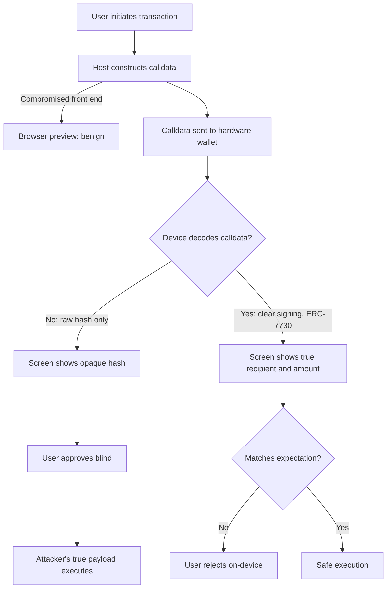
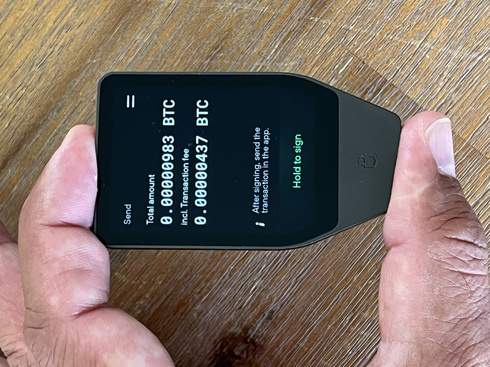
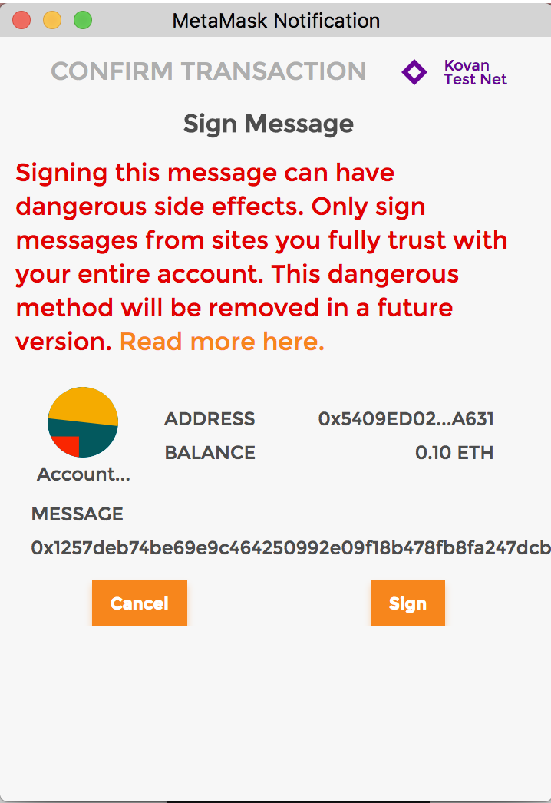
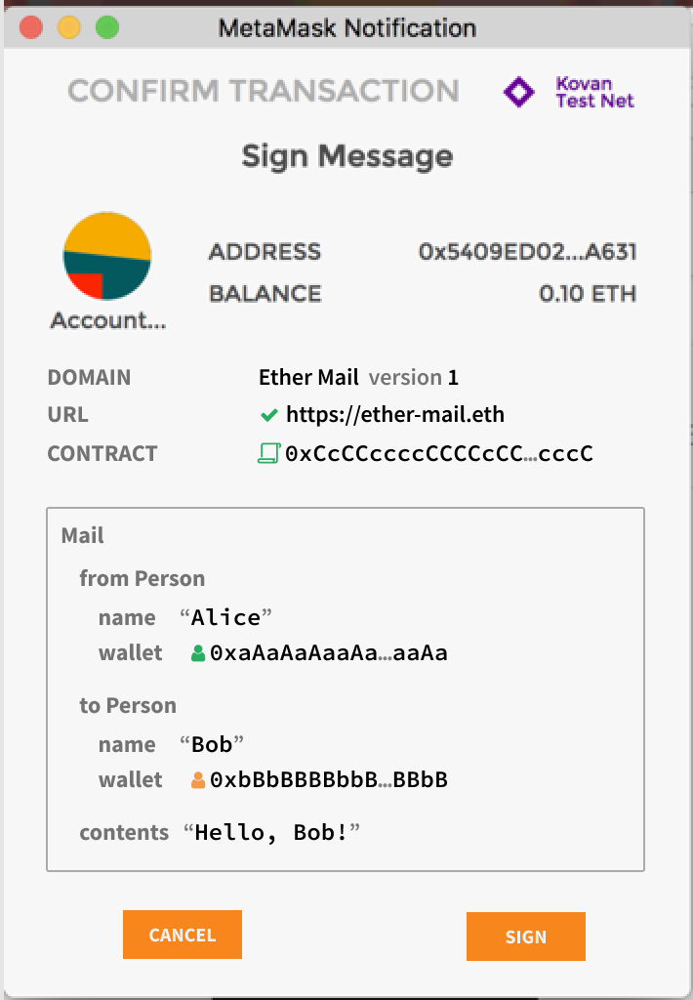
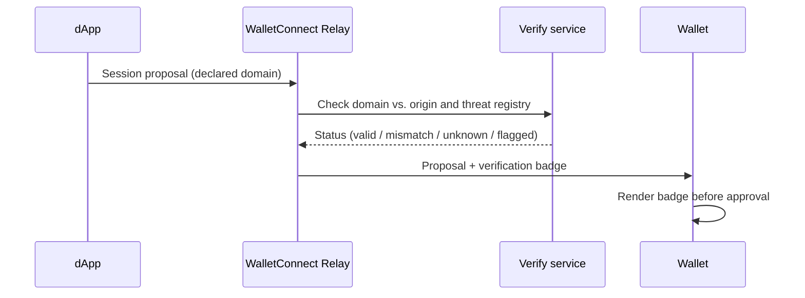
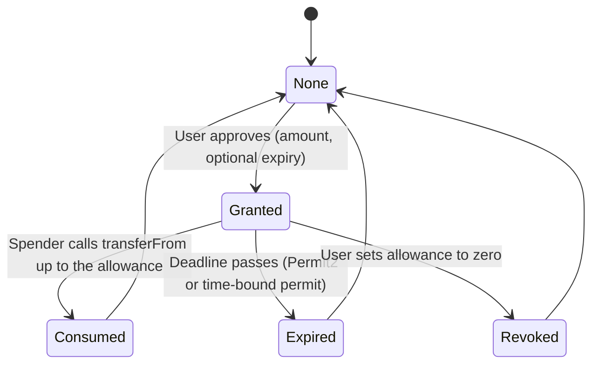
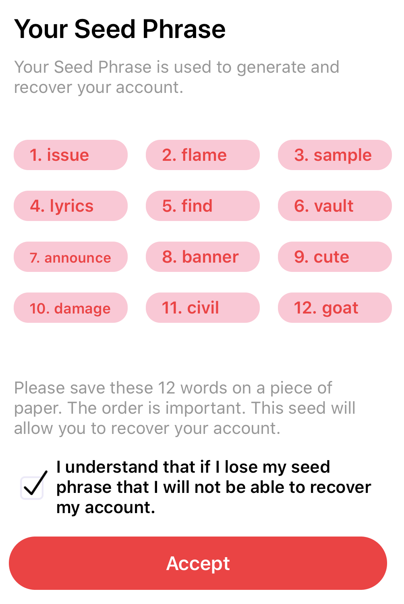

# Part 3: Best Practices

[Back to Handbook contents](index.md) | [Series index](../index.md)

The **UX Security** Scoring Matrix in Part II gives you dimensions to grade an interface against: clarity, confirmation, revocability, consistency, and error handling. This part turns each dimension into shippable patterns, working through the surfaces a Web3 user actually touches: the **wallet**'s signing screen, the handshake that connects a wallet to a decentralized application (dApp), the allowance a token grants a spender, the alert that fires when something goes wrong, and the first minutes a new user spends learning the product.

---

## 10. Wallet and Signing UX

The **wallet** is the last checkpoint before an on-chain action becomes irreversible, and every pattern in this chapter answers the same question: does the interface show the user what will actually happen, in language and on hardware the user can trust, before the signature is produced.

### 10.1 Custodial vs. Non-Custodial and Cold vs. Hot: UX Implications

Two independent axes shape a **wallet**'s security posture and UX budget. The first is custody: a custodial wallet (an exchange account, a managed multi-party computation (MPC) service) holds keys on the user's behalf and offers familiar patterns like password reset, trading self-custody risk for counterparty risk. A non-custodial wallet puts the user in sole possession of key material, usually a **seed phrase** or a hardware secure element, and inherits none of the operator's recovery infrastructure: lose the phrase and the funds are unrecoverable, a UX burden custodial products do not carry. The second axis is connectivity: a hot wallet (browser extension, mobile app) is reachable by any page or process the device runs, making it the default target for clipboard hijackers and drainer kits. A cold wallet (hardware device, air-gapped signer) keeps the private key on a device with no persistent network path, trading a few extra seconds of friction for immunity to remote key exfiltration.

Neither axis has one correct answer; the right choice tracks the value at risk.

| Actor profile | Recommended class | Rationale |
|---|---|---|
| Retail, daily spending balance | Non-custodial hot | Convenience outweighs the smaller balance at risk; pair with allowance hygiene (12.1) |
| Retail, long-term holdings | Non-custodial cold | Infrequent use tolerates the friction; removes remote-exfiltration risk |
| DAO or protocol treasury | Non-custodial cold, multisig | No single signer should authorize alone; on-device verification (10.2) mandatory |
| Institutional custody | Custodial MPC or qualified custodian | Regulatory and insurance requirements usually outweigh counterparty risk |

Surface this tradeoff explicitly rather than defaulting silently to whichever option is easiest to build; the choice a user makes at onboarding is rarely revisited.

### 10.2 Hardware Wallet On-Device Verification for Critical Actions

A **hardware wallet**'s security promise rests on one property: the screen the user reads and the key that signs live on the same tamper-resistant device, so a compromised host computer cannot alter what is confirmed. That promise breaks the moment a critical action is approved by glancing at the connected computer's screen instead of the device's own display, because the host is exactly the component an attacker is most likely to control. The February 2025 Bybit theft, in which North Korea's Lazarus Group (tracked by the FBI as "TraderTraitor") stole approximately $1.5 billion by manipulating the transaction shown to Safe **multisig** cold-wallet signers ([FBI Internet Crime Complaint Center (IC3) flash alert, 26 Feb 2025](https://www.ic3.gov/PSA/2025/PSA250226)), is the reference case: the front end displayed a routine transfer while the actual signed payload changed control of the wallet, and because it was never decoded into human-readable form on the device itself, the on-device screen could not catch what the browser hid.


*Figure 1. On-device decoding is the only checkpoint a compromised host cannot spoof. Without it, the hardware screen is a blind rubber stamp.*


*Figure. A hardware wallet's on-device screen, the checkpoint this section describes: the device decodes and displays what it will actually sign, so a compromised host cannot substitute a different transaction without the mismatch being visible here. Source: [Wikimedia Commons](https://commons.wikimedia.org/wiki/File:Trezor_Safe_7.jpg), CC0 1.0 (public domain).*

The industry response is the Clear Signing initiative Ledger began in 2023, now the Ethereum Foundation-backed Clear Signing Alliance, built on the open **ERC-7730** metadata standard, which lets a hardware device translate raw calldata into "the recipient, the amount, the type of approval, and which dApp is requesting it, in simple language" on a certified, tamper-proof display ([Ledger, Clear Signing](https://shop.ledger.com/pages/clear-signing)). Treat these as critical actions that must never be approved from a raw hash: any high-value transfer, any token or non-fungible token (NFT) approval, any change to a multisig owner set or threshold, any contract upgrade or ownership transfer, and any EIP-7702 delegation (Section 10.4). Where a target contract has no ERC-7730 descriptor yet, the **wallet** should say so explicitly ("this action cannot be clear-signed") rather than falling back silently to blind signing.

### 10.3 EIP-712 and Human-Readable Signature Review

Before structured signing existed, a **wallet** had only one way to ask a user to authorize arbitrary data: show a hex string and a "Sign" button. [EIP-712](https://eips.ethereum.org/EIPS/eip-712) replaced that with a standard for hashing and signing typed structured data, so a message can be rendered the way a Solidity struct is: named fields, explicit types, and a domain separator (contract name, version, chain ID, and verifying contract address) that stops the same signature from being replayed against a different application or chain. A wallet that supports `eth_signTypedData_v4` can walk the struct and print `spender: 0xA1b2...`, `value: 500 USDC`, `deadline: 2026-08-17 14:00 UTC` instead of a 66-byte blob, which is the difference between a user who can catch a mismatched spender address and one who cannot.


*Figure. The failure state EIP-712 was designed to replace: an `eth_sign` prompt exposes bytes but no domain, field names, recipient, amount, or deadline that a human can verify. Source: [EIP-712 specification](https://eips.ethereum.org/EIPS/eip-712), CC0.*


*Figure. The same authorization class represented as typed structured data. Named fields are necessary but not sufficient: the wallet must still render the domain separator, verifying contract, chain, spender, value, nonce, and expiry in a layout that makes mismatches salient. Source: [EIP-712 specification](https://eips.ethereum.org/EIPS/eip-712), CC0.*

```json
{
  "domain": { "name": "USD Coin", "version": "2", "chainId": 1, "verifyingContract": "0xA0b8...eB48" },
  "types": {
    "Permit": [
      { "name": "owner", "type": "address" },
      { "name": "spender", "type": "address" },
      { "name": "value", "type": "uint256" },
      { "name": "nonce", "type": "uint256" },
      { "name": "deadline", "type": "uint256" }
    ]
  },
  "primaryType": "Permit",
  "message": { "owner": "0xUser...", "spender": "0xRouter...", "value": "500000000", "nonce": 4, "deadline": 1755436800 }
}
```

Two practices follow. dApp developers should never request a legacy `eth_sign` or unstructured `personal_sign` over arbitrary bytes when a typed-data equivalent exists; most major wallets, including MetaMask, now warn or block `eth_sign` by default precisely because it lets a malicious dApp request a signature over anything, including a disguised transaction hash. Wallet developers should treat an unrecognized message type the way they treat undecodable calldata in Section 10.2: flag it, name the risk in plain language, and require an extra confirmation step. This directly satisfies the [Transaction and Action Clarity dimension](part2-ux-security-scoring-matrix.md#4-dimension-transaction-and-action-clarity) of the scoring matrix in Part II.

### 10.4 EIP-7702 and Smart-Contract Features for EOAs: New Risks

[EIP-7702](https://eips.ethereum.org/EIPS/eip-7702), activated on Ethereum mainnet as part of the Pectra upgrade on 7 May 2025 ([Ethereum Foundation, Pectra roadmap](https://ethereum.org/en/roadmap/pectra/)), lets an externally owned account (EOA) attach executable code to itself for the duration of a transaction by including a signed authorization tuple, enabling call batching, sponsored (gas-paid-by-a-third-party) transactions, and privilege de-escalation through sub-keys. It is a genuine UX improvement and a genuinely new class of risk, because the EOA's authorization signature is a delegation of authority, not a one-time action. The EIP's own security considerations state that "a poorly implemented delegate can allow a malicious actor to take near complete control over a signer's EOA," and warn that delegate contracts must independently enforce replay protection, value limits, gas limits, and target restrictions ([EIP-7702 Security Considerations](https://eips.ethereum.org/EIPS/eip-7702)). The upgrade also breaks the long-standing invariant that `tx.origin == msg.sender` holds only at the top of the call stack, quietly invalidating some existing reentrancy and sandwich-attack guards.

The OWASP Web3 Attack Vectors Top 15 already documents scam pages that frame a 7702 authorization as a routine "upgrade your **wallet**" prompt, deceiving users into delegating their EOA's code to an adversarial contract that sweeps its assets ([OWASP Web3 Attack Vectors, WA06](https://scs.owasp.org/sctop10/Web3-Attack-Vectors-Top15/)).

| Risk | UX mitigation |
|---|---|
| Malicious delegate takes full control of the EOA | Treat any 7702 authorization request with the same critical-action UI as an owner change (10.2): full on-device address display, no batching with unrelated actions |
| Generic "upgrade your wallet" framing hides the delegation's scope | Show the exact delegate contract address and, where an ERC-7730 descriptor exists, what functions it exposes; never render a vague label |
| Front-run initialization of a newly delegated account | Require the EOA's own signature (`ecrecover`) for setup parameters; never accept unsigned initialization from an observer |
| Sponsor (relayer) risk of asset sweep before reimbursement | dApps offering sponsored transactions should disclose the sponsor's bonding or reputation mechanism in-product |

Never let a dApp present a 7702 signature request as anything less than "you are granting a smart contract permanent code-level control over this wallet address until you revoke it."

### 10.5 Account Abstraction Wallets: Verification and Consent UX

[ERC-4337](https://eips.ethereum.org/EIPS/eip-4337) account abstraction (AA) moves the **wallet** from a fixed protocol-level EOA to a smart contract account with programmable validation logic, using a `UserOperation` object that a Bundler packages into a call against a shared EntryPoint contract, optionally paid for by a Paymaster. This breaks the "one click, one signature" model Sections 10.2 and 10.3 assume: a single UserOperation can bundle several calls, gas can be sponsored so the user never sees a native-token cost, and under ERC-7579 modular accounts, a session key can be granted to a dApp or automation service to act without any further per-transaction confirmation, constrained by spending limits, time windows, and target restrictions enforced by a session-management module.

That programmability is a UX win only if consent UX keeps pace. A wallet's decoding obligation from Section 10.3 extends to every call inside a UserOperation, not just the top-level intent, because a bundled operation can hide an unrelated approval inside an otherwise-expected swap; show a net asset-flow summary (what leaves, what arrives, what allowances change) rather than a generic "confirm transaction" button. For session keys, provide a persistent panel listing every active grant with its scope, spend limit, expiry, and an instant, on-chain-enforceable revoke action, the AA equivalent of the allowance dashboard in Section 12.1. Where the account has no hardware secure element, pair it with a WebAuthn passkey or hardware co-signer so the on-device verification guarantee from Section 10.2 is not silently dropped.

---

## 11. dApp and Connection UX

Before a **wallet** signs anything, it has to trust that it is talking to the dApp the user intended to reach. This chapter covers the two controls that anchor that trust: verifying the connecting domain, and never letting the user discover a dApp through an unverified link.

### 11.1 WalletConnect Verify API and Domain Verification

Browser-extension wallets get an origin check for free: the browser enforces that a page can only request signatures for the origin it is served from. WalletConnect-style connections, where a desktop dApp displays a QR code or deep link and a separate mobile **wallet** scans or receives it, have no such built-in check, because the wallet never loads the dApp's page and cannot inspect its origin directly. The Verify API, offered by WalletConnect's parent project Reown, closes that gap by having the relay attach a verification attestation to the session proposal: it compares the domain the dApp declared in its metadata against the domain actually serving the connection request and cross-references both against a registry of known-malicious domains, then returns a status the wallet renders as a badge before the user approves the pairing (see [Reown documentation](https://docs.reown.com/) for current implementation details).


*Figure 2. The Verify API attaches an out-of-band domain check to a connection that has no native browser origin boundary to rely on.*

| Badge state | Meaning | Recommended wallet UX |
|---|---|---|
| Verified | Declared domain matches serving origin, not flagged | Green indicator, standard flow |
| Domain mismatch | Declared domain differs from actual serving origin | Prominent warning; require an extra confirmation tap |
| Unknown | dApp has not registered verifiable metadata | Neutral indicator, but still surfaced; silence is not safety |
| Flagged | Domain matches a known-scam entry | Block by default; require an explicit, labeled override |

The control only works if wallets refuse to render every state identically; a badge nobody sees is not a control.

### 11.2 Bookmarks and Verified Entry Points

The single most exploited human factor in Web3 phishing is not a cryptographic weakness, it is the address bar. Punycode homograph domains, malicious search-engine ads that outrank the legitimate result for "Uniswap" or "MetaMask," and compromised social-media links all attack the same moment: the instant a user chooses which URL to trust. The fix is procedural, not technical. Instruct users to type a canonical URL once, verify it against the project's official channels, and bookmark it rather than searching or clicking a link on every subsequent visit; a bookmark cannot be typosquatted and removes the search-ad **attack surface** entirely. **Wallet** vendors reinforce this by curating vetted dApp directories inside their own apps (hardware-wallet companion apps and mobile "discover" tabs vet an origin before listing it), and extensions such as MetaMask ship a community-maintained phishing-domain blocklist that intercepts known-bad hosts before the page renders.

Checklist for teams publishing an official entry point:
- Register and defend look-alike and homograph variants of your primary domain.
- Publish the canonical URL prominently and consistently across every official channel so users have one authoritative source to compare against.
- Apply the DNS-hardening controls in the DNS and Hosting Security Handbook (02), including registrar lock and DNSSEC, so the canonical domain itself cannot be hijacked.
- Submit your domain to major wallet phishing-blocklist maintainers and the WalletConnect Verify registry, and never rely on a paid search ad as a distribution channel.

---

## 12. Approval and Allowance UX

An approval is a standing authorization, not a one-time action, and the gap between what a user intends to grant and what the interface actually requests is one of the most exploited surfaces in Web3.

### 12.1 Granular and Time-Limited Approvals; Revocation Flows

The ERC-20 `approve` function takes an arbitrary allowance amount, and the path of least resistance for a dApp is to request `type(uint256).max`, an unlimited allowance, so the user never has to re-approve later. That convenience is exactly the mechanism behind approval-phishing drains: once a spender is authorized for an unlimited amount, one malicious `transferFrom` call, at any future point, empties the balance with no further signature required. Chainalysis attributed at least $374 million in 2023 losses to this pattern, tracked by OWASP as its own Web3 attack-vector category, WA06 ([OWASP Web3 Attack Vectors Top 15](https://scs.owasp.org/sctop10/Web3-Attack-Vectors-Top15/)).

```solidity
// Requested by the dApp, decided by the interface, not the protocol
IERC20(token).approve(spender, 500e6);              // exact amount: expires with the trade
IERC20(token).approve(spender, type(uint256).max);  // unlimited: standing risk until revoked
```

Uniswap's [Permit2](https://github.com/Uniswap/permit2) improves on raw `approve` by centralizing allowances in one audited contract and letting a spender request a signature-based, time-bound permit instead of a separate on-chain transaction per integration. That is a real improvement, but it moves the risk rather than eliminating it: a permit is a signature, not a transaction, so it produces no separate on-chain approval event for a monitoring tool to flag, and demands the exact same EIP-712 clear-signing rigor from Section 10.3, arguably more, since there is no second confirmation step to catch what the first missed.


*Figure 3. An allowance is standing risk between Granted and any exit state. The UX goal is to minimize time spent in Granted and make every exit reachable in one action.*

Concrete UX rules for any interface that requests an allowance:

| Rule | Why it matters |
|---|---|
| Default the requested amount to the exact transaction value, not unlimited | Removes the standing-risk window for the common case |
| Gate unlimited or custom amounts behind an explicit expand action with a plain-language warning | Satisfies the [Warnings and Error Handling dimension](part2-ux-security-scoring-matrix.md#8-dimension-warnings-and-error-handling); unlimited becomes deliberate, not default |
| Default a bounded expiry for signature-based permits | Converts standing risk into a self-expiring one, even without manual revocation |
| Ship or link an allowance dashboard (in-product or [Revoke.cash](https://revoke.cash) / block-explorer checkers) | Hardware wallets give no protection against an already-granted approval; users cannot manage what they cannot see |
| Make revocation one click from that dashboard | Satisfies the [Revocability and Recovery dimension](part2-ux-security-scoring-matrix.md#6-dimension-revocability-and-recovery) directly |

---

## 13. Notification and Alert UX

Detection only has value if it reaches the user before or immediately after damage occurs, and that alert path is its own discipline, distinct from the signing-time controls in Chapter 10. Two moments matter. Pre-signature, transaction-simulation tooling independent of the dApp's own front end can execute the pending transaction against current chain state and show the predicted asset-flow diff before the user signs, catching a manipulated preview exactly like the one in the Bybit incident (Section 10.2), because the simulation reads the real calldata, not whatever the compromised page chose to render. Post-broadcast, monitoring services should watch for the small set of events that precede most losses (a new unlimited approval, an unusually large outbound transfer, a **multisig** owner-set change, an EIP-7702 delegation) and push that alert through a channel the user actually checks, not only an in-app inbox that may go unread for days.

The central design failure here is alert fatigue: research on browser and phishing warnings, going back to Sunshine, Egelman, Almuhimedi, Atri, and Cranor's [Crying Wolf: An Empirical Study of SSL Warning Effectiveness](https://www.usenix.org/conference/usenixsecurity09/technical-sessions/presentation/crying-wolf-empirical-study-ssl-warning) (USENIX Security 2009), shows that users warned too often, or warned generically, learn to click through without reading. Apply severity tiers rather than a single warning style, and let friction scale with severity so the interface never trains a user to dismiss the exact alert that matters most.

| Channel | Latency | Guarantee | Best suited for |
|---|---|---|---|
| Pre-sign simulation warning | Before signature | Blocks or requires override before the action is possible | Every transaction and typed-data signature, especially unrecognized calldata |
| In-wallet post-broadcast alert | Seconds to minutes | Informational; damage may already be irreversible | New approvals, large transfers, ownership changes |
| Push notification / SMS | Seconds to minutes | Reaches the user outside the app | High-severity events, app not open |
| Email digest | Hours | Low urgency, high recall for review | Routine activity summaries, not time-critical incidents |

Tie the highest severity tier (large approval to a new spender, ownership transfer, unrecognized delegate contract) to the mandatory-confirmation pattern from Section 10.2 rather than a dismissible toast, and route confirmed incidents into the escalation process defined in the **Incident Response** Handbook (06).

## 14. Onboarding and Education

The first minutes a user spends in a Web3 product carry a contradiction: the interface must convey genuinely high-stakes information (an unrecoverable **seed phrase**, an irreversible transaction model) without producing so much friction or fear that the user abandons setup. A wall of security disclaimers read once at signup is measurably ineffective, because the concepts stay abstract until they become concrete, so the practice that performs better is progressive disclosure: teach the minimum needed for the current step and defer the rest until it is directly relevant.


*Figure. The seed-phrase creation screen this section discusses: the moment a wallet must convey an unrecoverable, high-stakes consequence without stalling setup, which is why the recommended pattern pairs a concrete warning with an active recall step rather than a passive checkbox. Source: [Wikimedia Commons](https://commons.wikimedia.org/wiki/File:Creating-Atala_PRISM-crypto_wallet-seed_phrase.png), CC BY-SA 4.0.*

Concretely, that means introducing seed-phrase custody at **wallet** creation with a short, concrete consequence statement ("if you lose this phrase, no company, including us, can recover your funds") rather than legal-style caveats, verified with a recall step instead of a checkbox. It means routing a trivial-value first transaction, a testnet or low-value transfer, before any flow that requests a meaningful approval, so the user's first exposure to the signing screen (Section 10.3) is low-stakes. It means triggering just-in-time explainers at first exposure to a specific risk rather than front-loading everything: the first blind-signing prompt, unlimited-approval request, and EIP-7702 delegation request should each surface a short explanation the moment they occur, when motivation to read it is highest. Some teams go further with sandboxed simulated-phishing exercises, a fake urgent prompt in a labeled practice environment, so a user learns to recognize social-engineering pressure without real funds at risk.

Checklist for an onboarding flow:
- Defer non-essential security content until it becomes actionable; do not front-load one long disclosure screen.
- Verify seed-phrase capture with an active recall step, not a passive "I have saved my phrase" checkbox.
- Route the first meaningful transaction through a low-value or testnet path before requesting a high-value approval.
- Bind every first exposure to a named risk category (**blind signing**, unlimited approval, delegation) to a short contextual explainer, reusable across the notification tiers in Chapter 13.
- Measure drop-off at each checkpoint and treat a spike as a UX defect to fix, not a security requirement to relax.

---

**Key controls for Part 3**

- Decode every signature request into human-readable form (EIP-712, ERC-7730 clear signing) with on-device confirmation for critical actions; never let a raw hash stand in for a reviewable transaction.
- Treat EIP-7702 delegation and account-abstraction session-key grants as owner-level actions with full address disclosure, never a generic "upgrade" prompt.
- Verify the dApp's domain out of band (WalletConnect Verify API) and route users to it only through bookmarked or vetted entry points, never a search ad.
- Default token and permit approvals to the exact amount needed with a bounded expiry, backed by a one-click revocation dashboard.
- Tier alerts by severity so friction scales with risk, and reserve just-in-time education for the moment a specific risk first appears.
