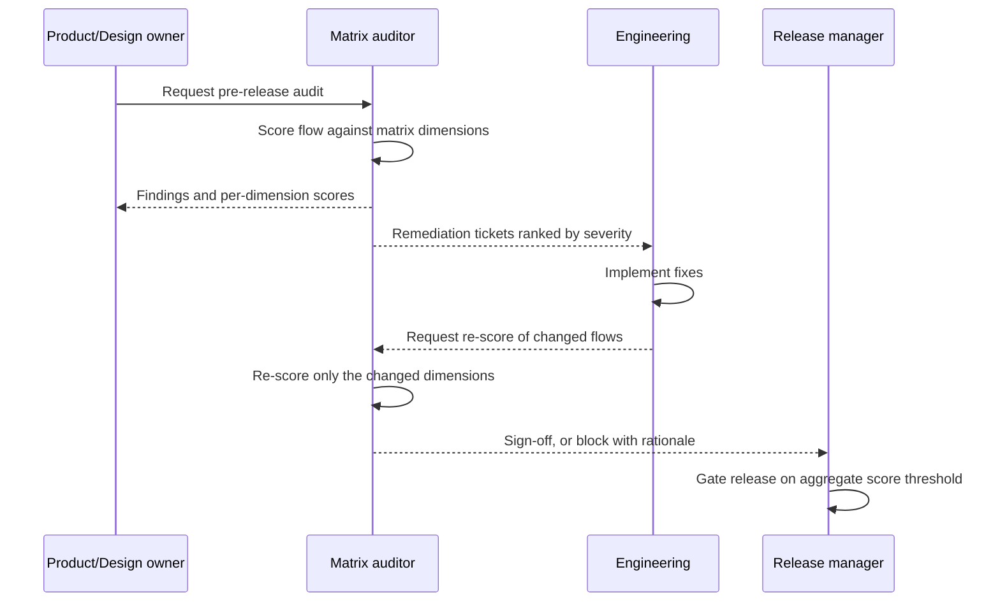
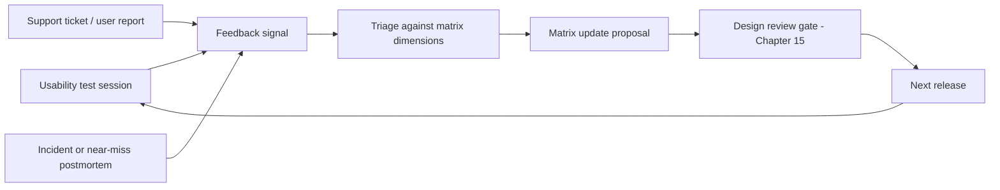
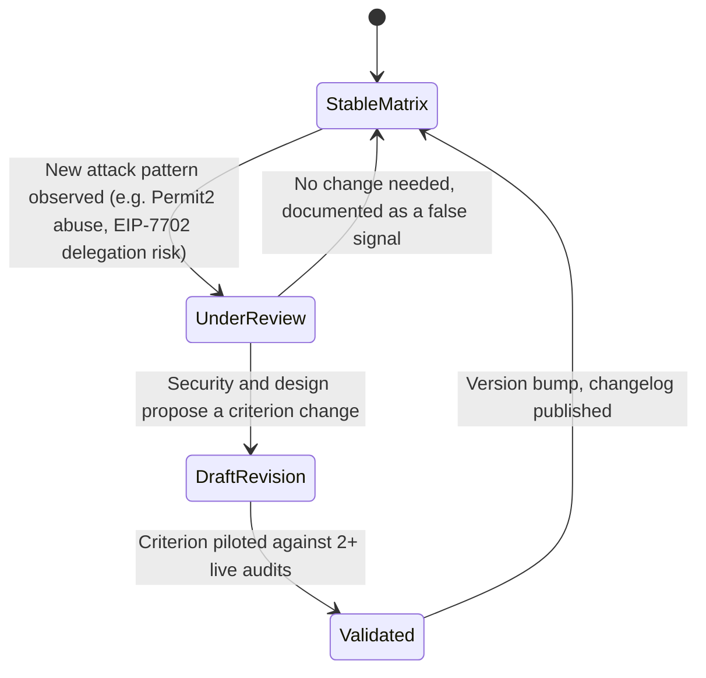

# Part 4: Implementation and Evaluation

[Back to Handbook contents](index.md) | [Series index](../index.md)

Part IV turns the scoring matrix from a reference document into a working control instead of a document teams consult once at launch and never again. It covers where **UX security** review gates sit in a normal software development lifecycle (SDLC), how to run a matrix-based audit and track its findings to closure, and how usability testing and incident feedback keep the matrix honest as wallets, standards, and attackers change. A dimension defined in Part II only protects users if it is re-checked on every release that touches a signing or approval flow, not just the first one.

---

## 15. Integrating UX Security into Development

**UX security** fails most often not because a team disagrees with the matrix, but because nobody owns the moment where a design either passes through a gate or ships without one. This chapter places those gates inside the SDLC, assigns them to roles, and automates the parts a human should not have to remember.

### 15.1 UX Security in the Software Development Lifecycle (SDLC)

Treat **UX security** the same way contract security treats a **threat model**: as an input to design, not an inspection applied after the fact. [NIST SP 800-218, the Secure Software Development Framework (SSDF)](https://csrc.nist.gov/pubs/sp/800/218/final), organizes secure development into four practice groups: Prepare the Organization, Protect Software, Produce Well-Secured Software, and Respond to Vulnerabilities. [OWASP's Software Assurance Maturity Model (SAMM)](https://owaspsamm.org/model/) covers similar ground through five business functions: Governance, Design, Implementation, Verification, and Operations. Both frameworks share the same underlying claim: security that only appears at the Verification stage is security applied too late and too narrowly to catch flow-level problems like a missing confirmation step or an approval that silently defaults to unlimited.

Mapped onto a typical feature's path from idea to production, UX security activities look like this:

| SDLC phase | UX security activity | Owning artifact |
|---|---|---|
| Requirements and discovery | Threat-model the flow against the UX threat categories in Part I, Chapter 2 (phishing, allowance abuse, blind signing, calldata/UI mismatch) | Threat-model worksheet attached to the feature ticket |
| Design | Score the proposed flow against the matrix dimensions before implementation begins | Pre-build matrix scorecard (Section 16.1) |
| Implementation | Enforce clear-text calldata rendering, confirmation modals, and revocation affordances as defaults in the component library, not opt-ins a developer must remember | Shared UI component library with security defaults |
| Verification | Run automated checks and manual QA against the matrix criteria | CI report plus audit checklist (Sections 15.4 and 16.1) |
| Release | Gate deployment on an aggregate score threshold | Release sign-off record (Section 16.3) |
| Operations | Monitor support tickets, wallet-side warnings, and incident reports for drift from the scored baseline | Feedback log (Section 17.2) |

The practical consequence is that a UX security finding raised at the design phase costs a redrawn mockup, while the same finding raised after launch costs a hotfix, a user-facing incident, and a re-audit. Front-load the checks.

### 15.2 Design Reviews and Security Requirement Gates

A design review gate is the point where a proposed flow must clear a defined bar before engineering starts building it. Without an explicit gate, "we'll fix the UX later" becomes the default, and later rarely arrives before the feature ships. Define the gate as a checklist a design cannot pass the review without satisfying, or without an explicit, logged exemption signed by a named security owner.

**Design review gate checklist**

- [ ] Every state-changing action (transfer, approval, delegation, signature) has an explicit UI element naming the exact action being taken.
- [ ] Recipient, amount, and asset are rendered from decoded calldata, not solely from a developer-supplied label (Part II, Section 4.1).
- [ ] High-risk actions, including unlimited approvals, contract upgrades, ownership transfers, and EIP-7702 delegation grants, require a distinct, higher-friction confirmation step (Part II, Chapter 5).
- [ ] A revocation path exists for any granted permission and is discoverable within two navigation steps of the flow that created it (Part II, Chapter 6).
- [ ] Terminology and iconography match the rest of the product and any prior version of the same flow (Part II, Chapter 7).
- [ ] Warning and error copy has been reviewed by both security and content design, not drafted by engineering alone (Part II, Chapter 8).
- [ ] The design carries a recorded matrix score, or a written exemption with an expiry date, before implementation begins.

Log the outcome of every gate review, pass or fail, in the same tracker used for the feature. A gate that exists only as a verbal conversation in a design review meeting leaves no evidence for the audit in Chapter 16, and no record for the postmortem in Section 17.2 if the flow later causes an incident.

### 15.3 Cross-Functional Collaboration: Security, Design, and Engineering

**UX security** sits across three disciplines that rarely report to the same manager, and ambiguity about who decides what is the most common reason a gate gets skipped under deadline pressure. A responsibility matrix resolves that ambiguity before a release, not during one.

| Matrix dimension | Product / Design | Frontend Engineering | Security | QA |
|---|---|---|---|---|
| Clarity | A | R | C | I |
| Confirmation and consent | C | R | A | I |
| Revocability and recovery | C | R | A | C |
| Consistency and predictability | A | R | I | C |
| Warnings and error handling | C | R | A | C |

*R = Responsible (does the work), A = Accountable (owns the sign-off), C = Consulted (input sought before the decision), I = Informed (told after the decision).*

Security holds accountability for the dimensions most directly tied to fund loss (confirmation, revocability, warnings), so a deadline cannot unilaterally lower that bar. Product and design own clarity and consistency, since both are inseparable from the product's overall voice. Engineering is responsible everywhere: it builds what the other two roles specify. QA tests against the same criteria defined in Chapter 16 rather than inventing its own bar.

### 15.4 Tooling, Linting, and CI Checks for UX Security Patterns

Manual review does not scale to every pull request, and a human reviewer tires of flagging the same pattern on the fortieth occurrence. Encode the cheapest, highest-confidence checks as automated gates in continuous integration and continuous delivery (CI/CD), so a violation blocks a merge instead of waiting for the next audit cycle.

```yaml
# .github/workflows/ux-security-checks.yml
name: ux-security-checks
on: [pull_request]
jobs:
  matrix-static-checks:
    runs-on: ubuntu-latest
    steps:
      - uses: actions/checkout@v4
      - run: npm ci
      - name: Verify rendered summary matches decoded calldata
        run: npm run test:calldata-render -- --ci
      - name: Flag unlimited-approval calls without a confirmation gate
        run: npx eslint . --rule '{"custom/no-unguarded-set-approval-for-all": "error"}'
      - name: Confirm every state-changing action carries a matrix score annotation
        run: node scripts/check-matrix-annotations.js
```

A lint rule can catch the specific pattern that most often defeats the Confirmation and Consent dimension: an unlimited or wildcard approval issued without a distinct, higher-friction confirmation step wrapping it.

```js
// eslint-rule sketch: flag setApprovalForAll / approve(MaxUint256) calls
// that are not routed through the shared confirmHighRiskAction() gate.
module.exports = {
  create(context) {
    return {
      CallExpression(node) {
        const callee = node.callee.property && node.callee.property.name;
        const isUnlimitedApprove =
          callee === 'approve' &&
          /MaxUint256/.test(context.getSourceCode().getText(node.arguments[1]));
        const isSetApprovalForAll = callee === 'setApprovalForAll';
        if ((isUnlimitedApprove || isSetApprovalForAll) && !isWrappedInConfirmationGate(node)) {
          context.report(node, 'Unlimited or blanket approval must route through confirmHighRiskAction()');
        }
      },
    };
  },
};
```

These checks are detection aids, not a substitute for the human review in Section 16.1: they catch known bad patterns cheaply and consistently, while a matrix audit catches the flows a static rule cannot reason about, such as whether the plain-language summary a developer wrote is actually accurate.

---

## 16. Review and Audit Using the Matrix

Where Chapter 15 builds the matrix into how a feature gets designed and shipped, this chapter turns it into a repeatable audit discipline, the interface-layer counterpart to the testing rigor the [Smart Contract Security Testing Guide (SCSTG)](https://scs.owasp.org/) applies to contract code.

### 16.1 Conducting a Matrix-Based UX Security Audit

An audit is a bounded, evidence-producing walk through a flow, not a general impression of whether the product "feels safe." Run it as a fixed procedure so two auditors reach comparable scores on the same flow.

1. Scope the audit to a specific feature, flow, or full product surface, and record the scope before starting.
2. Walk the flow start to finish twice: once as a first-time user with no prior context, once as a returning user who has completed the flow before.
3. Score each in-scope dimension (Clarity, Confirmation and Consent, Revocability and Recovery, Consistency and Predictability, Warnings and Error Handling, and any Additional Dimensions in scope) using the levels defined in Part II, Section 3.3.
4. Capture evidence, a screenshot, a decoded calldata dump, or a session recording, for every score below the maximum. A score with no evidence is not reproducible and will not survive a re-audit dispute.
5. Compute the aggregate score per Part II, Section 9.3, and compare it against the release threshold set for that flow's risk tier.
6. File one remediation ticket per below-threshold dimension, not one ticket per flow, so fixes can be tracked and prioritized independently.



*Figure 4.1. The audit-to-release interaction. Re-scoring after remediation is scoped to the changed dimensions, not a full re-walk, so the loop stays fast enough to fit inside a release cycle.*

An example scorecard for a token-approval flow makes the procedure concrete:

| Dimension | Score (0-3) | Evidence | Notes |
|---|---|---|---|
| Clarity | 2 | screenshot-04.png | Amount shown in raw token units, not a human-readable quantity |
| Confirmation and consent | 3 | - | Unlimited approval requires a separate, distinctly styled modal |
| Revocability and recovery | 1 | ticket UX-118 | No in-app revoke; user must leave the product to use an external allowance manager |
| Consistency and predictability | 3 | - | - |
| Warnings and error handling | 2 | screenshot-07.png | Generic "transaction failed" message gives no cause or next step |

### 16.2 Internal Review vs. Third-Party and Community Audit

No single review type covers every failure mode at every cadence a product needs. Combine them deliberately rather than treating any one as sufficient on its own.

| Review type | Best for | Typical cadence | Example |
|---|---|---|---|
| Internal design review | Catching issues before code exists | Every feature | Section 15.2 gate |
| Internal matrix audit | Full-scope scoring before a release ships | Every release that touches a signing or approval flow | Section 16.1 procedure |
| Third-party specialist audit | Independent validation, novel attack patterns, requirements a partner or regulator sets | Major releases, new wallet or connector integrations, at least annually | Contracted UX-security review firm |
| Community and bug bounty | Continuous, adversarial coverage at a volume no internal team can match | Ongoing | A bounty program scoped to include front-end and signing-flow issues, not contract code alone |

Bug bounty platforms built for Web3, such as [Immunefi](https://immunefi.com/), [Code4rena](https://code4rena.com/), and [Cantina](https://cantina.xyz/), primarily scope contract code, but most support extending scope to web assets and signing flows explicitly. A program that pays out for a contract reentrancy bug but not for a front-end that silently swaps a recipient address leaves the exact bug class this handbook exists to prevent outside its own incentive structure. When you write or renew a bounty scope, name the UX-security failure modes from Part I, Chapter 2 as in-scope, rather than leaving researchers to guess whether interface bugs qualify.

### 16.3 Scoring, Reporting, and Remediation Tracking

A finding that never leaves the audit report does not get fixed. Route every below-threshold dimension into the same issue tracker engineering already uses, with a severity derived mechanically from the score rather than from a case-by-case judgment call that different auditors will make differently.

| Matrix finding | Example | Severity | Release impact |
|---|---|---|---|
| Dimension scores 0 on a fund-moving action | Unlimited approval granted with no confirmation step | Critical | Blocks release |
| Dimension scores 1 on a fund-moving action | Amount is shown but the asset is ambiguous or truncated | High | Blocks release unless waived in writing by the security owner |
| Dimension scores 0-1 on a non-fund action | Inconsistent terminology between settings and onboarding | Medium | Tracked, does not block |
| Cosmetic or informational deviation | Icon style mismatch between two flows | Low | Backlog |

A minimal issue template keeps every finding comparable across auditors and audit cycles:

```markdown
### UX Security Finding: <short title>
- **Dimension**: Confirmation and Consent
- **Score**: 1 / 3
- **Severity**: High
- **Flow**: Token approval (ERC-20 `approve`)
- **Evidence**: <screenshot or decoded-calldata reference>
- **Expected**: Explicit modal naming spender, amount, and asset before signing
- **Owner**:
- **Target release**:
- **Status**: Open
```

Track remediation the same way you would track a security vulnerability, because from the user's perspective it is one: a below-threshold score on a fund-moving action is a control gap, not a design opinion, and it should carry the same urgency in the tracker as a Critical finding from a contract audit.

### 16.4 Re-Audit Cadence and Regression Testing

A matrix score is a snapshot, and it decays. A flow that scored a perfect 3 across every dimension six months ago can silently regress when a dependency updates, a new **wallet** connector is added, or a redesign touches shared components. Define explicit triggers for re-audit rather than relying on someone remembering to schedule one.

| Trigger | Re-audit scope |
|---|---|
| New wallet or connector integration | Full Confirmation and Consent and Consistency dimensions across the affected flows |
| New signature type or standard adopted (EIP-712 domain change, EIP-7702 delegation) | Full Clarity and Confirmation dimensions on flows using the new standard |
| Any incident or near-miss, regardless of severity | Full matrix on the affected flow, targeted spot-check on adjacent flows |
| Quarterly | Aggregate score refresh on the top flows by transaction volume |
| Major visual redesign | Full Consistency and Predictability dimension across the product |

Automate what regression testing can catch mechanically, so a re-audit trigger surfaces a known regression before a human auditor has to find it manually.

```ts
test('approve flow renders decoded spender, amount, and asset before signing', async ({ page }) => {
  await page.goto('/token/approve?spender=0xSpender&amount=max');
  const summary = await page.textContent('[data-testid="approval-summary"]');
  expect(summary).toContain('0xSpender'); // or a resolved, verified display name
  expect(summary).toMatch(/Unlimited|No limit/i); // unlimited must be labeled, never hidden
  await expect(page.locator('[data-testid="confirm-high-risk"]')).toBeVisible();
});
```

A regression suite built from prior audit findings turns every past finding into a permanent guardrail: the bug that scored a 1 last quarter cannot silently return in next quarter's release without the test catching it first.

---

## 17. Iteration and User Feedback

The matrix is only as good as the signal that revises it. This chapter closes the loop between how real users behave, what incidents reveal, and how the matrix itself changes over time.

### 17.1 Usability Testing With a Security Lens

Standard usability testing asks whether a user can complete a task. A security lens on the same session asks a sharper question: does the user correctly understand what they are about to authorize before they authorize it? [Nielsen Norman Group's guidance on usability testing](https://www.nngroup.com/articles/usability-testing-101/) holds that five participants surface most usability problems in a single round, and that principle applies directly to signing flows: run small, frequent rounds rather than one large study before launch. [ISO 9241-11](https://www.iso.org/standard/63500.html) defines usability as effectiveness, efficiency, and satisfaction in achieving specified goals; for a security-critical flow, add a fourth criterion the standard does not name explicitly: whether the user's understanding of the action matches the action the system will actually perform.

A task-based script surfaces comprehension gaps that a simple "were you able to complete this?" question misses:

1. "Connect your **wallet** to this site. Before you click Approve, tell us out loud what you think will happen next."
2. "You've been asked to approve a token spend. Without scrolling back up, tell us the amount and which contract will be able to spend it."
3. "You approved a spend last week and no longer want that contract to have access. Try to undo that now."
4. "This warning just appeared on screen. Read it out loud, then tell us what you would do next."
5. "Something about this transaction looks different from ones you've signed before. What, if anything, would you do?"

Score the session against the matrix dimensions directly: a participant who cannot answer question 2 accurately is reporting a live Clarity failure, evidence-grade and reproducible, not a hypothetical one.

### 17.2 Incident and Near-Miss Feedback Loops

An incident report that only assigns blame teaches a team to hide near-misses rather than report them. A blameless postmortem, factual and focused on the flow rather than the individual, produces evidence the matrix can act on.

| Field | Purpose |
|---|---|
| What happened | Factual timeline, free of blame language |
| What the user saw | Exact UI state at each step, with screenshots where available |
| What the matrix would have scored | Retroactive score against each dimension |
| Why it wasn't caught | Which gate, test, or review should have caught it and did not |
| Matrix or process change | The concrete change proposed as a result |
| Owner and date | Who is accountable for shipping the fix, and by when |

The Bybit exchange's February 2025 loss, covered as a threat pattern in Part I, Section 2.4, is the reference case for why this loop matters: the failure was not a missing warning on a single screen but a **signing flow** where what several **multisig** signers saw did not match what they were actually authorizing, and no feedback mechanism in that flow surfaced the drift before it was exploited at scale. A near-miss log that captures smaller versions of the same drift, a support ticket describing a transaction that "looked wrong but went through fine," a signer who paused but signed anyway, is the earliest and cheapest place to catch that pattern, well before it reaches the severity of an incident.



*Figure 4.2. Three independent feedback sources feed one triage step, so a pattern visible only across usability testing, support, and incident data is not missed because it lived below any single source's reporting threshold.*

### 17.3 Evolving the Matrix as Threats Change

The matrix defined in Part II is not fixed. New signing standards, new delegation mechanisms, and new phishing techniques appear faster than any static checklist can anticipate, and a matrix that never changes eventually scores a genuinely dangerous flow as passing simply because nobody wrote a criterion for the new attack. [MITRE's AADAPT framework](https://aadapt.mitre.org/) catalogs adversary techniques against digital asset platforms in the same spirit as ATT&CK for enterprise systems, and it is a useful external source of new criteria: when AADAPT documents a technique your matrix has no dimension or sub-criterion for, that is a concrete signal to open a revision, not a hypothetical one.



*Figure 4.3. The matrix's own revision lifecycle. A proposed change is piloted against real audits before it becomes binding, so the matrix does not accumulate untested criteria.*

Version the matrix like any other piece of shared infrastructure, with a changelog that states what changed and why:

```markdown
## Matrix changelog

### v1.3 (this quarter)
- Added: Confirmation and Consent criterion for EIP-7702 delegation grants.
  A delegate that gains code-execution rights over an externally owned
  account (EOA) must be shown as a "smart account upgrade," not rendered
  as a routine signature request.
- Tightened: Revocability scoring now requires an in-app revoke path;
  a link to an external allowance manager alone no longer scores above 1.
```

A trigger table keeps revisions deliberate rather than reactive to every single support ticket:

| Trigger | Matrix action |
|---|---|
| New standard adopted industry-wide (EIP-7702, Permit2, a new signature scheme) | New criterion drafted under the relevant dimension, or under Chapter 9's expandable dimensions |
| Novel attack pattern observed, internally or via a public incident | New criterion or dimension drafted, piloted, then merged per Figure 4.3 |
| Two consecutive quarters of near-perfect scores across all flows on one dimension | Criteria tightened so the ceiling stays meaningful |
| Engineering reports a recurring false positive against a criterion | Criterion clarified or narrowed, with the reasoning recorded in the changelog |

---

**Key controls for Part 4**

- Gate every design at a defined review checkpoint before implementation starts, with a logged pass, fail, or written exemption.
- Assign accountability for security-critical matrix dimensions to security, not to whichever role is under the most deadline pressure.
- Automate the cheap, high-confidence checks (unguarded unlimited approvals, calldata-to-summary mismatches) in CI so they block a merge instead of waiting for a human audit.
- Run matrix audits on a fixed procedure with recorded evidence, so scores are reproducible across auditors and comparable across release cycles.
- Combine internal review, third-party audit, and community bug bounty scoped to include front-end and signing flows, not contract code alone.
- Treat a below-threshold score on a fund-moving action with the same urgency as a Critical contract finding, and track it to closure in the same system.
- Re-audit on defined triggers (new connector, new signature standard, incident, quarterly cadence) rather than only before a major launch.
- Feed usability testing, support signals, and incident postmortems into one triage step, and version the matrix itself with a changelog when a genuine gap is found.

