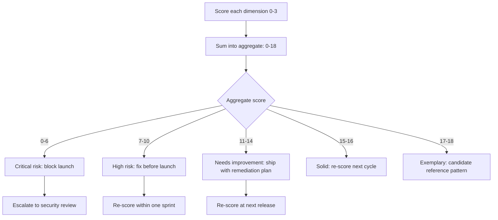
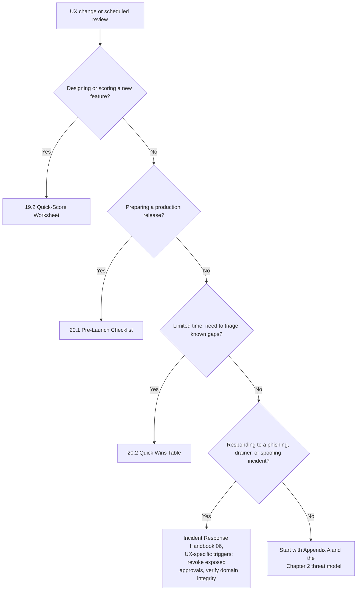

# Part 5: Appendices

[Back to Handbook contents](index.md) | [Series index](../index.md)

This part collects the reference material the rest of the handbook assumes a reader keeps within reach. Appendix A fixes the vocabulary so that a term like *blind signing* or *revocation* means the same thing in Chapter 2 as it does in Chapter 12. Appendix B is the condensed, printable form of the UX (**user experience**) Security Scoring Matrix built out across Part II, meant for a design review where nobody has time to reread six chapters. Appendix C turns the checklists scattered through Parts III and IV into copy-ready artifacts, and Appendix D points to the full source list rather than repeating every citation already given at the point of its claim.

---

## 18. Appendix A: Glossary

Entries below are grouped by the domain area where they carry the most weight, not strict alphabetical order, because a reader reviewing a **wallet**'s **signing flow** and a reader auditing an allowance screen reach for different clusters of vocabulary. Within each group, entries run alphabetically, with the acronym expanded on first appearance and the relevant chapter named so you can jump to the fuller treatment. Where an external standard, Ethereum Improvement Proposal (EIP), or documented incident defines the term, the entry cites that source directly.

### 18.1 Threat and Deception Terms

These terms describe how an attacker manipulates what a user sees and signs, the core **threat model** built in Chapter 2.

- **Approval phishing**: tricking a user into signing a token approval or `permit` message that grants an attacker-controlled address spending rights over the user's tokens, rather than stealing a **private key** directly. Named as its own category, UI/UX Spoofing and Approval Phishing (WA06), in the [OWASP Web3 Attack Vectors Top 15](https://scs.owasp.org/sctop10/Web3-Attack-Vectors-Top15/). See Chapter 2.2.
- **Blind signing**: approving a transaction or message without the **wallet** decoding and displaying its actual effect, forcing the user to trust the requesting dApp's (decentralized application's) representation of what they are signing rather than verified calldata. Central to the pattern behind the February 2025 Bybit theft. See Chapter 2.4 and Chapter 10.2.
- **Calldata/UI mismatch**: a discrepancy between the transaction data a wallet will actually broadcast and the recipient, amount, or function the requesting interface displays, whether from a bug or deliberate spoofing. See Chapter 2.7.
- **Drainer / Drainer-as-a-Service (DaaS)**: malicious code, often sold as a hosted kit to affiliates, that automates draining a connected wallet once a victim signs a malicious approval. [Scam Sniffer's 2025 phishing research](https://www.scamsniffer.io/) tracks named kits such as Inferno Drainer and reports 2025 phishing losses near $84 million, down 83 percent year over year as wallet-level warnings and blocklists matured. See Chapter 2.2.
- **Ice phishing**: a term for approval-phishing attacks that never touch a private key at all, coined to distinguish them from classic seed-phrase theft; the victim signs away spending rights while believing they are approving a routine transaction.
- **Malicious dApp impersonation**: a fraudulent front end that copies a legitimate protocol's branding and domain-adjacent naming to collect approvals or signatures, the failure mode the WalletConnect Verify API (Chapter 11.1) is built to catch.
- **Multisig hijacking**: compromising the signing or review interface a **multisig** operator relies on, so that operators approve a transaction whose real effect differs from what they reviewed, without any signer's key being stolen. Listed as WA01 in the [Web3 Attack Vectors Top 15](https://scs.owasp.org/sctop10/Web3-Attack-Vectors-Top15/) and the mechanism behind the Bybit theft. See Chapter 2.4.
- **UI/UX spoofing**: the umbrella term for any interface manipulation, fake confirmation dialog, mislabeled button, or altered display value, that causes a user to consent to something other than what they believe they are consenting to. See Chapter 2.5.
- **Wallet drain**: the end state of a successful phishing, drainer, or blind-signing attack, in which an attacker-controlled address receives a user's tokens or gains an approval sufficient to take them on a later transaction.

### 18.2 Approval, Signature, and Standard Terms

These terms describe the mechanisms by which a user grants a contract or address rights over their tokens, and the standards that govern how that consent is captured, covered across Chapter 2.3 and Chapter 12.

- **Allowance**: the amount of a token, tracked in the token contract's storage, that an owner has authorized a spender address to transfer on their behalf, set through the legacy [ERC-20 (Ethereum Request for Comment) `approve` function](https://eips.ethereum.org/EIPS/eip-20).
- **EIP-712**: the Ethereum standard for hashing and signing typed structured data, letting a **wallet** display a message's fields (recipient, amount, deadline) instead of an opaque hex string. First proposed in 2017 and central to human-readable signature review. See [EIP-712](https://eips.ethereum.org/EIPS/eip-712) and Chapter 10.3.
- **EIP-2612 (`permit`)**: an extension to the ERC-20 standard adding a `permit` function that lets a token owner set an allowance through an off-chain EIP-712 signature instead of an on-chain `approve` transaction, removing the need to hold gas token to grant an approval. See [EIP-2612](https://eips.ethereum.org/EIPS/eip-2612) and Chapter 2.3.
- **EIP-7702**: a standard letting an externally owned account (EOA) temporarily or permanently delegate its code execution to a smart contract, enabling batched transactions, sponsored gas, and sub-key permission schemes while the account keeps its original address. Reached Final status and activated on Ethereum mainnet as part of the Pectra upgrade on [May 7, 2025](https://ethereum.org/en/roadmap/pectra/). See [EIP-7702](https://eips.ethereum.org/EIPS/eip-7702) and Chapter 10.4.
- **Nonce**: a strictly increasing counter tied to a signer or contract, included in a signed message to prevent the same signature from being replayed a second time. Relevant to both transaction ordering and `permit` signature validity.
- **Permit2**: a unified, immutable contract published by Uniswap Labs that layers signature-based (`SignatureTransfer`) and allowance-based (`AllowanceTransfer`) authorization over any ERC-20 token, adding expiry timestamps and per-spender amount caps that neither legacy `approve` nor EIP-2612 `permit` enforce on their own. See the [Permit2 contract and documentation](https://github.com/Uniswap/permit2) and Chapter 2.3.
- **Revocation**: setting an existing allowance or Permit2 authorization back to zero (or letting it expire, for Permit2's time-bound grants), removing a spender's ability to move the owner's tokens. See Chapter 6.1 and Chapter 12.1.
- **Unlimited allowance**: an approval set to the maximum representable value (`type(uint256).max`) rather than the amount actually needed for a transaction, a widespread convenience pattern that leaves a user permanently exposed to any future compromise of the approved spender. See Chapter 2.2.

### 18.3 Wallet and Account Terms

These terms describe the account models and confirmation surfaces a user interacts with directly, covered in Chapter 10.

- **Account abstraction**: replacing an EOA's fixed signature-verification logic with programmable smart contract logic, enabling features such as social recovery, session keys, and gas sponsorship. Standardized for existing EVM (Ethereum Virtual Machine) chains without protocol changes by [ERC-4337](https://eips.ethereum.org/EIPS/eip-4337) and extended at the protocol level by EIP-7702. See Chapter 10.5.
- **Clear signing**: a **hardware wallet**'s ability to parse a transaction or typed-data message and render its actual effect (recipient, amount, contract call) on the device's own trusted screen, as opposed to blind signing a value the host computer supplied. See Chapter 10.2.
- **Cold wallet**: a **wallet** whose private key material never touches an internet-connected device, typically a hardware wallet or an air-gapped signer. See Chapter 10.1.
- **Custodial wallet**: a wallet where a third party (an exchange or service provider) holds the private keys on the user's behalf, trading self-custody for a recovery path if the user loses access. See Chapter 10.1.
- **EOA (externally owned account)**: an Ethereum account controlled directly by a **private key**, as opposed to a smart contract account whose logic governs its behavior.
- **Hot wallet**: a wallet whose keys are held on an internet-connected device, trading resistance-to-remote-compromise for signing convenience. See Chapter 10.1.
- **MPC (multi-party computation) wallet**: a wallet that splits a private key into shares held by separate parties or devices, such that no single share alone can produce a valid signature, used by some custodial and institutional providers as an alternative to a single hardware key.
- **Session key**: a limited-scope, often time-bound signing key that an account abstraction wallet issues to an application so it can execute a narrow set of pre-approved actions without prompting the user for every transaction. See Chapter 10.5.

### 18.4 Scoring, Standards, and Governance Terms

These terms describe the frameworks that structure the **threat model** in Chapter 2 and the matrix in Part II.

- **AADAPT (Adversarial Actions in Digital Asset Payment Technologies)**: a MITRE threat framework modeled on ATT&CK, cataloging adversary tactics specific to digital-asset and payment systems. See the [public matrix repository](https://github.com/mitre/AADAPT).
- **Aggregate score**: the weighted roll-up of a product's scores across every **UX Security** Scoring Matrix dimension, banded into a risk category for reporting and prioritization. See Chapter 9.3 and Appendix B.19.3.
- **Dimension**: one of the matrix's six evaluation axes, clarity, confirmation and consent, revocability and recovery, consistency and predictability, warnings and error handling, and accessibility and inclusivity, each scored independently before being aggregated. See Chapters 4 through 9.
- **MITRE ATT&CK**: a globally accessible knowledge base of adversary tactics and techniques drawn from real-world observations, used across the security industry to structure threat models. See [attack.mitre.org](https://attack.mitre.org/).
- **OWASP SC (Smart Contract) Top 10**: OWASP's ranked list of the most critical smart contract vulnerability categories; none of its ten categories address interface-layer risk directly, which is the gap this handbook and the companion Web3 Attack Vectors Top 15 fill. See [scs.owasp.org/sctop10](https://scs.owasp.org/sctop10/) and Chapter 1.3.
- **SCSVS (Smart Contract Security Verification Standard)**: OWASP's standard defining verifiable security requirements for smart contract systems; this handbook's scoring matrix is its interface-layer counterpart. See [scs.owasp.org](https://scs.owasp.org/) and Chapter 1.3.
- **SCSTG (Smart Contract Security Testing Guide)**: OWASP's companion guide describing test procedures for smart contract security, extended by Part IV's matrix-based review process. See [scs.owasp.org](https://scs.owasp.org/) and Chapter 1.3.
- **SCWE (Smart Contract Weakness Enumeration)**: OWASP's catalog of smart contract weakness classes, which stops at the contract boundary; the phishing, allowance-abuse, and blind-signing failure modes in Chapter 2 fill the human-computer-interaction space it leaves open. See [scs.owasp.org](https://scs.owasp.org/) and Chapter 1.3.
- **STRIDE**: a threat-modeling mnemonic, spoofing, tampering, repudiation, information disclosure, denial of service, elevation of privilege, introduced by Loren Kohnfelder and Praerit Garg at Microsoft in 1999 and applicable to interface-layer threats such as spoofed confirmation dialogs (spoofing) and altered display values (tampering).
- **Web3 Attack Vectors Top 15**: an OWASP catalog ranking the most significant non-contract Web3 risks, including **Multisig** Hijacking (WA01), Drainer Malware and Drainer-as-a-Service (WA04), and UI/UX Spoofing and Approval Phishing (WA06), the three categories most directly addressed by this handbook. See [scs.owasp.org/sctop10/Web3-Attack-Vectors-Top15](https://scs.owasp.org/sctop10/Web3-Attack-Vectors-Top15/) and Chapter 1.3.

---

## 19. Appendix B: UX Security Scoring Matrix (Reference)

Part II builds the **UX Security** Scoring Matrix dimension by dimension, with worked criteria and examples for each. This appendix is the condensed, single-page version: pull it out for a design review or a pre-launch audit where the reviewer needs the scoring structure in front of them without re-reading six chapters. Use it alongside, not instead of, the full dimension chapters when a score needs justification beyond a number.

### 19.1 Matrix at a Glance

Each dimension is scored independently on the same 0-to-3 scale defined in Chapter 3.3, then combined per Section 19.3. The table below names the dimension, the chapter with its full criteria, and a one-line anchor for what a 0 and a 3 look like in practice.

| Dimension | Chapter | Score 0 looks like | Score 3 looks like |
|-----------|---------|---------------------|----------------------|
| Transaction and Action Clarity | 4 | Raw hex or contract address shown with no plain-language summary | Recipient, amount, and asset shown in plain language, cross-checked against calldata |
| Confirmation and Consent | 5 | High-risk actions (unlimited approval, ownership transfer) execute with a single generic click | Distinct, explicit confirmation step for each high-risk action, with the specific risk named |
| Revocability and Recovery | 6 | No in-product way to view or revoke a prior approval | One-click revocation surfaced in the product itself, with a documented recovery path for lost access |
| Consistency and Predictability | 7 | Terminology and navigation differ across flows or between web and mobile | Identical terms, layouts, and outcomes across every entry point |
| Warnings and Error Handling | 8 | Errors surface as raw revert strings or fail silently | Warnings are risk-specific, actionable, and appear before signing, not after |
| Accessibility and Inclusivity | 9.1 | Signing flow unusable with a screen reader or on a small viewport | Meets WCAG (Web Content Accessibility Guidelines) AA for the signing and approval path |

### 19.2 Quick-Score Worksheet

Copy this table into a review ticket or design document. Score each dimension from the criteria in its chapter, cite the specific evidence (a screenshot, a flow recording, a line of copy), and note the reviewer and date so the score is traceable when the product changes.

```markdown
## UX Security Scoring Matrix - Quick Score

| Dimension | Score (0-3) | Evidence | Reviewer | Date |
|-----------|-------------|----------|----------|------|
| Transaction and Action Clarity (Ch. 4) | | | | |
| Confirmation and Consent (Ch. 5) | | | | |
| Revocability and Recovery (Ch. 6) | | | | |
| Consistency and Predictability (Ch. 7) | | | | |
| Warnings and Error Handling (Ch. 8) | | | | |
| Accessibility and Inclusivity (Ch. 9.1) | | | | |

Weighted aggregate: ___ / 18 (see 19.3 for banding)
Feature or product reviewed: _______________
Next review due: _______________
```

Weight the dimensions equally by default (sum the six raw scores out of a possible 18), as Chapter 3.2 recommends for a first pass. A team that has already suffered an incident in one dimension, an allowance-abuse loss, for instance, may apply a higher weight to Revocability and Recovery for subsequent reviews; document any deviation from equal weighting next to the aggregate so a later reviewer understands why the number differs from the default formula.

### 19.3 Interpreting the Aggregate Score

A raw number is only useful once it is banded into an action. The table and diagram below apply the aggregation and reporting method from Chapter 9.3 to the six-dimension, 18-point scale above.

| Aggregate score | Band | Recommended action |
|-------------------|------|----------------------|
| 0-6 | Critical risk | Block launch; escalate to security review before further design work |
| 7-10 | High risk | Fix the lowest-scoring dimension before launch; schedule re-score within one sprint |
| 11-14 | Needs improvement | Ship with a documented remediation plan; re-score at the next release |
| 15-16 | Solid | Note residual gaps; re-score on the standard cadence (Chapter 16) |
| 17-18 | Exemplary | Candidate for a documented pattern other teams can reuse |



*Figure 1. Scoring-to-action flow. The band, not the raw number, is what a release gate should key off, since a single catastrophic dimension (for example, no revocation path) can sit inside an otherwise "Solid" aggregate and still deserves the higher band's response; treat the banding table as a floor, not a substitute for reading the lowest individual score.*

---

## 20. Appendix C: Checklist and Quick Wins

Part III turns the matrix into product-level practice across **wallet**, connection, allowance, notification, and onboarding flows; Part IV covers integrating that practice into a development lifecycle. This appendix collects the copy-ready outputs of both: a pre-launch checklist, a quick-wins table for teams that cannot fix everything at once, and a decision flow for picking the right artifact for the moment you are in.

### 20.1 Pre-Launch UX Security Checklist

Run this checklist before any release that touches a signing, connection, approval, or notification flow, and again on the cadence set in Chapter 16. It mirrors the five best-practice chapters in Part III so nothing is checked from memory.

**Pre-Launch UX Security Checklist**


**Wallet and Signing (Ch. 10)**

- [ ] EIP-712 typed data used for every off-chain signature request; no raw hex
      presented for a signature a user is expected to understand
- [ ] **Hardware wallet** flows tested for clear signing on the actual device screen,
      not only in the host application's UI
- [ ] Any EIP-7702 delegation or account abstraction flow discloses what
      permissions the delegated contract receives, in plain language, before
      the user signs

**dApp and Connection (Ch. 11)**

- [ ] WalletConnect Verify API (or equivalent domain-verification signal) is
      enabled and its warning state is visibly surfaced, not silently logged
- [ ] Primary domain is bookmarked and communicated through a verified,
      out-of-band channel (Ch. 11.2)

**Approval and Allowance (Ch. 12)**

- [ ] Default approval amount is scoped to the transaction, not unlimited
- [ ] Every approval has a visible expiry or is revocable in one step from
      within the product
- [ ] Permit2 or EIP-2612 signature requests show spender, amount, and expiry
      before the user signs

**Notification and Alert (Ch. 13)**

- [ ] High-risk actions (new spender approval, ownership change, large
      transfer) trigger a distinct, non-dismissible-by-accident warning
- [ ] Notification copy is reviewed against the Warnings and Error Handling
      dimension (Ch. 8) for specificity and actionability

**Onboarding and Education (Ch. 14)**

- [ ] First-time users see a concrete explanation of what a signature and an
      approval authorize, in the flow, not only in a linked help article
- [ ] Recovery and support paths are documented and reachable from the
      signing screen itself

### 20.2 Quick Wins by Effort and Impact

Not every gap can close before a release ships. Use this table to prioritize when the full checklist surfaces more findings than the current cycle can absorb; sort by lowest effort within the highest-impact rows first.

| Quick win | Effort | Impact | Dimension improved | Reference |
|-----------|--------|--------|----------------------|-----------|
| Cap default approval amount to the transaction value instead of unlimited | Low | High | Confirmation and Consent | Ch. 12.1 |
| Add a one-click revoke link next to every active allowance in-product | Low | High | Revocability and Recovery | Ch. 6.1 |
| Replace raw revert strings with a mapped, plain-language error message | Low | Medium | Warnings and Error Handling | Ch. 8.2 |
| Enable WalletConnect Verify API and surface its warning state in the connect modal | Low | High | Clarity / Confirmation | Ch. 11.1 |
| Add an explicit confirmation step (separate from the wallet's own prompt) for ownership transfer or unlimited approval | Medium | High | Confirmation and Consent | Ch. 5.1 |
| Standardize terminology for "approve," "allow," and "authorize" across web and mobile | Medium | Medium | Consistency and Predictability | Ch. 7.1 |
| Add plain-language summaries above EIP-712 typed data fields | Medium | High | Transaction and Action Clarity | Ch. 4.2 |
| Audit signing and approval flows against WCAG AA | High | Medium | Accessibility and Inclusivity | Ch. 9.1 |

### 20.3 Template and Checklist Selection Flow

The right artifact depends on where you are in the release or incident cycle. Use the flow below to pick a starting point; a single release touching signing, connection, and allowance UX will often use more than one branch.



*Figure 2. Artifact selection by trigger scenario. A release that changes both the signing flow and the allowance screen runs both 20.1 and, if time is short, prioritizes with 20.2.*

---

## 21. Appendix D: References and Further Reading

Every claim in this handbook that names a standard, a version, a date, or an incident is cited inline at the point it is made, following the convention set in Part I. Rather than duplicate that source list here, this appendix points to `references.md`, the deduplicated bibliography for the full handbook, grouped into Standards and Frameworks (the OWASP SC Top 10, the Web3 Attack Vectors Top 15, SCSVS, SCSTG, SCWE, EIP-712, EIP-2612, EIP-7702, ERC-4337, and MITRE AADAPT), Incidents and Case Studies (the February 2025 Bybit theft and the [FBI Internet Crime Complaint Center advisory on the TraderTraitor activity behind it](https://www.ic3.gov/PSA/2025/PSA250226), alongside documented approval-phishing and drainer campaigns tracked by Scam Sniffer), Tools (the WalletConnect Verify API, Permit2, **hardware wallet** clear-signing implementations, and allowance-revocation dashboards), and Further Reading (research write-ups and companion material that goes deeper than this handbook's scope allows).

If a link in the body of any Part goes stale, check `references.md` for an updated URL or an archive copy before assuming the underlying claim no longer holds. When you extend this handbook, add the new source to `references.md` in the same change rather than letting citations accumulate only in the body text, so the bibliography stays a complete index rather than a partial one.

---

**Key controls for Part 5**

- Treat Appendix A as the canonical vocabulary; link to it from design tickets and incident write-ups instead of redefining a term inline each time.
- Keep the Quick-Score Worksheet (19.2) attached to every feature design doc that touches signing, connection, or approval flows.
- Run the Pre-Launch **UX Security** Checklist (20.1) before every release, not only after a phishing or drainer incident prompts one.
- Use the Quick Wins table (20.2) to sequence remediation when the full checklist surfaces more gaps than the current cycle can close, prioritizing low-effort, high-impact rows first.
- Score revocability and confirmation for unlimited or long-lived approvals with the same weight as clarity; a single missing revoke path can sit inside an otherwise "Solid" aggregate (19.3) and still represent the finding that matters most.
- Add every new citation to `references.md` in the same change that introduces it (Appendix D).
