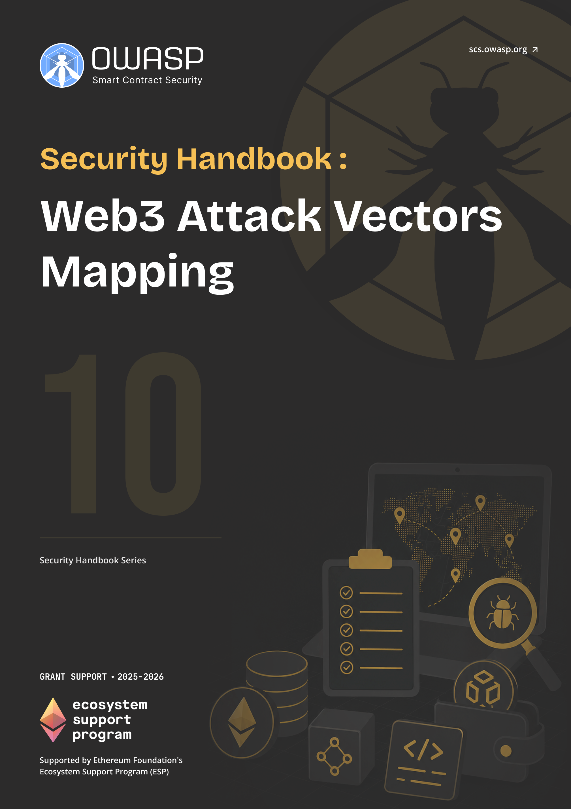

# OWASP SCS Web3 Attack Vectors Mapping Handbook

  
  

    <a class="handbook-series-link" href="../">← All handbooks</a>
    
Handbook 10 · 89 PDF pages

    
Map adversary tactics across the Web3 stack and apply the WA01–WA15 matrix to testing, detection, and defense.

    

      <a href="../pdfs/10-web3-attack-vectors-mapping.pdf" target="_blank" rel="noopener">Open PDF</a>
      <a href="../pdfs/10-web3-attack-vectors-mapping.pdf" download>Download PDF</a>
    

  

**OWASP Smart Contract Security Project**

Part of the [OWASP SCS Handbook Series](../index.md). Built to the series [conventions](../index.md#about-the-series).

## Purpose and Scope

This handbook builds a structured map of Web3 attack vectors that runs from the wallet and the user sitting in front of it, through the dApp front end, into the smart contract layer, and out to the node and infrastructure that keep a chain running. It is the companion volume to the OWASP Web3 Attack Vectors Top 15, the Alternate Top 15 list published alongside the OWASP Smart Contract Top 10 (SC Top 10) at [scs.owasp.org/sctop10/Web3-Attack-Vectors-Top15](https://scs.owasp.org/sctop10/Web3-Attack-Vectors-Top15/). Where the SC Top 10 catalogs on-chain logic risk, the Top 15 (WA01 through WA15) is an awareness list of the significant vectors that sit outside contract code: custody failures, **social engineering**, drainer malware, DNS hijacking, insider abuse, and nation-state operations against the people and pipelines that build Web3 software.

It organizes those vectors into a tactic-technique-procedure (**TTP**) catalog modeled on **MITRE ATT&CK** (Adversarial Tactics, Techniques, and Common Knowledge) and extended by MITRE AADAPT, MITRE's companion framework for digital asset and blockchain payment technologies. Each layer of the stack (user, wallet, dApp, contract, node, infrastructure) gets its own technique catalog, cross-referenced to the Top 15 vector IDs, to the Smart Contract Security Verification Standard (SCSVS), and to the Smart Contract Weakness Enumeration (SCWE), so a threat-modeling exercise or a detection team can work end to end from a single reference instead of stitching together five separate documents.

## Target Audience

Security specialists, **threat intelligence** teams, and architects performing **threat modeling** across the Web3 stack.

## How to Use This Handbook

Start with Part I to fix the taxonomy: the six layers this handbook uses, how they map onto WA01 through WA15, and the STRIDE-based threat-modeling method the rest of the book assumes. Part II is the **technique** catalog itself, one chapter per layer, and each chapter opens with its Top 15 alignment before working through specific techniques and their **TTP** IDs. Part III turns that catalog into a usable matrix: how to read it, how to apply it in a threat-modeling session, and how to apply it during detection and incident response. Part IV grounds the framework in named incidents, among them Bybit, the Ledger Connect Kit compromise, drainer-as-a-service campaigns, the Trust Wallet extension incident, and DPRK's TraderTraitor operation, traced across multiple layers at once. A reader building a detection program can go straight to the Part III matrix and the Part V quick-reference appendices; a reader running a single threat-modeling workshop should read Part I first, then the layer chapters that match the system's actual attack surface.

## Relationship to SCSVS, SCSTG, and SCWE

This handbook sits above the three core Smart Contract Security (SCS) standards as the connective layer between them. SCSVS defines the controls a system must satisfy and the Smart Contract Security Testing Guide (SCSTG) defines how to test for them, but both are scoped to the contract and its immediate surroundings; the **TTP** catalog here extends threat coverage to the wallets, front ends, RPC endpoints, and infrastructure that SCSVS and SCSTG do not reach. SCWE catalogs on-chain weaknesses, and Chapter 7 maps this handbook's contract-layer techniques directly onto SCWE entries instead of duplicating them, while the other five layers fill the ground the enumeration leaves uncovered. Two sibling handbooks depend directly on this mapping: the CDN and Front-End Supply Chain Security Handbook (01) supplies the deep technical detail behind the dApp-layer techniques in Chapter 6, and the **Incident Response** Handbook (06) consumes the detection and mitigation columns of the Part III matrix as its triage reference.

## Contents

### Part I: Foundations
- [1. Introduction to Web3 Attack Vector Mapping](part1-foundations.md#1-introduction-to-web3-attack-vector-mapping)
- [2. Scope and Taxonomy](part1-foundations.md#2-scope-and-taxonomy)
- [3. Threat Modeling and Attack Scenarios](part1-foundations.md#3-threat-modeling-and-attack-scenarios)

### Part II: Tactics and Techniques by Layer
- [4. User and Social Layer](part2-tactics-and-techniques-by-layer.md#4-user-and-social-layer)
- [5. Wallet and Key Management](part2-tactics-and-techniques-by-layer.md#5-wallet-and-key-management)
- [6. dApp and Front-End](part2-tactics-and-techniques-by-layer.md#6-dapp-and-front-end)
- [7. Smart Contract and Protocol](part2-tactics-and-techniques-by-layer.md#7-smart-contract-and-protocol)
- [8. Node and RPC](part2-tactics-and-techniques-by-layer.md#8-node-and-rpc)
- [9. Infrastructure](part2-tactics-and-techniques-by-layer.md#9-infrastructure)

### Part III: TTP Matrix and Use
- [10. Tactic-Technique-Procedure (TTP) Matrix](part3-ttp-matrix-and-use.md#10-tactic-technique-procedure-matrix)
- [11. Using the Matrix for Threat Modeling](part3-ttp-matrix-and-use.md#11-using-the-matrix-for-threat-modeling)
- [12. Using the Matrix for Detection and IR](part3-ttp-matrix-and-use.md#12-using-the-matrix-for-detection-and-ir)
- [13. Alignment with OWASP Web3 Attack Vectors Top 15 and MITRE](part3-ttp-matrix-and-use.md#13-alignment-with-owasp-web3-attack-vectors-top-15-and-mitre)

### Part IV: Case Studies and Examples
- [14. End-to-End Attack Scenarios](part4-case-studies-and-examples.md#14-end-to-end-attack-scenarios)
- [15. Updating the Mapping](part4-case-studies-and-examples.md#15-updating-the-mapping)

### Part V: Appendices
- [16. Appendix A: Glossary](part5-appendices.md#16-appendix-a-glossary)
- [17. Appendix B: TTP Quick Reference Table](part5-appendices.md#17-appendix-b-ttp-quick-reference-table)
- [18. Appendix C: OWASP Web3 Attack Vectors Top 15 (WA01-WA15) Summary Table](part5-appendices.md#18-appendix-c-owasp-web3-attack-vectors-top-15-wa01wa15-summary-table)
- [19. Appendix D: Mapping to SCWE and SC Top 10](part5-appendices.md#19-appendix-d-mapping-to-scwe-and-sc-top-10)
- [20. Appendix E: References and Further Reading](references.md)
