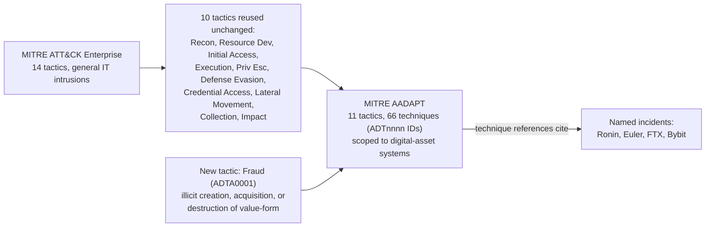
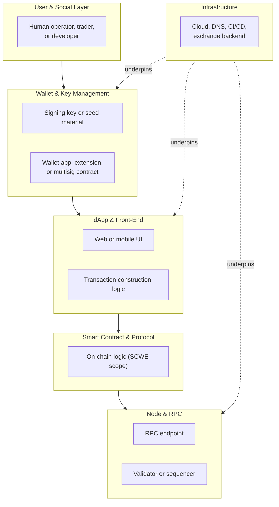
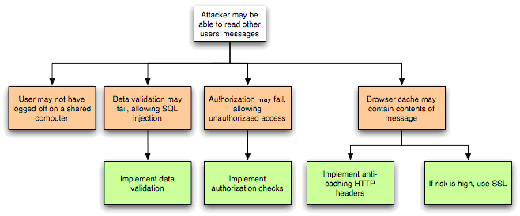
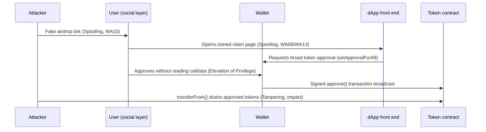
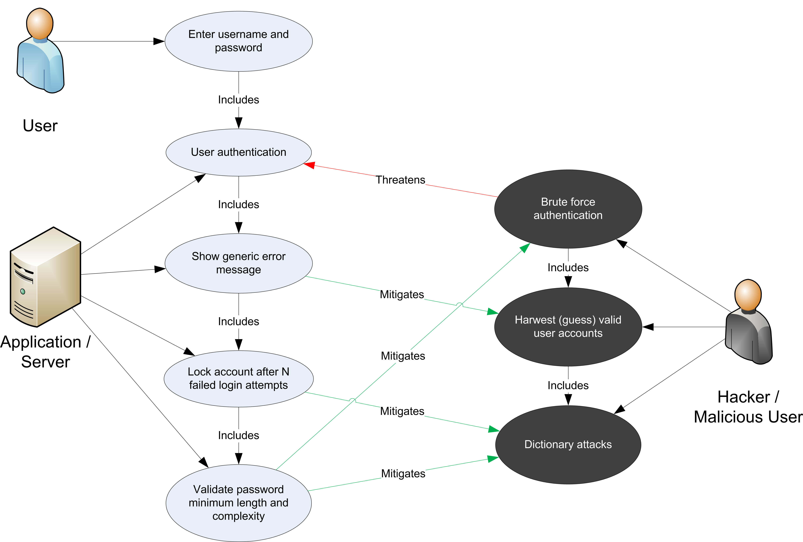
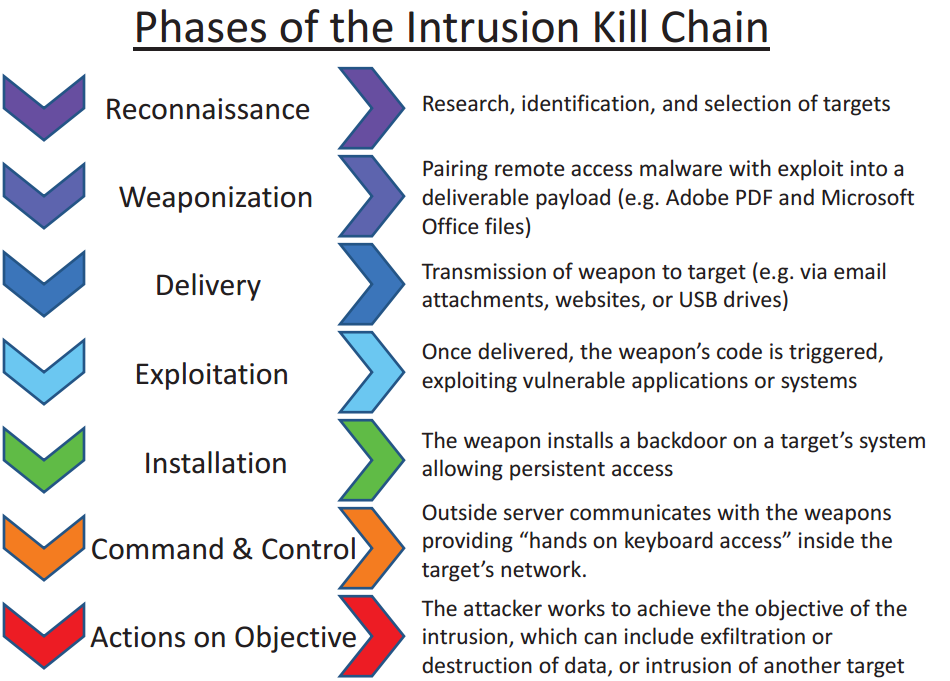
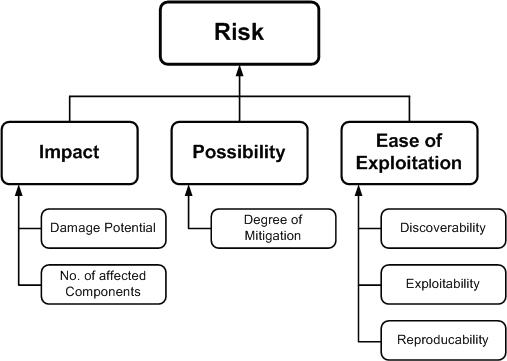

# Part 1: Foundations

[Back to Handbook contents](index.md) | [Series index](../index.md)

This part sets the vocabulary the rest of the handbook depends on: the six layers a Web3 system spans, the tactics-techniques-procedures (**TTP**) model this handbook borrows from **MITRE ATT&CK** and MITRE AADAPT, and the OWASP Web3 Attack Vectors Top 15 that anchors every chapter downstream. It treats an attack as a chain that crosses layers rather than a single-point event, then gives you the threat-modeling method (STRIDE plus scenario mapping) that Part 3 and Part 4 apply repeatedly. Read this part once before using the rest of the handbook as reference.

---

## 1. Introduction to Web3 Attack Vector Mapping

A Web3 system is not one artifact to defend. It is a chain of six: a person, the keys that person holds, the interface they click through, the contract that interface calls, the node that relays the call, and the infrastructure that keeps all of it online. This chapter introduces the frameworks this handbook borrows to describe attacks against that chain and fixes how it relates to OWASP's existing smart contract standards.

### 1.1 Why a Unified View (Wallets to Infra)

Security teams in Web3 default to organizing around one layer, usually the smart contract, because that is where audits and bug bounties concentrate. Real losses rarely stay inside one layer. Consider the theft of roughly $1.4 billion in ether from Bybit on 21 February 2025, the largest cryptocurrency heist recorded to date. The attacker did not touch Bybit's contracts. Attackers compromised a developer's machine at Safe{Wallet}, the multisignature wallet interface Bybit's signers used, and injected JavaScript that showed signers a routine transfer while the actual payload was a `delegatecall` repointing the cold wallet's proxy implementation to attacker-controlled logic. Signers blind-signed calldata they could not read, approved what looked routine, and the funds moved. Investigators attributed the operation to North Korea's Lazarus Group based on the laundering pattern that followed ([NCC Group technical analysis](https://www.nccgroup.com/us/research-blog/in-depth-technical-analysis-of-the-bybit-hack/)).

That single incident spans four layers: the user (a signer who trusted what the screen showed), the wallet (the multisignature approval flow), the dApp front end (the compromised interface serving malicious JavaScript), and the infrastructure behind it (the developer workstation that gave the attacker a foothold). A team that only threat-models the Safe contract itself, which behaved exactly as written, would never have found this path. A defender reasoning about the full chain asks the same question at every hop: what does this layer trust from the layer before it, and what happens if that trust breaks? This handbook makes that question repeatable, and later parts revisit Bybit and comparable incidents (Ledger Connect Kit, covered in the CDN and Front-End Supply Chain Security Handbook, 01) as worked examples of chains a single-layer view misses.

### 1.2 MITRE ATT&CK and TTP Concepts

MITRE ATT&CK (Adversarial Tactics, Techniques, and Common Knowledge) is, in its own words, "a globally-accessible knowledge base of adversary tactics and techniques based on real-world observations" ([attack.mitre.org](https://attack.mitre.org/)). It organizes adversary behavior into a hierarchy that this handbook reuses throughout: a **tactic** is the adversary's short-term goal, a **technique** is a specific method used to achieve that goal, a **sub-technique** is a more granular variant of a technique, and a **procedure** is the exact implementation a particular threat actor used in a particular incident. [NIST SP 800-150](https://csrc.nist.gov/glossary/term/tactics_techniques_and_procedures) formalizes the umbrella term TTP (tactics, techniques, and procedures) this way: a tactic is "the highest-level description" of adversary behavior, techniques "give a more detailed description... in the context of a tactic," and procedures are "an even lower-level, highly detailed description in the context of a technique."

The ATT&CK Enterprise matrix currently defines 14 tactics, from Reconnaissance and Initial Access through Impact, each identified by a stable `TAnnnn` ID, with techniques and sub-techniques identified by `Tnnnn` and `Tnnnn.nnn` respectively.

| Level | Granularity | Example ID | Example |
|-------|-------------|-----------|---------|
| Tactic | Adversary's goal | TA0001 | Initial Access |
| Technique | Method to reach the goal | T1566 | Phishing |
| Sub-technique | Specific variant of the technique | T1566.002 | Spearphishing Link |
| Procedure | Exact implementation in one incident | (free text, no fixed ID) | A cloned wallet-connect page sent to a specific signer with a lookalike domain |

This handbook adopts the same tactic-technique-procedure structure for every layer in Part 2, assigns each **technique** a handbook-local ID (Section 2.3), and cross-references ATT&CK and AADAPT IDs wherever an entry maps cleanly onto them.

### 1.3 MITRE AADAPT: Digital Asset and Blockchain Threat Framework

ATT&CK was built for enterprise IT, not for systems where the adversary's objective is the irreversible transfer of a bearer asset. MITRE's Center for **Threat-Informed Defense** addressed that gap with AADAPT, Adversarial Actions in Digital Asset Payment Technologies, a knowledge base hosted at [aadapt.mitre.org](https://aadapt.mitre.org/) and published as open data in the [`mitre/AADAPT` GitHub repository](https://github.com/mitre/AADAPT). AADAPT is explicitly modeled on ATT&CK's structure (tactics, techniques, a navigable matrix) but scoped to cryptocurrency, blockchain, and digital-asset payment systems, the domain ATT&CK does not cover.

#### 1.3.1 Complement to ATT&CK; Real-World Attack Derivation

AADAPT's published data (`AADAPT.yaml`, retrieved August 2026) shows how it complements rather than replaces ATT&CK. Ten of its eleven tactics are ATT&CK Enterprise tactics reused with their original `TAnnnn` IDs: Reconnaissance, Resource Development, Initial Access, Execution, Privilege Escalation, Defense Evasion, Credential Access, Lateral Movement, Collection, and Impact. AADAPT drops four ATT&CK tactics that fit general IT intrusions poorly here (Persistence, Discovery, Command and Control, Exfiltration) and adds one ATT&CK has no equivalent for: **Fraud** (`ADTA0001`), an adversary trying "to illicitly create, acquire, or utilize value-form," or to destroy a victim's value-form outright. Beneath these eleven tactics sit 66 techniques with `ADTnnnn` IDs, for example `ADT3001` (Acquire Accounts, under Resource Development) and `ADT3002` (Aggregate **Private Key** Generation Data, under Collection).

The "real-world attack derivation" in this subsection's title is not a slogan. Every AADAPT **technique** carries a references list pointing to named incidents rather than abstractions: the Ronin Network bridge exploit, the Euler Finance flash-loan attack, the FTX collapse, and the Bybit hack (the same NCC Group analysis cited in Section 1.1) all appear as sourced technique evidence. That is why this handbook cross-references AADAPT technique IDs in Part 2's wallet, node, and infrastructure chapters: an AADAPT ID points to a documented incident, not a hypothetical.



*Figure 1. How AADAPT derives from ATT&CK: it keeps the ten tactics that transfer cleanly to digital-asset systems, adds one new tactic (Fraud) that ATT&CK has no category for, and grounds every technique in a cited incident.*

### 1.4 Relationship to OWASP SC Top 10, SCWE, and SCSVS

Three existing OWASP Smart Contract Security (SCS) project deliverables already cover the contract layer in depth, and this handbook is built to extend that coverage outward, not duplicate it. The [Smart Contract Top 10](https://scs.owasp.org/sctop10/) ranks the highest-impact classes of on-chain logic risk (reentrancy, **access control** failures, oracle manipulation, flash-loan-facilitated attacks, and similar categories) for a given year. The [Smart Contract Security Verification Standard (SCSVS)](https://scs.owasp.org/SCSVS/) turns that risk landscape into a checklist of testable controls, organized into eleven domains from architecture through cryptography and component security. The [Smart Contract Weakness Enumeration (SCWE)](https://scs.owasp.org/SCWE/) is the weakness-level catalog beneath both, naming specific patterns (a missing check, an unbounded loop, an unvalidated external call) and mapping each to the SCSVS control it violates.

All three are scoped, by design, to the contract and its immediate surroundings. This handbook's Chapter 7 (Smart Contract and Protocol, Part 2) maps directly onto SCWE's categories rather than re-deriving them, and the other five layers cover exactly the ground those three standards leave uncovered: the human who signs, the key that signs, the interface that requests the signature, the node that broadcasts it, and the infrastructure underneath. Where a **technique** here does touch contract logic (Section 2.4), it cites the relevant SCWE entry rather than restating it.

### 1.5 The OWASP Web3 Attack Vectors Top 15 (Alternate List)

The Web3 Attack Vectors Top 15 (WA01 through WA15) is the OWASP SCS project's companion awareness list to the Smart Contract Top 10, and it is the single most important external reference this handbook aligns to. Where the Smart Contract Top 10 is a ranked list of on-chain risk, the Top 15 is an unranked catalog of everything a Web3 organization loses money to that has nothing to do with a Solidity bug.

#### 1.5.1 Canonical List: https://scs.owasp.org/sctop10/Web3-Attack-Vectors-Top15/

The authoritative source is published at [scs.owasp.org/sctop10/Web3-Attack-Vectors-Top15](https://scs.owasp.org/sctop10/Web3-Attack-Vectors-Top15/) under the title "Alternate Top 15, Web3 Attack Vectors (Beyond Smart Contracts)." Treat every WAnn reference in this handbook as a pointer to that page rather than to a frozen snapshot: the OWASP SCS project states explicitly that the list will evolve (Section 1.5.5), so verify the current wording against the canonical page before citing a specific WA entry in a client-facing deliverable.

#### 1.5.2 Scope: Non-Smart-Contract Vectors; Complements SC Top 10

The Top 15's own framing is unambiguous: it "complements the OWASP Smart Contract Top 10: 2026 by cataloguing significant non-smart-contract attack vectors in the Web3 space." That boundary is why this handbook exists as a separate volume rather than a chapter bolted onto the Smart Contract Top 10. A reentrancy bug is a code defect with a code fix. A drainer campaign, a fake-interview social-engineering operation, or a hijacked DNS record is not a code defect at all, it is a failure at the human, operational, or infrastructure layer, and it needs its own taxonomy, detection signals, and owner inside a security organization. The Top 15 draws that boundary explicitly so a reader does not mistake "our contracts passed audit" for "we are covered."

#### 1.5.3 WA01–WA15 Overview and Summary Table


*Figure. The canonical attack-surface view this handbook operationalizes. The list deliberately spans people, software, signing UX, custody, infrastructure, and state-backed infiltration, preventing a threat model from collapsing into smart-contract code alone. Source: [OWASP SCS, Web3 Attack Vectors Top 15](https://scs.owasp.org/sctop10/Web3-Attack-Vectors-Top15/), OWASP project content.*

| ID | Vector | What it covers |
|----|--------|-----------------|
| WA01 | Multisig Hijacking | Manipulated signing UIs trick operators into authorizing malicious transactions without seeing the real payload. |
| WA02 | Supply Chain Attacks (npm, PyPI, OSS) | Compromised open-source packages distribute crypto-stealing malware to developers and users. |
| WA03 | Private Key Compromise | Keys or seed phrases stolen via phishing, malware, or weak implementation; cited as roughly 43.8 percent of hacking-related losses. |
| WA04 | Drainer Malware and Drainer-as-a-Service (DaaS) | Packaged phishing-site toolkits trick users into granting malicious contracts transfer permissions. |
| WA05 | Fake Interview and Video Call Social Engineering | Attackers pose as employers, use fake meeting software, and abuse remote-control features to plant malware. |
| WA06 | UI/UX Spoofing and Approval Phishing | Spoofed or cloned sites trick users into signing transactions granting spending authority to a malicious contract. |
| WA07 | Centralised Exchange and Web2/2.5 Infrastructure Breaches | Custody and operational-security failures at exchanges and platforms enable large-scale theft. |
| WA08 | Phishing and General Social Engineering | Phishing emails and fake support sites trick users into revealing seed phrases or passwords directly. |
| WA09 | Romance, Investment, Impersonation, Recovery, and Pig Butchering Scams | Long-horizon social engineering builds trust to extract funds through fake platforms or impersonation. |
| WA10 | Rug Pulls, Fake Airdrops, and Token Impersonation | Fraudulent launches and airdrop claims lure users into acquiring worthless or malicious tokens. |
| WA11 | Wrench Attacks and Physical Coercion | Threats, kidnapping, or coercion force individuals to reveal credentials or authorize transfers. |
| WA12 | Insider Threats and Collusive Abuse | Employees or contractors abuse legitimate wallet, admin-panel, or deployment access to steal funds. |
| WA13 | DNS, Domain, and Routing Infrastructure Hijacking | Compromised DNS or registrars redirect users to phishing sites impersonating a real dApp or exchange. |
| WA14 | Wallet Software, Extension, and App Compromises | Malicious updates or exploited vulnerabilities enable silent approval or key theft. |
| WA15 | Nation-State Infiltration via Fake Hiring and Malicious OSS Contributions | State-backed groups pose as developers or employers to infiltrate orgs and compromise software supply chains. |

*Table 1. The OWASP Web3 Attack Vectors Top 15. Source: [OWASP SCS, Alternate Top 15](https://scs.owasp.org/sctop10/Web3-Attack-Vectors-Top15/).*

#### 1.5.4 Use of the Top 15: Awareness, Threat Modeling, and Detection

The Top 15's authors position it as "an awareness list for protocols, Web3 users, stakeholders, and the CXO suite," and this handbook operationalizes that in three ways. As an **awareness checklist**, walk WA01 through WA15 during onboarding or vendor review and confirm each vector has a named owner, even if the answer for some is "accepted risk, out of scope." As a **threat-modeling input**, use the WA taxonomy to keep a STRIDE session (Section 3.2) from silently collapsing into a contract-only exercise; every WA entry maps to at least one layer in Section 2.2's table, so a session that never touches a WA vector has probably only covered the contract layer. As a **detection input**, each vector implies monitoring surface (seed-phrase entry on a foreign domain for WA08, an unexpected `setApprovalForAll` for WA06), so Part 3's TTP matrix maps WA vectors to concrete signals instead of leaving them as narrative categories.

- Assign an owner to each of WA01 to WA15 (security, legal, HR, or "accepted risk").
- Confirm at least one control exists per vector, even a manual process, before calling it covered.
- Re-run the mapping whenever the canonical page updates (Section 1.5.5).
- Feed WA IDs into the STRIDE and risk tables in Chapter 3 so nothing is threat-modeled twice under different names.

#### 1.5.5 Future Development: Ranking, Methodology, and Update Cycles

The canonical page states plainly that the current ordering "does not imply relative severity or prevalence" and that the list "will be developed, ranked, and maintained in the near future," with methodology, data sources, and update cycles established as the project matures. Treat WA01 to WA15 as an index, not a priority order: do not tell a client that WA01 (**Multisig** Hijacking) outranks WA08 (Phishing) purely on its lower number. When OWASP publishes a ranked successor, Section 2.2's layer mapping and the Part 3 **TTP** matrix are the two artifacts to re-validate; both are structured so adding, splitting, or re-ranking a WA entry does not require rebuilding the six-layer taxonomy underneath them.

### 1.6 How to Use This Handbook

Read this Part once, end to end, to internalize the six-layer taxonomy, the **TTP** vocabulary, and the STRIDE method. After that, use the handbook as a reference rather than a cover-to-cover read.

| If your goal is... | Start here |
|---------------------|-----------|
| Build or update a layer-by-layer technique catalog | Part 2, the chapter matching the layer in question |
| Run a threat-modeling workshop for a specific system | Part 1, Chapter 3, then the matching Part 2 chapters |
| Build a detection or incident-response playbook | Part 3's TTP matrix, then the Incident Response Handbook (06) |
| Understand a named incident across layers | Part 4's case studies |
| Look up a term, a WA ID, or an SCWE cross-reference fast | Part 5's appendices |

Cross-references throughout point to sibling handbooks by number (02, 06, 07, 08, 09, 11) so that when a **technique** here touches a topic covered in depth elsewhere, you can follow the thread outward instead of finding a shallow restatement.

---

## 2. Scope and Taxonomy

This chapter fixes the six-layer model the handbook is built on and shows how it connects to the Top 15, to the handbook's own **TTP** identifiers, and to sibling handbooks.

### 2.1 Layers: User, Wallet, dApp, Contract, Node, Infra

Six layers cover the full path a transaction takes from human intent to settled state, each a distinct **trust boundary** with its own adversaries and controls, mirroring the level-based approach the CDN and Front-End Supply Chain Security Handbook (01) uses for its narrower scope.

The **user and social layer** is the human: trader, signer, developer, executive, and everything a social engineer can target in them. The **wallet and key management layer** is the private key or seed material and the software (browser extension, mobile app, hardware device, or multisignature contract) that signs with it. The **dApp and front-end layer** is the web or mobile interface that constructs transactions and requests signatures, the layer the Bybit incident (Section 1.1) compromised. The **smart contract and protocol layer** is the on-chain logic SCWE already catalogs in depth (Section 1.4). The **node and RPC (remote procedure call) layer** receives signed transactions, relays them to the network, and serves state back to clients. The **infrastructure layer** is everything underneath: cloud accounts, DNS, CI/CD (continuous integration and continuous deployment) pipelines, and, for centralized platforms, the exchange backend itself.



*Figure 2. The six-layer taxonomy. Intent flows left to right from user through settlement; infrastructure underlies the wallet, dApp, and node layers rather than sitting only at one end of the chain.*

### 2.2 Mapping Layers to the Web3 Attack Vectors Top 15 (WA01–WA15)

Most WA vectors have one primary layer and, often, a secondary layer where the attack lands. Use this table as the crosswalk between Table 1 and the layer chapters in Part 2.

| Layer | Primary WA vectors | Secondary or cross-layer |
|-------|--------------------|--------------------------|
| User and social | WA05, WA08, WA09, WA11 | WA04, WA06 (delivery mechanism) |
| Wallet and key management | WA01, WA03, WA04, WA06, WA14 | WA02 (compromised wallet dependency) |
| dApp and front-end | WA02, WA06, WA10, WA13 | WA01 (multisig UI), WA04 (drainer sites) |
| Smart contract and protocol | (none primary; see Section 1.4) | WA10 (fraudulent token contracts) |
| Node and RPC | (none primary in current Top 15) | WA13 (routing hijack can target RPC) |
| Infrastructure | WA07, WA12, WA13, WA15 | WA02 (build infrastructure) |

*Table 2. Layer-to-vector crosswalk. A vector with no primary layer is fully covered elsewhere (contract logic by SCWE) or has no dedicated Top 15 entry yet (node-layer attacks are still covered in Part 2 Chapter 8).*

### 2.3 Tactics and Techniques Overview

Part 2's six layer chapters each build a **technique** catalog using the **TTP** structure from Section 1.2, and every entry carries a handbook-local identifier so the Part 3 matrix, the Part 4 case studies, and the Part 5 appendices can reference it without ambiguity. The ID format is:

```
W3.<LAYER>.<NNN>

LAYER codes: US (User & Social) | WK (Wallet & Key Mgmt) | DA (dApp & Front-End)
             SC (Smart Contract) | ND (Node & RPC)        | IF (Infrastructure)
NNN: sequential three-digit number within the layer, assigned in Part 2

Example: W3.WK.004  ->  Wallet & Key Management layer, technique 004
```

Where a technique corresponds to an existing framework entry, the catalog cites it alongside the handbook ID rather than replacing it: an ATT&CK `Tnnnn` ID, an AADAPT `ADTnnnn` ID, a Top 15 `WAnn` ID, or an SCWE identifier for contract-layer entries. A technique with no clean external match still gets a `W3.*` ID and a plain-language justification. This keeps the catalog navigable by layer, by **tactic** (the Part 3 matrix's rows), and by external standard (the Part 5 appendix cross-reference tables).

### 2.4 Cross-References to Other Handbooks and SCWE

No layer here is this handbook's alone to own. Each has a sibling handbook that treats it in operational depth, and this handbook's job is to map the **attack surface**, not duplicate control detail those handbooks already carry.

| Layer | Primary sibling handbook(s) | SCWE relevance |
|-------|------------------------------|-----------------|
| User and social | Employee Lifecycle Security (03); Hiring, Remote Work, and Insider Threat (05); UX Security (09) | None |
| Wallet and key management | UX Security (09); Web3 Operational Security (11) | None |
| dApp and front-end | CDN and Front-End Supply Chain Security (01); DNS and Hosting Security (02) | None |
| Smart contract and protocol | (mapping only; audits are out of scope) | Direct: all 11 SCWE categories |
| Node and RPC | Infrastructure Security (07) | Partial: SCSVS-BRIDGE, SCSVS-BLOCK for chain-facing logic |
| Infrastructure | DNS and Hosting Security (02); Infrastructure Security (07); Incident Response (06) | None |

*Table 3. Cross-reference map. When a Part 2 entry names a control this handbook does not detail, an SRI (Subresource Integrity) pin or a DNSSEC record, it points to the sibling handbook that owns it rather than restating it.*

---

## 3. Threat Modeling and Attack Scenarios

This chapter supplies the method the rest of the handbook assumes: scoping a **threat model** across six layers, running it with STRIDE, visualizing a multi-layer attack, and turning the result into a prioritized mitigation list.


*Figure. OWASP's threat graph makes the causal chain explicit: an agent uses a vector to exploit a weakness, producing technical and then business impact. In this handbook, the six-layer taxonomy supplies the locations, while the TTP matrix supplies the reusable vectors and controls. Source: [OWASP Threat Modeling Process](https://owasp.org/www-community/Threat_Modeling_Process), OWASP community content used with attribution.*

### 3.1 Define Scope, Assets, and Boundaries

Every **threat model** starts by writing down three things before a single attack is discussed: what is in scope, what an adversary would want, and where the trust boundaries sit. Scope is a decision, not a discovery: state explicitly whether the exercise covers one dApp, one organization's whole stack, or a single layer in isolation, because an unscoped session drifts toward whatever layer the loudest participant knows best. Assets in a Web3 system are rarely just "funds," enumerate them by layer: signing keys (wallet), session cookies and approval state (dApp), admin roles and upgrade keys (contract), RPC credentials (node), and DNS zone access and CI/CD secrets (infrastructure). Boundaries are the points where one layer's output becomes another layer's trusted input without independent verification: does the wallet show the human what it is actually signing? Does the contract validate what the front end sends, or trust it? Can an infrastructure compromise silently swap which node a client talks to?

| Layer | Primary asset to protect | Trust boundary crossed |
|-------|---------------------------|--------------------------|
| User and social | Attention and judgment | Human trusts a message, call, or site as legitimate |
| Wallet and key management | Private key or seed material | Wallet trusts the calldata it is asked to sign |
| dApp and front-end | Session state, approval scope | User trusts the interface to represent the transaction accurately |
| Smart contract and protocol | Contract state, admin roles | Contract trusts caller-supplied input and upstream oracles |
| Node and RPC | Chain state, RPC responses | Client trusts the node it queries to be unmodified and honest |
| Infrastructure | DNS, cloud credentials, CI/CD secrets | Every layer above trusts infrastructure to be unmodified |

*Table 4. A scoping worksheet: fill in the asset and boundary columns for the system under review before running STRIDE.*

### 3.2 STRIDE (Spoofing, Tampering, Repudiation, Information Disclosure, DoS, Elevation of Privilege)

STRIDE is Microsoft's threat-categorization model, still the reference method for structured **threat modeling** nearly three decades after its introduction ([Microsoft Learn, Threat Modeling Tool threat categories](https://learn.microsoft.com/en-us/azure/security/develop/threat-modeling-tool-threats)). Working through all six categories against every layer prevents the common failure of hardening the layer a team already worries about while an adjacent category goes unexamined; this handbook applies it across all six layers, not the single application boundary STRIDE was originally built for.

| STRIDE category | Multi-layer Web3 scenario | Layer(s) affected | Related Top 15 vector |
|-------------------|------------------------------|---------------------|--------------------------|
| **S**poofing | Cloned dApp domain or fake wallet-connect prompt impersonates the real interface | dApp, user | WA06, WA13 |
| **T**ampering | Front-end JavaScript altered to change calldata before signing (as in Bybit) | dApp, wallet | WA01, WA14 |
| **R**epudiation | An insider with deployment access pushes a malicious upgrade with no attributable trail | Infrastructure, contract | WA12 |
| **I**nformation disclosure | CI/CD secrets or keys leak from a build pipeline or exposed RPC endpoint | Infrastructure, node | WA02, WA07 |
| **D**enial of service | A targeted RPC provider or DNS host is knocked offline, stranding users | Node, infrastructure | WA13 |
| **E**levation of privilege | A phished support agent resets a user's two-factor authentication and drains a custodial balance | User, infrastructure | WA07, WA08 |

*Table 5. STRIDE mapped across the six-layer taxonomy, with each scenario tied to a Top 15 vector and the layers it actually touches.*

Run this table live in a workshop: replace each generic scenario with the team's own, and leave a cell blank only when the team can state affirmatively why that category does not apply at that layer, not because nobody thought about it.

### 3.3 Attack Scenarios and Visualizations

A STRIDE table tells you what can happen; a sequence diagram tells you in what order and where a control could have interrupted it. Build one for every scenario that crosses more than one layer, the class of attack a single-layer review misses. The example below walks a fake-airdrop lure (WA10) through to an on-chain drain, crossing the user, wallet, dApp, and contract layers.



*Figure 3. A worked multi-layer scenario. Each arrow is a point where a control (SRI on the claim page, a wallet that decodes calldata in plain language, an approval-scope limit) could have broken the chain; Part 3's matrix lists the concrete control for each step.*

Attack trees and kill-chain diagrams (the Lockheed Martin model, adapted here to layer transitions instead of network stages) serve scenarios with branching paths rather than a single line; use whichever visualization makes the decision points visible to the people who act on the model.


*Figure. A misuse case anchors an adversary action to the normal function it abuses and the security behavior that must interrupt it. This is particularly useful for Web3 actions such as token approval, multisig signing, and contract upgrade, where the same valid mechanism serves both legitimate and malicious intent. Source: [OWASP Threat Modeling Process](https://owasp.org/www-community/Threat_Modeling_Process), OWASP community content used with attribution.*


*Figure. The intrusion kill chain, the seven-stage model this handbook's layer-transition sequence diagrams (Figure 3 above, and the multi-layer chains in Part 2 and Part 4) adapt from network stages to Web3 layer transitions. Source: [Wikimedia Commons, U.S. Senate Committee on Commerce, Science, and Transportation](https://commons.wikimedia.org/wiki/File:Intrusion_Kill_Chain_-_v2.png), public domain (U.S. government work).*

### 3.4 Risk Evaluation and Mitigation Mapping

Once a scenario is mapped, score it and route it to a control before moving to the next: an unscored **threat model** is a list of scary stories, not a work plan. Score likelihood and impact independently (High, Medium, or Low is enough resolution for a workshop), and always score impact using the worst realistic state the attack lands in, not the state the system happens to be in on the day of the workshop.


*Figure. The OWASP risk-factor model prevents severity from collapsing into one intuition: threat agent and vulnerability properties determine likelihood, while technical and business consequences determine impact. For irreversible Web3 transfers, business impact may dominate even when observed frequency is modest. Source: [OWASP Threat Modeling Process](https://owasp.org/www-community/Threat_Modeling_Process), OWASP community content used with attribution.*

| Scenario | Layer(s) | Likelihood | Impact | Priority | Primary mitigation | Owning handbook |
|----------|----------|------------|--------|----------|----------------------|----------------------|
| Cloned front end alters calldata (Bybit pattern) | dApp, wallet | Medium | High | Critical | Human-readable calldata decoding at signing; SRI on wallet-connect scripts | 01 |
| Fake-interview malware plants a wallet stealer | User | High | High | Critical | Sandboxed interviews; no credential entry outside managed devices | 05 |
| DNS hijack redirects users to a phishing clone | dApp, infrastructure | Medium | High | High | Registry lock, DNSSEC, domain monitoring | 02 |
| Insider pushes unauthorized contract upgrade | Infrastructure, contract | Low | High | Medium | Multi-party approval, timelock, signed provenance | 06, SCSVS-ARCH |
| RPC provider outage strands users mid-transaction | Node, infrastructure | Medium | Medium | Medium | Multi-provider RPC failover | 07 |

*Table 6. A worked risk register. Priority is not a mechanical product of likelihood and impact: a Critical mitigation gets built even at Medium likelihood if the impact is unrecoverable fund loss. Part 3's TTP matrix supplies the detection and mitigation detail this table only summarizes.*

---

**Key controls for Part 1**

- Treat every attack as a potential chain across the six layers (user, wallet, dApp, contract, node, infrastructure) before assuming it is contained to one.
- Use the OWASP Web3 Attack Vectors Top 15 as an unranked awareness checklist, assign an owner to every WA01 to WA15 vector, not a severity order.
- Cross-reference this handbook's **TTP** catalog to ATT&CK, AADAPT, WA, and SCWE identifiers rather than inventing parallel taxonomy.
- Run STRIDE across all six layers, not just the application boundary, and require an explicit reason to leave any cell blank.
- Score risk on worst-realistic-state impact, and route every scored scenario to a named control and an owning handbook before closing the workshop.

