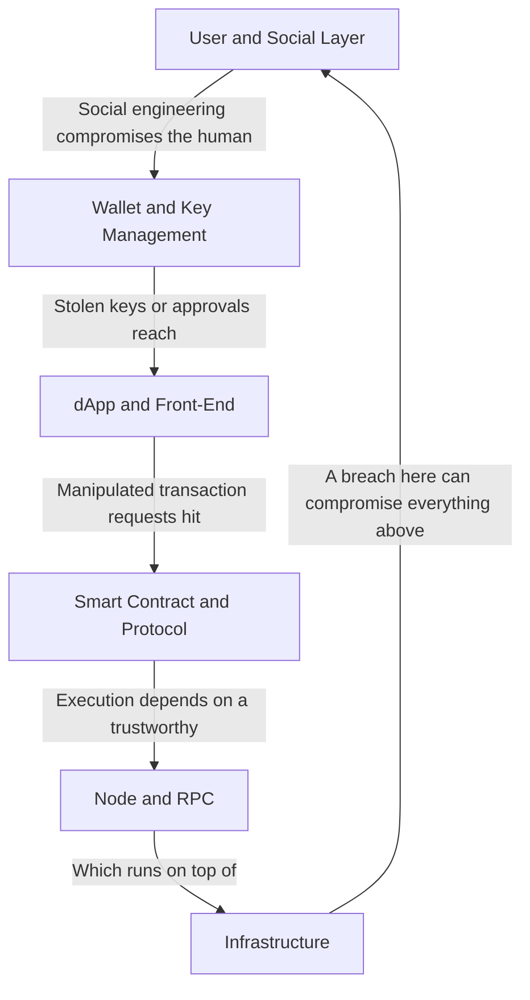
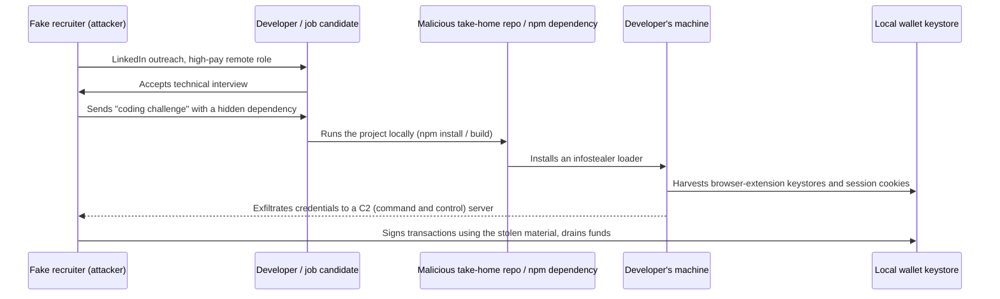
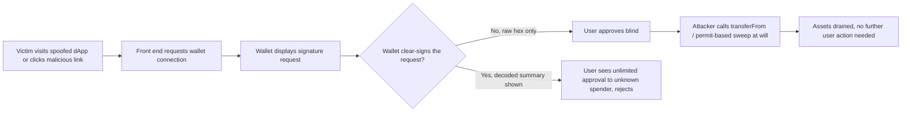

# Part 2: Tactics and Techniques by Layer

[Back to Handbook contents](index.md) | [Series index](../index.md)

Part 2 works through the Web3 stack one layer at a time: the person holding the keys, the wallet that holds them, the dApp front end that requests a signature, the smart contract that executes it, the node and RPC (remote **procedure** call) path that relays it, and the infrastructure everything else runs on. Each chapter opens by aligning its layer to the relevant vectors from the [OWASP Web3 Attack Vectors Top 15](https://scs.owasp.org/sctop10/Web3-Attack-Vectors-Top15/) (WA01 through WA15), works through the mechanics with a detection signal and a mitigation for every named technique, and closes with a technique catalog. The `T<chapter>.<sequence>` labels in this Part (for example, `T4.001`) are **chapter-local editorial locators**, not stable interchange identifiers. Part III assigns the canonical, never-reused `W3TTP-<LAYER>-<NNN>` identifiers to curated techniques. A machine-readable release must publish an explicit locator-to-canonical-ID crosswalk; consumers must not infer equivalence merely because two suffixes happen to match.



*Figure 1. The six layers this Part covers, in the order a transaction actually flows. The feedback edge from Infrastructure back to User matters: a compromised build pipeline or a breached developer laptop at the infrastructure layer routinely becomes the root cause of a wallet- or dApp-layer incident, which is why Chapters 4 through 9 cross-reference each other rather than treating each layer as isolated.*

---

## 4. User and Social Layer

The user and social layer is where most Web3 losses start, not in a contract's bytecode but in a message, a call, or a form that convinces a person to act against their own interest. Attacks here rarely touch code; they touch trust, urgency, and a target's willingness to believe a counterparty is who it claims to be.

### 4.1 Top 15 Alignment: WA05, WA08, WA09, WA11

Four Top 15 vectors describe attacks that require no code vulnerability at all: the target's own judgment is the exploited surface. WA05 (fake interviews), WA08 (phishing), WA09 (romance and investment fraud), and WA11 (physical coercion) share a common defensive posture: because there is no patch for a **social engineering** **technique**, controls have to intervene at the process or behavioral layer rather than the code layer. That means isolation of untrusted inputs (never run a stranger's code on a key-holding device), verification habits (confirm identity out of band before acting on a request), and organizational policy (support never initiates contact, recruiters never require pre-interview code execution). The [OWASP Web3 Attack Vectors Top 15](https://scs.owasp.org/sctop10/Web3-Attack-Vectors-Top15/) groups these under its social-engineering-driven vectors precisely because pattern-matching detection (malicious signatures, static analysis) cannot see them; only behavioral and process controls can.

#### 4.1.1 WA05: Fake Interview and Video Call Social Engineering

North Korea-aligned threat actors run a well-documented recruiting lure against Web3 and traditional software developers. A fake recruiter reaches out on LinkedIn or a developer job board with an unusually well-paid remote role, moves the conversation to a "technical interview," and asks the candidate to run a take-home coding project or install a video-conferencing tool for the call. The project's dependency tree or the installer carries an infostealer loader, tracked across multiple campaigns under names including BeaverTail and InvisibleFerret, that the security community has documented under the umbrella term Contagious Interview and, separately, DeceptiveDevelopment ([Palo Alto Networks Unit 42](https://unit42.paloaltonetworks.com/), [ESET WeLiveSecurity](https://www.welivesecurity.com/)). Once installed, the loader harvests browser-extension wallet keystores, session cookies, and SSH keys from the candidate's machine.

Detection signals include an unsolicited high-compensation offer that moves unusually fast to a technical stage, and any request to execute unfamiliar code or install an unfamiliar binary before an interview has been verified through a second channel. The mitigation is procedural: run every candidate assignment inside a disposable, network-isolated virtual machine or container with no wallet extensions, no production credentials, and no SSH keys present, and treat any interview process that requires bypassing that isolation as disqualifying in itself. Employers should adopt the same rule in reverse (candidates should never receive an unsigned, unreviewed executable as a "test").

#### 4.1.2 WA08: Phishing and General Social Engineering

General phishing covers the high-volume channel: email, SMS, and direct messages on Discord, Telegram, or X that carry a malicious link or a request for a credential, **seed phrase**, or signature. Web3-specific variants include fake wallet-support tickets, fake exchange security alerts demanding an urgent login, and QR-code phishing ("quishing") at conferences where a scanned code opens a spoofed wallet-connect page instead of the legitimate one. Because these campaigns operate at scale, defenders benefit from treating them statistically rather than case by case; the FBI's Internet Crime Complaint Center tracks cryptocurrency-related fraud losses in the billions of dollars annually across these categories ([FBI IC3 annual reports](https://www.ic3.gov/)).

Detection signals include look-alike domains (character substitution, added hyphens, wrong top-level domain), urgency language ("act within 24 hours or lose access"), and any inbound message that requests a seed phrase, **private key**, or signature under time pressure. Mitigation combines technical controls, hardware-backed multi-factor authentication (WebAuthn/FIDO2) that phishing pages cannot relay, canonical bookmarked links instead of search-result or DM links, and email-authentication monitoring (DMARC, SPF, DKIM) on the organization's own domains so its brand cannot be spoofed as easily.

#### 4.1.3 WA09: Romance, Investment, Impersonation, Recovery and Pig Butchering Scams

Pig butchering, translated from the Chinese *sha zhu pan*, describes a long-con fraud in which the attacker builds a relationship, romantic or purely social, over weeks or months before introducing a "can't miss" investment opportunity on a platform the attacker controls. The victim's early deposits appear to grow, sometimes with fabricated withdrawals to build confidence, until a large deposit is requested and the platform vanishes or blocks withdrawal behind a fabricated "tax" or "compliance fee." A parallel pattern, "recovery scams," targets people who have already lost funds by posing as a recovery service and charging an upfront fee to reverse an irreversible loss. The [FBI's 2023 IC3 report](https://www.ic3.gov/) placed investment fraud, dominated by this pattern, as the single largest category of reported cryptocurrency losses, and Chainalysis tracks pig-butchering infrastructure as an organized, often forced-labor-staffed industry concentrated in parts of Southeast Asia ([Chainalysis Crypto Crime research](https://www.chainalysis.com/blog/)).

Detection signals include a new personal contact who steers conversation toward an unfamiliar trading app outside official app stores, and any platform that shows paper gains but blocks withdrawal without an additional payment. Mitigation is largely educational at the individual level and typological at the institutional level: exchanges and custodians can screen outbound transfers against known scam-cluster address lists and flag the deposit-then-large-withdrawal pattern characteristic of this fraud.

#### 4.1.4 WA11: Wrench Attacks and Physical Coercion

A "wrench attack" (the term borrows from the [xkcd 538 "security" comic](https://xkcd.com/538/), which observed that a five-dollar wrench defeats cryptography no algorithm can) is physical coercion used to extract a **seed phrase**, a **private key**, or a signed transaction directly from a person. 2025 saw a documented wave of such attacks in France targeting cryptocurrency holders and their families, including the kidnapping of a Ledger co-founder and his partner in January 2025, during which the attackers mutilated a victim to pressure a ransom payment; both were later rescued and multiple suspects were arrested. Chainalysis and other blockchain intelligence firms began tracking wrench attacks as a distinct, rising 2025 trend, driven partly by public on-chain wealth signals and social-media self-disclosure of holdings ([Chainalysis blog](https://www.chainalysis.com/blog/)).

Detection is largely about exposure reduction rather than technical monitoring: the risk indicator is a person's own public disclosure of wealth (leaderboard rankings, conference talks naming a personal net worth, doxxable social accounts linked to a known address). Mitigation includes operational security around holdings disclosure, multisignature or time-locked withdrawal schemes that cannot be completed under immediate duress, decoy wallets holding a plausible but limited balance, and duress PINs on hardware wallets that open a limited-balance account under coercion. Personal physical security planning, covered in the Web3 Operational Security Handbook (11), is the primary control for individuals at elevated risk.

### 4.2 Phishing and Social Engineering

Beyond the WA08-specific channel list, phishing against Web3 targets follows patterns worth cataloging by delivery channel because detection tooling differs by channel. Spear-phishing against protocol team members is reconnaissance-driven: an attacker researches a target's role (treasury signer, deployer key holder, on-call engineer) from public GitHub commits, conference talks, or LinkedIn before crafting a tailored lure, often a fake job offer that doubles as WA05 reconnaissance or a fake urgent bug report requiring the target to run a "reproduction" script. OAuth consent phishing, where a victim is tricked into granting a malicious application scoped access to an email or cloud account rather than typing a password, evades traditional credential-phishing detection entirely because no password ever changes hands.

| Channel | Typical payload | Detection surface | Primary control |
|---------|-----------------|-------------------|------------------|
| Email | Malicious link, attached macro document | DMARC/SPF/DKIM failures, sender domain age | Email authentication enforcement, attachment sandboxing |
| SMS/voice ("smishing"/vishing) | Urgent account-verification link or callback number | Sender number reputation, spoofed caller ID | Hardware-token 2FA that ignores SMS-based codes |
| Discord/Telegram DM | Fake support, fake collaboration/investment offer | New account age, mismatched role badges | Server-level DM restrictions, verified-bot allowlists |
| X/social DM or reply | Fake giveaway, fake verification form | Reply-spam pattern, mismatched handle history | Platform reporting, brand-monitoring services |
| OAuth consent screen | Malicious app requesting broad account scope | Unusual app name/publisher, excessive scope request | Periodic connected-app audits, least-privilege OAuth scopes |

Every row in this table converges on the same structural mitigation: verify identity and intent through a channel the attacker does not control, and never let time pressure substitute for that verification.

### 4.3 Impersonation and Support Scams

Impersonation attacks exploit the gap between a brand's visual identity and its actual communication channels. A fake support account replies to a user's public complaint on X or Discord before the legitimate team can, offering to "help" through a DM that leads to a credential or seed-phrase harvest; because the fake account often mimics the real support handle closely (an added underscore, a swapped letter), victims rarely notice. A related and higher-impact pattern is account takeover of an already-verified, high-follower account: the July 2020 mass compromise of prominent X (then Twitter) accounts, including major public figures and companies, to post a cryptocurrency giveaway scam remains the reference incident for how much a single hijacked "trusted" account can extract in a short window, reported by Twitter's own [post-incident update](https://blog.x.com/) at the time as netting over $100,000 in Bitcoin within hours across more than a hundred compromised accounts.

Homoglyph and punycode domains extend the same trick to URLs: a domain that renders visually identical to a legitimate one using Cyrillic or other Unicode look-alike characters is registered and used for phishing pages that copy the real site pixel for pixel. Detection signals include any support contact that originates as an unsolicited DM (legitimate support teams almost universally require the user to open a ticket first, not the reverse), a verified badge on an account whose recent posting behavior has abruptly changed, and browser-rendered domains that look correct but fail a punycode decode check. Mitigation combines platform-level account-recovery hardening (hardware-token 2FA on official social accounts, so a phished password alone cannot take them over), brand-monitoring services that flag look-alike domain registrations, and a hard organizational policy, published where users can find it, that support will never initiate contact or request a **seed phrase** under any circumstance.

### 4.4 Technique Catalog and TTP IDs

The table below assigns **TTP** IDs to every **technique** named in this chapter. Detection and mitigation columns are deliberately compressed here; the full reasoning for each sits in the corresponding subsection above. Part III's TTP Matrix (Chapter 10) reproduces these rows alongside every other chapter's catalog for cross-layer correlation.

| TTP ID | Technique | Top 15 ID | Primary detection signal | Primary mitigation |
|--------|-----------|-----------|---------------------------|---------------------|
| T4.001 | Fake interview / trojanized take-home lure | WA05 | Unsolicited high-pay offer moving fast to code execution | Disposable, network-isolated VM for all candidate code |
| T4.002 | Mass and spear phishing (email/SMS/social) | WA08 | Look-alike domain, urgency language, unexpected 2FA prompt | Hardware-token 2FA, canonical bookmarked links |
| T4.003 | Romance/investment long-con (pig butchering) | WA09 | New contact steers to unfamiliar trading platform | User education, exchange-side scam-cluster screening |
| T4.004 | Wrench attack / physical coercion | WA11 | Public wealth disclosure, unusual in-person contact | OPSEC on holdings, duress wallets, time-locked withdrawal |
| T4.005 | Fake support / help-desk impersonation | WA08 | Support contacts user first via DM | Published "support never DMs first" policy |
| T4.006 | Hijacked/verified-account impersonation and giveaways | WA08 | Abrupt posting-pattern change on a known account | Hardware 2FA on official social accounts, brand monitoring |

---

## 5. Wallet and Key Management

The wallet layer is where a social-engineering success becomes a financial loss: everything in Chapter 4 exists to reach the keys or the signature this chapter protects. A wallet compromise is rarely detectable by the victim in real time, because the attacker's goal is a single, fast, irreversible transfer.

### 5.1 Top 15 Alignment: WA01, WA03, WA04, WA06, WA14

Five Top 15 vectors converge on the wallet: WA01 (**multisig** hijacking), WA03 (**private key** compromise), WA04 (drainer malware and drainer-as-a-service), WA06 (UI/UX spoofing and approval phishing), and WA14 (wallet software and extension compromise). What unites them is the signing moment: every one of these techniques ends with the victim's wallet producing a valid signature over attacker-chosen data, whether through stolen keys, a manipulated display, or a multisig quorum individually deceived. Defenses cluster the same way, around making the signing moment trustworthy: clear signing (showing a human-readable summary of what is actually being signed, not raw hex), transaction simulation before signing, and hardware isolation of the key itself.

#### 5.1.1 WA01: Multisig Hijacking

Multisignature (**multisig**) wallets require several independent signers to approve a transaction, which should make a single compromise insufficient. Attackers instead target the thing every signer trusts in common: the interface that shows them what they are signing. The February 2025 Bybit incident, at the time the largest cryptocurrency theft on record at roughly $1.4 to $1.5 billion in ether, worked exactly this way: attackers compromised a developer machine tied to Safe{Wallet}'s front-end infrastructure and altered the transaction-proposal interface so that Bybit's cold-wallet signers saw a legitimate-looking transfer while the actual calldata routed funds to attacker-controlled addresses, a blind-signing failure at organizational scale attributed by the FBI to North Korea's TraderTraitor group ([FBI IC3 advisory, February 2025](https://www.ic3.gov/)). WazirX suffered a comparable multisig compromise in July 2024, losing roughly $230 million when signers approved a transaction that silently changed the multisig's underlying implementation contract.

Detection signals include any mismatch between a wallet's independent **transaction simulation** and what the front end displays, and any unexpected change to a multisig's implementation or logic contract address. Mitigation requires hardware wallets that clear-sign the actual calldata (not a UI-rendered summary the hardware device cannot itself verify), independent transaction-simulation tooling run by each signer before approving, **out-of-band verification** of the calldata hash among signers over a channel the compromised UI cannot influence, and combining signature thresholds with time locks so a malicious approval can be caught and reversed before execution.

#### 5.1.2 WA03: Private Key Compromise

Direct key theft covers infostealer malware families (commonly reported strains include RedLine, Lumma, and Raccoon-class stealers) that scan a browser's local storage for extension-wallet keystores, physical theft or coercion of a written **seed phrase**, and cloud-backup misconfiguration where a user photographs or screenshots a seed phrase that then syncs to an iCloud or Google Drive account with its own separate compromise surface. Clipboard hijackers are a distinct but related **technique**: malware that monitors the system clipboard and silently swaps a copied wallet address for an attacker-controlled one immediately before the victim pastes it into a transfer field.

Detection depends on endpoint visibility: endpoint detection and response (EDR) tooling that alerts on an unrelated process reading browser-extension local storage, or on a process registering a clipboard-change hook, catches both patterns before the theft completes. Mitigation is architectural: hardware wallets keep the **private key** off any general-purpose, internet-connected device entirely; passphrase-protected ("25th word") wallets defeat a stolen seed phrase alone; and a dedicated, minimal-software device used only for signing removes most of the **attack surface** infostealers rely on.

#### 5.1.3 WA04: Drainer Malware and Drainer-as-a-Service (DaaS)

Drainer-as-a-service describes a criminal business model: a developer builds a reusable "drainer" script, a piece of front-end JavaScript that connects to a victim's wallet and requests a single high-value signature, then rents it to affiliates for a percentage of everything stolen, commonly reported in the 10 to 30 percent range by researchers tracking kits such as Inferno Drainer and Pink Drainer. The affiliate handles distribution (a phishing site, a fake airdrop claim, a compromised Discord server) while the kit handles the technical work of constructing the malicious approval or `permit` signature and sweeping the victim's assets the instant it is signed, often within the same block.

Detection signals include a sudden spike in `Approval` events granted to a newly deployed or previously unseen spender contract, and browser-extension phishing-site blocklists (maintained by services such as ScamSniffer and individual wallet vendors) flagging the connecting domain before the wallet-connect handshake completes. Mitigation combines periodic approval revocation using tooling such as Revoke.cash so stale, unused approvals cannot be exploited later, wallet-level **transaction simulation** that previews the net asset change before signing, and browser extensions that check outbound connection domains against a maintained drainer blocklist.

#### 5.1.4 WA06: UI/UX Spoofing and Approval Phishing

At the wallet layer, UI/UX spoofing means the signing dialog itself lies: a wallet or a connecting dApp shows a summary ("Connect to MyDeFi") that does not match the underlying request ("grant unlimited token transfer approval to this address"), or a spoofed wallet-verification page asks a user to "reconnect" and sign a message that turns out to be a live transaction rather than the harmless signature it claims to be. This is the wallet-side half of a **technique** that also appears from the dApp side in Section 6.1.2; the distinction matters for defenders because the fix differs, wallet vendors must render clear-signed summaries accurately, while dApp operators must not construct requests designed to obscure their true effect. Front-end integrity controls (SRI, CSP) that prevent a spoofed clone site from existing in the first place are covered in depth in the CDN and Front-End Supply Chain Security Handbook (01).

#### 5.1.5 WA14: Wallet Software, Extension and App Compromises

This vector covers the wallet application itself, not the site connecting to it. Trojanized wallet apps distributed through unofficial app stores or sideloaded outside Google Play and the Apple App Store impersonate popular wallets such as MetaMask or Trust Wallet closely enough in name and icon to catch a search-driven install; security researchers at firms including ESET and Kaspersky have repeatedly documented waves of such fake wallet apps reaching official app stores before takedown. A second pattern targets the legitimate extension's update mechanism: if an attacker compromises the developer account or build pipeline that ships extension updates, every installed copy receives the malicious version automatically, an attack class that overlaps directly with the supply-chain techniques in Section 6.1.1.

Detection signals include a wallet app with an unusually low download count and recent publication date impersonating an established brand, and any browser-extension update that changes requested permissions without a corresponding, verifiable release note. Mitigation includes installing wallet software only from the vendor's own linked, verified store listing, checking extension publisher identity and permission scope on every update, and, for organizations, pinning extension versions and re-approving updates through a review step rather than accepting automatic updates silently.

### 5.2 Key Theft and Malware

Malware targeting wallets follows a predictable **kill chain** regardless of the specific family involved: initial access (a phishing lure, a trojanized installer, a fake interview package), execution on the target's machine, credential harvesting (browser-extension local storage, keychain files, clipboard content), and exfiltration to an attacker-controlled server before the theft itself occurs, often with the actual transfer executed by the attacker's own infrastructure rather than the malware itself. Remote access trojans (RATs) extend this further by giving the attacker interactive control, letting them wait for the victim to unlock a **hardware wallet** or type a passphrase before triggering a live transaction.



*Figure 2. The fake-interview-to-key-theft chain (WA05 into WA03), the mechanism behind the Contagious Interview/DeceptiveDevelopment campaigns discussed in Section 4.1.1. The same pattern recurs at organizational scale as nation-state infiltration in Section 9.1.4, where the "developer" is a placed insider rather than an interview candidate.*

The chain-level defense is isolation at every hop: sandboxed execution for untrusted code (breaks the Repo-to-Host edge), EDR alerting on keystore and clipboard access (breaks the Host-to-Wallet edge), and network egress monitoring for unexpected outbound connections from a development machine (breaks the Host-to-C2 edge). No single control is sufficient; the chain is only as strong as its weakest unbroken edge.

### 5.3 Approval and Signature Abuse

Token approvals exist to let a contract move tokens on a user's behalf without a signature on every single transfer: ERC-20's `approve` and `increaseAllowance`, ERC-721 and ERC-1155's `setApprovalForAll`, and the gasless variants `permit` ([EIP-2612](https://eips.ethereum.org/EIPS/eip-2612)) and Uniswap's Permit2. Every one of these mechanisms grants standing authority, sometimes unlimited, that persists until explicitly revoked, which makes a single signed approval as dangerous as a direct transfer if it is signed unknowingly. The core defensive problem is that a `permit` signature is an off-chain EIP-712 typed-data structure, and a poorly implemented wallet can render it as an opaque hex blob instead of a decoded, human-readable summary.

```
# What the user should be shown (clear-signed EIP-712 summary)
Grant approval to: 0xA1b2...F00d (labeled "Unknown contract, 3 days old")
Token: USDC
Amount: UNLIMITED
Expiry: none

# What a raw, undecoded signing request looks like to the user
0x19010a2f8c... (416 hex characters, no human-readable summary)
```

A wallet that only ever shows the second form cannot support informed consent regardless of how careful the user is; this is the mechanical root of most approval phishing.



*Figure 3. Approval phishing succeeds or fails at the clear-signing decision point. Detection tooling (transaction simulators, approval-scanning browser extensions) and an emerging clear-signing metadata standard for structured display of contract interactions (ERC-7730 and related efforts) both target this exact junction.*

Detection signals include any approval request for an unlimited amount rather than a scoped one, and any spender contract with no verified source code or a deployment age of hours rather than months. Mitigation includes preferring wallets and interfaces that clear-sign `permit` and `setApprovalForAll` requests with a decoded summary, scoping approvals to the exact amount needed rather than accepting a dApp's default unlimited request, and running periodic approval audits with revocation tooling.

### 5.4 Wallet UI and Redress

"Redress" in a Web3 context is limited by design: blockchain transactions are final, so the primary lever is prevention at the signing moment rather than reversal afterward. Wallet UI design choices directly determine how much a user can actually understand before signing. Hardware wallets historically constrained this further with small screens that could show only a few lines of a transaction, forcing either truncation (hiding the very fields an attacker manipulates) or a trust handoff to the connected software wallet's rendering, which is exactly the trust the Bybit-style **multisig** compromise abused. Industry initiatives, including Ledger's clear-signing push and the associated ERC-7730 metadata standard for describing how a contract's calldata should be rendered to a human, aim to let any wallet display a decoded, contract-author-defined summary rather than relying on each wallet vendor to reverse-engineer every protocol's calldata independently.

Where prevention fails, redress options are narrow and time-sensitive: rapid on-chain tracing and exchange notification (covered operationally in the EVM Forensics and DeFi Recovery Handbook, 04) to flag destination addresses before funds move further, and, for protocol-level incidents, a governance or multisig-controlled pause function if one exists and has not itself been compromised. Neither substitutes for prevention, and both depend on speed measured in minutes, not the hours a typical incident-response process assumes. Wallet vendors and dApp teams should treat the signing dialog as the single highest-leverage UI surface in the entire stack and invest accordingly: every ambiguity resolved there prevents an incident that no amount of downstream tracing fully recovers.

### 5.5 Technique Catalog and TTP IDs

| TTP ID | Technique | Top 15 ID | Primary detection signal | Primary mitigation |
|--------|-----------|-----------|---------------------------|---------------------|
| T5.001 | Multisig hijacking via compromised signer UI | WA01 | Simulation-vs-display mismatch; unexpected implementation change | Independent simulation, hardware clear-signing, time-locked thresholds |
| T5.002 | Private key compromise (infostealer, clipboard hijack) | WA03 | EDR alert on keystore/clipboard access | Hardware wallets, passphrase protection, dedicated signing device |
| T5.003 | Drainer-as-a-service kits | WA04 | Spike in approvals to unfamiliar spender | Approval revocation, transaction simulation, drainer blocklists |
| T5.004 | UI/UX spoofing of signing dialogs | WA06 | Signing summary does not match underlying request | Clear-signing wallets, SRI/CSP on connecting front ends |
| T5.005 | Malicious wallet extension or trojanized app | WA14 | Low-download impostor app; permission scope change on update | Install only from vendor-verified listings, pin extension versions |
| T5.006 | Seed-phrase phishing (fake recovery form) | WA03/WA08 | Any form requesting a full seed phrase | User education, no legitimate wallet ever requests a seed phrase |
| T5.007 | Approval/`permit` signature abuse | WA04/WA06 | Unlimited-amount request to an unverified spender | Scoped approvals, clear-signed `permit` display |
| T5.008 | Clipboard hijacker / address poisoning | WA03 | Pasted address differs from copied source | Clipboard-monitoring EDR rules, always verify first/last characters |

---

## 6. dApp and Front-End

The dApp and front-end layer is the delivery mechanism for everything above it: even a perfectly secure wallet and a perfectly audited contract can be defeated if the page constructing the transaction is compromised. This chapter summarizes the layer at the level a **threat model** needs; the CDN and Front-End Supply Chain Security Handbook (01) is the deep technical reference for every control named here.

### 6.1 Top 15 Alignment: WA02, WA06, WA10, WA13

WA02 (supply chain attacks), WA06 (deceptive interfaces), WA10 (rug pulls and token impersonation), and WA13 (DNS and routing hijacking) all converge on the same target: the code a browser executes when a user opens a dApp. What differs is the point of insertion, a poisoned dependency (WA02), a deliberately deceptive interface built by the protocol's own team (WA10), or a hijacked delivery path redirecting to attacker-controlled content (WA06 in its clone-site form, and WA13). A **threat model** for this layer has to cover all three insertion points, because hardening one does nothing for the others.

#### 6.1.1 WA02: Supply Chain Attacks (npm, PyPI, OSS)

Front-end applications resolve to thousands of transitive dependencies from npm, PyPI, and other open-source registries, and any one of them is a potential insertion point. The reference incidents span a decade: the 2018 event-stream compromise inserted a Bitcoin-wallet-targeting payload into a popular npm package after a malicious actor gained trusted-maintainer access; the October 2021 ua-parser-js compromise pushed a cryptominer and password stealer through a hijacked maintainer account; and in December 2024 a compromised maintainer account published malicious versions of the `@solana/web3.js` package that attempted to exfiltrate private keys from any application that updated to the poisoned release, prompting an official advisory from the Solana Foundation and package registry. Security researchers also tracked a large-scale, self-propagating npm worm campaign in September 2025, publicized under the name Shai-Hulud, that stole publish credentials from compromised maintainers to republish itself into further packages.

```
// Illustrative pattern security teams grep for during dependency review,
// NOT a working payload: a postinstall hook that reaches out to a
// remote host during package installation is a red flag regardless
// of what it claims to do.
"scripts": {
  "postinstall": "node ./scripts/fetch-remote-config.js"
}
```

Detection signals include lockfile diffs that show a dependency version bump with no corresponding upstream changelog entry, and any `postinstall` or `preinstall` script that performs network activity. Mitigation includes pinning exact dependency versions and hashes rather than floating ranges, mirroring registries through a private proxy with a manual review gate for new versions, and verifying package provenance attestations where the registry supports them, all covered in depth in Handbook 01's supply-chain part.

#### 6.1.2 WA06: Deceptive dApp Interfaces and Approval Phishing

From the dApp side, this vector covers spoofed clone sites (pixel-identical copies of a legitimate dApp hosted on a look-alike domain) and malicious search-engine advertisements that outrank the legitimate site for high-value brand terms such as a popular DEX (decentralized exchange) or wallet name, a pattern researchers have repeatedly documented against Uniswap, MetaMask, and other high-traffic Web3 brands. The wallet-side half of this vector, covering how a signing dialog itself can deceive, is detailed in Section 5.1.4 and 5.3; here the emphasis is on how the deceptive interface reaches the user in the first place. Detection and mitigation for the delivery path (SRI, CSP, ad-fraud monitoring, brand-protected search advertising) are covered in Handbook 01, Parts II and III.

#### 6.1.3 WA10: Rug Pulls, Fake Airdrops and Token Impersonation

A rug pull is a front-end and contract-layer deception at once: the interface presents a token or protocol as legitimate while a hidden function (an unrestricted mint, an owner-only sell-blocking modifier that makes the token a honeypot, or a disguised liquidity-withdrawal path) lets the operator extract value from participants. The November 2021 Squid Game-themed token is the reference case for the pattern's speed: the token's price rose sharply on hype before its creators disabled selling for everyone but themselves and the price collapsed to near zero within minutes, widely reported at the time including by [BBC News](https://www.bbc.com/). Fake airdrops extend the same trick to a "claim" flow: a page invites a user to sign a message to receive free tokens, but the signed payload is actually an approval or a `permit` granting the attacker transfer rights, sweeping the wallet the moment it is signed, directly overlapping with the drainer techniques in Section 5.1.3.

Detection signals include a token contract with an unverified or unusually short source (or one that verifies but contains an owner-gated transfer restriction), and any "claim" transaction that a simulator shows as an approval rather than a token receipt. Mitigation includes simulating every claim transaction before signing, checking token contract verification and ownership renunciation status, and treating any project's own marketing claims about audits as a starting point for verification, not a substitute for it.

#### 6.1.4 WA13: DNS, Domain and Routing Infrastructure Hijacking

If an attacker controls the DNS record or the hosting path a dApp's domain resolves to, every integrity control on the page itself becomes moot, because the attacker serves an entirely different page. The August 2022 Curve Finance incident is the reference case: attackers compromised the registrar-level DNS settings for curve.fi and redirected the domain to a malicious clone that requested a token approval, resulting in reported losses on the order of hundreds of thousands of dollars from users who trusted the familiar URL. The December 2021 BadgerDAO incident took an adjacent path, compromising a Cloudflare API key to inject a malicious script directly into the legitimate front end without touching DNS at all, resulting in losses reported near $120 million. Both incidents illustrate the same lesson from different entry points: the delivery path between a correct domain name and a correct byte stream has multiple independent links, and each one needs its own control. The DNS and Hosting Security Handbook (02) covers registrar hardening, DNSSEC, and routing protections in full depth.

### 6.2 Front-End Compromise and Supply Chain

Synthesizing Sections 6.1.1 and 6.1.4, front-end compromise is best modeled as a chain with four independent links: the dependency graph (code level), the build pipeline (build level), the CDN and DNS (deploy level), and the browser runtime (runtime level), the same four-level model developed in Handbook 01's foundations part. A defender auditing a dApp's front-end integrity should walk all four links rather than stopping at the first one checked, because an attacker only needs one weak link and will find whichever one the defender skipped.

**Front-end integrity checklist** (full technical detail in Handbook 01):
- Every third-party script pinned with Subresource Integrity (SRI) and served from an immutable, versioned URL.
- A nonce-based or hash-based Content Security Policy (CSP) with `strict-dynamic` deployed and violation reporting enabled.
- Dependencies pinned to exact versions and hashes; a software bill of materials (SBOM, in [CycloneDX](https://cyclonedx.org/) or [SPDX](https://spdx.dev/) format) generated on every build.
- Build artifacts signed (Sigstore/Cosign or equivalent) and verified before deployment.
- DNS records protected with registrar-level 2FA, a registry lock, and DNSSEC.
- CDN and cloud API credentials scoped to **least privilege** and rotated on a defined schedule.

### 6.3 DNS, ENS, and Hosting Abuse

The Ethereum Name Service (ENS) layers a human-readable naming system on top of Ethereum addresses, and it introduces its own impersonation surface alongside traditional DNS. Homoglyph ENS names (registering a name that renders visually similar to a well-known one using look-alike characters or subtly different casing) exploit the same visual-trust gap as homoglyph domains. A second ENS-specific **technique** targets the reverse record: because a wallet interface may display a resolved ENS name in place of a raw address to make a transaction "friendlier" to read, an attacker who controls a matching reverse record can make an unrelated address display as a trusted-looking name, a social-engineering assist rather than a technical exploit.

Traditional DNS abuse against dApp hosting includes registrar account takeover (often itself downstream of the phishing techniques in Chapter 4, since registrar credentials are a high-value phishing target) and expired-domain re-registration, where an attacker registers a domain a project has since abandoned but that remains linked from old documentation, social posts, or bookmarks, and serves malicious content from it. Detection signals include unexpected changes to authoritative nameservers or DNS records outside a change window, and any ENS reverse-record lookup that resolves to a name inconsistent with the address's known history. Mitigation includes registrar-level hardening (hardware 2FA, registry lock, monitoring via [RDAP](https://www.icann.org/rdap) for unauthorized changes) and DNSSEC deployment, both covered in full in the DNS and Hosting Security Handbook (02).

### 6.4 Connection and Transaction Manipulation

Beyond the display and delivery attacks above, the connection between a wallet and a dApp is itself a manipulable surface. WalletConnect and similar bridging protocols establish a session with a defined permission scope; a malicious or compromised dApp can request an overly broad scope (persistent session, unlimited method access) that a user approves without reading, giving the dApp standing ability to request signatures well beyond the immediate interaction. Session-relay infrastructure is also a target: an attacker positioned on the relay path, or one who has phished a session-approval QR code at a physical event by displaying it on a compromised or spoofed screen, can hijack an active session rather than needing to compromise the wallet itself.

Detection signals include a WalletConnect session request with an unusually broad or unlimited scope, and any QR-code scan at a physical venue that does not resolve to the expected, officially verified dApp identity. Mitigation includes scoping sessions to specific methods and a defined expiry rather than accepting default broad grants, reviewing and revoking active sessions periodically, and using WalletConnect's own domain-verification API where the connecting wallet supports it to confirm the requesting dApp's registered identity before approving a session.

### 6.5 Technique Catalog and TTP IDs

| TTP ID | Technique | Top 15 ID | Primary detection signal | Primary mitigation |
|--------|-----------|-----------|---------------------------|---------------------|
| T6.001 | npm/PyPI/OSS dependency supply chain injection | WA02 | Lockfile diff with no changelog; network activity in install scripts | Pinned hashes, private registry review gate, provenance verification |
| T6.002 | Deceptive dApp clone site / malvertising | WA06 | Look-alike domain; ad ranking above official site | SRI/CSP, brand-protected search advertising |
| T6.003 | Rug pull via disguised mint/owner function | WA10 | Unverified source or owner-gated transfer restriction | Transaction simulation, contract verification checks |
| T6.004 | Fake airdrop / token impersonation claim | WA10 | Claim transaction simulates as approval, not receipt | Simulate every claim before signing |
| T6.005 | DNS/domain/routing hijack of front end | WA13 | Unexpected nameserver or DNS record change | Registrar 2FA, registry lock, DNSSEC |
| T6.006 | CDN/build-pipeline compromise | WA02/WA13 | Unauthorized change to CDN/API config outside change window | Least-privilege, rotated CDN and cloud credentials |
| T6.007 | WalletConnect session hijack / over-broad scope grant | WA06 | Session request with unlimited method scope | Scoped sessions, periodic session review and revocation |
| T6.008 | Homoglyph ENS name / spoofed reverse record | WA06/WA13 | Reverse-record name inconsistent with address history | Manual address verification, ENS name-history checks |

---

## 7. Smart Contract and Protocol

The smart contract layer is the one layer the OWASP Web3 Attack Vectors Top 15 deliberately does not re-catalog in depth, because the Smart Contract Top 10 (SC Top 10) and Smart Contract Weakness Enumeration (SCWE) already own on-chain logic risk in exhaustive detail. This chapter's job is to map, not duplicate: it places contract-layer techniques into the same **TTP** structure as every other layer so a cross-layer chain (Chapter 10's matrix) can reference a contract bug alongside the social-engineering or infrastructure step that made it exploitable.

### 7.1 Mapping to SCWE and SC Top 10 (On-Chain Logic; Top 15 Focuses on Non-Contract Vectors)

The [OWASP Web3 Attack Vectors Top 15](https://scs.owasp.org/sctop10/Web3-Attack-Vectors-Top15/) explicitly positions itself as the *non-contract* companion to the [SC Top 10](https://scs.owasp.org/sctop10/), which catalogs on-chain logic risk (reentrancy, **access control**, arithmetic, and related classes), and to the [SCWE](https://scs.owasp.org/), which enumerates individual weaknesses within those classes at a granularity comparable to CWE (Common Weakness Enumeration) for traditional software. A **threat model** that only consults the Top 15 will therefore systematically under-cover contract logic; this chapter exists to close that gap by giving contract-layer techniques the same TTP treatment as every other layer, cross-referenced outward to SCWE rather than restating its content.

| This handbook's chapter 7 technique | SC Top 10 category | Representative SCWE reference |
|--------------------------------------|---------------------|-------------------------------|
| Reentrancy (T7.001) | Reentrancy | SCWE entries for external-call-before-state-update patterns |
| Oracle manipulation (T7.002) | Price/oracle manipulation | SCWE entries for unvalidated external price feeds |
| Access control failure (T7.003) | Access control | SCWE entries for missing or misconfigured modifiers |
| Business logic/rounding error (T7.004) | Logic errors | SCWE entries for arithmetic and precision-loss weaknesses |

Readers building a full contract-layer threat model should treat this table as a pointer, then work the [SCSVS](https://scs.owasp.org/) verification requirements and [SCWE](https://scs.owasp.org/) catalog directly for exhaustive coverage; this handbook does not restate either.

### 7.2 Reentrancy, Oracle, Access Control, Logic

These four classes account for the large majority of reported on-chain value loss and are worth naming together because they share a root cause: a function that trusts state or an external input at the wrong moment. **Reentrancy** occurs when a contract makes an external call before finalizing its own state update, letting the called contract call back in and act on stale state; the pattern dates to [The DAO incident of 2016](https://www.gemini.com/cryptopedia/the-dao-hack-makerdao) and remains common in modern variants (cross-function and read-only reentrancy) despite being the best-understood class in the field. **Oracle manipulation** exploits a contract's reliance on a price or data feed that an attacker can move, often within a single transaction using a flash loan (Section 7.3); the [Harvest Finance incident of October 2020](https://www.coindesk.com/) and numerous later incidents against protocols using spot-price-derived oracles illustrate the pattern. **Access control failure** covers missing or misconfigured permission checks, exemplified by the [2017 Parity multisig wallet incident](https://www.parity.io/blog/), where a library contract's initialization function was left callable by anyone, letting an attacker become its owner and subsequently self-destruct it, freezing funds in every wallet depending on it. **Logic and rounding errors** are the catch-all for arithmetic that behaves correctly in the common case but produces an exploitable result at a boundary value, such as a division that rounds in the attacker's favor when repeated at scale.

```solidity
// Illustrative defensive pattern (checks-effects-interactions),
// not exploit code: state is finalized before the external call.
function withdraw(uint256 amount) external {
    require(balances[msg.sender] >= amount, "insufficient balance");
    balances[msg.sender] -= amount;              // effect, before interaction
    (bool ok, ) = msg.sender.call{value: amount}("");
    require(ok, "transfer failed");
}
```

Detection for this class of bug leans heavily on static analysis and formal methods rather than runtime monitoring, since the exploit condition often exists from deployment. Mitigation includes the checks-effects-interactions ordering shown above (or a reentrancy guard modifier as a **defense in depth**), time-weighted or multi-source oracles instead of single-block spot prices, exhaustive access-control test coverage for every state-mutating function, and boundary-value testing (zero, one, and maximum-value inputs) for every arithmetic path.

### 7.3 Flash Loans and Economic Exploits

A flash loan lets a borrower draw an arbitrarily large, uncollateralized amount of capital for the duration of a single transaction, provided the loan is repaid with a fee before the transaction ends. That capability is economically neutral by itself, but it collapses the capital requirement for any attack that depends on temporarily moving a market or a governance vote, since the attacker never needs to own the capital, only to borrow, manipulate, extract, and repay atomically. The February 2020 bZx incidents were among the first widely analyzed flash-loan-funded oracle manipulations; the April 2022 Beanstalk incident used a flash loan to briefly acquire enough of the protocol's governance token to pass and execute a malicious proposal in a single transaction, extracting roughly $182 million; and the March 2023 Euler Finance incident, resulting in losses of roughly $197 million (subsequently returned after negotiation), combined a flash loan with a donation-based accounting flaw rather than direct price manipulation, illustrating that the **technique** generalizes beyond oracle attacks to any state a single atomic transaction can distort.

| Incident | Date | Mechanism | Reported impact |
|----------|------|-----------|------------------|
| bZx | Feb 2020 | Flash-loan-funded spot price manipulation against an oracle | Low hundreds of thousands (USD) |
| Harvest Finance | Oct 2020 | Flash-loan-funded price manipulation against a Curve pool oracle | ~$24 million |
| Beanstalk | Apr 2022 | Flash-loan-funded governance takeover, single-transaction proposal execution | ~$182 million |
| Euler Finance | Mar 2023 | Flash-loan-funded donation/accounting exploit | ~$197 million (later returned) |

Detection for flash-loan-funded attacks focuses on transaction-level anomaly patterns: a single transaction that borrows an unusually large amount, interacts with a governance or pricing function, and repays within the same transaction is a strong signal, and several mempool-monitoring and simulation services now flag this pattern before inclusion. Mitigation includes time-weighted average price (TWAP) oracles resistant to single-block manipulation, governance designs that require proposal and execution to occur in separate blocks (breaking the atomicity the attack depends on), and borrow-size circuit breakers on lending markets that supply flash loans.

### 7.4 Technique Catalog and TTP IDs

| TTP ID | Technique | SC Top 10 category | Primary detection signal | Primary mitigation |
|--------|-----------|---------------------|---------------------------|---------------------|
| T7.001 | Reentrancy | Reentrancy | External call before state finalization in static analysis | Checks-effects-interactions, reentrancy guards |
| T7.002 | Oracle manipulation | Price/oracle manipulation | Single-block spot-price dependency | TWAP or multi-source oracles |
| T7.003 | Access control failure | Access control | Missing/misconfigured permission modifier | Exhaustive access-control test coverage |
| T7.004 | Business logic/rounding error | Logic errors | Boundary-value tests fail (0, 1, max) | Formal verification, boundary-value fuzzing |
| T7.005 | Flash-loan-funded price manipulation | Price/oracle manipulation | Large atomic borrow-manipulate-repay pattern | TWAP oracles, borrow-size circuit breakers |
| T7.006 | Flash-loan-funded governance takeover | Access control / governance | Proposal and execution in the same transaction/block | Time-separated proposal and execution windows |

---

## 8. Node and RPC

The node and RPC (remote **procedure** call) layer is the plumbing between a wallet or dApp and the chain itself. It receives comparatively little attention in most Web3 threat models because it is often outsourced to a third-party provider, which is exactly why it deserves explicit coverage: outsourcing responsibility does not outsource risk.

### 8.1 RPC Abuse and Manipulation

Every wallet and dApp interaction with a blockchain passes through an RPC endpoint, a server that answers queries such as "what is this address's balance" and relays signed transactions to the network. An attacker who controls the RPC endpoint a victim's wallet is configured to use controls the wallet's entire view of reality: it can report fabricated balances, omit pending or malicious transactions from a wallet's activity feed, or silently redirect a submitted transaction's broadcast. The most common delivery mechanism is a malicious "Add Network" or "Add Custom RPC" prompt on a phishing site, which many wallets accept with minimal friction because switching networks is a routine, low-perceived-risk action.

```json
// Illustrative structure of a wallet_addEthereumChain request
// (EIP-3085). A mismatched chainId paired with a familiar-sounding
// chainName is the detection signal, not a working exploit.
{
  "chainId": "0x89",
  "chainName": "Polygon Mainnet",
  "rpcUrls": ["https://rpc.attacker-controlled.example"],
  "nativeCurrency": { "name": "MATIC", "symbol": "MATIC", "decimals": 18 }
}
```

Detection signals include a network-addition prompt whose `chainId` does not match the well-known value for the claimed network, and an RPC endpoint whose responses diverge from a second, independently queried provider for the same query. Mitigation includes wallets validating `chainId` against a maintained registry of known chains before accepting a custom network, users cross-checking balances against a second RPC provider or a block explorer before trusting a discrepancy, and organizations pinning wallet configurations to a small, vetted set of RPC providers rather than accepting arbitrary custom endpoints.

### 8.2 Node Compromise and Consensus (Where Applicable)

Direct compromise of the consensus layer itself, rather than the RPC interface in front of it, is a narrower but higher-impact concern that applies mainly to smaller or less-decentralized networks rather than to the largest proof-of-stake chains, where the economic cost of acquiring sufficient stake is prohibitive. Proof-of-work chains with modest hash rate remain the clearest example: Ethereum Classic suffered multiple documented 51 percent (majority hash rate) attacks in January 2019 and again in August 2020, each enabling a deep chain reorganization that let the attacker double-spend already-confirmed transactions on centralized exchanges. A related but distinct **technique**, the eclipse attack, does not require majority hash rate at all: it isolates a single victim node by surrounding its peer connections with attacker-controlled nodes, feeding it a fabricated view of the network without needing to attack the broader consensus.

A newer variant of this concern applies to rollups and other layer-2 networks that rely on a centralized or lightly decentralized sequencer to order transactions: a compromised or malicious sequencer can reorder, delay, or censor transactions even without any consensus-layer attack in the traditional sense, an architectural risk actively discussed as rollups move toward decentralized sequencing. Detection signals include an unexpected deep chain reorganization reported by monitoring infrastructure, and a node whose peer set shows unusually low diversity in IP ranges or autonomous system numbers. Mitigation includes requiring a higher confirmation count for high-value transactions on lower-hash-rate chains, running validating nodes with diverse, monitored peer connections to reduce eclipse risk, and, at the protocol design level, pursuing sequencer decentralization or fraud-proof mechanisms that bound how much damage a compromised sequencer can cause.

### 8.3 Technique Catalog and TTP IDs

| TTP ID | Technique | Primary detection signal | Primary mitigation |
|--------|-----------|---------------------------|---------------------|
| T8.001 | Malicious "Add Network"/RPC endpoint spoofing | `chainId` mismatch on network-addition prompt | Wallet-side chain ID validation against known registry |
| T8.002 | RPC response manipulation (fake balance/gas) | Divergence from a second, independent RPC provider | Cross-check balances via block explorer or second provider |
| T8.003 | MEV sandwich/front-running via mempool visibility | Abnormal price impact around a pending transaction | Private mempools/relays, slippage limits |
| T8.004 | Eclipse attack on node peer connections | Low peer IP/ASN diversity | Diverse, monitored peer connections |
| T8.005 | 51 percent/consensus reorganization attack | Unexpected deep chain reorganization | Higher confirmation thresholds on lower-hash-rate chains |

---

## 9. Infrastructure

Infrastructure is the layer everything else assumes is trustworthy: the exchange backend, the cloud account, the registrar, and the people with administrative access to all three. A breach here rarely stays contained to this layer, which is why several techniques in this chapter reappear as the root cause of incidents already discussed at other layers.

### 9.1 Top 15 Alignment: WA07, WA12, WA13, WA15

WA07 (centralized exchange and Web2/2.5 infrastructure breaches), WA12 (insider threats), WA13 (DNS and routing hijacking, revisited here from the infrastructure-operator side rather than the dApp-consumer side covered in Chapter 6), and WA15 (nation-state infiltration) share an operational, rather than purely technical, defensive posture: identity and access management, vendor and third-party risk management, and personnel security controls do more work here than any code-level fix.

#### 9.1.1 WA07: Centralised Exchange and Web2/2.5 Infrastructure Breaches

Exchanges and other centralized custodians hold value that concentrates attacker interest, and their breaches have produced some of the industry's largest losses: [Mt. Gox in 2014](https://www.wired.com/2014/03/bitcoin-exchange/) (roughly 850,000 bitcoin, a substantial share never recovered), [Coincheck in January 2018](https://www.reuters.com/) (roughly $530 million in NEM tokens, attributed to a hot-wallet compromise), and the February 2025 Bybit incident already detailed in Section 5.1.1, which is worth re-reading from this chapter's angle: the root cause traced to a compromised Web2/2.5 developer workstation inside Safe{Wallet}'s infrastructure, not a flaw in Bybit's own systems, illustrating how a vendor's Web2 infrastructure breach becomes every downstream customer's Web3 incident. FTX's November 2022 incident, occurring during the exchange's bankruptcy filing, involved an unauthorized on-chain drain of several hundred million dollars whose attribution (external attacker versus insider access) remained disputed in subsequent reporting.

Detection signals include hot-wallet balance changes inconsistent with recorded customer withdrawal activity, and unusual administrative access patterns on exchange back-office systems. Mitigation includes cold-storage majority custody with a minimal, closely monitored hot-wallet balance, multi-party computation (MPC) or hardware-backed signing for any hot-wallet transaction, and treating every third-party infrastructure vendor's own security posture as part of the exchange's own **attack surface**, not a separate concern.

#### 9.1.2 WA12: Insider Threats and Collusive Abuse

An insider with legitimate access bypasses every perimeter control built to keep external attackers out. The risk spans a spectrum from a single disgruntled employee exfiltrating credentials on their way out, to coerced or bribed staff providing access under duress or payment, to fully collusive schemes where an employee actively partners with an external actor, for example bypassing know-your-customer (KYC) controls to onboard a laundering-focused account. Detection relies on behavioral analytics (access outside normal patterns, data exfiltration volume anomalies) more than signature-based tooling, since an insider's individual actions are each, in isolation, legitimate. Mitigation includes least-privilege access provisioning, mandatory **access review** on role change, **separation of duties** for any high-value action (no single employee able to both approve and execute a large transfer), and prompt, verified credential revocation on termination, covered operationally in the Employee Lifecycle Security Handbook (03) and the Hiring, Remote Work, and Insider Threat Handbook (05).

#### 9.1.3 WA13: DNS, Domain and Routing Hijacking

From the infrastructure operator's side, this vector is about the controls a team runs on its own registrar and network accounts rather than the front-end consequences covered in Section 6.1.4 and 6.3. Registrar account security (hardware-backed 2FA, a registry lock requiring an out-of-band step to change nameservers), continuous monitoring of authoritative DNS records through the Registration Data Access Protocol (RDAP) for unauthorized changes, and, at the network layer, Resource Public Key Infrastructure (RPKI) to reduce the risk of Border Gateway Protocol (BGP) route hijacking, are the operational controls that prevent the incidents Chapter 6 describes from the victim's perspective. The DNS and Hosting Security Handbook (02) is the full reference for implementing each of these.

#### 9.1.4 WA15: Nation-State Infiltration via Fake Hiring and Malicious OSS Contributions

This vector inverts the direction of Section 4.1.1's fake-interview **technique**: rather than a fake recruiter targeting a real developer, a nation-state actor poses as a real developer to get hired inside a target organization. United States Department of Justice indictments issued across 2023 and 2024 detailed a sustained North Korean scheme placing operatives in remote developer roles at Western companies using stolen or fabricated identities, with wages funneled back to fund the regime's weapons programs; security awareness firm KnowBe4 publicly disclosed in 2024 that it had unknowingly hired one such operative, who began installing malware within minutes of receiving a company laptop, an incident notable for how quickly the placed insider moved from access to action. A separate but related technique targets open-source projects directly rather than employers: the [XZ Utils backdoor](https://www.openssf.org/blog/) involved an actor building maintainer trust in a widely used compression library over more than two years before inserting a backdoor into official release tarballs, discovered in March 2024 by a Microsoft engineer investigating unrelated performance anomalies.

Detection signals include a remote hire whose identity documents, video-call behavior, or payment-routing requests show inconsistencies (multiple job offers accepted simultaneously, a request to route payment through a third party, reluctance to appear on unscripted video calls), and, for open-source projects, a sudden escalation in a long-time contributor's push for merge access or release authority. Mitigation includes **identity verification** during hiring that goes beyond a resume and a single video call, behavioral monitoring for the access-to-action speed that characterized the KnowBe4 incident, and, for open-source maintainers, requiring multiple independent reviewers for any change touching security-sensitive code regardless of a contributor's tenure.

### 9.2 Rug Pulls and Token Fraud (WA10): Cross-Layer Analysis

Rug pulls, introduced from the front-end and contract angle in Section 6.1.3, are worth revisiting here because the fraud rarely lives at a single layer: the social layer builds hype and community trust (Chapter 4 techniques), the front end presents a polished, professional-looking interface (Chapter 6), the contract contains the actual mechanism of extraction (Chapter 7), and the infrastructure, a registered company, a funded marketing budget, sometimes even a fabricated audit report, lends borrowed legitimacy (this chapter). Treating a rug pull as purely a contract-layer bug misses most of the actual **attack surface** a defender or a diligence team should check.

**Rug-pull red-flag checklist:**
- Liquidity not locked, or locked for a suspiciously short duration, in a verifiable on-chain lock contract.
- Token contract unverified, or verified but containing an owner-gated transfer or sell restriction.
- Anonymous team with no verifiable prior project history and no willingness to complete know-your-customer style diligence with reputable counterparties.
- Marketing claims of an audit that, when checked, does not exist, is from an unverifiable auditor, or does not cover the deployed contract's actual bytecode.
- Concentrated token holder distribution, with a small number of wallets, sometimes deployer-linked, holding a majority of supply.

### 9.3 Cloud, DNS, DDoS

Cloud misconfiguration remains one of the most common Web2/2.5 infrastructure failures feeding into Web3 incidents: publicly readable storage buckets containing deployment secrets, overly permissive Identity and Access Management (IAM) roles granting a compromised low-privilege credential a path to a high-privilege one, and leaked API keys committed accidentally to a public repository all recur across incident post-mortems industry-wide. DNS risk at the infrastructure level compounds registrar account security (Section 9.1.3) with the operational discipline of change management, every DNS record change should be logged, reviewed, and attributable to a specific authorized change request. Distributed denial-of-service (DDoS) attacks against exchange or RPC infrastructure serve a different objective than the theft-focused techniques elsewhere in this Part: they aim at availability, sometimes as pure extortion, sometimes as a diversion timed to draw incident-response attention away from a simultaneous theft attempt elsewhere in the stack.

| Surface | Common failure | Detection | Primary control |
|---------|-----------------|-----------|------------------|
| Cloud storage | Publicly readable bucket with secrets | Automated public-exposure scanning | Default-private buckets, secret scanning in CI |
| IAM/cloud roles | Overly permissive role escalation path | Periodic access-graph review | Least privilege, scheduled access recertification |
| DNS change management | Unlogged/unattributed record change | Change-log reconciliation against records | Mandatory change tickets, RDAP monitoring |
| RPC/exchange availability | Volumetric or application-layer DDoS | Traffic-pattern anomaly detection | Rate limiting, upstream DDoS scrubbing, redundant providers |

### 9.4 Insider and Third-Party Compromise

The Bybit incident's actual root cause, a compromised developer workstation at a third-party infrastructure vendor, illustrates a broader pattern worth naming explicitly: an organization's third-party vendors are part of its **attack surface** whether or not that organization treats them as such. Vendor risk assessment should extend past a one-time security questionnaire at onboarding to continuous monitoring of any vendor with privileged access to production systems or signing infrastructure, and contractual requirements for prompt incident notification. Insider risk (Section 9.1.2) and third-party risk share a mitigation core, least-privilege access, **separation of duties**, and monitored, revocable credentials, because both describe a trusted party whose access is misused, whether through malice, coercion, or compromise of the party itself. The Employee Lifecycle Security Handbook (03) covers onboarding, role-change, and offboarding controls for internal personnel in full depth; treat every high-privilege vendor relationship under an equivalent lifecycle discipline rather than a lighter one.

### 9.5 Technique Catalog and TTP IDs

| TTP ID | Technique | Top 15 ID | Primary detection signal | Primary mitigation |
|--------|-----------|-----------|---------------------------|---------------------|
| T9.001 | Centralized exchange / Web2/2.5 infrastructure breach | WA07 | Hot-wallet balance inconsistent with recorded withdrawals | Cold-storage majority custody, MPC/hardware signing |
| T9.002 | Insider threat / collusive abuse | WA12 | Access pattern outside behavioral baseline | Least privilege, separation of duties, access recertification |
| T9.003 | DNS/registrar/routing hijack (infrastructure side) | WA13 | Unattributed DNS or nameserver change | Registrar 2FA, registry lock, RPKI |
| T9.004 | Nation-state fake hiring / malicious OSS contribution | WA15 | Access-to-action speed after onboarding; identity inconsistencies | Enhanced hiring verification, multi-reviewer release gates |
| T9.005 | Rug pull cross-layer orchestration | WA10 | Unlocked liquidity, owner-gated token functions, unverifiable audit claims | Liquidity-lock verification, contract diligence checklist |
| T9.006 | Cloud misconfiguration / credential leakage | (infra, non-WA) | Public-exposure scan hit; secret found in repository | Default-private storage, CI secret scanning |
| T9.007 | DDoS extortion against exchange/RPC infrastructure | (infra, non-WA) | Volumetric traffic anomaly, often timed with another incident | Rate limiting, DDoS scrubbing, redundant providers |

---

**Key controls for Part 2**

- Treat the wallet signing dialog as the single highest-leverage control point in the stack: clear-signed, decoded summaries and independent **transaction simulation** stop **multisig** hijacking, approval abuse, and drainer kits at the same junction.
- Run every untrusted code path (candidate take-home projects, new dependencies, browser extensions) in isolation from any device or account that holds keys.
- Pin and verify the front-end delivery chain end to end: dependencies, build artifacts, CDN content, and DNS records, since an attacker only needs the one link a defender left unpinned.
- Extend contract-layer verification (SCVS, SCWE, and standard test coverage for reentrancy, oracle, access-control, and logic classes) rather than assuming the Top 15's non-contract focus means contract risk is out of scope.
- Validate RPC endpoints and chain identifiers before trusting displayed balances or broadcasting transactions, and cross-check against a second provider when a discrepancy appears.
- Manage insider, vendor, and nation-state hiring risk with the same access-lifecycle discipline applied to every other credential in the stack: **least privilege**, monitored access, and prompt revocation.

