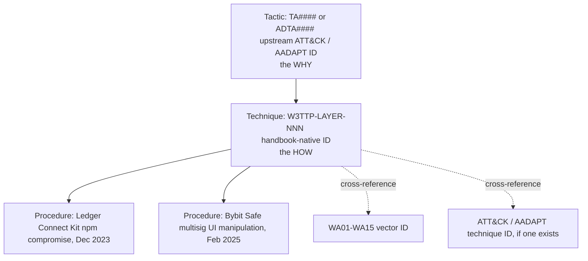
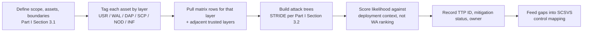
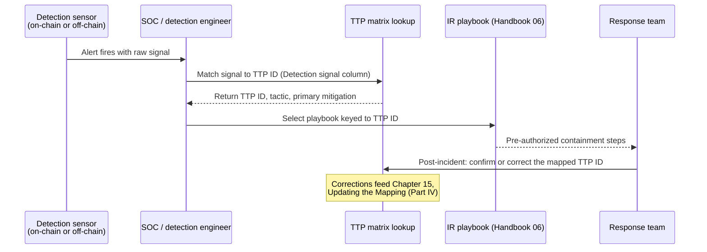
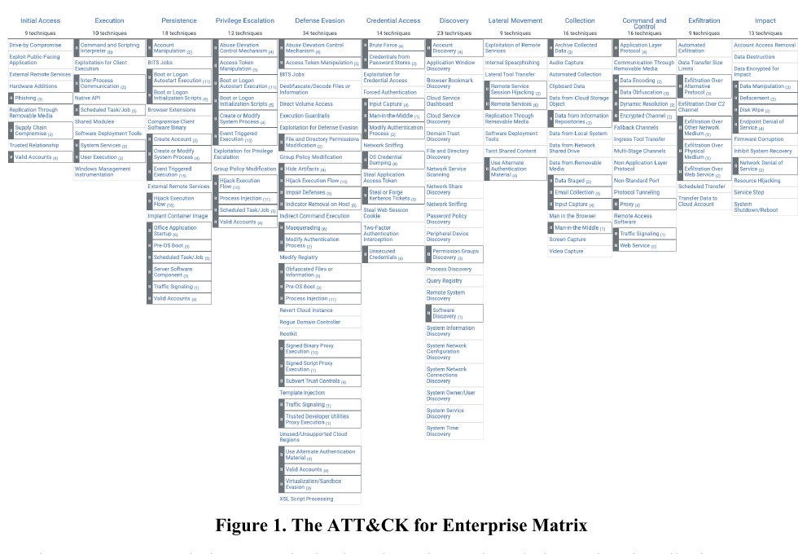
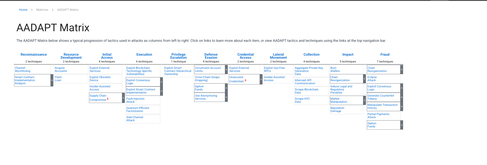

# Part 3: TTP Matrix and Use

[Back to Handbook contents](index.md) | [Series index](../index.md)

Part I fixed the six-layer taxonomy and Part II filled it with a **technique** catalog, layer by layer. This part turns that catalog into a single working matrix: a tactic-technique-procedure (**TTP**) table with a fixed ID scheme, detection signals, and mitigations attached to every row, cross-walked to the OWASP Web3 Attack Vectors Top 15 (WA01 through WA15) and to MITRE's ATT&CK (Adversarial Tactics, Techniques, and Common Knowledge) and AADAPT (Adversarial Actions in Digital Asset Payment Technologies) frameworks. It then shows the matrix in use: as a threat-modeling input and as a detection and incident-response reference.

---

## 10. Tactic-Technique-Procedure Matrix

A **TTP** matrix is only useful if every row answers three questions the same way every time: why the adversary acted (**tactic**), how they did it (technique), and what a specific instance of that technique looked like in practice (procedure). This chapter fixes the structure so Parts II and IV can populate and extend it without drifting into inconsistent naming.

### 10.1 Structure and Naming Conventions

MITRE's own definition anchors the hierarchy: a **tactic** is the adversary's short-term technical goal, a **technique** is the means by which that goal is achieved, and a procedure is the specific implementation an adversary or campaign actually used ([MITRE ATT&CK Design and Philosophy](https://attack.mitre.org/resources/attack-data-and-tools/)). This handbook does not invent a parallel tactic taxonomy. Every tactic ID in the matrix is a real ATT&CK tactic ID (`TA####`) or, where the action is native to value transfer rather than intrusion, a real AADAPT tactic ID (`ADTA####`), covered in full in Section 13.2. Reusing upstream tactic IDs keeps every row queryable against the source frameworks without a translation layer.

Techniques are where a generic enterprise framework runs out of vocabulary. "Approval phishing" and "**multisig** signing-UI manipulation" have no clean ATT&CK equivalent, so this handbook assigns its own technique IDs, scoped to the six layers from Part I, Section 2.1: `W3TTP-<LAYER>-<NNN>`, where `LAYER` is one of `USR` (User and Social), `WAL` (Wallet and Key Management), `DAP` (dApp and Front-End), `SCP` (Smart Contract and Protocol), `NOD` (Node and RPC), or `INF` (Infrastructure), and `NNN` is a zero-padded, never-reused sequence number within that layer. A retired technique keeps its ID and is marked deprecated rather than recycled, matching ATT&CK's own numbering discipline. Procedures are not separately numbered; they are named, cited instances listed under a technique, exactly as ATT&CK lists "**Procedure** Examples" under each technique page.

*Figure 6. The three-level TTP hierarchy used throughout this handbook. Tactic IDs are always borrowed from upstream frameworks; technique IDs are handbook-native and layer-scoped; procedures are named examples, not separately numbered.*

### 10.2 Detection and Mitigation Mapping

A technique row that names an attack without telling a defender what to watch for or what to build is a glossary entry, not a control. Every row in the working matrix carries two additional fields beyond the ID and the tactic: a **detection signal**, phrased as something a log source, monitoring rule, or on-chain watcher can actually emit, and a **primary mitigation**, phrased as a control a team can implement or a product can ship. Detection signals draw from two telemetry classes that this handbook treats as equally first-class: off-chain signals (endpoint detection and response, or EDR; DNS and certificate-transparency logs; SIEM correlation) and on-chain signals (event logs, mempool observation, state-diff simulation). The Incident Response Handbook (06) consumes this column directly as its triage reference, so the phrasing stays operational rather than descriptive: "detect X" rather than "X is dangerous."

The table below is a representative slice of the working matrix, one to three rows per layer, chosen to span the full outline of Part II. The complete matrix (all **technique** IDs, all **procedure** citations) lives in the Part V Appendix B quick-reference table; this slice illustrates the pattern every row follows.

| TTP ID | Layer | Technique | Tactic (source ID) | WA ref. | Detection signal | Primary mitigation |
|---|---|---|---|---|---|---|
| W3TTP-USR-001 | User | Fake interview / meeting-software lure | Initial Access ([TA0001](https://attack.mitre.org/tactics/TA0001/)) | WA05 | Unsigned installer fetched right after a video-call link; traffic to a new meeting-clone domain | Disposable VM for external calls; block unsigned binary execution |
| W3TTP-USR-002 | User | Seed-phrase and credential phishing | Credential Access ([TA0006](https://attack.mitre.org/tactics/TA0006/)) | WA08 | Click-through on look-alike domains; DMARC/DKIM failure reports | Hardware wallet with on-device verification; phishing-resistant WebAuthn |
| W3TTP-USR-003 | User | Pig-butchering / romance-investment grooming | Fraud ([ADTA0001](https://github.com/mitre/AADAPT)) | WA09 | Large transfer to a newly funded counterparty after weeks of staged "profit" withdrawals | Velocity holds on first-time high-value counterparties |
| W3TTP-WAL-001 | Wallet | Multisig signing-UI manipulation | Defense Evasion ([TA0005](https://attack.mitre.org/tactics/TA0005/)) | WA01 | Signer's independent calldata decode does not match the UI's rendered summary | Independent hardware verification of raw calldata before signing |
| W3TTP-WAL-002 | Wallet | Unsecured private-key or seed exposure | Credential Access ([T1552.004](https://attack.mitre.org/techniques/T1552/004/), *Private Keys*) | WA03 | Key file access from an unexpected process; DLP hit on seed-phrase-shaped strings | Hardware security module or air-gapped signer; secret scanning |
| W3TTP-WAL-003 | Wallet | Drainer contract / malicious approval | Fraud (ADTA0001) + Impact ([TA0040](https://attack.mitre.org/tactics/TA0040/)) | WA04 | `Approval`/`ApprovalForAll` to a newly deployed, unverified spender | Pre-sign approval simulation; periodic allowance revocation |
| W3TTP-DAP-001 | dApp | Front-end JS supply-chain compromise | Initial Access ([T1195.002](https://attack.mitre.org/techniques/T1195/002/)) | WA02 | SRI hash mismatch or CSP violation report; new script origin in production | SRI and CSP (Handbook 01); signed, pinned builds |
| W3TTP-DAP-002 | dApp | Deceptive dApp interface / approval phishing | Defense Evasion (TA0005) | WA06 | Rendered DOM diverges from the payload actually signed | Transaction simulation shown pre-sign; wallet-side domain risk scoring |
| W3TTP-DAP-003 | dApp | DNS or domain hijack redirect | Resource Development ([T1584.001](https://attack.mitre.org/techniques/T1584/001/), *Domains*) | WA13 | Unexpected DNS record change; CT-log entry for an unrequested issuer | Registrar lock and DNSSEC (Handbook 02); CAA records |
| W3TTP-SCP-001 | Contract | Oracle price manipulation | Impact (TA0040) | n/a (SCWE-ORACLE) | Spot price deviates from oracle beyond a set band after a large flash-loan trade | TWAP/multi-source oracles; circuit breakers on price-dependent state |
| W3TTP-NOD-001 | Node/RPC | Eclipse attack / RPC manipulation | Collection ([TA0009](https://attack.mitre.org/tactics/TA0009/)) | n/a | Peer-diversity drop; inconsistent state roots across independent RPC providers | Multi-provider RPC quorum; self-hosted fallback node |
| W3TTP-INF-001 | Infrastructure | Insider-assisted access / collusion | Fraud (ADTA0001) + Valid Accounts ([T1078](https://attack.mitre.org/techniques/T1078/)) | WA12 | Privileged action outside normal hours or geography; dual-control bypass | Least privilege with dual control on hot-wallet operations |

### 10.3 Mapping Matrix Rows to WA01–WA15

The WA reference column above only works as a lookup if the mapping runs in both directions. An executive reading the OWASP Web3 Attack Vectors Top 15 as an awareness list needs to find which matrix rows, and therefore which controls, back a given WA vector. A defender who just closed a matrix row after an incident needs to know which awareness-list item to update. This crosswalk table is that bridge, built directly from the layer assignments each vector carries in Part II's chapter structure: a vector that spans two layers (WA06 and WA13 each appear in two Part II chapters) gets a primary and secondary layer rather than a forced single answer.

| WA ID | Vector | Primary layer(s) | Primary TTP ID(s) |
|---|---|---|---|
| WA01 | Multisig Hijacking | Wallet | W3TTP-WAL-001 |
| WA02 | Supply Chain Attacks (npm, PyPI, OSS) | dApp | W3TTP-DAP-001 |
| WA03 | Private Key Compromise | Wallet | W3TTP-WAL-002 |
| WA04 | Drainer Malware and Drainer-as-a-Service | Wallet | W3TTP-WAL-003 |
| WA05 | Fake Interview and Video Call Social Engineering | User | W3TTP-USR-001 |
| WA06 | UI/UX Spoofing and Approval Phishing | Wallet, dApp | W3TTP-WAL-001, W3TTP-DAP-002 |
| WA07 | Centralised Exchange and Web2/2.5 Infrastructure Breaches | Infrastructure | W3TTP-INF-001 |
| WA08 | Phishing and General Social Engineering | User | W3TTP-USR-002 |
| WA09 | Romance, Investment, Impersonation, Recovery, and Pig Butchering Scams | User | W3TTP-USR-003 |
| WA10 | Rug Pulls, Fake Airdrops, and Token Impersonation | dApp | W3TTP-DAP-003 |
| WA11 | Wrench Attacks and Physical Coercion | User | W3TTP-USR-004 |
| WA12 | Insider Threats and Collusive Abuse | Infrastructure | W3TTP-INF-001 |
| WA13 | DNS, Domain, and Routing Infrastructure Hijacking | dApp, Infrastructure | W3TTP-DAP-003 |
| WA14 | Wallet Software, Extension, and App Compromises | Wallet | W3TTP-WAL-004 |
| WA15 | Nation-State Infiltration via Fake Hiring and Malicious OSS Contributions | Infrastructure | W3TTP-INF-001 |

---

## 11. Using the Matrix for Threat Modeling

The matrix earns its place in a threat-modeling session by replacing brainstorming with lookup: instead of asking "what could go wrong here," a modeler asks "which matrix rows apply to this asset's layer," and works from a bounded, cited list.

Start from the scope, asset, and boundary work in Part I, Section 3.1: for each in-scope asset, identify its layer (a hot wallet is `WAL`, a swap front end is `DAP`, an RPC gateway is `NOD`), then pull every matrix row tagged to that layer plus every row on an adjacent layer the asset directly trusts. A custody desk evaluating a new **multisig** signer, for example, pulls all `WAL` rows and the `USR` rows for the humans who operate it, because W3TTP-USR-001 (fake-interview lure) is how an attacker gets malware onto the signer's machine in the first place. From the pulled rows, build attack trees the same way Part I, Section 3.2 applies STRIDE: each row becomes a labeled path from precondition to impact, and the team scores likelihood against known deployment context (does this org use a browser extension wallet in scope for WA14, does it hold funds that make it a target for WA11) rather than against OWASP's own explicit "not ranked" prevalence claim (covered in Section 13.1). The output is a per-asset table of applicable **TTP** IDs, current mitigation status, and an owner, which becomes the input to the SCSVS control-mapping exercise the session closes with.

*Figure 7. The matrix-driven threat-modeling workflow. Every step resolves to a cited matrix row rather than an unstructured guess.*

A worked fragment for a swap front end illustrates the output format: W3TTP-DAP-001 (front-end supply-chain compromise), mitigation status "SRI partially deployed, third-party analytics script unpinned," owner "front-end lead," residual risk "Medium until analytics script is pinned or removed." That single line is simultaneously a threat-model entry, an SCSVS gap, and (Chapter 12) a detection-engineering backlog item, which is the point of keeping one matrix instead of three separate documents.

## 12. Using the Matrix for Detection and IR

A detection team reads the same matrix top to bottom for a different purpose: turning the Detection Signal column into alerting rules and turning the Primary Mitigation column into pre-authorized containment actions, so the first ten minutes of an incident are a lookup, not a debate.

Prioritize instrumentation by **tactic** stage. Early-stage tactics such as Reconnaissance (`TA0043`) and Resource Development (`TA0042`, which covers domain and infrastructure staging for WA13-class attacks) generate cheap, high-volume signals: a newly registered look-alike domain, a certificate-transparency entry, a GitHub fork of a wallet-connector repo. These are individually low-confidence but valuable as an early-warning feed when correlated against brand and dependency inventories. Late-stage tactics such as Impact (`TA0040`) and AADAPT's Fraud (`ADTA0001`) generate expensive, high-confidence signals (a drained wallet, a manipulated oracle price), but by the time they fire the containment window has mostly closed. A mature program instruments both ends: cheap early signals to buy response time, and expensive late signals as the backstop. Every alert a SOC builds should carry the **TTP** ID that triggered it, so triage staff jump directly to that row's mitigation column and the matching playbook in the Incident Response Handbook (06) instead of reasoning from scratch under time pressure.

*Figure 8. Matrix-driven detection and incident response. The TTP ID is the join key between the alert, the playbook, and the post-incident update.*

A short triage checklist operationalizes the diagram: confirm the alert against the matrix row's stated detection signal before escalating (rules out signal drift); pull the mapped mitigation column as the first containment candidate rather than improvising; page the asset owner recorded during the Chapter 11 threat-modeling pass, since that person already has context on the asset's residual risk; and log whether the live incident matched the mapped TTP ID exactly or revealed a gap, feeding Part IV, Chapter 15's update process.

---

## 13. Alignment with OWASP Web3 Attack Vectors Top 15 and MITRE

The matrix is only as credible as the frameworks it cites. This chapter documents exactly what each upstream source claims for itself, so the crosswalk tables above are read with the right caveats attached rather than treated as more authoritative than their sources intend.

### 13.1 Top 15 (WA01–WA15) as Awareness and Checklist

The canonical [OWASP Web3 Attack Vectors Top 15](https://scs.owasp.org/sctop10/Web3-Attack-Vectors-Top15/) is explicit about its own status: it complements the OWASP Smart Contract Top 10:2026 by covering non-smart-contract vectors, and the list is **not ranked** by loss volume, incident frequency, or severity. "Ordering does not imply relative severity or prevalence," the page states, and adds that ranking methodology, data sources, and update cycles are still being established. Treat WA01 through WA15 as a checklist of vectors a Web3 organization must be able to say something about, not as a priority-ordered backlog. This distinction matters operationally: a team that reads WA01 (listed first) as "the most important attack" and under-resources WA15 (listed last, nation-state infiltration) because of list position has misread the document.

Used correctly, the Top 15 is a coverage checklist run at the organization level, independent of any single asset's **threat model**. The table below is that checklist in template form: an organization fills the last two columns during a quarterly review, and a blank cell in "Control owner" is itself a finding.

| WA ID | Vector | Assessed this cycle? | Control owner |
|---|---|---|---|
| WA01 | Multisig Hijacking | | |
| WA02 | Supply Chain Attacks (npm, PyPI, OSS) | | |
| WA03 | Private Key Compromise | | |
| WA04 | Drainer Malware and Drainer-as-a-Service | | |
| WA05 | Fake Interview and Video Call Social Engineering | | |
| WA06 | UI/UX Spoofing and Approval Phishing | | |
| WA07 | Centralised Exchange and Web2/2.5 Infrastructure Breaches | | |
| WA08 | Phishing and General Social Engineering | | |
| WA09 | Romance, Investment, Impersonation, Recovery, and Pig Butchering Scams | | |
| WA10 | Rug Pulls, Fake Airdrops, and Token Impersonation | | |
| WA11 | Wrench Attacks and Physical Coercion | | |
| WA12 | Insider Threats and Collusive Abuse | | |
| WA13 | DNS, Domain, and Routing Infrastructure Hijacking | | |
| WA14 | Wallet Software, Extension, and App Compromises | | |
| WA15 | Nation-State Infiltration via Fake Hiring and Malicious OSS Contributions | | |

### 13.2 Cross-Mapping to MITRE ATT&CK and AADAPT

The Top 15 names vectors; it does not define reusable **tactic** and **technique** identifiers, procedure catalogs, or a versioned data model. MITRE's ATT&CK and AADAPT frameworks supply exactly that, and the matrix in Chapter 10 borrows their IDs rather than duplicating their content. The two frameworks divide the space differently and the split matters for how you cite them: ATT&CK covers the intrusion lifecycle common to any networked system, while AADAPT covers the actions specific to moving, minting, burning, and laundering value on a ledger, actions that have no equivalent in a conventional enterprise kill chain.

#### 13.2.1 MITRE ATT&CK (Enterprise, etc.)

[MITRE ATT&CK](https://attack.mitre.org/) publishes three matrix domains: Enterprise (IT networks and cloud), Mobile (device-resident threats), and ICS (industrial control systems). This handbook draws almost entirely from Enterprise, whose current **tactic** set runs 14 tactics from [Reconnaissance (TA0043)](https://attack.mitre.org/tactics/TA0043/) through [Impact (TA0040)](https://attack.mitre.org/tactics/TA0040/), and occasionally from Mobile for wallet-app-specific vectors under WA14, since a mobile wallet app compromise fits Mobile's device-permission model better than Enterprise's network model. Each ATT&CK **technique** carries a stable `T####` ID, and where a technique has meaningfully distinct sub-variants, a dotted sub-technique ID such as `T1566.002` (Spearphishing Link, a sub-technique of [T1566 Phishing](https://attack.mitre.org/techniques/T1566/)). [T1195 Supply Chain Compromise](https://attack.mitre.org/techniques/T1195/) and its sub-technique [T1195.002 Compromise Software Supply Chain](https://attack.mitre.org/techniques/T1195/002/) are the technique pair behind every WA02 and WA13 matrix row in Chapter 10; [T1584 Compromise Infrastructure](https://attack.mitre.org/techniques/T1584/) and its Domains and Web Services sub-techniques back the DNS and hosting rows.

*Figure. ATT&CK's Enterprise matrix is a behavioral coverage map, not a chronological checklist: a campaign may enter at several tactics, repeat techniques, or skip columns. Use it to identify detection and control gaps around Web3 infrastructure, then use AADAPT for ledger-native behaviors the Enterprise matrix does not name. Source: [MITRE ATT&CK Design and Philosophy](https://attack.mitre.org/docs/ATTACK_Design_and_Philosophy_March_2020.pdf), © MITRE; approved for public release and unlimited distribution.*

| Web3 TTP ID | ATT&CK ID | ATT&CK name | Why it applies |
|---|---|---|---|
| W3TTP-USR-002 | [T1566](https://attack.mitre.org/techniques/T1566/) | Phishing | Seed-phrase and credential harvesting through crafted messages |
| W3TTP-DAP-001 | [T1195.002](https://attack.mitre.org/techniques/T1195/002/) | Compromise Software Supply Chain | JS package or CDN artifact tampering before it reaches a browser |
| W3TTP-DAP-003 | [T1584.001](https://attack.mitre.org/techniques/T1584/001/) | Domains | Staging or hijacking a domain used for a phishing redirect |
| W3TTP-WAL-002 | [T1552.004](https://attack.mitre.org/techniques/T1552/004/) | Unsecured Credentials: Private Keys | Seed phrase or key material found in plaintext storage |
| W3TTP-INF-001 | [T1078](https://attack.mitre.org/techniques/T1078/) | Valid Accounts | Insider or ex-employee credential reused for unauthorized privileged access |

#### 13.2.2 MITRE AADAPT Tactics and Techniques for Digital Assets

AADAPT (Adversarial Actions in Digital Asset Payment Technologies) is MITRE's ATT&CK-style knowledge base scoped to digital-asset systems, published openly on [GitHub](https://github.com/mitre/AADAPT) and described on the [project site](https://aadapt.mitre.org/) as complementary to ATT&CK, not a replacement for it. The version examined here (`AADAPT.yaml`, version 4.4.0, retrieved 10 August 2026) defines 11 tactics: 10 reuse ATT&CK Enterprise **tactic** IDs verbatim (Reconnaissance, Resource Development, Initial Access, Execution, Privilege Escalation, Defense Evasion, Credential Access, Lateral Movement, Collection, Impact), and one, `ADTA0001` **Fraud**, is new: "the adversary is trying to illicitly create, acquire, or utilize value-form," a goal ATT&CK's intrusion-centric model has no category for. Underneath sit 66 techniques, most native to blockchain mechanics: Oracle Manipulation (`ADT3012.004`), Reentrancy (`ADT3012.005`), Flash Loan (`ADT3015`), Signature Replay Attack (`ADT3012.006`), Chain Reorganization (`ADT3003`), and Eclipse Attack (`ADT3006`), alongside laundering typologies such as Money Mules (`ADT3028.004`), Peel Chains, CoinJoin, and Tumblers that give the `INF` and `WAL` layers a shared post-theft vocabulary.

*Figure. The AADAPT matrix extends ATT&CK's behavior-first structure into digital-asset payment technology, making contract exploitation, consensus abuse, key compromise, fund movement, and laundering visible in one coverage map. Source: [MITRE AADAPT Matrix](https://aadapt.mitre.org/matrices/AADAPT/), © 2025 MITRE, approved for public release and unlimited distribution (case 25-1204); reproduced for research and education under the [AADAPT terms](https://aadapt.mitre.org/resources/terms/).*

One entry is worth flagging because it shows the two frameworks converging rather than staying permanently parallel: AADAPT's `ADT1552.004` **Private Keys** **technique** carries an explicit `ATT&CK-reference` pointing at [T1552/004](https://attack.mitre.org/techniques/T1552/004/), meaning it was contributed upstream and now exists as a registered ATT&CK Enterprise sub-technique, not merely a cross-reference. Most other AADAPT techniques remain AADAPT-native (`ADT####` with no upstream mirror), so check both catalogs rather than assuming AADAPT is a strict subset.

| AADAPT ID | Name | Tactic | Web3 TTP ID | WA ref. |
|---|---|---|---|---|
| ADT3012.004 | Oracle Manipulation | Impact (TA0040) | W3TTP-SCP-001 | n/a (SCWE-ORACLE) |
| ADT3015 | Flash Loan | Impact (TA0040) | W3TTP-SCP-001 | n/a (SCWE-ORACLE) |
| ADT3006 | Eclipse Attack | Collection (TA0009) | W3TTP-NOD-001 | n/a |
| ADT3020.001 | Address Poisoning | Fraud (ADTA0001) | W3TTP-DAP-002 | WA06 |
| ADT3028.004 | Money Mules | Fraud (ADTA0001) | W3TTP-INF-001 | WA12 |
| ADT1552.004 | Private Keys | Credential Access (TA0006 / [T1552.004](https://attack.mitre.org/techniques/T1552/004/)) | W3TTP-WAL-002 | WA03 |

### 13.3 Web3-Specific Extensions and Community Mappings

Neither ATT&CK nor AADAPT was written to describe a spoofed wallet-connect button or a cloned airdrop-claim page in detail, because both frameworks work at the level of intrusion and value-transfer mechanics, not front-end deception. That gap is why a community layer of Web3-specific mappings exists alongside the two MITRE frameworks, and why this handbook treats them as first-class sources rather than footnotes.

The OWASP Web3 Attack Vectors Top 15 itself is the primary community mapping this handbook builds on, and its methodology is openly still forming, per Section 13.1's caveat. [Security Alliance (SEAL)](https://www.securityalliance.org/), a non-profit crypto-native security coordination body, runs [SEAL 911](https://www.securityalliance.org/our-work/seal-911), a free around-the-clock hotline connecting anyone facing an active incident to a vetted responder pool, and a companion information-sharing network under the [SEAL-ISAC banner](https://www.businesswire.com/news/home/20240417493276/en/Security-Alliance-SEAL-Launches-Free-Crypto-Native-ISAC/); both feed real **procedure** examples into community catalogs faster than any single vendor's incident log could. [DeFiHackLabs](https://github.com/SunWeb3Sec/DeFiHackLabs) maintains a large, growing public repository of DeFi incidents reproduced as executable Foundry proof-of-concept tests, giving the `SCP` layer a runnable procedure source rather than prose description alone. For the on-chain leaf specifically, the [Smart Contract Security Weakness Enumeration (SCWE)](https://scs.owasp.org/SCWE/) supplies 156 weakness entries across 11 categories aligned to SCSVS sections, which is what the `n/a (SCWE-ORACLE)` references above point back to.

Community-sourced **technique** candidates do not enter the matrix automatically. Part IV, Chapter 15 defines the review and versioning process that promotes a candidate from "observed in the wild, documented by SEAL or DeFiHackLabs" to "assigned a `W3TTP-<LAYER>-<NNN>` ID with a detection and mitigation pair," keeping the matrix a curated reference rather than an unfiltered aggregation feed.

---

**Key controls for Part 3**

- Every matrix row carries a **tactic** ID borrowed from ATT&CK or AADAPT, a handbook-native `W3TTP-<LAYER>-<NNN>` technique ID, at least one cited procedure, a detection signal, and a primary mitigation.
- **Keep the WA01-WA15 crosswalk bidirectional:** every matrix row maps to a WA vector where one exists, and every WA vector resolves to at least one matrix row.
- Cite ATT&CK and AADAPT IDs directly rather than re-deriving technique descriptions; check both catalogs, since only a minority of AADAPT techniques (for example `ADT1552.004`) are formally merged into ATT&CK.
- Treat the OWASP Web3 Attack Vectors Top 15 as an unranked coverage checklist, never as a priority-ordered backlog.
- Route detection-signal and mitigation columns into the **Incident Response** Handbook (06) playbooks so triage resolves to a lookup, not a fresh investigation.
- Feed post-incident **TTP** corrections and community-sourced technique candidates through the Part IV, Chapter 15 update process rather than editing the matrix ad hoc.

