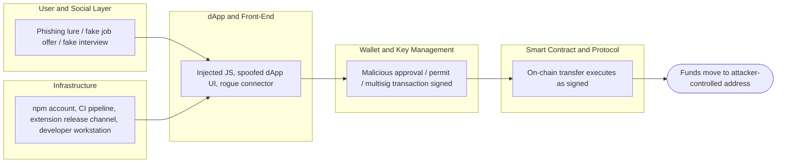
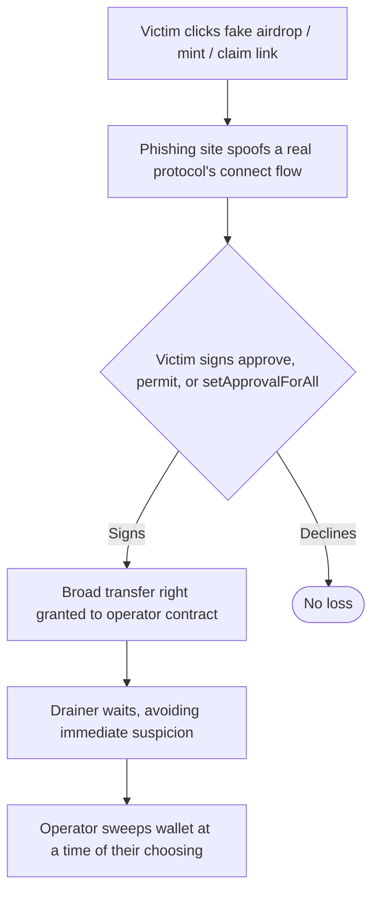

# Part 4: Case Studies and Examples

[Back to Handbook contents](index.md) | [Series index](../index.md)

Every control catalogued in Parts II and III exists because a real attacker used a real **technique** against a real system. This part tests the six-layer mapping against five incidents that together touch every layer in the taxonomy, from a $1.5 billion **multisig** and infrastructure compromise down to a single trojanized browser-extension update. It closes by treating the mapping itself as a maintained artifact: how the community proposes new techniques, and how this handbook stays synchronized with the OWASP Web3 Attack Vectors Top 15, the Smart Contract (SC) Top 10, and the Smart Contract Weakness Enumeration (SCWE) as each evolves on its own schedule.

---

## 14. End-to-End Attack Scenarios

A model that treats an incident as either "a contract bug" or "a user mistake" undercounts how these attacks actually unfold. The five case studies below each start in one layer, pivot through one or two more, and land their impact in a different layer again, which is the pattern a **threat model** needs to anticipate rather than the exception it needs to excuse.

### 14.1 Multi-Layer Scenarios (Including Top 15 Case Studies)

An attacker rarely needs to break the layer that holds the money. It is usually cheaper to break a layer that the money-holding layer implicitly trusts, then let that trust carry the attack the rest of the way. A cold-storage **multisig** trusts the software that renders its transactions. A dApp trusts the npm package it imported for wallet connection. A browser extension trusts its own auto-update channel. A hiring pipeline trusts a resume and a video call. In every case in this chapter, the layer that was actually broken is not the layer where the loss was recorded.



*Figure 6. The recurring multi-layer pattern: the layer an attacker compromises (User/Social or Infrastructure) is rarely the layer where the theft is recorded (Wallet and Smart Contract). Node and RPC involvement varies by incident and is omitted here for clarity.*

The table below previews how each case study in Section 14.2.1 maps onto this pattern, naming the layer where the attacker actually gained a foothold versus the layer where the loss became visible, and the OWASP Web3 Attack Vectors Top 15 (WA) identifiers each incident is filed under.

| Incident | Foothold layer | Pivot layer | Loss recorded at | WA ID(s) |
|----------|----------------|-------------|-------------------|----------|
| Bybit | Infrastructure (Safe developer workstation) | dApp and Front-End (injected JS in signing UI) | Wallet and Key Management (multisig execution) | WA01, WA07 |
| Ledger Connect Kit | Infrastructure (phished npm account) | dApp and Front-End (poisoned connector library) | Wallet and Key Management (rerouted approval) | WA02 |
| Drainers / approval phishing | User and Social Layer (phishing lure) | dApp and Front-End (spoofed claim/mint site) | Wallet and Key Management (signed approval or permit) | WA04, WA06 |
| Trust Wallet extension | Infrastructure (extension release pipeline) | Wallet and Key Management (the wallet software itself) | User and Social Layer (seed phrase exfiltrated) | WA14 |
| DPRK TraderTraitor | User and Social Layer (fake hiring, fake interview) | Infrastructure (insider or CI access) | Varies by operation; feeds forward into incidents like Bybit | WA15 |

Reading down the "foothold" and "loss recorded at" columns side by side is the exercise this handbook exists to support: a defense concentrated only on the layer where money sits will miss every one of these five attacks.

### 14.2 Reference to Public Incidents and RCAs

A mapping that is not anchored to public root cause analyses (RCAs) drifts into abstraction and stops being testable. **MITRE ATT&CK** earns its authority the same way: every **technique** traces to observed intrusions, not hypothesized ones ([MITRE ATT&CK](https://attack.mitre.org/)). The five incidents below were chosen because each has a citable, technically detailed public account from the affected party, a blockchain intelligence firm, or a federal agency, and because together they exercise five different WA identifiers without overlapping mechanism. Read each case study as a worked example of Section 11's threat-modeling method: identify the layer that actually failed, then check whether your own environment has the equivalent control gap.

#### 14.2.1 Five named incidents across the Top 15

##### Bybit: a $1.5 billion multisig and infrastructure compromise (WA01, WA07)

On February 21, 2025, the cryptocurrency exchange Bybit lost approximately 401,000 ETH, worth close to $1.5 billion at the time, in what blockchain intelligence firm Chainalysis called the largest digital asset theft on record ([Chainalysis](https://www.chainalysis.com/blog/bybit-exchange-hack-february-2025-crypto-security-dprk/)). The theft did not exploit Bybit's own systems. The investigation traced the root cause to a compromised developer workstation at Safe{Wallet}, the third-party **multisig** infrastructure Bybit used to manage its cold wallet ([Sygnia](https://www.sygnia.co/blog/sygnia-investigation-bybit-hack/)). The attacker used that access to insert malicious JavaScript into the Safe front end, so that when Bybit's approvers reviewed what looked like a routine cold-to-hot wallet transfer, the interface displayed a benign summary while the transaction actually being signed reassigned control of the wallet. Because Safe's security model assumes signers review what they sign, corrupting that one shared surface defeated the multisig threshold without touching a single **private key**. This is a compound of WA01 (Multisig Hijacking) at the point of execution and WA07 (Centralised Exchange & Web2/2.5 Infrastructure Breaches) at the point of entry, since Safe's web application is Web2.5 infrastructure the exchange depended on without directly controlling.

| Field | Detail |
|-------|--------|
| Date | February 21, 2025 |
| Loss | ~401,000 ETH, ~$1.5B |
| Attribution | Lazarus Group / TraderTraitor (FBI) |
| Entry point | Compromised Safe developer workstation |
| Mechanism | Malicious JS altered signed transaction while UI showed a normal transfer |

The FBI's public service announcement of February 26, 2025 formally attributed the theft to North Korea's "TraderTraitor" actors and published 51 Ethereum addresses tied to the stolen funds for industry-wide blocking ([FBI IC3 PSA 250226](https://www.ic3.gov/PSA/2025/PSA250226)). Bybit replenished its reserves within 72 hours through bridge financing from Galaxy Digital, FalconX, and Wintermute, so no customer suffered a loss, but the incident remains the reference case for why a signing interface is itself part of the **attack surface**.

**Detection signals**: raw calldata that does not match the UI-rendered transaction summary; unscheduled or off-hours multisig approval requests; unexpected `delegatecall` or ownership-changing targets in a routine transfer; integrity-hash drift on the signing front end's served JavaScript.

**Mitigations**: verify transaction calldata on an independent, air-gapped device rather than trusting the browser-rendered summary; run an independent transaction simulator (a second implementation, not the same vendor's UI) before any signer approves a high-value transfer; apply the front-end supply chain controls from the CDN and Front-End Supply Chain Security Handbook (01), including Subresource Integrity (SRI) on the signing application itself, to any third-party multisig UI; segregate developer workstations with production deploy access from general-purpose browsing and email.

##### Ledger Connect Kit: a poisoned wallet-connector library (WA02)

On December 14, 2023, an attacker who had phished a former Ledger employee's npm account published three malicious versions (1.1.5 through 1.1.7) of `@ledgerhq/connect-kit`, a JavaScript library dozens of decentralized applications (dApps) embed to let users connect a wallet ([Ledger](https://www.ledger.com/blog/a-letter-from-ledger-chairman-ceo-pascal-gauthier-regarding-ledger-connect-kit-exploit)). The tampered package substituted a rogue WalletConnect project that silently rerouted approved transactions to an attacker-controlled address. Ledger's own hardware and Ledger Live were untouched; every affected user was a customer of some other dApp that had added Connect Kit as a dependency, often years earlier, and never re-verified it. The malicious code was live for roughly five hours, with an actual drain window under two hours before a fix shipped, and The Block reported roughly $600,000 drained across affected dApps before the package was pulled from the registry.

This is the code-level supply chain failure mode covered in depth by the CDN and Front-End Supply Chain Security Handbook (01): a single compromised publisher credential propagated instantly to every project that resolved the package's version range, with no re-verification step in between. It is WA02 (Supply Chain Attacks) in its purest form, because the vulnerability was never in any dApp's own code.

**Detection signals**: an npm package publishing an unexpected new version outside its normal release cadence; a wallet-connection library requesting a different WalletConnect project ID than the one a dApp registered; sudden anomalous outbound approval destinations across multiple, otherwise unrelated dApps within the same short window.

**Mitigations**: pin exact dependency versions and hashes rather than floating ranges; apply Subresource Integrity to any CDN-served bundle of a wallet connector; require hardware-backed multi-factor authentication and short-lived, scoped tokens for every account with publish rights to a package used this widely; monitor Sigstore's Rekor transparency log or an equivalent for unexpected signing events tied to your own dependencies ([Sigstore](https://docs.sigstore.dev/cosign/signing/overview/)).

##### Drainers and approval phishing at scale (WA04, WA06)

Drainer-as-a-service (DaaS) turned wallet theft into a rentable product. A kit such as Inferno Drainer, which Group-IB tracked across more than 16,000 phishing domains impersonating over 100 legitimate brands, gave low-skill affiliates a ready-made phishing site that spoofed the connection flow of popular protocols including Seaport, WalletConnect, and Coinbase Wallet, then split the proceeds roughly 80/20 in the affiliate's favor ([Group-IB](https://www.group-ib.com/blog/inferno-drainer/)). Group-IB estimated at least $80 million stolen through the kit before its operators announced a shutdown in November 2023, though the panel remained reachable months later, a reminder that a brand takedown does not remove the underlying infrastructure.

The technical hook in nearly every drainer campaign is the same regardless of kit: get a victim to sign an ERC-20 `approve` or EIP-2612 `permit` call, or an ERC-721/1155 `setApprovalForAll`, that grants an operator contract unlimited or broad transfer rights, then sweep the wallet on the drainer operator's own schedule rather than at signing time ([Chainalysis](https://www.chainalysis.com/blog/crypto-drainers/)). Because the malicious grant and the theft are separated in time, a victim frequently has no reason to suspect the wallet they connected weeks ago to claim a fake airdrop is the one now being drained. Industry tracker Scam Sniffer reported that aggregate phishing losses fell 83%, from roughly $494 million in 2024 to about $84 million in 2025, crediting wider adoption of wallet-side **transaction simulation** and community blocklists for the decline, even as the underlying kits remained active ([Scam Sniffer](https://scamsniffer.io/)).



*Figure 7. The approval-phishing kill chain. The delay between grant (P) and sweep (D) is what makes this pattern harder to notice than a same-block theft.*

**Detection signals**: a wallet transaction requesting `approve` with `type(uint256).max` or `setApprovalForAll(operator, true)` to a contract with no prior reputation; a connection request whose domain does not match the protocol it visually impersonates; a sudden multi-asset outbound transfer with no preceding user-initiated action.

**Mitigations**: use wallets with transaction simulation that flags unlimited approvals before signing; grant time-boxed or amount-limited allowances instead of unlimited ones where the interface supports it; periodically audit and revoke stale approvals with a tool such as the Etherscan Token Approval Checker or Revoke.cash; block known drainer infrastructure using community-maintained domain and contract blocklists; treat any unsolicited "claim your airdrop" prompt as a WA06 (UI/UX Spoofing & Approval Phishing) scenario by default.

##### Trust Wallet browser extension: a compromised official update (WA14)

On December 24, 2025, a compromised build of Trust Wallet's Chrome extension, version 2.68.0, was distributed through the official Chrome Web Store, so users who installed or auto-updated received it as a routine, trusted release. Security researchers found the malicious behavior hidden inside a bundled file, `4482.js`, disguised as analytics code; it triggered when a user imported a **seed phrase** and exfiltrated wallet data to an external domain, `metrics-trustwallet[.]com` ([BleepingComputer](https://www.bleepingcomputer.com/news/security/trust-wallet-confirms-extension-hack-led-to-7-million-crypto-theft/)). Binance founder Changpeng Zhao confirmed roughly $7 million in affected funds and committed to covering the loss. Trust Wallet shipped a patched version, 2.69, the following day and urged every user on 2.68.0 to update immediately.

This incident is the wallet-software mirror of the Ledger Connect Kit case: rather than a dApp trusting a poisoned dependency, here the wallet itself was the poisoned artifact, delivered through the one channel (the official extension store) users have no practical way to route around. A second wave of harm followed the first: opportunistic phishing sites, including one at `fix-trustwallet[.]com`, capitalized on user panic by directly soliciting seed phrases under the guise of a fix, layering WA08 (Phishing & General **Social Engineering**) on top of the original WA14 event.

**Detection signals**: an extension auto-updating to a version number not announced in the vendor's own release notes; new, previously unseen outbound network destinations appearing immediately after an extension update; a spike in seed-phrase-import events correlated with a specific extension version in telemetry.

**Mitigations**: publish and independently verify **reproducible build** hashes for every extension release so a compromised build artifact is externally detectable before mass distribution; minimize the extension's requested host permissions so it cannot reach arbitrary domains even if compromised; keep high-value holdings on a hardware wallet whose seed material never touches software that receives remote updates; monitor vendor security advisories and be prepared to force-disable a specific extension version fleet-wide when operating a managed browser environment.

##### DPRK TraderTraitor: nation-state access through fake hiring (WA15)

TraderTraitor is the name the US Cybersecurity and Infrastructure Security Agency (CISA), the FBI, and the Treasury Department gave in a April 2022 joint advisory to a persistent North Korean campaign that distributes trojanized cryptocurrency trading and exchange applications, built by fake companies with polished websites and social media presence, to gain initial access into blockchain and fintech firms ([CISA AA22-108A](https://www.cisa.gov/news-events/cybersecurity-advisories/aa22-108a)). The same actor cluster is the one the FBI's 2025 advisory named in connection with the Bybit theft covered above, which is why this case belongs in the mapping as its own entry: Bybit describes what was broken, TraderTraitor describes the actor and access pattern that keeps recurring across many different victims.

A parallel, increasingly prominent branch of the same threat is the DPRK IT worker fraud scheme: thousands of North Korean nationals, using stolen or fabricated Western identities and sometimes facilitated by "laptop farms" run by co-conspirators inside the target country, obtain legitimate remote developer roles at crypto and technology companies. Salary is funneled back to the regime, and the resulting insider access has in multiple documented cases been leveraged for further compromise or extortion after termination. The US Department of Justice has brought multiple indictments against facilitators of this scheme since 2024. A related pattern targets developers directly: fake job interviews or coding-test repositories that, once cloned and run, execute malware on the candidate's own machine, a **technique** tracked under names including Contagious Interview.

**Detection signals**: inconsistent video-interview behavior or documentation for a remote hire; salary payments requested to money-mule or frequently-changed accounts; unsolicited take-home coding exercises that require running an unreviewed `npm install` or arbitrary setup script; new open-source contributor accounts adding obfuscated or unexplained dependencies; command-and-control (C2)-pattern outbound traffic from a developer laptop or a CI runner shortly after onboarding.

**Mitigations**: strengthen **identity verification** for remote technical hires beyond a resume and a single video call; sandbox and network-isolate any take-home interview exercise before execution; apply dependency review and software bill of materials (SBOM) checks to contributions from new or unverified accounts; revoke access and credentials immediately and completely at offboarding; cross-reference outbound crypto addresses against Treasury's Office of Foreign Assets Control (OFAC) sanctioned-address lists. This is precisely where the Employee Lifecycle Security Handbook (03) and the Hiring, Remote Work, and Insider Threat Handbook (05) take over from this one: those handbooks carry the HR-side controls that TraderTraitor's fake-hiring branch is designed to defeat.

---

## 15. Updating the Mapping

A **TTP** catalog that stops changing after publication stops describing the threat within a year. This chapter sets out how the mapping keeps pace: who can propose a change, how a version is cut, and how this handbook stays aligned with the three upstream OWASP artifacts it depends on.

### 15.1 Community Contribution and Versioning

The OWASP Smart Contract Security (SCS) project already runs a working contribution pipeline for its Top 10 and testing guide repositories: an idea starts as a GitHub Discussion, promising ideas are promoted to a formal issue, and a pull request (PR) against approved content is reviewed by the core team before merging, all published under a CC-BY-4.0 license ([OWASP SCS contributing](https://scs.owasp.org/contributing/)). This handbook's **TTP** mapping should use that same channel rather than a separate process.

For versioning cadence, **MITRE ATT&CK** is the closest working precedent at this handbook's scale: it ships on a semi-annual schedule, alternating roughly between April and October, using a major.minor scheme where a major version increment adds or restructures techniques and a minor increment carries corrections that do not change **technique** scope (ATT&CK reached v19.2 in April 2026 under this pattern) ([MITRE ATT&CK versions](https://attack.mitre.org/resources/versions/)). This handbook adopts the same discipline for its own layer catalog and TTP matrix: a major revision when a layer gains, loses, or restructures a technique family or when an upstream WA identifier is renumbered; a minor revision for new case studies, citation refreshes, or wording fixes that leave the taxonomy unchanged.

A contribution proposing a new technique or case study should arrive as a PR containing, at minimum, the fields below, matching the finding structure used throughout Part II so a reviewer can merge it without reformatting:

```markdown
## Proposed addition

- **Layer**: [User/Social | Wallet | dApp/Front-End | Smart Contract/Protocol | Node/RPC | Infrastructure]
- **WA ID(s)**: [e.g. WA04, WA06]
- **Technique summary**: [1-3 sentences, methodology not just outcome]
- **Public evidence**: [link to an RCA, advisory, or post-mortem; no evidence, no merge]
- **Detection signal(s)**: [concrete, observable]
- **Mitigation(s)**: [concrete, actionable]
```

Reject any submission that lacks a cited, public source. This is the same anti-anecdote discipline **MITRE ATT&CK** enforces to keep the framework technique-grounded rather than speculative, and it is what keeps this handbook's case studies auditable rather than aspirational.

### 15.2 Integration with Web3 Attack Vectors Top 15, SC Top 10, and SCWE Updates

This handbook does not own the three catalogs it references; it tracks them. The Web3 Attack Vectors Top 15 supplies the WA identifiers used throughout Part IV. The SC Top 10 catalogs on-chain logic risk and is itself forward-looking: the 2026 edition already draws on 2025 incident data, citing roughly $905.4 million in losses across 122 deduplicated protocols to forecast the coming year's most significant risks ([OWASP SC Top 10](https://scs.owasp.org/sctop10/)). The SCWE enumerates specific on-chain weaknesses across eleven SCSVS-aligned domains, numbered SCWE-001 upward, explicitly positioned as a blockchain-focused complement to the Common Weakness Enumeration (CWE) rather than a replacement for it ([OWASP SCWE](https://scs.owasp.org/SCWE/)). Because these three artifacts version independently of each other and of this handbook, a change in any one can silently invalidate a cross-reference in Chapter 7's contract-layer mapping or in the WA-ID columns used across this part.

The table below defines the trigger that should prompt a review of this handbook when each upstream artifact moves, and which chapter owns the resulting update.

| Upstream artifact | Typical cadence | Update trigger for this handbook | Owning chapter |
|--------------------|-----------------|-----------------------------------|-----------------|
| Web3 Attack Vectors Top 15 | Irregular, OWASP SCS release cycle | Any WA ID added, renumbered, or retired | Chapters 2, 13, and every WA reference in Part IV |
| SC Top 10 | Annual (forward-looking edition) | New or reordered SC entries affecting contract-layer techniques | Chapter 7 (Part II) |
| SCWE | Rolling, tied to SCSVS domains | New SCWE-### entries within an SCSVS domain this handbook already maps | Appendix D (Part V) |
| MITRE ATT&CK / AADAPT | Semi-annual (ATT&CK); rolling (AADAPT) | New tactic or technique with a plausible Web3 analogue not yet represented | Part II technique catalog |

Treat this table as a recurring calendar item, not a one-time reconciliation. A practical cadence is to check the SC Top 10 and Web3 Attack Vectors Top 15 for changes each time either publishes, and to run a lighter SCWE and AADAPT diff on the same semi-annual rhythm this handbook uses for its own version bumps. Because MITRE AADAPT (Adversary Actions in Digital Asset Payment Technologies) extends the ATT&CK methodology specifically to digital-asset and blockchain payment threats, a new AADAPT **technique** is often the first external signal that a Web3-specific attack pattern deserves its own entry in Part II before it shows up as a named incident in this part ([MITRE AADAPT](https://aadapt.mitre.org/)).

---

**Key controls for Part 4**

- Verify what a signing interface displays against the raw calldata it actually submits, on hardware or an independent simulator, before approving any high-value **multisig** transaction.
- Pin dependency and extension versions with hashes, and monitor a transparency log such as Rekor for unexpected signing events on packages you depend on.
- Default to time-boxed or limited-value token approvals, and audit and revoke standing approvals on a recurring schedule.
- Verify **reproducible build** hashes for wallet software and browser extensions before trusting an auto-update.
- Treat unsolicited remote-hire pipelines and take-home coding exercises as an **attack surface**, and sandbox anything a candidate asks you to run.
- Review this handbook's WA-ID and SCWE cross-references every time the Web3 Attack Vectors Top 15, SC Top 10, or SCWE publishes a new version.
