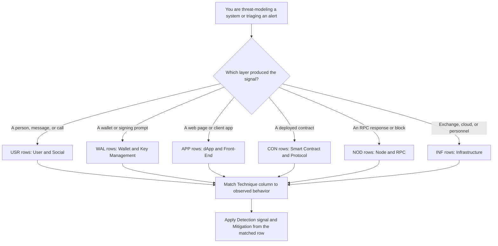
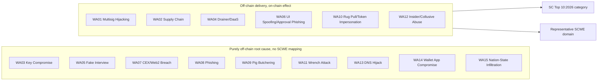

# Part 5: Appendices

[Back to Handbook contents](index.md) | [Series index](../index.md)

This part collects the reference material the rest of the handbook assumes you already have to hand. Appendix A fixes the vocabulary so a term like *drainer-as-a-service* means the same thing in Chapter 5 as it does in Chapter 14. Appendix B condenses the six layer chapters of Part II into one scannable table. Appendices C and D turn the two external references this handbook is built on, the OWASP Web3 Attack Vectors Top 15 and the Smart Contract Weakness Enumeration (SCWE), into quick lookups, and Appendix E points to the full bibliography.

---

## 16. Appendix A: Glossary

Entries group by the part of the stack where the term does the most work, not strict alphabetical order: a reader triaging a wallet-drain report and a reader mapping a contract finding to SCWE reach for different clusters of vocabulary. Within each group, entries run alphabetically, acronyms expand on first appearance, and each entry names the chapter with the fuller treatment.

### 16.1 Frameworks, Standards, and Modeling Terms

These terms describe the reference frameworks this handbook maps every **technique** onto, introduced in Chapter 1.

- **MITRE AADAPT (Adversarial Actions in Digital Asset Payment Technologies)**: a MITRE knowledge base, launched in 2025 and built to complement ATT&CK, cataloging adversary tactics specific to digital asset and payment systems. See the [MITRE fact sheet](https://www.mitre.org/news-insights/fact-sheet/aadapt-cyber-threat-framework-digital-assets), the [public repository](https://github.com/mitre/AADAPT), and Chapter 1.3.
- **MITRE ATT&CK**: a globally accessible knowledge base of adversary tactics and techniques drawn from real-world observations, structured as tactics, techniques, and sub-techniques across Enterprise, Mobile, and ICS domains. See [attack.mitre.org](https://attack.mitre.org/) and Chapter 1.2.
- **SC Top 10 (Smart Contract Top 10)**: OWASP's ranked list of the ten most critical on-chain vulnerability classes, currently the 2026 edition (SC01 through SC10). See [scs.owasp.org/sctop10](https://scs.owasp.org/sctop10/) and Chapter 1.4.
- **SCSVS** and **SCSTG**: the Smart Contract Security Verification Standard and its companion Testing Guide; this handbook extends their coverage to wallet, front-end, and infrastructure layers neither reaches. See [scs.owasp.org](https://scs.owasp.org/) and Chapter 1.4.
- **SCWE (Smart Contract Weakness Enumeration)**: OWASP's catalog of on-chain weakness classes, past 150 entries across eleven SCSVS domains, mapped in Appendix D. See [scs.owasp.org/SCWE](https://scs.owasp.org/SCWE/) and Chapter 1.4.
- **STRIDE**: a threat-modeling mnemonic (spoofing, tampering, repudiation, information disclosure, denial of service, elevation of privilege) introduced by Loren Kohnfelder and Praerit Garg at Microsoft in 1999. See [Microsoft's documentation](https://learn.microsoft.com/en-us/azure/security/develop/threat-modeling-tool-threats) and Chapter 3.2.
- **TTP (tactic, technique, and procedure)**: the tiered ATT&CK vocabulary this handbook borrows: **tactic** is the adversary's objective, technique the general method, procedure the specific observed case. See Chapter 1.2.
- **Web3 Attack Vectors Top 15**: OWASP's awareness list of the fifteen most significant non-smart-contract Web3 risks (WA01 through WA15), an alternate companion to the SC Top 10. See [scs.owasp.org/sctop10/Web3-Attack-Vectors-Top15](https://scs.owasp.org/sctop10/Web3-Attack-Vectors-Top15/) and Appendix C.

### 16.2 User, Wallet, and Social Engineering Terms

These terms describe the path from a human decision to a signed, irreversible transaction, the surface covered in Chapters 4 and 5.

- **Approval phishing**: tricking a user into granting a token `approve` or `setApprovalForAll` allowance to an attacker address, letting the attacker sweep the balance later without a further signature. Central to WA06.
- **Blind signing**: approving a transaction on a wallet that cannot decode and display its actual effect, forcing trust in the requesting front end's claim of what it does. See the UX Security Handbook (09).
- **Drainer-as-a-service (DaaS)**: a commercial criminal toolkit that automates sweeping a victim's approved balances after one malicious signature. Underlies WA04.
- **EIP-712**: an Ethereum Improvement Proposal standardizing hashed, typed structured data signing, so a wallet can render a request in human-readable fields instead of opaque hex. See the [EIP-712 specification](https://eips.ethereum.org/EIPS/eip-712).
- **Multisig (multi-signature wallet)**: a wallet requiring several independent keys to sign before execution; Safe{Wallet} (formerly Gnosis Safe) is the most widely deployed implementation. See Chapter 5.1.
- **Pig butchering**: a long-con romance or social fraud that builds a fabricated relationship before steering the victim into a fraudulent crypto-investment platform, a pattern the FBI and Treasury's FinCEN both track and which frequently traces to forced-labor scam compounds in Southeast Asia. See [background](https://en.wikipedia.org/wiki/Pig_butchering_scam) and Chapter 4.1.3.
- **Wrench attack**: a physical-coercion attack against a crypto holder, named for the [xkcd "security" comic](https://xkcd.com/538/) observing that a five-dollar wrench defeats cryptography. Tracked incidents rose sharply through 2024 and 2025, including the January 2025 kidnapping of a Ledger co-founder. See the [physical-attack tracker](https://github.com/jlopp/physical-bitcoin-attacks) and Chapter 4.1.4.

### 16.3 dApp, Infrastructure, and Supply Chain Terms

These terms describe the delivery and networking layers a Web3 application depends on, covered in Chapters 6, 8, and 9.

- **Dependency confusion** and **typosquatting**: package-manager and domain attacks that trick a build or a user into resolving to an attacker-published or attacker-registered lookalike. Covered in depth in the CDN and Front-End Supply Chain Security Handbook (01); see Chapter 6.1.1.
- **DNS hijacking**: taking control of a domain's resolution, through registrar takeover, cache poisoning, or route hijacking, silently redirecting users to attacker infrastructure. Central to WA13. See the DNS and Hosting Security Handbook (02).
- **RPC (remote procedure call) node**: the server a wallet or dApp queries to read chain state and broadcast transactions; a spoofed endpoint can return falsified balances or simulation results. See Chapter 8.1.
- **Rug pull** and **token impersonation**: a token deployer draining value through an undisclosed privileged function, or a contract cloning a legitimate project's name and metadata to deceive holders and aggregators. Central to WA10. See Chapter 6.1.3.
- **Sequencer**: the component of a rollup or Layer 2 network that orders and batches transactions before settlement to the base chain; its compromise or centralization is a distinct node-layer risk. See Chapter 8.2.

### 16.4 Contract-Layer and Threat-Actor Terms

These terms describe the on-chain logic risks Chapter 7 maps onto SCWE and SC Top 10, and the organized adversaries behind Chapters 9 and 15.

- **Flash loan**: an uncollateralized loan borrowed and repaid within a single transaction, used to fund temporary price or governance-weight manipulation. Maps to SC04:2026.
- **Insider threat**: harm from a person with legitimate, authorized access, through deliberate collusive abuse or access that outlived its purpose. Central to WA12. See the Employee Lifecycle Security Handbook (03).
- **Lazarus Group**: a North Korean state-sponsored actor publicly attributed by the FBI to the February 2025 Bybit theft (roughly $1.4 to $1.5 billion in ether, the largest crypto theft on record). See [background](https://en.wikipedia.org/wiki/Bybit) and Chapter 9.1.
- **Oracle manipulation** and **reentrancy**: skewing a thin-liquidity price feed within one transaction, or calling out to an external address before a state update finishes so the callee re-enters against stale state. Map to SC03:2026 and SC08:2026 respectively. See Chapter 7.2.
- **TraderTraitor**: the activity-cluster name US authorities use for DPRK-linked operations combining trojanized crypto applications with fake-recruiter **social engineering**, tracked jointly by CISA, the FBI, and Treasury. See the [CISA advisory](https://www.cisa.gov/news-events/cybersecurity-advisories/aa22-108a) and Chapter 9.1.4.
- **DPRK IT worker fraud**: North Korean operatives obtaining remote developer roles under fabricated identities, often at crypto firms, to generate sanctioned revenue and, in a subset of cases, plant backdoors. Underlies WA15. See Chapter 9.1.4.

---

## 17. Appendix B: TTP Quick Reference Table

Part II builds one **technique** catalog per layer, each closing with a "Technique Catalog and TTP IDs" section (Chapters 4.4, 5.5, 6.5, 7.4, 8.3, and 9.5). This appendix pulls every entry into a single table so a reader threat-modeling a system, or triaging a live alert, does not have to page through six chapters to find the row that matches what they are looking at. TTP IDs follow a fixed pattern: a three-letter layer prefix (USR, WAL, APP, CON, NOD, INF) and a sequential two-digit number, matching the layer each entry's parent chapter covers. The **Tactic** column uses ATT&CK-style objective names (Chapter 1.2) so the table composes cleanly with any ATT&CK or AADAPT navigator you already run.

*Figure 1. Layer-first lookup path through the TTP quick reference table. Most real incidents touch two or more layers; start from where the signal first surfaced, then read the Chapter cross-reference for the full write-up.*

<!-- pdf-table: landscape -->
| TTP ID | Layer | Tactic | Technique (summary) | WA / SC Ref | Detection Signal | Primary Mitigation | Chapter |
|--------|-------|--------|----------------------|-------------|-------------------|---------------------|---------|
| USR-01 | User and Social | Initial Access | Fake recruiter runs a video-call or "test task" that drops a loader disguised as meeting or build software | WA05 | Unsigned installer downloaded right after a call; outbound to non-corporate infra | Sandboxed interviews; verify recruiters via a second channel | 4.1.1 |
| USR-02 | User and Social | Initial Access | Lookalike-domain or compromised support-channel phishing harvests credentials or seed phrases | WA08 | Domain-similarity monitoring; help-desk impersonation reports | Phishing-resistant MFA (FIDO2/WebAuthn); never request a seed phrase | 4.1.2 |
| USR-03 | User and Social | Initial Access, Impact | Long-con relationship building steers a victim into a fraudulent investment platform (pig butchering) | WA09 | Deposit-velocity anomalies from dating/social-app-referred accounts | User education; exchange-side deposit and off-ramp coordination | 4.1.3 |
| USR-04 | User and Social | Impact | Physical targeting and coercion of a known or presumed holder (wrench attack) | WA11 | OSINT exposure monitoring; physical-security incident reports | Operational security discipline; duress wallets; time-locked withdrawals | 4.1.4 |
| WAL-01 | Wallet and Key Mgmt | Execution, Impact | Malicious calldata substituted into a multisig UI so signers approve a different transaction than they see | WA01 | Calldata decoding mismatches across independent signer devices | Hardware-wallet clear-signing; out-of-band hash confirmation | 5.1.1 |
| WAL-02 | Wallet and Key Mgmt | Credential Access | Keyloggers, clipboard hijackers, or weak entropy expose a raw private key | WA03 | Endpoint anomaly detection; clipboard-malware signatures | Hardware wallets; key sharding or MPC custody; entropy audits | 5.1.2 |
| WAL-03 | Wallet and Key Mgmt | Impact | A drainer-as-a-service kit auto-sweeps every approved balance after one malicious signature | WA04 | Simulation flags a mass `approve` or `setApprovalForAll` call | Wallet-side simulation; routine approval revocation | 5.1.3 |
| WAL-04 | Wallet and Key Mgmt | Persistence | A malicious or compromised browser extension intercepts the signing flow | WA14 | Extension permission audits; unexpected out-of-store updates | Extension allowlisting; hardware-wallet independent display | 5.1.5 |
| APP-01 | dApp and Front-End | Initial Access | A typosquatted or maintainer-compromised OSS package injects wallet-draining code into the dependency tree | WA02 | SBOM diffing on install; OSV/npm audit findings | Lockfile pinning; SRI; signed build provenance (Handbook 01) | 6.1.1 |
| APP-02 | dApp and Front-End | Defense Evasion | A cloned or compromised front end swaps the recipient, spender, or amount mid-transaction (WA06's front-end face) | WA06 | CSP violation reports; DOM-integrity monitoring | Subresource Integrity; strict-dynamic CSP; wallet-side simulation | 6.1.2 |
| APP-03 | dApp and Front-End | Impact | A token contract with a hidden mint, pause, or blacklist function drains value post-launch | WA10 | Bytecode diffing against verified source; honeypot scanners | Contract-verification requirements; liquidity-lock proof | 6.1.3 |
| APP-04 | dApp and Front-End | Initial Access | Registrar takeover or route hijack redirects a dApp's domain to attacker infrastructure | WA13 | DNSSEC validation failures; certificate-transparency alerts | Registry lock; DNSSEC; CAA records (Handbook 02) | 6.1.4 |
| CON-01 | Smart Contract | Execution | An external call fires before the caller's own state update completes (reentrancy) | SC08:2026 | Static-analyzer findings; invariant-fuzzing violations | Checks-effects-interactions ordering; reentrancy guards | 7.2 |
| CON-02 | Smart Contract | Impact | A flash-loan-funded trade moves a thin-liquidity price feeding an unprotected oracle | SC03/04:2026 | TWAP deviation alerts; oracle staleness checks | Time-weighted or multi-source oracles; circuit breakers | 7.2, 7.3 |
| CON-03 | Smart Contract | Privilege Escalation | A missing or misconfigured access modifier leaves a privileged function callable by anyone | SC01:2026 | Access-control matrix review; role-coverage tests | Explicit RBAC; least privilege; timelocked admin actions | 7.2 |
| NOD-01 | Node and RPC | Collection, Impact | A spoofed RPC endpoint returns falsified balance or simulation data | infra | Multi-provider response cross-checking | Independent RPC providers; light-client verification | 8.1 |
| NOD-02 | Node and RPC | Impact | A compromised validator or sequencer key enables censorship or double-signing | infra | Slashing-condition monitoring; consensus-divergence alerts | HSM-backed keys; redundant client software | 8.2 |
| INF-01 | Infrastructure | Initial Access | Compromise of an exchange's back-office or cloud infrastructure enables unauthorized withdrawal | WA07 | Privileged-access anomaly detection; withdrawal-pattern alerts | Cold-storage segregation; multi-party withdrawal approval | 9.1.1 |
| INF-02 | Infrastructure | Collection, Exfiltration | A privileged insider abuses legitimate access to exfiltrate keys or approve fraud | WA12 | User/entity behavior analytics; dual-control audit gaps | Least privilege; separation of duties; strict offboarding (Handbook 03) | 9.1.2 |
| INF-03 | Infrastructure | Initial Access, Persistence | A state-linked operative obtains a developer role under a false identity, or backdoors a dependency | WA15 | Identity-verification gaps; anomalous contributor/payroll patterns | Enhanced identity checks (Handbook 05); sanctions screening | 9.1.4 |

Row APP-04 and the DNS-hijacking angle of infrastructure overlap deliberately: WA13 spans both the domain a dApp resolves to (dApp layer) and the registrar or routing infrastructure behind it (infrastructure layer). Treat a WA13 finding as two rows to check, not one.

---

## 18. Appendix C: OWASP Web3 Attack Vectors Top 15 (WA01–WA15) Summary Table

### 18.1 Full Vector List and Primary Targets

Use this table as the fast lookup for "which chapter covers WA-whatever." Every row names the primary layer this handbook assigns the vector to (a vector can touch more than one layer; the primary assignment is where its **technique** catalog lives) and points to the chapter section that carries the full treatment.

<!-- pdf-table: fit -->
| WA ID | Name | Primary Layer | Handbook Chapter | Representative Incident |
|-------|------|----------------|-------------------|--------------------------|
| WA01 | Multisig Hijacking | Wallet and Key Management | 5.1.1 | Bybit, Feb 2025 (~$1.4-1.5B, Safe{Wallet} signer UI compromise) |
| WA02 | Supply Chain Attacks (npm, PyPI, OSS) | dApp and Front-End | 6.1.1 | Ledger Connect Kit, Dec 2023 |
| WA03 | Private Key Compromise | Wallet and Key Management | 5.1.2 | Malware and clipboard-hijacker campaigns |
| WA04 | Drainer Malware and Drainer-as-a-Service (DaaS) | Wallet and Key Management | 5.1.3 | Commercial drainer kits sold on underground forums |
| WA05 | Fake Interview and Video Call Social Engineering | User and Social | 4.1.1 | DPRK-linked developer targeting |
| WA06 | UI/UX Spoofing and Approval Phishing | Wallet / dApp | 5.1.4, 6.1.2 | Cloned front ends harvesting unlimited approvals |
| WA07 | Centralised Exchange and Web2/2.5 Infrastructure Breaches | Infrastructure | 9.1.1 | Exchange back-office compromises |
| WA08 | Phishing and General Social Engineering | User and Social | 4.1.2 | Ongoing, cross-platform |
| WA09 | Romance, Investment, Impersonation, Recovery, and Pig Butchering Scams | User and Social | 4.1.3 | Southeast Asia scam-compound operations |
| WA10 | Rug Pulls, Fake Airdrops, and Token Impersonation | dApp and Front-End | 6.1.3 | Recurring token-launch fraud |
| WA11 | Wrench Attacks and Physical Coercion | User and Social | 4.1.4 | Ledger co-founder kidnapping, Jan 2025 |
| WA12 | Insider Threats and Collusive Abuse | Infrastructure | 9.1.2 | Employee-enabled fund diversion |
| WA13 | DNS, Domain, and Routing Infrastructure Hijacking | dApp / Infrastructure | 6.1.4, 9.1.3 | Registrar and DNS takeovers |
| WA14 | Wallet Software, Extension, and App Compromises | Wallet and Key Management | 5.1.5 | Compromised browser-extension builds |
| WA15 | Nation-State Infiltration via Fake Hiring and Malicious OSS Contributions | Infrastructure | 9.1.4 | DPRK IT worker fraud, TraderTraitor |

#### 18.1.1 Source: OWASP SCS, Alternate Top 15: Web3 Attack Vectors (Beyond Smart Contracts)

The canonical list lives at [scs.owasp.org/sctop10/Web3-Attack-Vectors-Top15](https://scs.owasp.org/sctop10/Web3-Attack-Vectors-Top15/), published by the OWASP Smart Contract Security (SCS) project as the deliberate complement to the [Smart Contract Top 10](https://scs.owasp.org/sctop10/). Where the SC Top 10 ranks on-chain logic risk, WA01 through WA15 covers everything outside the contract: custody, **social engineering**, front-end delivery, infrastructure, and the human layer above it.

Two scope notes matter when you cite this list. The OWASP project states explicitly that the ordering is not a severity or frequency ranking; WA01 is not "worse" than WA15, and a data-driven ranking methodology is flagged as a planned future addition. Treat the list as a coverage checklist, not a priority queue, until that ships. The list is also versioned alongside the SC Top 10, so wording or grouping can shift between editions; this handbook's chapter numbers point to the vector IDs, the stable reference, rather than to any single edition's prose. When you build a control against a specific WA ID, record the publication date you worked from and re-check the source on your next review cycle (Chapter 15.1 covers this handbook's own update discipline).

---

## 19. Appendix D: Mapping to SCWE and SC Top 10

The Web3 Attack Vectors Top 15 and the SC Top 10 are deliberately non-overlapping: the Top 15 covers what happens around the contract, the SC Top 10 covers what happens inside it. Most WA vectors therefore have no SCWE or SC Top 10 mapping at all, because their root cause never touches deployed bytecode. A handful sit at the seam, where an off-chain vector (a spoofed UI, a compromised deployer key, an insider with a privileged role) is the delivery mechanism for an on-chain weakness. This appendix is the quick-reference for that seam, consolidating the mapping Chapter 7.1 develops in full prose.

*Figure 2. Only vectors in the seam group carry an SC Top 10 or SCWE mapping. The nine purely off-chain vectors are fully addressed by this handbook's own detection and mitigation columns (Appendix B); mapping them to a contract-weakness catalog would misrepresent where the risk lives.*

| WA ID | On-Chain Touchpoint | SC Top 10:2026 | Representative SCWE Domain |
|-------|----------------------|------------------|------------------------------|
| WA01 | Multisig executes an attacker-substituted call once signers are deceived | SC01:2026 (Access Control) | SCSVS-AUTH: access-control and authorization weaknesses |
| WA02 | Compromised dependency ships malicious logic into a contract's build or a front end's signing path | SC05:2026 (Lack of Input Validation), SC10:2026 (Proxy and Upgradeability) | SCSVS-CODE: code and dependency management weaknesses |
| WA04 | A single deceptive approval becomes an unbounded, contract-enforced allowance | SC02:2026 (Business Logic) | SCSVS-AUTH: approval and allowance handling weaknesses |
| WA06 | Approval or transfer calldata differs from what the user believed they authorized | SC02:2026 (Business Logic) | SCSVS-AUTH: signature and approval handling weaknesses |
| WA10 | Deployer retains an undisclosed privileged function (mint, pause, blacklist) | SC01:2026 (Access Control), SC02:2026 (Business Logic) | SCSVS-GOV: business-logic and privileged-role weaknesses |
| WA12 | An insider with a legitimate privileged role executes or authorizes a malicious on-chain action | SC01:2026 (Access Control) | SCSVS-AUTH: access-control and role-management weaknesses |

Read the table as a starting point, not an exhaustive cross-reference; a given incident can implicate more than one SC Top 10 category (the Bybit theft is a WA01 finding whose **blast radius** touched both **access control** and business logic). In a finding write-up, cite the specific [SCWE](https://scs.owasp.org/SCWE/) entry ID your reviewer identifies rather than the domain grouping shown here; the domain grouping is a navigation aid, the individual SCWE-XXX entry is the citable weakness.

---

## 20. Appendix E: References and Further Reading

Every claim in this handbook that names a standard, a date, a figure, or an incident is cited inline at the point it is made, the convention Part I establishes. Rather than duplicate that source list here, this appendix points to `references.md`, the deduplicated bibliography for the full handbook, grouped into Standards and Frameworks (the Web3 Attack Vectors Top 15, SC Top 10, SCWE, SCSVS, SCSTG, **MITRE ATT&CK** and AADAPT, STRIDE), Incidents and Case Studies (Bybit, Ledger Connect Kit, the Ledger co-founder kidnapping, TraderTraitor and DPRK IT worker fraud reporting), Tools (transaction simulators, honeypot and bytecode-diffing scanners, SBOM tooling from Handbook 01), and Further Reading (vendor post-mortems, tracker projects, and companion material outside this handbook's scope).

If a link anywhere in this handbook goes stale, check `references.md` first for an updated URL or an archived copy before assuming the underlying claim no longer holds. When you extend this handbook, whether adding a new **TTP** row, a new WA-to-SCWE mapping, or a new incident, add the source to `references.md` in the same change so the bibliography never drifts out of sync with the body text.

---

**Key controls for Part 5**

- **Treat Appendix A as the shared vocabulary:** link to it from tickets and post-mortems instead of redefining a term inline each time.
- Start any threat-modeling session or alert triage from the layer-first lookup in Appendix B (Figure 1), then follow the Chapter cross-reference to the full **technique** write-up.
- Cite the Web3 Attack Vectors Top 15 by WA ID, not by rank; the list is explicitly unranked (Appendix C, 18.1.1), and treating the numbering as a severity order misrepresents the source.
- When a finding sits in the seam between an off-chain vector and on-chain logic, cite the specific SCWE entry your review identifies, not just the domain grouping in Appendix D.
- Add every new citation to `references.md` in the same change that introduces it (Appendix E).
