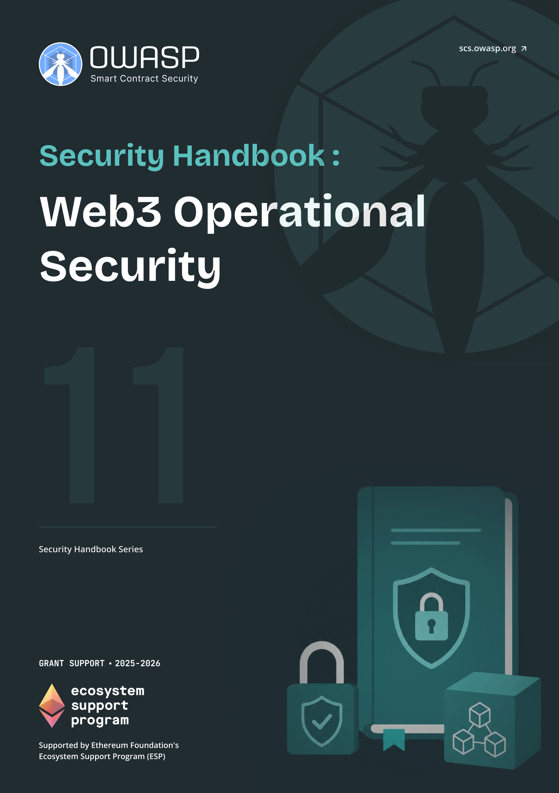

# OWASP SCS Web3 Operational Security Handbook

  
  

    <a class="handbook-series-link" href="../">← All handbooks</a>
    
Handbook 11 · 109 PDF pages

    
Protect people, devices, identities, communications, travel, signing operations, and other sensitive Web3 workflows.

    

      <a href="../pdfs/11-opsec-in-web3.pdf" target="_blank" rel="noopener">Open PDF</a>
      <a href="../pdfs/11-opsec-in-web3.pdf" download>Download PDF</a>
    

  

**OWASP Smart Contract Security Project**

Part of the [OWASP SCS Handbook Series](../index.md). Built to the series [conventions](../index.md#about-the-series).

## Purpose and Scope

This handbook operationalizes security for Web3 teams: identifying critical information, analyzing threat actors, assessing vulnerabilities, weighing risk in business context, and deploying targeted countermeasures. It is anchored in two current U.S. National Institute of Standards and Technology (NIST) references: **Zero Trust** Architecture (ZTA) under [NIST SP 800-207](https://csrc.nist.gov/pubs/sp/800/207/final) and its companion implementation guide [NIST SP 1800-35](https://csrc.nist.gov/pubs/sp/1800/35/final), plus the [NIST Cybersecurity Framework (CSF) 2.0](https://csrc.nist.gov/pubs/cswp/29/the-nist-cybersecurity-framework-csf-20/final) functions of Govern, Identify, Protect, Detect, Respond, and Recover. Both frameworks assume a perimeter-less, "never trust, always verify" model, a natural fit for Web3 organizations that never had a network perimeter to defend in the first place.

A protocol's smart contracts can pass every audit while the team behind them loses everything to a phished admin, an unlocked laptop, or a hot wallet compartmentalized in name only. Web3 operations run on distributed teams, pseudonymous collaborators, and Web2 SaaS tooling that sits next to keys controlling real value, so **operational security** (**OpSec**) here carries the same discipline the term originally described in intelligence and military doctrine: protect the information and access that, if exposed, lets an adversary act. This handbook applies that discipline to key management, endpoint hardening, communications, travel, and the control domains a Web3 team runs day to day.

## Target Audience

Security specialists, operations and strategy leads, DevOps and Site Reliability Engineering (SRE) teams, protocol and dApp engineering teams, and anyone who carries day-to-day responsibility for the **operational security** of a Web3 organization.

## How to Use This Handbook

Start with Part I to fix vocabulary and the standards baseline: what **OpSec** means in a Web3 context, how NIST ZTA and CSF 2.0 map onto it, and the five-step operational process (asset identification, threat analysis, vulnerability assessment, risk evaluation, control deployment) that structures every chapter after it. Part II is Web3-specific reference material, covering the challenges unique to transparent, decentralized, key-custodying teams before moving through endpoint, workspace, authentication, communication, and travel controls in turn. Part III organizes controls by domain (organizational, personnel, physical, technical) and walks through selecting and deploying them. Part IV integrates OpSec with the wider security program and sets a cadence for continuous improvement. Part V holds the glossary, a policy and template library, case studies with tabletop exercise scripts, and quick-reference checklists; a reader under time pressure can jump straight to Appendix D and work outward from there.

## Relationship to SCSVS, SCSTG, and SCWE

This handbook sits beside, not inside, the Smart Contract Security Verification Standard (SCSVS): SCSVS verifies that a deployed system satisfies defined security requirements, while the controls here protect the humans, devices, and processes that build, sign, and operate that system. The Smart Contract Security Testing Guide (SCSTG) tests code and infrastructure; the operational controls in Parts II and III are what keep the environment the SCSTG tests from being undermined by a compromised laptop or a phished operator before code ever ships. The Smart Contract Weakness Enumeration (SCWE) catalogs weaknesses in contract code; this handbook covers the class of weakness SCWE does not enumerate, in people and process. Two sibling handbooks share the most surface area: the Hiring, Remote Work, and **Insider Threat** Handbook (05) goes deep on the personnel-side controls introduced in Chapters 6 through 10, and the **Incident Response** Handbook (06) owns the escalation and forensics process that Chapter 13's integration section hands off to.

## Contents

### Part 1: Foundations
- [1. Introduction to Operational Security](part1-foundations.md#1-introduction-to-operational-security)
- [2. Alignment with Standards and Frameworks](part1-foundations.md#2-alignment-with-standards-and-frameworks)
- [3. Core Principles](part1-foundations.md#3-core-principles)
- [4. Operational Implementation Process](part1-foundations.md#4-operational-implementation-process)

### Part 2: Web3-Specific Considerations
- [5. Web3 OpSec Challenges](part2-web3-specific-considerations.md#5-web3-opsec-challenges)
- [6. Endpoint and Device Security](part2-web3-specific-considerations.md#6-endpoint-and-device-security)
- [7. Workspace and Productivity Security](part2-web3-specific-considerations.md#7-workspace-and-productivity-security)
- [8. Authentication and Access](part2-web3-specific-considerations.md#8-authentication-and-access)
- [9. Communication and Collaboration Security](part2-web3-specific-considerations.md#9-communication-and-collaboration-security)
- [10. Travel and Remote Work](part2-web3-specific-considerations.md#10-travel-and-remote-work)

### Part 3: Control Domains
- [11. Control Domains Overview](part3-control-domains.md#11-control-domains-overview)
- [12. Control Selection and Implementation](part3-control-domains.md#12-control-selection-and-implementation)

### Part 4: Integration and Continuous Improvement
- [13. Integration with Other Frameworks](part4-integration-and-continuous.md#13-integration-with-other-frameworks)
- [14. Continuous Improvement](part4-integration-and-continuous.md#14-continuous-improvement)

### Part 5: Appendices
- [15. Appendix A: Glossary](part5-appendices.md#15-appendix-a-glossary)
- [16. Appendix B: Policy and Template Library](part5-appendices.md#16-appendix-b-policy-and-template-library)
- [17. Appendix C: Case Studies and Tabletop Exercises](part5-appendices.md#17-appendix-c-case-studies-and-tabletop-exercises)
- [18. Appendix D: Checklists (Quick Reference)](part5-appendices.md#18-appendix-d-checklists-quick-reference)
- [19. Appendix E: References and Further Reading](references.md)
