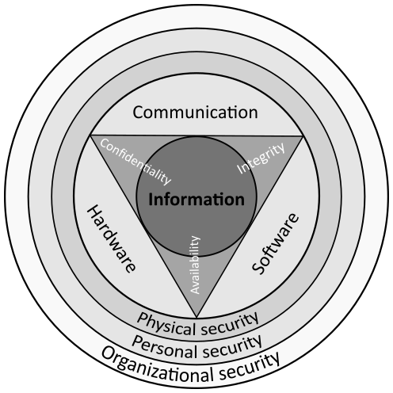
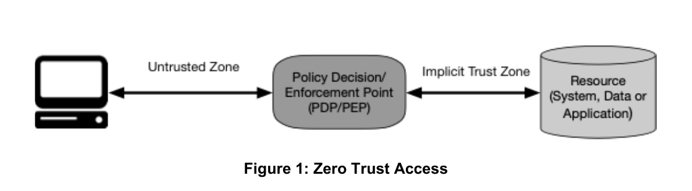
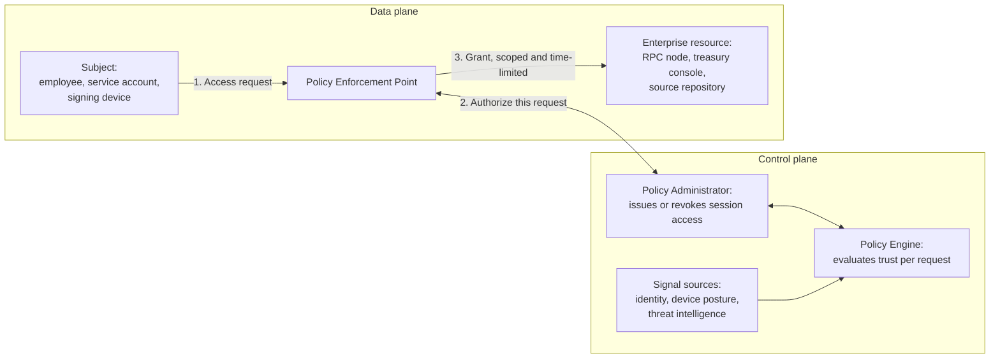
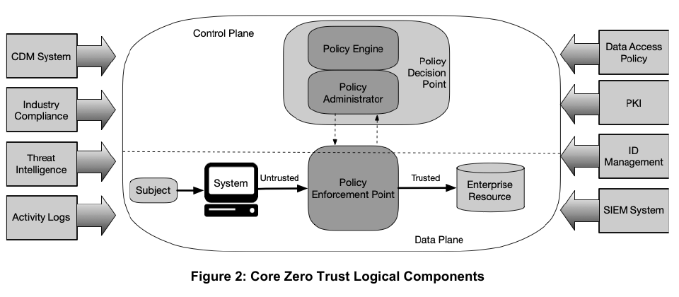
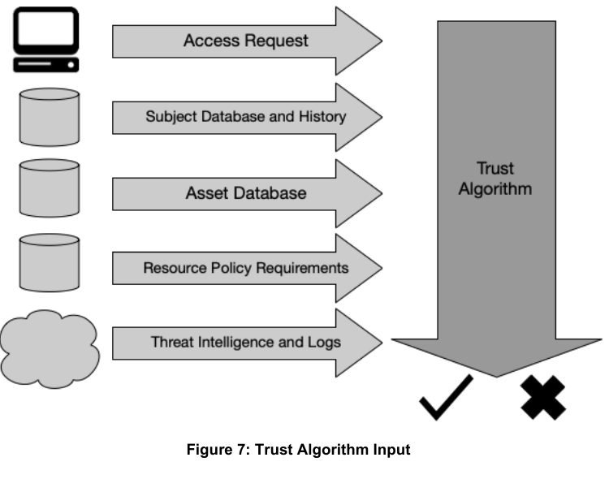
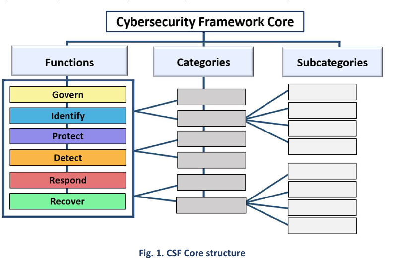
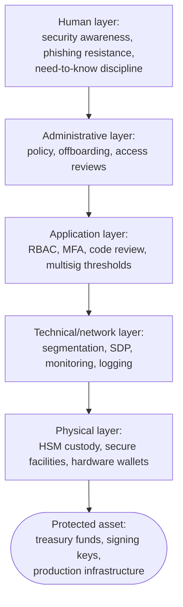
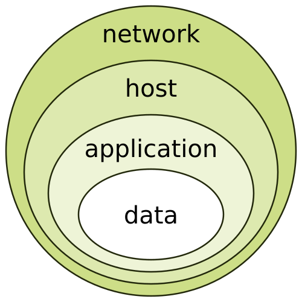
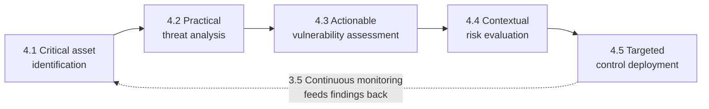

# Part 1: Foundations

[Back to Handbook contents](index.md) | [Series index](../index.md)

This part defines **operational security** (**OpSec**) for a Web3 organization, distinguishes it from smart contract security and from generic enterprise IT security, and grounds it in the frameworks that give it verifiable structure. It sets out five core OpSec principles used throughout the handbook: defense in depth, least privilege, need-to-know, compartmentalization, and continuous monitoring. It closes with the five-step operational implementation process that later parts apply to specific Web3 domains: identify assets, analyze threats, assess vulnerabilities, evaluate risk, deploy controls.

---

## 1. Introduction to Operational Security

Before a team can defend key custody, employee onboarding, or **incident response**, it needs a shared definition of **operational security** and a reason to prioritize it above the smart contract audit that usually consumes the security budget. This chapter supplies both.

### 1.1 What is Operational Security

**Operational security** (**OpSec**) began as a US military discipline, not an IT one. During the Vietnam War, a team investigating why enemy forces anticipated American operations found no single classified leak: the adversary was piecing together publicly observable indicators (flight schedules, radio traffic patterns, logistics movements) into an accurate picture of intent. The Department of Defense named the discipline of denying that kind of inference Operations Security, and the United States formalized it government-wide in [National Security Decision Directive 298 (1988)](https://irp.fas.org/offdocs/nsdd298.htm), which still defines the five-step OPSEC process: identify critical information, analyze threats, analyze vulnerabilities, assess risk, and apply countermeasures.

OpSec is not synonymous with information security. Information security protects the confidentiality, integrity, and availability of specific systems and data; OpSec protects against an adversary correlating fragments (public GitHub activity, a conference talk, an out-of-office reply, a wallet's on-chain history) into an operational picture that no single fragment reveals on its own. A firewall rule is an information-security control. A policy against announcing a treasury rebalance before it executes is an OpSec control.


*Figure. The CIA triad: confidentiality, integrity, and availability, the three goals information security protects. OpSec is the discipline that sits alongside it, protecting against inference from fragments no single one of these three properties covers. Source: [Wikimedia Commons](https://commons.wikimedia.org/wiki/File:CIAJMK1209-en.svg), CC BY-SA 4.0.*

The five-step process in NSDD-298 reappears, adapted, as Chapter 4 of this Part: critical asset identification, practical threat analysis, actionable vulnerability assessment, contextual risk evaluation, and targeted control deployment. That structure, not a list of tools, is what makes OpSec a repeatable discipline rather than a vague call to "be careful."

### 1.2 Why OpSec Matters in Web3

Two properties make **OpSec** disproportionately important in Web3 compared with a typical enterprise. First, the ledger is public and permanent: a wallet's balance, its transaction graph, and often the ENS name or social account linked to it are queryable by anyone, giving an adversary a head start on the open-source intelligence (OSINT) reconnaissance that used to take weeks of corporate research. Second, execution is irreversible: a signed transaction that moves funds to an attacker has no chargeback and, absent a rare and contested social-layer intervention, no recovery path.

The largest crypto losses on record bear this out, and most of them are OpSec failures, not smart contract bugs. In March 2022, attackers the FBI attributed to North Korea's [Lazarus Group and APT38](https://www.fbi.gov/news/press-releases/fbi-statement-on-attribution-of-malicious-cyber-activity-posed-by-the-democratic-peoples-republic-of-korea) compromised five of nine validator keys on the Ronin sidechain behind Axie Infinity, reportedly through a fake job offer that delivered a malicious payload to a senior engineer, and drained roughly $620 million ([Ronin Network incident summary](https://en.wikipedia.org/wiki/Ronin_Network)). In February 2025, an attacker compromised infrastructure at Safe{Wallet}, the **multisig** provider Bybit used, and manipulated the transaction Bybit's signers reviewed before they approved it, converting a routine cold-wallet transfer into a theft of roughly $1.4 to 1.5 billion in Ether, again attributed by the FBI to North Korean state-linked actors ([Bybit hack summary](https://en.wikipedia.org/wiki/Bybit)). Neither attack exploited a line of Solidity. Both fall under [WA05 (Fake Interview and Video Call Social Engineering)](https://scs.owasp.org/sctop10/Web3-Attack-Vectors-Top15/) and [WA01 (Multisig Hijacking)](https://scs.owasp.org/sctop10/Web3-Attack-Vectors-Top15/) of the OWASP Web3 Attack Vectors Top 15, the companion catalog covered in full in Handbook 10.

### 1.3 How to Use This Handbook

Read this Part once, start to finish, to fix the vocabulary and the two frameworks (**Zero Trust** Architecture and the Cybersecurity Framework) that later parts assume. After that, treat the handbook as a reference to dip into by task. Part II, Web3-Specific Considerations, adapts the general principles here to constructs that only exist in this industry: **multisig** custody, validator operation, DAO governance, and pseudonymous contributor management. Part III, Control Domains, is the operational core, with domain-by-domain controls for identity, endpoints, communications, and physical security. Part IV, Integration and Continuous Operations, covers how OpSec fits into a program that already runs incident response and monitoring, and how to keep it current as tactics change. Part V holds the appendices: templates, checklists, and the worksheets referenced throughout.

If your immediate need is narrower, for example hardening a key ceremony or writing an offboarding checklist, skip to the relevant chapter directly. Each chapter is written to stand on its own once you carry forward the five **OpSec** principles introduced in Chapter 3.

### 1.4 Relationship to SCSVS, SCSTG, and SCWE

The [OWASP Smart Contract Security (SCS)](https://scs.owasp.org/) project's existing standards are deliberately scoped to the contract layer. The Smart Contract Security Verification Standard (SCSVS) states verifiable requirements for the code that runs on-chain. The Smart Contract Security Testing Guide (SCSTG) describes how to test that code. The Smart Contract Weakness Enumeration (SCWE) catalogs the ways that code goes wrong. None of the three asks who held the deployer key, whether the person who approved a Safe transaction verified it on a hardware device, or whether a departed employee still has console access. This handbook answers those questions.

The [OWASP Web3 Attack Vectors Top 15](https://scs.owasp.org/sctop10/Web3-Attack-Vectors-Top15/) makes the gap explicit: of its fifteen categories, at least six (WA01 **Multisig** Hijacking, WA03 **Private Key** Compromise, WA05 Fake Interview and Video Call Social Engineering, WA11 Wrench Attacks and Physical Coercion, WA12 Insider Threats and Collusive Abuse, and WA15 Nation-State Infiltration via Fake Hiring) are OpSec failures with no corresponding SCWE entry, because they never touch the contract. This handbook operationalizes those categories in detail. It also cross-references sibling handbooks that go deeper on adjacent surfaces the Web3 Attack Vectors list flags but this one only summarizes: Employee Lifecycle Security (03), Hiring, Remote Work, and Insider Threat (05), Incident Response (06), and Infrastructure Security (07).

---

## 2. Alignment with Standards and Frameworks

Web3-specific advice is more durable when it maps onto frameworks an enterprise security program, an auditor, or a regulator already recognizes. This chapter grounds the handbook in two publications from the US National Institute of Standards and Technology (NIST) and the **zero trust** components both reference.

### 2.1 NIST Zero Trust Architecture (ZTA)

**Zero trust** architecture (ZTA) replaces the assumption that anything inside a network boundary is safe with a requirement that every access request is evaluated on its own merits. [NIST Special Publication (SP) 800-207](https://csrc.nist.gov/pubs/sp/800/207/final) defines the model abstractly; a companion practice guide translates it into deployable reference designs. The four subsections below cover the standard, its stated boundaries, its central tenet, and why it fits Web3 organizations better than most enterprises realize.


*Figure. Zero trust moves the decision boundary from “inside the network” to access to each resource. For Web3 operations, a source repository, RPC console, signer-management interface, and treasury workflow are separate resources whose authorization decisions should not be inherited from one successful login. Source: [NIST SP 800-207](https://csrc.nist.gov/pubs/sp/800/207/final), U.S. government work, public domain.*



*Figure 1. NIST SP 800-207's logical Zero Trust Architecture components, redrawn for a Web3 resource. No standing trust exists between subject and resource; the Policy Engine evaluates fresh signal on every request.*


*Figure. The authoritative NIST component model distinguishes the policy decision point from the enforcement point in the data path. Keeping those roles separate is what lets policy use identity, device, threat, and telemetry signals without placing every signal source directly in the resource path. Source: [NIST SP 800-207](https://csrc.nist.gov/pubs/sp/800/207/final), U.S. government work, public domain.*

#### 2.1.1 NIST SP 800-207 and SP 1800-35 Practice Guide

NIST published SP 800-207, *Zero Trust Architecture*, in [August 2020](https://csrc.nist.gov/pubs/sp/800/207/final). It defines **zero trust** as a set of principles rather than a product category: no implicit trust is granted based on network location or asset ownership, every access request is authenticated and authorized before it is granted, and access is scoped to the minimum necessary and continuously reevaluated. The document is deliberately abstract so it applies across cloud, on-premises, and hybrid environments without prescribing a specific vendor architecture.

That abstraction left a gap between principle and deployment, which the National Cybersecurity Center of Excellence (NCCoE) closed with SP 1800-35, *Implementing a Zero Trust Architecture*, finalized in [June 2025](https://csrc.nist.gov/pubs/sp/1800/35/final). The NCCoE built nineteen example implementations with twenty-four industry collaborators, covering identity governance, microsegmentation, software-defined perimeters, and secure access service edge, and published the lessons learned from each. For a Web3 team, SP 1800-35 is the more useful document day to day: it shows concretely how ZTA maps to identity providers, endpoint agents, and network controls a security engineer can actually buy or build, where SP 800-207 supplies the vocabulary to argue for doing so.

#### 2.1.2 Scope: Enterprise IT; Excludes ICS, OT, IoT (See NIST for Boundaries)

SP 800-207 states its own boundary: it targets enterprise IT infrastructure and explicitly excludes industrial control systems (ICS), operational technology (OT), and most Internet of Things (IoT) deployments, which have different latency, availability, and failure-mode requirements that a per-request authentication model can violate. NIST points readers to separate ICS/OT guidance rather than stretching 800-207 to cover them.

That boundary matters for Web3, because some infrastructure a protocol depends on sits closer to OT than to enterprise IT: a hardware security module (HSM) signing a validator's blocks, a bare-metal node with strict uptime requirements, or a physically gated safe cannot always tolerate a policy engine that adds latency or fails closed on a network blip during a live signing ceremony. Apply ZTA fully to the corporate identity, endpoint, and application layers this handbook covers, and treat signing infrastructure and physical custody hardware as a distinct domain with its own availability-first controls, covered in Part III. Conflating the two produces either an unsafe ZTA rollout on custody hardware or an under-protected corporate perimeter left in the legacy model.

#### 2.1.3 "Never Trust, Always Verify" and Identity-Centric Security

"Never trust, always verify" is the popular shorthand for **zero trust**, though NIST's own phrasing is more precise: no implicit trust based on physical or network location. In practice this shifts the primary **security boundary** from the network perimeter to identity. Under a perimeter model, a user who reached the corporate virtual private network (VPN) was largely trusted for the session that followed. Under an identity-centric model, every request, not every session, carries its own authentication and authorization decision, informed by who is asking, from what device, in what posture, and against what resource.

For Web3 organizations this is a natural fit rather than a retrofit. A **multisig** co-signer's identity (which hardware key, which device, whether that device shows the correct signing screen) matters more than which network the co-signer connected from; a compromised laptop on the correct corporate VPN is exactly the scenario that drained Bybit's cold wallet through Safe{Wallet} in February 2025. Binding access decisions to verified identity and device posture, re-evaluated per request, closes the gap that a one-time network-perimeter check leaves open.


*Figure. A zero-trust decision is only as trustworthy as its inputs. Identity alone is insufficient: resource policy, asset posture, threat intelligence, historical behavior, and current telemetry must converge on the policy engine, with stale or unavailable signals handled by an explicit fail-closed rule for critical assets. Source: [NIST SP 800-207](https://csrc.nist.gov/pubs/sp/800/207/final), U.S. government work, public domain.*

#### 2.1.4 Applicability to Web3 (No Traditional Perimeter)

Most enterprises adopt **zero trust** to dismantle a perimeter they already have: office networks, VPNs, and on-premises data centers built over decades. Web3 organizations rarely have one to dismantle. Teams are commonly remote-first and distributed across time zones and jurisdictions from day one; infrastructure spans self-hosted validator nodes, multiple cloud providers, hardware wallets, and third-party RPC services; contributors range from full-time employees to pseudonymous DAO participants paid in tokens. There was never a castle, so there is no moat to defend and no legacy VPN culture to unwind.

That absence is an advantage only if a team designs for it deliberately, and a liability if it does not. A validator operator with signers in four countries cannot assume any network location is trustworthy, so access to signing infrastructure must be authenticated and authorized on a per-session, per-device basis regardless of where the request originates: this is the ZTA model applied by default rather than by migration. The risk is that "no perimeter to defend" gets quietly read as "no perimeter to build," leaving identity as the only control and skipping the device posture, continuous monitoring, and policy engine layers that make identity-centric security actually work rather than merely sound modern.

### 2.2 NIST Cybersecurity Framework (CSF) 2.0

Where ZTA governs access decisions, the [NIST Cybersecurity Framework (CSF) 2.0](https://www.nist.gov/cyberframework), released in [February 2024](https://www.nist.gov/news-events/news/2024/02/nist-releases-version-20-landmark-cybersecurity-framework), gives a vocabulary for the security program as a whole. It organizes a program into six functions and, unlike its 2018 predecessor (CSF 1.1), treats governance as a first-class function rather than an implicit assumption. The two subsections below define the functions and map them to **OpSec** controls.


*Figure. CSF 2.0 is an outcomes hierarchy, not a product checklist: Functions organize Categories, Categories contain measurable Subcategories, and Informative References map outcomes to implementation guidance. Use that structure to connect an OpSec policy objective to evidence an assessor can verify. Source: [NIST Cybersecurity Framework 2.0](https://www.nist.gov/cyberframework), U.S. government work, public domain.*

#### 2.2.1 Govern, Identify, Protect, Detect, Respond, Recover

CSF 2.0 organizes cybersecurity outcomes into six functions, listed here with the one-line purpose NIST assigns each:

| Function | Purpose |
|----------|---------|
| **Govern** (GV) | Establish and monitor the organization's cybersecurity risk management strategy, expectations, and policy (new in 2.0) |
| **Identify** (ID) | Understand the organization's assets, risks, and current security posture |
| **Protect** (PR) | Implement safeguards to limit or contain the impact of a potential event |
| **Detect** (DE) | Find and analyze anomalies and indicators of compromise |
| **Respond** (RS) | Take action once an incident is confirmed |
| **Recover** (RC) | Restore capabilities and services impaired by an incident |

Govern is the headline addition in the 2.0 revision. CSF 1.1 buried governance inside Identify; CSF 2.0 elevates it to its own function, explicit that cybersecurity risk is enterprise risk and belongs on the same reporting line as financial or legal risk, with a dedicated Supply Chain Risk Management (GV.SC) category. For a Web3 organization, that elevation matters directly: a treasury **multisig** threshold, a key-holder travel policy, or a decision to concentrate signing authority in one geography are governance decisions with security consequences, and CSF 2.0 gives them a home in the framework rather than leaving them as engineering-team footnotes.

The remaining five functions map cleanly onto the five-step **OpSec** process from Section 1.1 and Chapter 4. Identify and Protect correspond to asset identification and control deployment, Detect and Respond correspond to continuous monitoring, and Recover closes the loop back to Govern for lessons learned.

#### 2.2.2 Mapping OpSec Controls to CSF Functions

The table below gives one representative Web3 **OpSec** control per function, each expanded in later parts of this handbook.

| CSF Function | Representative Web3 OpSec control |
|--------------|-----------------------------------|
| Govern | Board-level key-custody policy defining multisig thresholds and signer geographic distribution |
| Identify | Living asset register of every wallet, deployer key, admin role, and infrastructure credential (Section 4.1) |
| Protect | Hardware-backed signing, least privilege, and just-in-time access for privileged roles (Sections 2.3.4, 3.2) |
| Detect | On-chain transaction monitoring and off-chain security information and event management (SIEM) alerting on privileged account activity |
| Respond | Incident response runbook with a pause or freeze path, covered fully in Handbook 06 |
| Recover | Tested key regeneration and cold-backup restoration procedure after a compromise |

Use the table as a gap-finding tool, not a compliance checkbox. A team that can point to strong Protect controls but has no Govern-level policy stating who is authorized to change a **multisig** threshold has a documented function without an accountable owner, precisely the gap CSF 2.0 was revised to close. Run this mapping exercise during the asset identification step in Chapter 4, so that control deployment in Section 4.5 has a known function, and therefore a known owner and reporting line, for every control it proposes.

### 2.3 Zero Trust Components Relevant to OpSec

SP 1800-35 groups **zero trust** into implementable components rather than leaving it at the principle level of SP 800-207. Four of those components recur throughout this handbook's control chapters: identity governance, network microsegmentation, secure remote access, and time-bound credentials. Each is introduced here and applied concretely in Part III.

#### 2.3.1 Enhanced Identity Governance (EIG) and ICAM

Enhanced Identity Governance (EIG) is [CISA's](https://www.cisa.gov/zero-trust-maturity-model) term for a **zero trust** approach in which identity is the primary basis for granting access, rather than one factor among several. It depends on mature Identity, Credential, and Access Management (ICAM), the US federal government's umbrella term for the systems and processes that establish who a digital identity belongs to, issue it a credential, and govern what that credential can access ([idmanagement.gov](https://www.idmanagement.gov/)).

Web3 organizations run two identity systems that rarely talk to each other: corporate identity (a workspace suite, a single sign-on provider, GitHub organization membership) and cryptographic identity (which key controls which **multisig** signer slot, which address holds a validator's operator role). EIG done well links them: revoking an employee's corporate identity should trigger a review of every cryptographic role tied to that person, not leave a signer key active because it lives in a **hardware wallet** the offboarding checklist never touches. Bot and relayer service accounts need the same governance discipline as human ones; an unreviewed automation key with standing signing rights is functionally an ungoverned identity, regardless of whether a human sits behind it.

#### 2.3.2 Microsegmentation and Software-Defined Perimeter (SDP)

Microsegmentation divides a network into small, independently controlled zones so that reaching one workload does not imply reaching its neighbors. Where a traditional flat network lets a compromised marketing laptop route toward a database server, microsegmentation requires a policy decision at every hop. Software-Defined Perimeter (SDP), a related architecture formalized by the [Cloud Security Alliance](https://cloudsecurityalliance.org/research/topics/software-defined-perimeter/), goes further by making protected resources invisible until a client authenticates: no open port, no listening service visible to an unauthenticated scan, an approach sometimes summarized as "dark" infrastructure.

Apply both to signing and node infrastructure specifically. A validator's signing key and the machine that holds it belong in a segment unreachable from the general corporate network and unreachable from the public internet outright. A remote procedure call (RPC) endpoint or admin console that would otherwise need a public IP address and an allowlist can instead sit behind an SDP gateway that never advertises the service to an unauthenticated client. The practical payoff is that a phished laptop or a leaked engineer credential no longer implies a path to signing infrastructure, because that infrastructure was never reachable from the segment the laptop lives in.

#### 2.3.3 Secure Access Service Edge (SASE) and Remote Access

Secure Access Service Edge (SASE, commonly pronounced "sassy"), a term [Gartner](https://www.gartner.com/en/information-technology/glossary/secure-access-service-edge-sase) introduced in a 2019 report on the convergence of networking and security, describes delivering SD-WAN connectivity together with a bundle of cloud-delivered security services (secure web gateway, cloud access security broker, **zero trust** network access, and firewall-as-a-service) from edge points of presence close to the user, rather than backhauling traffic to a corporate data center.

SASE fits a Web3 team's default topology better than a legacy site-to-site VPN does. A VPN typically grants network-level access once connected, reintroducing the implicit trust ZTA is meant to remove, and it assumes a hub of corporate offices that most Web3 teams never build. A SASE deployment enforces identity-aware policy at the edge nearest each remote contributor, whether an engineer in one country or a contractor in another, without ever placing them "inside" a network segment they do not need. The result is consistent policy enforcement for a distributed workforce, with zero trust network access replacing standing VPN tunnels as the default remote-access model in SP 1800-35's example implementations.

#### 2.3.4 Just-in-Time and Ephemeral Credentials

Just-in-time (JIT) access grants a privileged permission only for the window it is needed, then automatically revokes it, replacing the standing admin role that sits active, and attackable, around the clock for the sake of the ten minutes a month it is actually used. Ephemeral credentials extend the same idea to secrets themselves: a short-lived, auto-expiring token or key rather than a long-lived password or API key that, once leaked, remains valid indefinitely.

Web3 operations have concrete places to apply both. A **multisig** co-signer role can be time-boxed to the window around a scheduled transaction rather than left standing. Cloud infrastructure roles used to deploy a contract or update a node can be issued through short-lived session tokens (AWS Security Token Service, or a dynamic-secrets engine such as HashiCorp Vault) rather than long-lived Identity and Access Management (IAM) keys committed to a build variable:

```bash
# Example: request a 15-minute scoped AWS session instead of using a static key
aws sts assume-role \
  --role-arn arn:aws:iam::ACCOUNT_ID:role/deploy-readonly \
  --role-session-name ci-deploy-$(date +%s) \
  --duration-seconds 900
```

The security payoff compounds with the identity governance in Section 2.3.1: even if EIG fails to catch a stale identity during offboarding, a credential that expired eight hours ago closes the gap anyway. Standing credentials are a single point of failure that JIT access is designed to remove, a theme Chapter 3 returns to directly.

---

## 3. Core Principles

Frameworks describe what a mature program looks like from the outside; principles are what an engineer or an operator actually applies when making a decision at two in the morning. This chapter sets out the five principles that recur, named explicitly, throughout every later part of this handbook.

### 3.1 Defense in Depth

**Defense in depth** layers independent controls so that the failure of any single one does not expose the protected asset directly. The idea predates computing (it is a military doctrine for fortification), and its computing form is described in classic references such as [NIST SP 800-53](https://csrc.nist.gov/pubs/sp/800/53/r5/upd1/final) and [CISA's layered-security guidance](https://www.cisa.gov/). The three subsections below define it, show how the layers stack for a Web3 asset, and explain why single points of failure defeat the whole idea.



*Figure 2. Defense in depth as five independent layers around a Web3 asset. An attacker who defeats one layer, for example a phished credential at the human layer, still faces every layer beneath it.*

#### 3.1.1 Definition and Rationale

**Defense in depth** accepts, as a starting assumption, that any single control will eventually fail: a patch will be late, a phishing email will land in the right inbox on the wrong day, a password will be reused. Rather than trying to build one perfect control, the strategy stacks multiple independent controls so that an adversary who defeats one still has to defeat the next, and the next, before reaching the protected asset. Independence matters as much as quantity: five controls that all depend on the same credential store are not five layers, they are one layer wearing five names.

The rationale is economic as much as technical. Each additional layer raises an attacker's cost (time, tooling, and the chance of detection) even when it does not raise that cost to infinity, and the goal of most Web3 defenses is not absolute prevention but making an attack too slow, too expensive, or too visible to complete before the target's own controls (monitoring, rate limits, **multisig** thresholds) intervene. A single high-quality control, a strong password policy, for instance, is still worth having, but treating it as sufficient on its own is the specific mistake defense in depth exists to correct.


*Figure. Defense in depth drawn as an onion: the protected asset sits at the center, and an attacker must peel back each independent layer in turn to reach it. Source: [Wikimedia Commons](https://commons.wikimedia.org/wiki/File:Defense_In_Depth_-_Onion_Model.svg), CC BY-SA 3.0.*

#### 3.1.2 Layering Controls Across Physical, Technical, Administrative, and Human

Classic defense-in-depth models group controls into four categories, and Web3 operations have concrete instances of each:

| Layer | Traditional example | Web3 instance |
|-------|---------------------|----------------|
| Physical | Badge-controlled data center access | HSM custody, hardware wallet storage, secure key-ceremony facilities |
| Technical | Firewalls, network segmentation | Microsegmented signing infrastructure, on-chain monitoring, SDP-gated RPC access |
| Administrative | Written policy, access review cadence | Multisig signer policy, offboarding runbooks, change-management approval |
| Human | Security awareness training | Phishing-resistant multi-factor authentication (MFA) culture, fake-recruiter awareness training tied to WA05/WA15 |

No single layer is sufficient, because Web3-specific attacks are engineered to skip straight to whichever layer is weakest. A drainer contract (WA04) defeats technical controls entirely by relying on a user's own signature; a fake interview lure (WA05) defeats every technical control by targeting the human layer directly, exactly why the Ronin Bridge and Bybit incidents in Section 1.2 both succeeded despite the target organizations running conventional endpoint security. Effective **defense in depth** for a Web3 team therefore means building administrative and human-layer controls with the same rigor normally reserved for the technical layer, not treating awareness training as a compliance formality bolted onto a network diagram.

#### 3.1.3 Ensuring No Single Point of Failure

A single point of failure (SPOF) is any component whose compromise alone defeats the entire defense stack, regardless of how many layers surround it. The clearest Web3 example is a single **private key** with unilateral control over an upgradeable contract's admin function or a treasury's entire balance: no matter how well that key is physically secured, its compromise is total and immediate, and every layer in Section 3.1.2 becomes irrelevant the moment it happens.

The structural fix is to require quorum rather than a single actor for any high-value action: a **multisig** wallet requiring M-of-N signatures, an HSM cluster that needs multiple key-shard holders (a Shamir's Secret Sharing scheme, for instance), or a timelock that forces a delay between a proposed action and its execution, giving monitoring and human review a window to intervene. Quorum requirements have their own failure mode if misconfigured; a two-of-three multisig where two signers share an office, a laptop, or a cloud account is not meaningfully more resilient than a single key. Validate that the parties satisfying a threshold are actually independent across every layer in the table above, not merely independent in name on a governance document.

### 3.2 Principle of Least Privilege

**Least privilege** grants each user, process, or system exactly the access it needs to perform its function, and nothing beyond that, for exactly as long as the function requires it. The three subsections below cover minimum rights, how roles and just-in-time access implement them at scale, and the offboarding discipline that keeps privilege from silently accumulating.

#### 3.2.1 Minimum Access Rights for Users, Systems, and Processes

**Least privilege** applies identically to a human engineer, a continuous integration and deployment (CI/CD) service account, and a smart contract's own admin function: each should hold the narrowest set of permissions its actual job requires, evaluated against what it does today, not what it might plausibly need someday. A developer who occasionally needs production database access for debugging does not need standing production access; a deployment pipeline that only ever pushes to a staging environment does not need a mainnet deployer key sitting in its secrets store, even unused.

The habit that erodes least privilege is convenience-driven over-provisioning: granting broad access once to avoid a second request later, or reusing a single highly privileged service account across unrelated pipelines because creating a scoped one takes more setup time. Audit privileged accounts, human and non-human alike, on a fixed cadence against the question "what did this identity actually use in the last review period," and revoke anything unused. A permission nobody has exercised in ninety days is not a convenience, it is unmonitored **attack surface** waiting for a credential leak to activate it.

#### 3.2.2 Role-Based Access and Just-in-Time Privilege

Role-based **access control** (RBAC) assigns permissions to defined roles rather than to individuals, so access changes when someone moves roles instead of accumulating on top of whatever they already had. Combined with the just-in-time access from Section 2.3.4, RBAC becomes the mechanism **least privilege** is actually enforced through at scale: a role defines the maximum a function could ever need, and JIT grants the specific instance of that access only for the window it is used.

For a Web3 organization, define roles around the actual privileged actions in the environment rather than around job titles. "**Multisig** co-signer for treasury operations," "mainnet deployer," "production node administrator," and "customer support with read access to identity-verification records" are roles with clearly bounded blast radii if compromised. A job title like "senior engineer" is not a role in this sense, because it implies nothing about which of those specific privileged actions the person actually performs. Map every standing credential in the environment back to one of these bounded roles during the asset identification step in Section 4.1; any credential that does not map cleanly to a role is a candidate for the offboarding review in the next section.

#### 3.2.3 Offboarding and Credential Revocation

Offboarding is where **least privilege** most commonly fails in practice, because access accumulates gradually and continuously while revocation happens once, at a single point in time, and is easy to do incompletely. A departing employee's corporate email might be disabled within the hour, while their name remains a signer on a Gnosis Safe, their key remains authorized on a validator host, or their personal device retains a copy of a shared password vault, none of which a standard HR-triggered deprovisioning workflow touches.

Build the offboarding checklist around the role mapping from Section 3.2.2, not around a generic IT list. For every role the departing person held, walk through every credential, key share, and standing session tied to that role, and confirm each is revoked, rotated, or reassigned before the person's last working day, not after. Treat any **multisig** or key-shard role as requiring active remediation (a signer swap, a re-key ceremony) rather than passive account disablement, since a departed co-signer's key material does not stop functioning just because their corporate account is deactivated. This handbook covers offboarding at a summary level; the Employee Lifecycle Security Handbook (03) provides the full checklist, and the Hiring, Remote Work, and **Insider Threat** Handbook (05) covers the insider-risk dimension of a departure gone wrong.

### 3.3 Need-to-Know Basis

Need-to-know restricts information, not just system access, to the people whose function actually requires it, independent of whether they hold a role that would technically permit broader access. The three subsections cover classifying information, handling and sharing it, and choosing channels that do not undermine the classification the moment sensitive content is typed into them.

#### 3.3.1 Information Classification and Compartmentalization

Classification gives need-to-know a concrete boundary instead of leaving it to individual judgment about what feels sensitive. A simple four-tier scheme covers most Web3 organizations:

| Tier | Definition | Web3 example |
|------|------------|--------------|
| Public | Safe for anyone, published deliberately | Audited contract source, published tokenomics |
| Internal | Safe for all employees and contributors, not for the public | Internal roadmap, non-sensitive team discussion |
| Confidential | Restricted to a named team or role | Pre-disclosure audit findings, unreleased partnership terms |
| Restricted | Restricted to a named individual list, logged access | Key ceremony logistics, treasury signer identities, incident forensic detail |

**Compartmentalization** applies the same classification horizontally, not only vertically: two people at the same seniority and the same clearance tier may still not need the same restricted information if their functions do not overlap. A security engineer investigating an active incident and a marketing lead both hold Confidential-tier clearance in the scheme above, but the marketing lead has no need to know the specific vulnerability under investigation before a coordinated disclosure. Classifying information without compartmentalizing it by function reduces to "trust everyone at this level with everything," which defeats the purpose.

#### 3.3.2 Data Handling and Sharing Policies

A classification scheme is only as strong as the handling rules attached to each tier: where it can be stored, how it can be transmitted, how long it is retained, and who can approve an exception. Write these rules to be checkable, not aspirational. "Restricted-tier documents are stored only in the encrypted vault, never in a general-purpose cloud drive, and any exception requires sign-off from the security lead, logged with a reason and an expiry date" is checkable; "handle sensitive data appropriately" is not.

Sharing policy deserves particular attention around pre-disclosure security findings and key-ceremony logistics, the two categories most likely to leak through convenience. An auditor's draft report shared over email to a personal address, a key-ceremony date mentioned in a public calendar invite, or an incident bridge call number posted to a semi-public chat channel are all violations of a data-handling policy even when no malicious intent is involved. Pair the written policy with periodic spot checks, confirming the actual location of last quarter's audit drafts matches the policy, rather than assuming a signed acknowledgment form guarantees compliance.

#### 3.3.3 Secure Communication Channels for Sensitive Information

The channel a message travels through can undermine its classification regardless of how carefully the content itself was written. Consumer messaging apps and public chat servers, both common in Web3 team culture, are frequently unencrypted at the server side, retained indefinitely by the platform, and one misdirected message away from reaching an unintended audience; none of that is appropriate for Confidential- or Restricted-tier content as defined in Section 3.3.1.

The channel choice is also an **attack surface** in its own right. Nation-state actors tracked under [WA05, Fake Interview and Video Call Social Engineering](https://scs.owasp.org/sctop10/Web3-Attack-Vectors-Top15/), have repeatedly used fabricated recruiting processes to induce crypto-industry targets into installing malicious "video call" or "coding assessment" software, turning the act of joining a legitimate-seeming communication channel into the initial compromise (see the [FBI, CISA, and Treasury joint advisory on North Korean cyber actors targeting blockchain companies, AA22-108A](https://www.cisa.gov/news-events/cybersecurity-advisories/aa22-108a)). Standardize on a small set of vetted, end-to-end encrypted channels for Confidential and Restricted communication, require any external call software to be installed only from an organization-managed source rather than a link sent by an external party regardless of how legitimate the sender appears, and treat "please install this to join the call" as a standing red flag requiring verification through a second channel.

### 3.4 Compartmentalization

**Compartmentalization** is need-to-know applied structurally, at the level of networks, environments, and accounts, so that a breach in one compartment does not automatically grant reach into the next. The three subsections cover network segmentation, environment isolation, and separating the accounts that access each domain.

#### 3.4.1 Network and System Segmentation

Segmentation, introduced technically in Section 2.3.2 as microsegmentation, is a **compartmentalization** control at the network layer: dividing infrastructure into zones such that reaching one does not imply reaching another. Apply it along the boundaries that actually matter for a Web3 organization, not along a generic office-network diagram. Corporate productivity systems (email, chat, ticketing), engineering infrastructure (build pipelines, source control, staging environments), and signing or custody infrastructure (HSMs, validator hosts, multisig-adjacent tooling) belong in at least three separate zones with explicit, minimal, and logged pathways between them, rather than one flat network where a phished laptop in the first zone has a plausible route to the third.

Segmentation earns its value from being tested, not merely diagrammed. A network diagram showing three zones is not evidence that a compromised host in zone one cannot reach zone three, only that it should not be able to. Periodic penetration testing or red-team exercises (Section 4.3.2) that specifically attempt lateral movement across the drawn boundaries convert an architectural intent into a verified control, and any successful crossing found during such a test is a finding to remediate before the next quarterly review, not a footnote.

#### 3.4.2 Isolation of Critical Assets; Dev / Test / Prod Separation

Development, test, and production environments should be isolated to the point that a compromise or a mistake in one cannot reach another, and Web3 teams have a failure mode enterprise software teams rarely face: a testnet key or a staging deployer credential reused, deliberately or by copy-paste habit, in a mainnet context. A key generated "just for testing" and later promoted to a production role carries none of the custody controls a production key was supposed to have from creation, because it was never treated as sensitive when it was made.

Enforce isolation with structural, not merely procedural, separation: distinct cloud accounts or projects per environment (not just distinct namespaces within one account), distinct secrets stores, distinct build pipelines with no shared credentials between a staging deploy job and a mainnet deploy job, and a hard rule that no key or credential generated for test or staging purposes is ever promoted to production use, full stop, with a freshly generated and separately custodied credential required for the production role instead. Verify this rule technically where possible, for example automated scanning that flags any address seen on both testnet and mainnet under a production role, rather than relying on a developer to remember it under deadline pressure.

#### 3.4.3 Separate Accounts and Access Methods per Security Domain

The same person should authenticate differently, and often through entirely separate accounts, depending on which security domain they are acting in. An engineer who has both a general corporate workspace account and a role requiring access to production infrastructure should not use the same account, the same password manager vault, or in many cases the same physical device for both, because a single compromised session, a malicious browser extension or a phished corporate login, should not cascade into the higher-value domain.

This is most visible, and most often skipped for convenience, in cloud and code hosting: one source-control organization spanning both a public marketing website repository and the private smart-contract repository, or one cloud account holding both a low-value marketing analytics workload and the treasury infrastructure, collapses two very different risk profiles into one **blast radius**. Split by account boundary, not just by access-policy configuration within a single account: a misconfigured policy is a bug to fix, but a genuinely separate account is a compartment an attacker cannot cross through a policy misconfiguration alone, only through a second, independent compromise.

### 3.5 Continuous Monitoring and Improvement

The four principles above describe a defensive posture at a point in time; this one keeps that posture from decaying as the environment, the team, and the threat landscape change. The three subsections cover measuring control effectiveness, learning from what goes wrong (including what almost goes wrong), and deliberately updating controls rather than letting them fossilize.

#### 3.5.1 Security Metrics and Effectiveness of Controls

A control that is deployed but never measured is a hypothesis, not a defense. Track metrics that show whether a control is actually working, not just whether it exists:

- Mean time to detect (MTTD) and mean time to respond (MTTR) for privileged-account anomalies
- Percentage of privileged accounts, human and service, with hardware-backed MFA enrolled and enforced
- Percentage of privileged access reviewed and re-justified in the last quarter, against the RBAC mapping in Section 3.2.2
- Click and credential-entry rate on internal phishing simulations, trended over time rather than compared once to an industry benchmark
- Time from an offboarding trigger to full credential revocation across every system in Section 3.2.3's checklist

Report these to the governance function from Section 2.2.1 (CSF's Govern), not only to the engineering team that implements the controls, so a declining metric becomes a resourcing conversation rather than unnoticed drift. A metric that never moves is often as informative as one that moves badly: a hardware-MFA-enrollment figure that has read 100 percent for two years without a single new hire or offboarding event logged against it usually indicates the metric stopped being measured, not that the control became permanently perfect.

#### 3.5.2 Learning from Incidents and Near-Misses

An incident that reaches the point of financial loss is the expensive way to learn a lesson; a near-miss (a phishing email reported before anyone clicked it, a JIT access request denied because it looked anomalous, an alert that fired correctly and stopped an attack in progress) teaches the same lesson for free, if the organization captures it. Most teams have a process for the former and none for the latter, which means they only ever learn from their worst days.

Run every confirmed incident, and a sampled subset of near-misses, through a blameless postmortem: what happened, what control caught or failed to catch it, and what would need to change for the same pattern to be caught earlier next time, with the explicit goal of fixing the process rather than assigning fault to the individual who reported a phishing email late or nearly fell for it. Blame-oriented postmortems reliably suppress future reporting, the opposite of what a near-miss program needs to function; teams that punish the person who almost clicked the link train employees to stop reporting near-misses at all. Handbook 06, **Incident Response**, details the full postmortem process this section summarizes.

#### 3.5.3 Updating Controls for New Threats and Technologies

Static controls age against a moving threat landscape. Two shifts illustrate why this section closes the chapter rather than standing alone. Generative artificial intelligence (AI) has made voice- and video-based impersonation, a deepfake call from a "CEO" or "investor" requesting an urgent wire or key action, cheap enough to attempt at scale, a pattern multiple threat-intelligence vendors documented targeting crypto and fintech firms through 2024 and 2025. Authentication technology has moved as well, with FIDO2 and passkey-based phishing-resistant authentication increasingly available to replace the SMS and app-based one-time codes that MFA-fatigue and SIM-swap attacks were designed against.

Treat control review as scheduled, not reactive: revisit the threat-actor and tactic list in Section 4.2.1 on a fixed cadence (quarterly is reasonable for a fast-moving industry) and ask explicitly whether any control assumes a **threat model** that no longer holds, for example a verbal-confirmation callback procedure that assumed a human voice could not be convincingly cloned. A phishing-resistant MFA rollout, a callback-verification policy updated to require a pre-shared challenge phrase rather than voice recognition alone, and a periodic review of which authentication methods remain phishable are all concrete outputs of this discipline, and each closes the loop back to the asset-and-threat cycle in Chapter 4.

---

## 4. Operational Implementation Process

The five-step **OPSEC** process traced back to NSDD-298 in Section 1.1 becomes, in this chapter, a repeatable operational cycle: identify what matters, understand who threatens it and how, find where it is weak, evaluate what that means for the business, and deploy controls sized to the answer. Run the cycle deliberately rather than once at program launch, because the continuous monitoring principle from Section 3.5 exists specifically to feed its results back into step one.



*Figure 3. The operational implementation process as a continuous cycle, not a one-time project. Each pass narrows toward the highest-priority risk given the current asset inventory and threat landscape.*

### 4.1 Critical Asset Identification

A control deployed against an asset nobody documented protects nothing measurable. This step builds the inventory every later step in the cycle, and every chapter in Part III, assumes already exists.


*Figure. A real U.S. Air Force operational-security awareness artifact, not a decorative stock image. It distills this step to one question every contributor must answer: which mission-critical information would help an adversary if disclosed? Source: [U.S. Air Force Medicine, OPSEC poster](https://www.airforcemedicine.af.mil/News/Photos/igphoto/2000870511/), public domain; credit requested by the source.*

#### 4.1.1 Mapping and Documenting Assets

Build an asset register that covers both traditional IT assets and the Web3-specific ones a generic template omits:

| Asset class | Examples | Owner field |
|-------------|----------|-------------|
| Cryptographic | Multisig signer keys, validator keys, deployer keys, HSM-held key shards | Named individual or role |
| On-chain | Deployed contracts, admin/upgrade roles, treasury addresses | Governance body or team |
| Infrastructure | RPC endpoints, validator hosts, cloud accounts, build pipelines | Engineering lead |
| Identity | Single sign-on accounts, source-control org membership, service accounts | IT/security |
| Information | Pre-disclosure audit reports, key-ceremony records, incident forensics | Classification owner (Section 3.3.1) |

The register only earns its keep if it is actually current, which means assigning an update trigger to each class (a new deployment, a new hire, a signer rotation) rather than relying on an annual audit to catch drift. Cross-reference every entry against the RBAC role mapping from Section 3.2.2: an asset with no role and no accountable owner listed is itself a finding, not an administrative gap to fix later. Store the register at the Restricted classification tier from Section 3.3.1, since a complete asset map is exactly the reconnaissance an attacker would otherwise have to assemble themselves.

#### 4.1.2 Prioritization by Impact of Compromise

Not every asset in the register deserves equal attention, and treating them as equal dilutes scarce security effort across low-value targets while high-value ones wait their turn. Prioritize by realistic impact of compromise, not by how technically interesting an asset is to defend. A treasury **multisig** holding the majority of a protocol's funds, a contract's upgrade-admin role, the organization's primary domain registrar account, and the credentials with publish rights to a package registry entry consumed by thousands of downstream projects are "crown jewel" assets whose compromise is catastrophic and often irreversible, and they should receive disproportionate attention relative to their count in the register.

A useful discipline is to ask, for each asset, "if this specific credential or key were compromised right now, what is the maximum realistic loss before anyone could intervene," and rank by that figure rather than by a generic severity label. This framing naturally surfaces assets a team underrated: a marketing team's social media account might not hold funds directly, but if it can post a "verified" malicious contract address to hundreds of thousands of followers, its realistic impact belongs near the top of the list, not the bottom.

### 4.2 Practical Threat Analysis

With assets ranked, the next step asks who actually wants each one and how they would try to get it, grounded in real observed tactics rather than generic "hackers" as an undifferentiated category.

#### 4.2.1 Identifying Relevant Threat Actors and Tactics

Ground threat-actor identification in structured references rather than intuition. [MITRE ATT&CK](https://attack.mitre.org/) catalogs adversary tactics and techniques across an Enterprise matrix built from real-world observations, useful for the corporate-IT surfaces this handbook covers (initial access, credential access, lateral movement). MITRE's newer framework, [AADAPT (Adversarial Actions in Digital Asset Payment Technologies)](https://aadapt.mitre.org/), extends the same structured approach specifically to digital-asset and blockchain-payment adversary behavior, filling the gap ATT&CK's enterprise focus leaves for on-chain-specific tactics.

Four actor profiles cover most Web3 incidents, echoing the pattern used across this handbook series. Financially motivated criminals run phishing, drainer, and social-engineering campaigns at scale for direct profit. Nation-state actors, most visibly North Korea's Lazarus Group and its sub-clusters (tracked by various vendors under names such as TraderTraitor or Contagious Interview), pursue sanctioned-regime revenue through patient, well-resourced campaigns, including the fake job offer behind Ronin and the developer-infrastructure compromise behind the Bybit incident. Malicious or negligent insiders retain legitimate access that outlives its purpose (WA12). Opportunistic actors run mass scans for exposed secrets, unpinned credentials, or reused keys with no specific target in mind. Map each threat to the specific asset classes from Section 4.1 it realistically targets, since a nation-state campaign and an opportunistic scanner pose very different threats to the same treasury **multisig**.

#### 4.2.2 Organization-Specific Threat Profiles

The generic actor list in Section 4.2.1 becomes useful only after it is weighted for your organization specifically. A custodial exchange, a DeFi protocol with a large public treasury, a DAO with pseudonymous contributors, and an infrastructure provider running validator nodes for other protocols each attract a different mix of the four actor profiles, and applying a one-size **threat model** across all four wastes effort on threats that do not apply while missing ones that do.

Build the profile from concrete, checkable factors: the total value the organization's assets could realistically expose (a rough proxy for financially motivated and nation-state attention), how publicly visible key holders and signers are (professional networking presence, conference speaking, source-control history tied to a real name, all of which feed the reconnaissance that made the Ronin fake job offer lure possible), employee headcount and hiring velocity (a fast-growing team is a wider surface for WA15-style fake-hiring infiltration), and the jurisdictions the team and its key holders operate in. Revisit the profile whenever any of these factors changes materially, not on a fixed calendar alone, since a funding round or a public treasury milestone can shift the threat profile faster than an annual review cycle catches.

### 4.3 Actionable Vulnerability Assessment

Threat analysis identifies who and how; this step finds where the organization is actually exposed to that how, validated rather than assumed.

#### 4.3.1 Systematic Identification and Validation of Weaknesses

Systematic assessment combines self-directed reconnaissance with structured exercises, and both matter because they surface different classes of weakness. Run an OSINT self-assessment periodically: what can an outside party learn about your key holders, your infrastructure, and your operational schedule from public sources alone? A professional profile naming a "Head of Treasury Operations," a conference talk that names the cloud provider hosting production, or a source-control history that reveals a deployment cadence are exactly the reconnaissance an attacker like the one behind Ronin Bridge performs before ever sending a fake job offer. Finding it yourself first means you can decide deliberately what stays public.

Pair OSINT self-assessment with tabletop exercises that walk a specific scenario, a compromised co-signer's laptop, a fake recruiter contact, a leaked internal message, through the organization's actual controls step by step, asking at each point whether a real control would have caught it or whether the walkthrough is relying on an assumption nobody has tested. Validated weaknesses, meaning ones confirmed through an exercise rather than merely hypothesized, are the only ones that belong in the risk register in Section 4.4; an untested hypothesis is a good question, not yet a finding.

#### 4.3.2 Practical Testing and Validation

Move from tabletop hypotheticals to executed tests wherever the organization's risk tolerance and legal scope allow. Authorized phishing simulations measure the human-layer control from Section 3.1.2 directly, and are trended over time (per the metrics in Section 3.5.1) rather than treated as a one-time score. Physical security walkthroughs validate the physical layer: can an unbadged visitor reach a workstation with access to signing infrastructure, is a **hardware wallet** left unlocked in an unattended office. **Access review** audits validate least privilege directly: pull the actual current permission set for a sample of accounts and compare it against the RBAC role mapping from Section 3.2.2, rather than trusting that the mapping document and reality have stayed in sync.

Purple-team exercises, where an internal or contracted red team executes specific MITRE ATT&CK or AADAPT techniques while the defensive team observes what does and does not trigger a detection, validate the monitoring layer with the most rigor of any method here, because they test whether Section 3.5's metrics would actually catch a real attempt rather than only a simulated phishing email. Schedule each test type on a cadence proportional to the asset criticality it validates: crown-jewel assets from Section 4.1.2 warrant more frequent and more adversarial testing than a low-priority marketing account.

### 4.4 Contextual Risk Evaluation

A validated weakness against a low-value asset and the same weakness against a crown-jewel asset are not the same risk. This step weighs each finding against the business context established in Sections 4.1 and 4.2 before anything moves to remediation.

#### 4.4.1 Business-Context Risk Analysis

Risk, in the formulation this handbook uses throughout, is likelihood weighed against impact, and both terms need to be evaluated in the specific business context of the finding, not in the abstract. A weak password policy on a modest marketing operations budget account and the same weak password policy on the infrastructure supporting a nine-figure treasury **multisig** are technically identical findings and completely different risks. Treating them with the same urgency either wastes effort on the former or, more dangerously, under-reacts to the latter because it reads as "just a password policy gap" on a generic severity scale.

Evaluate likelihood using the threat-actor weighting from Section 4.2.2 (does the profile that would realistically exploit this weakness actually target organizations like yours) and evaluate impact using the prioritization from Section 4.1.2 (what is the realistic maximum loss). A finding that scores high on a generic vulnerability scanner but low on both actual likelihood and actual impact for your specific organization is a lower priority than a finding a scanner would never flag but that maps directly onto the fake job offer pattern behind a $620 million loss at Ronin.

#### 4.4.2 Informed Decision-Making and Prioritization

Formalize the output of risk evaluation into a risk register that supports a real decision, not just a list of findings:

| Risk | Likelihood | Impact | Priority | Owner | Decision |
|------|------------|--------|----------|-------|----------|
| Standing admin key for treasury multisig | Medium | Critical | 1 | Security lead | Mitigate: move to JIT plus hardware signing |
| Unreviewed contractor access to staging | Low | Medium | 3 | Engineering manager | Accept, with quarterly review |
| Public professional profile naming key holders | High | High | 2 | Communications/HR | Mitigate: policy update |

Four decisions are available for any risk: accept it explicitly (documented, with an owner and a review date, never silently), mitigate it (deploy a control that reduces likelihood or impact), transfer it (insurance, a third-party custody provider assuming some operational burden), or avoid it (stop doing the thing that creates the risk, such as retiring an unused legacy admin key entirely). The register's value comes from forcing an explicit decision on every entry, rather than letting unranked findings accumulate in a backlog that never gets prioritized against the crown-jewel assets identified earlier in the cycle.

### 4.5 Targeted Control Deployment

The cycle's final step turns a prioritized risk register into deployed controls, and the two subsections address the two ways this step most commonly goes wrong: deploying generically instead of targeting the actual prioritized risk, and deploying so much friction that people route around the control entirely.

#### 4.5.1 Implementing Controls for Prioritized Risks

Deploy controls against the risk register in the priority order it establishes, mapped back to the CSF Protect function from Section 2.2.2, and resist the temptation to deploy the easiest control first regardless of its rank; a quick win on a Priority-3 finding does not substitute for slow progress on Priority-1. For each control deployed, state explicitly which specific finding it addresses and how, so the deployment can be verified against that finding rather than checked off generically: "enabled hardware-backed MFA for the treasury **multisig** co-signer role" is verifiable against the finding it targets, while "improved authentication security" is not.

Verify effectiveness against the actual threat scenario the finding described, not only against a checklist item. If the prioritized risk was "a fake job offer could compromise a co-signer's device," echoing the Ronin pattern, the control is not complete once MFA is enabled; it is complete once the organization can show that a device compromised through that specific vector would still be blocked from initiating a signing action, which likely requires device attestation or a hardware-isolated signing flow in addition to MFA. Tie every deployed control back to the metric in Section 3.5.1 that will show whether it is working.

#### 4.5.2 Balancing Security and Operational Friction

Every control this handbook recommends imposes some cost on the people who work within it, and a control that imposes more friction than the asset's criticality justifies gets worked around rather than followed, worse than not deploying it at all because it creates a false sense of coverage. The clearest documented example of friction defeating a control is MFA fatigue: Uber's [September 2022 breach](https://www.uber.com/newsroom/security-update/), attributed to a Lapsus$-affiliated actor, succeeded not because MFA was absent but because the attacker bombarded a contractor with repeated push-approval requests until, worn down, the contractor approved one, at which point a control that should have stopped the intrusion instead rubber-stamped it.

Right-size friction to the asset-criticality tiers established in Section 4.1.2. A crown-jewel asset (the treasury **multisig**, the production deployer role) justifies phishing-resistant, number-matching or hardware-token MFA and a deliberately, slightly inconvenient JIT approval flow, because the cost of that friction is small relative to the asset's value, while a low-criticality internal tool does not justify the same friction and will simply drive shadow-IT workarounds if it receives it anyway. Ask, for every control under consideration, whether the friction it adds is proportional to the specific risk it mitigates, not whether more friction is generically safer; past a certain point, it measurably is not.

---

**Key controls for Part 1**

- Ground every **OpSec** decision in NIST SP 800-207/1800-35 (**zero trust**) and CSF 2.0 (Govern through Recover), so the program maps onto frameworks an auditor already recognizes.
- Apply the five principles, **defense in depth**, **least privilege**, need-to-know, compartmentalization, and continuous monitoring, as a checklist for every new control, not as background theory.
- Build and maintain a living critical-asset register (Section 4.1) that includes cryptographic and on-chain assets a generic IT template omits.
- **Run the five-step implementation cycle continuously:** identify, analyze threats, assess vulnerabilities, evaluate risk, deploy controls, then feed monitoring results back to step one.
- Size every control's friction to the asset-criticality tier it protects; both under-protecting crown-jewel assets and over-friction on low-value ones defeat the program.
