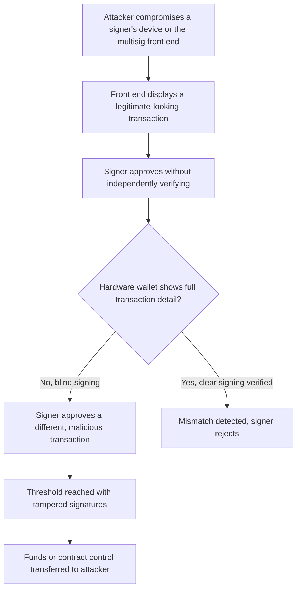
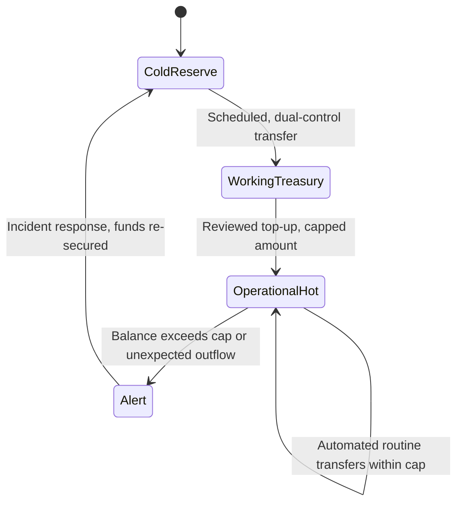

# Part 2: Web3-Specific Considerations

[Back to Handbook contents](index.md) | [Series index](../index.md)

Part 1 established **operational security** (**OpSec**) vocabulary and the Zero Trust baseline. This Part applies that baseline to what actually differs in Web3: a public ledger that erases the line between transparency and privacy, keys that are bearer instruments with no chargeback, and organizations that run on distributed contributors, SaaS tooling, and community channels an adversary can watch as easily as an employee can. Every chapter below pairs a Web3-specific challenge with the endpoint, workspace, authentication, communication, and travel controls a team uses to hold the line against it.

---

## 5. Web3 OpSec Challenges

This chapter names the structural properties of Web3 systems and teams that break assumptions a conventional **OpSec** program takes for granted, before later chapters turn each one into a control.

### 5.1 Transparency vs. Privacy

A public blockchain is a permanent, queryable record of every transaction a wallet has ever made. That transparency is a deliberate design goal: it is what lets anyone verify a protocol's solvency or a contract's behavior without trusting an intermediary. It is also a standing **OpSec** liability, because the same ledger that lets a user audit a protocol lets an adversary audit a team. Chain-analytics platforms such as Chainalysis Reactor, Arkham Intelligence, and Nansen cluster addresses by co-spend patterns, label them from exchange know-your-customer (KYC) data leaks and public disclosures, and can turn a single careless address reuse into a map of a team's entire treasury, personal holdings, and transaction timing. North Korea (Democratic People's Republic of Korea, DPRK)-linked actors used exactly this kind of reconnaissance ahead of the intrusions that made them responsible for $1.34 billion of the $2.2 billion in total cryptocurrency stolen in 2024, 61% of the year's total ([Chainalysis 2025 Crypto Crime Report](https://www.chainalysis.com/blog/2025-crypto-crime-report-introduction/)).

The practical response is not secrecy about the protocol, which would defeat the point of a public chain, but deliberate **compartmentalization** of what a given address reveals:

| On-chain exposure by default | Mitigation |
|---|---|
| Treasury and admin wallet balances, visible to anyone | Fresh, single-purpose addresses; never fund an operational wallet directly from a KYC'd personal exchange account |
| Timing and gas patterns correlating a wallet to a time zone or individual | Batch or schedule transactions; avoid signing at the same time of day from the same wallet |
| Ethereum Name Service (ENS) or similar naming linking a wallet to a public identity | Use unlabelled addresses for treasury operations; reserve named addresses for public-facing donation or payment flows only |
| Counterparty graph exposed by every transfer | Route high-sensitivity transfers through processes reviewed for unintended linkage before signing |

### 5.2 Decentralized Operations and Distributed Teams

A Web3 organization rarely has a network perimeter to defend, because it rarely has a single network. Core contributors, auditors, community moderators, and Decentralized Autonomous Organization (DAO) delegates work from personal devices, home and coworking networks, and their own choice of cloud accounts, spread across jurisdictions and time zones. Bring-your-own-device (BYOD) is the default operating mode, not an exception carved out for convenience. Every contributor's **personal security** hygiene becomes, in effect, part of the organization's **attack surface**, which is precisely the condition NIST Special Publication (SP) 800-207 Zero Trust Architecture was written for: identity and device posture, not network location, is what has to carry the trust decision ([NIST SP 800-207](https://csrc.nist.gov/pubs/sp/800/207/final)).

The right controls depend on how the team is structured:

| Coordination model | Primary OpSec risk | Baseline control |
|---|---|---|
| Fully doxxed core team | Individuals are identifiable, high-value targets for physical and social-engineering attacks | Personal threat modeling per role; travel and physical security controls (Chapter 10) |
| Pseudonymous contributors | Identity theft of the pseudonym; no reliable background check | Scoped access regardless of tenure; reputation and contribution history as a trust proxy, never a substitute for access control |
| Hybrid (doxxed leadership, pseudonymous contributors) | Impersonation of either group to reach the other | Out-of-band identity verification (9.1) before any access grant or fund request crosses the doxxed/pseudonymous boundary |

### 5.3 Cryptocurrency and Digital Asset Security

Cryptographic keys in Web3 are bearer instruments: whoever can produce a valid signature controls the asset, permanently and irreversibly, with no chargeback and no help desk that can undo a transfer. Chainalysis attributes 43.8% of the $2.2 billion stolen across the industry in 2024 to **private key** compromise, the single largest cause category tracked ([Chainalysis 2025 Crypto Crime Report](https://www.chainalysis.com/blog/2025-crypto-crime-report-introduction/)). Everything in this section exists to shrink that number for your organization specifically.

#### 5.3.1 Cold vs. Hot and Key Compartmentalization

A hot wallet holds a **private key** on a network-connected device so it can sign transactions with minimal friction; a cold wallet keeps the key generated and stored on a device that never touches the internet, commonly a **hardware wallet** or an air-gapped machine, and signs by exporting an unsigned transaction, moving it out of band, and returning only the signature. Hot wallets trade security for availability and belong only where availability is the point: paying gas, funding a bot, settling small operational transfers. Cold storage trades availability for security and belongs wherever the loss of the asset would be organizationally significant.

**Compartmentalization** is the discipline that makes the hot/cold split actually work: one key, one purpose, and no key spans a **trust boundary**. A deployment key should never also be a treasury key. A testnet key should never share a seed with anything holding mainnet value. A departing contractor's access should map to keys that can be rotated in isolation, not a shared wallet the whole team uses.

| Wallet tier | Typical balance ceiling | Storage medium | Signing cadence |
|---|---|---|---|
| Operational hot wallet | Days of gas and routine transfer volume | Software wallet on a dedicated machine (6.2) | Frequent, often automated within scoped limits |
| Working treasury | Weeks of runway | Multisig or MPC threshold wallet (5.3.2) | Scheduled, human-reviewed |
| Cold reserve | Majority of holdings | Air-gapped hardware wallet, geographically distributed backups | Rare, manual, dual-control |

#### 5.3.2 Multisig and Threshold Key Management

Multi-signature (**multisig**) wallets require M of N designated signers to approve a transaction on-chain, most commonly through the [Safe](https://safe.global/) smart contract standard. Threshold signature schemes (TSS) and multi-party computation (MPC) wallets achieve a similar M-of-N property off-chain: no single device ever assembles a complete **private key**, only a share of one, and a threshold of shares cooperates to produce a single signature. Both approaches remove the single point of failure a lone hot key represents, but both share an exploitable weak point: each signer still has to look at a proposed transaction and decide whether to approve it, and that decision happens on an ordinary computer running an ordinary browser.

The February 2025 Bybit incident is the largest cryptocurrency theft on record and the clearest illustration of that weak point. Attackers compromised infrastructure at Safe{Wallet}, the third-party interface Bybit's signers used to review and approve multisig transactions, and manipulated what those signers saw on screen while a different, malicious transaction was actually being signed. Bybit's signers approved what appeared to be a routine cold-wallet transfer; the transaction that executed reassigned control of the wallet and drained roughly 400,000 Ether worth $1.4 to $1.5 billion. The Federal Bureau of Investigation (FBI) attributed the intrusion to North Korea's Lazarus Group, tracked under the alias TraderTraitor ([Bybit hack summary, Wikipedia](https://en.wikipedia.org/wiki/Bybit)).

Radiant Capital suffered the same class of attack eight months earlier, at smaller scale but with the mechanism laid bare. The protocol used a 3-of-11 Safe multisig. Malware planted on three signers' devices intercepted the Safe front end so that it displayed the legitimate, intended transaction on screen while silently substituting a malicious transaction for the signers' hardware wallets to actually approve, exploiting the fact that hardware wallets often show only a truncated hash or a generic confirmation rather than full transaction details, a failure mode known as **blind signing**. The team had grown accustomed to occasional transaction failures as routine noise, which let the attacker collect signatures without triggering suspicion. The stolen signatures handed control of Radiant's Pool Provider contract to the attacker, who upgraded the lending pools to malicious versions and drained approximately $53 million ([Halborn, Radiant Capital hack explained](https://www.halborn.com/blog/post/explained-the-radiant-capital-hack-october-2024)).



*Figure 1. The blind-signing attack chain behind the Bybit and Radiant Capital losses. The single control that breaks the chain is a signer independently verifying the transaction on a device the attacker does not control, at the point marked D.*

Defenses follow directly from where the chain breaks: require every signer to verify the recipient address, amount, and calldata on the **hardware wallet**'s own display, never trusting the software front end alone; adopt clear-signing standards and independent transaction-simulation tools that decode calldata into human-readable terms rather than a raw hash; confirm the transaction hash through a channel the front end does not control; and treat any signer's report of "the transaction failed, trying again" as an incident-worthy anomaly rather than routine friction, exactly the assumption Radiant's team lost to.

### 5.4 Smart Contract and Protocol Exposure

A contract's code can pass a rigorous audit and remain one phished operator away from compromise if its administrative controls are not treated as OpSec-critical assets in their own right. Upgrade authority, pause functions, and parameter-setting roles are, from an **operational security** standpoint, just another set of keys, and every control this Part describes for treasury keys applies equally to them. The Smart Contract Security Verification Standard's access-control requirements define what "correct" administrative control looks like in code; this handbook is concerned with keeping the humans and machines that hold those admin keys from being the reason the code's guarantees fail in practice ([SCSVS](https://scs.owasp.org/)).

Operational controls that belong alongside the code-level ones:

- Admin keys held by a **multisig** or timelock, never a single externally owned account (EOA), with the same signer hygiene as 5.3.2.
- A timelock delay long enough for the community or an internal review process to react to a malicious or erroneous proposed change before it executes.
- Monitoring on every privileged function call, alerting the security team the moment an admin function fires, not after a post-incident review discovers it.
- Documented, rehearsed use of pause functionality, so the first time it is invoked is not during a live incident.
- Regular verification that on-chain admin roles match the organization's actual current personnel; a departed contractor's still-active admin key is a live vulnerability, not a paperwork gap (cross-reference Part 1, 3.2.3, offboarding and credential revocation).

### 5.5 Community and Open-Source Dynamics

Open-source code and public community channels are core to how Web3 projects build legitimacy, and both give an adversary a research environment most conventional targets never offer. Attackers can study a codebase's history for patterns before submitting a plausible pull request, observe how a support channel actually operates to craft a convincing impersonation, and identify which community moderators or "official" bot accounts hold elevated trust worth compromising. Discord and Telegram channels see impersonation of core developers, fake support accounts directing users to "verify your wallet" phishing sites, and compromised moderator accounts posting malicious "airdrop claim" links to an audience primed to trust them. On the code side, a patient, trust-building contribution history is the same playbook that produced the XZ Utils backdoor, where an attacker contributed to a project for more than two years to earn commit access before inserting a backdoor into an official release ([Trail of Bits on XZ Utils](https://blog.trailofbits.com/2025/09/24/supply-chain-attacks-are-exploiting-our-assumptions/)).

Baseline controls: default new community members to a read-only role until a manual or time-based promotion; require at least two independent reviewers on any pull request touching deployment, signing, or dependency-manifest files, regardless of the contributor's history; never grant an external contributor merge rights into a branch that triggers a build or deploy pipeline; and publish an official, cryptographically verifiable channel (a signed announcement key, a pinned message) for security-relevant communications so community members have a way to distinguish real alerts from impersonation.

### 5.6 Entry-Point Centralization (DNS, Front-Ends, RPC)

A protocol can be fully decentralized at the contract layer and still depend on a small number of centralized chokepoints for users to ever reach it: the Domain Name System (DNS) name in the address bar, the front-end application that renders the interface, and the Remote Procedure Call (RPC) endpoint that actually broadcasts a signed transaction to the network. Compromising any one of these lets an attacker manipulate what a user sees and signs without touching a single line of audited contract code, the exact pattern the OWASP Web3 Attack Vectors Top 15 tracks as supply-chain compromise (WA02) and User Interface and User Experience (UI/UX) deception (WA06) ([OWASP Web3 Attack Vectors Top 15](https://scs.owasp.org/sctop10/Web3-Attack-Vectors-Top15/)). Front-end DNS hijacks that redirect users toward a malicious clone site, and malicious or spoofed RPC endpoints that lie about balances or silently rewrite transaction data before a wallet ever sees it, have both recurred across DeFi protocols since 2022; the deep technical controls for the DNS and front-end layers are covered in the CDN and Front-End Supply Chain Handbook (01) and the DNS and Hosting Security Handbook (02).

From an **OpSec** standpoint, the discipline is treating every one of these chokepoints as a critical asset with a named owner, not an implementation detail:

| Entry point | Single point of failure | OpSec control |
|---|---|---|
| Domain registrar account | Domain hijack redirects all users instantly | Registrar lock, dedicated hardened login, no shared credentials |
| Content delivery network (CDN) / hosting account | Malicious front-end served to every visitor | Multi-person approval for deploys, subresource integrity on scripts (Handbook 01) |
| RPC provider account and default endpoints | Transaction manipulation or censorship before broadcast | Verified default RPC list, monitoring for unexpected endpoint changes prompted in-wallet |
| Mobile app store listing | Fake or hijacked listing distributes malicious app | Verified publisher account, MFA on the developer console (Chapter 8) |

---

## 6. Endpoint and Device Security

Every control in Chapter 5 ultimately executes on a physical device. This chapter sets the hardening baseline for those devices, then layers additional controls onto the subset of machines that sign or deploy anything of value.

### 6.1 Workstation Hardening

Baseline workstation hardening is not Web3-specific, but it is the floor every other control in this handbook stands on: a compromised operating system defeats a **hardware wallet** just as easily as it defeats a password manager. Apply full-disk encryption on every device that ever touches organizational data or keys; keep the operating system and browser on automatic security updates; run endpoint detection and response (EDR) tooling that alerts a central team rather than only the local user; disable USB auto-run and restrict removable media where feasible; remove local administrator rights from standard user accounts; and set a short, enforced screen-lock timeout. The [CIS Benchmarks](https://www.cisecurity.org/cis-benchmarks) provide configuration baselines per operating system that a small team can adopt without building a hardening standard from scratch.

**Workstation hardening checklist**

- [ ] Full-disk encryption enabled and verified, not just assumed
- [ ] OS and browser patched automatically; no manually-deferred update queue
- [ ] EDR agent installed, reporting to a monitored console
- [ ] Local admin rights removed from daily-use accounts
- [ ] Screen lock at 5 minutes or less, biometric plus passphrase fallback
- [ ] USB auto-run disabled; unknown removable media never plugged in

### 6.2 Secure Development and Signing Machines

A machine that deploys contracts, holds infrastructure credentials, or signs a **multisig** transaction carries materially more risk than a daily-use laptop and deserves a materially higher trust tier, isolated from everyday browsing, email, and messaging. This is precisely the gap North Korea-aligned actors exploited against Radiant Capital: signers used devices that also handled Telegram and file attachments, and a malicious file delivered through that ordinary channel became the beachhead for a $53 million theft (5.3.2). A dedicated signing machine, used for nothing else, removes the exposure a general-purpose device accumulates simply by existing on the internet.

| Property | Daily-driver laptop | Dedicated signing machine |
|---|---|---|
| Email and messaging clients | Installed, actively used | None installed |
| Browser extensions | Whatever the user has accumulated | Only what signing requires, reviewed |
| Software installation | Unrestricted | Allowlisted, reviewed before install |
| Network exposure | Full internet access | Restricted to required endpoints where feasible |
| Session persistence | Long-lived, always logged in | Rebuilt from a clean image between sensitive sessions where operationally possible |

Where a fully dedicated physical machine is not feasible for a smaller team, a hardened virtual machine reserved exclusively for signing, ideally rebuilt from a known-clean snapshot on a regular cadence, delivers most of the same isolation.

### 6.3 Browser Security and Browsing Safely

The browser is the execution environment for the wallet itself: extension-based wallets inject page-accessible interfaces, and a malicious or compromised extension, a malvertised search result, or a fake wallet-connection popup can intercept a transaction before it ever reaches the **hardware wallet** for confirmation. Malicious browser extensions that harvest clipboard contents (to swap a copied wallet address for an attacker's) or capture screenshots have repeatedly been distributed through official extension stores under innocuous-sounding names, which makes extension count and permission scope, not just extension source, a control worth enforcing.

Practical controls: maintain a dedicated browser profile used only for wallet interaction, with the minimum set of extensions the workflow actually requires; review each extension's requested permissions before installing and again on any update; verify URLs character by character before connecting a wallet, since homoglyph domains (substituting visually similar Unicode characters) remain a live phishing technique; and use a transaction-simulation or decoding tool that renders calldata in human terms before a signature is requested, so a malicious contract interaction is visible before approval rather than discovered afterward.

### 6.4 Hardware Wallet and Key Storage Hygiene

A **hardware wallet** keeps the **private key** inside a secure element that never exposes it to a network-connected computer, signing by displaying the transaction on its own screen and requiring a physical confirmation. That security model depends entirely on two things the operator controls: buying the device through a channel that guarantees it has not been tampered with, and actually reading what the device's screen shows before pressing confirm. Devices purchased secondhand or through unofficial resellers have been documented arriving with a pre-seeded recovery phrase, letting the seller drain funds the moment the "new" wallet is funded; buy only direct from the manufacturer or an authorized reseller, verify the tamper-evident packaging, and generate the seed on the device yourself rather than trusting a pre-printed card in the box.

The [Ledger Recover](https://www.ledger.com/) key-backup service, announced in 2023, drew industry scrutiny precisely because it proposed extracting key shares from the secure element for an optional recovery service, prompting a public debate about what "the key never leaves the device" actually guarantees when a vendor can ship a firmware update changing that behavior. The lesson generalizes: a hardware wallet's security model rests on vendor firmware integrity as much as on the secure element itself, so verify firmware signatures before updating and never install firmware from a link received in an unsolicited message.

**Key storage checklist**

- [ ] **Seed phrase** recorded on a fire- and water-resistant metal backup, never photographed or stored in cloud notes
- [ ] Seed phrase split (Shamir's Secret Sharing or SLIP-39) or a hidden passphrase wallet used for the highest-value holdings
- [ ] PIN set to the device maximum length the workflow tolerates
- [ ] Device and its only backup never traveling together (10.2)
- [ ] Firmware updates verified against the vendor's published signature before installing

### 6.5 Separation of Hot and Cold Operations

Chapter 5's hot/cold split (5.3.1) only holds if the operational workflow enforces it every day, not just at wallet-creation time. The rule that makes it durable: a hot wallet is topped up from cold storage on a schedule or by manual review, never automatically, and no automation script, deployment pipeline, or bot ever holds a key with cold-tier value behind it.



*Figure 2. Fund flow across wallet tiers. Value moves down toward operational use through reviewed, capped steps; an alert on any breach of the operational cap routes the response back to cold reserve rather than compounding exposure in the hot tier.*

---

## 7. Workspace and Productivity Security

Web3 teams run day-to-day operations, ironically, on the same Software-as-a-Service (SaaS) productivity stack every other organization uses. That stack is where an attacker often gets the first foothold, well before ever touching a wallet.

### 7.1 Google Workspace and Collaboration Platform Hardening

Google Workspace, or an equivalent SaaS identity platform such as Microsoft 365, functions as the organization's identity provider (IdP) for email, documents, and often single sign-on into other tools, which makes its admin console a single point of compromise worth defending at the tenant level. Enforce two-step verification for every account with no exceptions, enroll privileged administrators in Google's Advanced Protection Program for phishing-resistant hardware-key-only authentication, restrict third-party OAuth application access to an explicit allowlist so a malicious "connect your Google account" app cannot silently harvest Drive or Calendar data, and review the admin console's audit log on a fixed cadence rather than only after something looks wrong ([Google Workspace security checklist](https://knowledge.workspace.google.com/admin/security/security-checklist-for-medium-and-large-businesses-100-users)).

**Workspace admin hardening checklist**

- [ ] Org-wide two-step verification enforced, no per-user opt-out
- [ ] Advanced Protection Program (or equivalent) enrolled for admins and treasury-adjacent roles
- [ ] Third-party OAuth apps allowlisted, not open by default
- [ ] Legacy protocol access (IMAP/POP, basic auth) disabled
- [ ] Admin console audit log reviewed on a fixed weekly or monthly cadence

### 7.2 Password Management and Robustness

A team password manager replaces the alternative every organization defaults to without one: password reuse across dozens of SaaS tools, and credentials shared over Slack or email in plaintext. A shared-vault model lets service credentials (a shared exchange sub-account login, a monitoring dashboard) be granted, rotated, and revoked per person without ever appearing in a chat log. [NIST SP 800-63-4](https://csrc.nist.gov/pubs/sp/800/63/4/final), finalized on 31 July 2025, continues the direction of prior guidance: favor length over enforced complexity, screen new passwords against known-breach corpora, and drop mandatory periodic rotation absent specific evidence of compromise, since forced rotation on a fixed schedule measurably pushes users toward weaker, more predictable passwords.

| Policy element | NIST SP 800-63-4-aligned guidance |
|---|---|
| Minimum length | At least 8 characters for user-chosen passwords, 15+ recommended for higher-assurance accounts |
| Complexity rules | Not required; length and breach screening matter more |
| Rotation | Only on evidence of compromise, not a fixed calendar |
| Storage | Password manager with vault-level access control, never plaintext or spreadsheet |

### 7.3 Multi-Factor Authentication (MFA) Hardening

This section covers configuring MFA specifically within the productivity and collaboration stack; the standards-level comparison of MFA methods and their phishing resistance is in 8.1. Enforce a phishing-resistant method (FIDO2/WebAuthn security key or platform passkey) organization-wide inside the Google Workspace, Okta, or Azure AD admin console, and explicitly disable SMS or voice call as a fallback factor, since a fallback is only as strong as its weakest option regardless of what the primary factor is. Alert on any change to a user's registered MFA method: an attacker adding a new authenticator to a compromised account is a well-established persistence step, and catching it in near real time turns what would be a silent takeover into a contained incident.

---

## 8. Authentication and Access

Where Chapter 7 hardened the productivity stack specifically, this chapter defines the authentication and access-control principles that apply across every system a Web3 team touches, from cloud infrastructure to the signing tools covered in Chapter 6.

### 8.1 Multi-Factor Authentication (MFA)

Multi-factor authentication (MFA), sometimes called two-factor authentication (2FA), combines two or more independent factors: something the user knows (a password), something the user has (a security key or authenticator app), or something the user is (biometrics). Factors are not interchangeable in the security they provide. The Cybersecurity and Infrastructure Security Agency (CISA) ranks methods explicitly by phishing resistance and recommends FIDO2/WebAuthn hardware security keys and passkeys as the strongest widely available option, because the cryptographic challenge-response is bound to the specific origin requesting it and cannot be replayed against a look-alike site ([CISA, phishing-resistant MFA](https://www.cisa.gov/sites/default/files/2023-01/fact-sheet-implementing-phishing-resistant-mfa-508c.pdf); [FIDO Alliance passkeys](https://fidoalliance.org/passkeys/)).

| Factor type | Phishing resistance | Primary weakness |
|---|---|---|
| FIDO2/WebAuthn security key or passkey | High | Device loss without a registered backup key |
| Time-based one-time password (TOTP) app | Medium | Code can be relayed in real time by a phishing proxy |
| Push notification approval | Medium-low | Push-bombing / MFA fatigue: repeated prompts until the user approves out of annoyance |
| SMS or voice call one-time password | Low | SIM swap, SS7 interception, no cryptographic binding to the site |

### 8.2 Password and Credential Management

Where 7.2 covered human passwords for SaaS logins, this section covers the fuller credential lifecycle: service accounts, application programming interface (API) keys, CI/CD pipeline secrets, and cloud provider root credentials, none of which belong in a human-facing password manager alone. Route machine credentials through a secrets manager (a cloud provider's key management service, HashiCorp Vault, or an equivalent) with per-service scoping and access logging, never a shared root or admin login used by multiple humans or systems. Trigger rotation on role change and offboarding as a hard gate, not a best-effort follow-up (cross-reference Part 1, 3.2.3): a credential that outlives the person who needed it is a standing liability with no offsetting benefit.

### 8.3 Hardware-Backed Authentication

Hardware-backed authentication anchors a credential to a physical device's secure element rather than to something that can be copied, phished, or brute-forced remotely. FIDO2 security keys (YubiKey and equivalents) and passkeys, whether device-bound or synced across a vendor's ecosystem, are the user-facing form of this; for developers, the same principle extends to signing Secure Shell (SSH) and code-commit keys with a hardware-backed key rather than a plain file on disk.

```bash
# Generate an SSH key backed by a FIDO2 security key (resident, discoverable)
ssh-keygen -t ed25519-sk -O resident -O verify-required -C "signing-machine-key"

# Configure git to require a hardware-backed signature on every commit
git config --global gpg.format ssh
git config --global user.signingkey ~/.ssh/id_ed25519_sk.pub
git config --global commit.gpgsign true
```

A hardware-backed commit signature means a stolen laptop's disk image alone cannot forge a commit as a trusted maintainer; the physical key still has to be present and touched. This closes exactly the kind of maintainer-impersonation gap that made the XZ Utils backdoor possible over a long enough timeline (5.5).

### 8.4 Identity and Access Management (IAM) in Web3 Contexts

Traditional identity and access management (IAM), single sign-on (SSO) through Security Assertion Markup Language (SAML) or OpenID Connect (OIDC) into internal SaaS tools, gets a Web3-native counterpart in wallet-based authentication. Sign-In with Ethereum ([EIP-4361](https://eips.ethereum.org/EIPS/eip-4361)) standardizes how an Ethereum account authenticates to an off-chain service by signing a structured message instead of submitting a password, replacing a phishable credential with a cryptographic proof of key possession. That trade shifts the entire trust anchor onto wallet-key hygiene: every control in Chapter 6 now doubles as an IAM control the moment a service accepts wallet-based login. Account-abstraction session keys ([EIP-4337](https://eips.ethereum.org/EIPS/eip-4337)) extend the model further, letting a user grant a dApp a time-boxed, function-scoped signing authority instead of exposing the master key to every interaction, the Web3 analogue of a short-lived, least-privilege access token.

| Traditional IAM control | Web3-native analogue |
|---|---|
| SSO via SAML/OIDC | Sign-In with Ethereum (EIP-4361) |
| Scoped OAuth access token | Account-abstraction session key (EIP-4337) |
| Role-based access control | Multisig threshold and per-role signer sets (5.3.2) |
| Just-in-time privilege elevation | Time-boxed session keys, revoked automatically on expiry |

---

## 9. Communication and Collaboration Security

Communication channels are where most Web3 intrusions actually begin, well upstream of any wallet or contract. This chapter treats channel selection, key handling, and third-party integrations as first-class **OpSec** surfaces.

### 9.1 Secure Channels for Internal and External Comms

Match channel choice to sensitivity, and assume public community channels are fully adversary-monitored, because they are. A public Discord or Telegram server is a research environment for an attacker, not a private space; internal team channels on Slack or Signal are better but remain SaaS-hosted and phishable; the highest-sensitivity conversations, anything touching keys, signing, or fund movement, deserve an out-of-band, previously-established channel with disappearing messages, never the default team chat.

North Korea-aligned actors run a well-documented playbook against exactly this boundary, publicly tracked as Slow Pisces, Jade Sleet, or TraderTraitor: pose as a recruiter or collaborator on LinkedIn, move the conversation to a "coding assessment" hosted in a plausible-looking GitHub repository, or to a video call where the target is asked to "fix your camera or microphone driver" before the call can proceed, and use that pretext to deliver malware disguised as a routine software fix ([Unit 42, Slow Pisces](https://unit42.paloaltonetworks.com/slow-pisces-new-custom-malware/)).

**Communication channel checklist**

- [ ] Never act on a funds- or credential-related request received through a single channel; verify through a second, previously-established channel first
- [ ] Never install software, drivers, or "fixes" prompted mid-conversation or mid-call
- [ ] Treat unsolicited recruiter or collaboration outreach touching crypto work as a phishing vector by default until verified
- [ ] Reserve the highest-sensitivity channel for key and signing conversations exclusively

### 9.2 Handling of Keys, Mnemonics, and Sensitive Data

One rule sits above every other control in this section: seed phrases, private keys, and **multisig** approval requests are never transmitted through any chat, email, or file-sharing channel, encrypted or not. This is not a theoretical caution; it is the literal mechanism behind the $53 million Radiant Capital loss, where a malicious file delivered as a routine "contractor deliverable" over Telegram was the entry point for the malware that ultimately hijacked signer approvals (5.3.2). A file transfer channel is not a secure enclave, and no amount of end-to-end encryption on the channel protects against a malicious payload the recipient is asked to open.

For any high-value transaction, apply a standing **out-of-band verification** protocol before signing: confirm the request through a second communication channel, verify the requester's identity live rather than trusting a text or chat handle, and independently verify the transaction hash and calldata on the **hardware wallet**'s own display, never on the trust of a screen-shared or described transaction. This closes the exact gap the blind-signing diagram in 5.3.2 identifies as the attack's decision point.

| Data type | Acceptable channel | Never acceptable |
|---|---|---|
| Seed phrase, private key | Never transmitted; generated and stored offline only | Any chat, email, screenshot, or cloud note |
| Multisig transaction approval request | In-app notification plus independent hardware-wallet verification | A described or screen-shared transaction with no independent verification |
| Routine operational credentials | Team password manager, per-user scoped access | Plaintext in chat, shared documents |

### 9.3 Collaboration Tools and Workspace Security

Beyond the identity-provider hardening in 7.1, the bot, webhook, and OAuth integration layer of Discord, Slack, Notion, and GitHub is its own **attack surface**: a third-party bot requesting broad OAuth scopes, a webhook URL accidentally committed to a public repository, or a GitHub Action with write access to protected branches or repository secrets all give an attacker a path that never touches a password. The tj-actions/changed-files compromise of March 2025, which altered a GitHub Action used across more than 23,000 repositories to dump CI runner memory into logs, is the general pattern this section defends against, covered in full in the CDN and Front-End Supply Chain Handbook (01).

Review and prune app and bot integrations on a quarterly cadence rather than leaving them to accumulate indefinitely; scope GitHub organization tokens to the minimum required repositories and permissions rather than an org-wide grant; and require branch protection with mandatory reviews on any repository that touches deployment scripts, signing tooling, or infrastructure-as-code, so a compromised or malicious contribution cannot reach production through a single approval.

---

## 10. Travel and Remote Work

Physical mobility introduces a **threat model** conventional **OpSec** programs often underweight: device seizure, jurisdiction-dependent search authority, and the fact that a stolen laptop belonging to a multisig signer is a direct path to theft, not merely a data-exposure incident.

### 10.1 Travel Security Overview

Not every traveler carries the same risk, and controls should scale with what a compromised device or seized traveler actually exposes.

| Traveler risk tier | Exposure if device is seized or compromised | Baseline control |
|---|---|---|
| Non-signer employee | Internal documents, SaaS session tokens | Standard device hardening (6.1), session revocation on report |
| Multisig signer | Direct path to fund theft if signing credentials are reachable | Temporary signer-role delegation before travel; clean loaner device (10.2) |
| Founder or treasury-access role | Full organizational exposure, highest-value target | Dedicated travel device with zero standing production access; pre-cleared incident response plan |

### 10.2 Pre-Travel Checklist and Device Hygiene

Preparation before departure matters more than any control applied at the border, because by the time a device is in an agent's hands, the only remaining question is what it contains.

**Pre-travel checklist**

- [ ] Travel with a clean loaner device wiped of production access, not the primary daily-use machine, wherever the role allows it
- [ ] Full-disk encryption with a strong passphrase, not biometric-unlock alone; a passphrase carries stronger legal protection against compelled disclosure in many jurisdictions than a fingerprint or face unlock ([EFF, Digital Privacy at the U.S. Border](https://www.eff.org/wp/digital-privacy-us-border-2017))
- [ ] Temporarily delegate or revoke standing **multisig** signing rights before departure if the role and threshold configuration allow it
- [ ] Never carry a **hardware wallet** and its only seed-phrase backup on the same trip
- [ ] Register device serial numbers with IT for remote-wipe capability before leaving
- [ ] Power down devices fully before reaching any checkpoint; a powered-off device resists a wider class of extraction techniques than one merely locked

### 10.3 Secure Access While Traveling

Public and hotel networks are hostile by default; a virtual private network (VPN) raises the bar but is not sufficient on its own, since it protects the network path without addressing a compromised endpoint or a malicious captive portal. Never sign a **multisig** transaction from an unmanaged network or an untrusted device, prefer a mobile hotspot on a carrier account not vulnerable to SIM-swap targeting over public wifi, and disable auto-join wifi and Bluetooth so a device does not silently associate with a spoofed access point mimicking a known network name.

### 10.4 Remote Work and Overseas Consultation Considerations

Remote hiring and overseas consulting arrangements are also where the DPRK IT-worker infiltration scheme most directly threatens a Web3 team. North Korean operatives have posed as remote contractors and full-time employees, using stolen, fabricated, or purchased identities and, in documented cases, real-time video manipulation, to gain legitimate insider access to codebases, infrastructure, and in some instances treasury-adjacent operations; Chainalysis links a portion of 2024's $1.34 billion in DPRK-attributed cryptocurrency theft to exactly this infiltration vector ([Chainalysis 2025 Crypto Crime Report](https://www.chainalysis.com/blog/2025-crypto-crime-report-introduction/); [MITRE AADAPT](https://aadapt.mitre.org/)). The personnel-side depth on this threat, including hiring-pipeline controls, belongs to the Hiring, Remote Work, and **Insider Threat** Handbook (05); the OpSec-specific mitigation is scoping what a new remote hire or consultant can touch until trust is independently established.

**Remote hire and consultant vetting checklist**

- [ ] Live, unscripted video interview, not a resume and asynchronous messaging alone
- [ ] **Identity verification** beyond a self-reported name and LinkedIn profile where feasible
- [ ] Payment-method and banking geography checked for consistency with the claimed location
- [ ] No production, signing, or treasury-adjacent access granted at onboarding; access staged and expanded only as trust is demonstrated over time
- [ ] Pseudonymous contributors held to the same staged-access model as named hires, since a background check is unavailable for either group in practice

---

**Key controls for Part 2**

- Compartmentalize keys by purpose and value tier (5.3.1), and require independent, on-device transaction verification for every **multisig** or threshold signature (5.3.2) to close the blind-signing gap behind the Bybit and Radiant Capital losses.
- Isolate signing and deployment machines from daily-use browsing, email, and messaging (6.2), and buy hardware wallets only through verified channels with vendor-signed firmware (6.4).
- Enforce phishing-resistant MFA (FIDO2/WebAuthn) organization-wide, with SMS explicitly disabled as a fallback (7.3, 8.1).
- Never transmit seed phrases, private keys, or approval requests through any chat, email, or file channel, and verify high-value transactions through a second, previously-established channel (9.2).
- Treat DPRK-linked fake-recruiter and fake-contractor campaigns as a standing threat to communication channels and hiring pipelines alike (9.1, 10.4), and stage access for every new remote hire or consultant regardless of how the relationship began.
