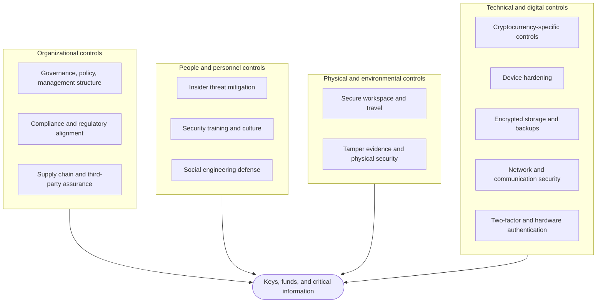
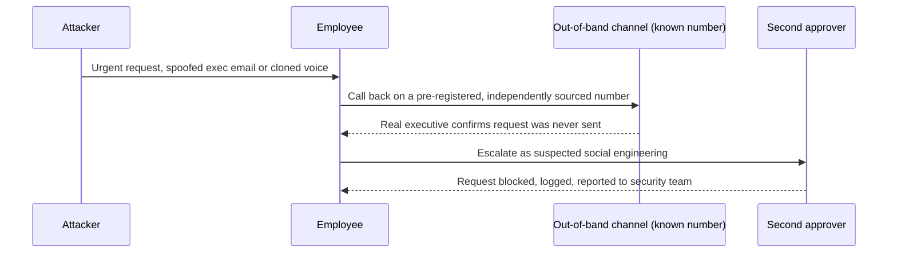
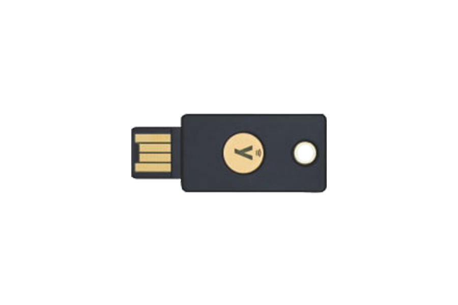
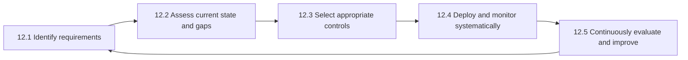

# Part 3: Control Domains

[Back to Handbook contents](index.md) | [Series index](../index.md)

Part 1 fixed the vocabulary and Part 2 walked the Web3-specific **attack surface**. This part turns that surface into a control catalog, organized into four domains so that no protective measure floats without a home and no domain is defended while its neighbors are ignored. It closes with a repeatable process for choosing, deploying, and revising controls, because a catalog without a selection method just becomes a compliance checklist nobody re-examines.

---

## 11. Control Domains Overview

Every control a Web3 team deploys falls into one of four domains: organizational, personnel, physical, or technical. The split matters because each domain has a different owner, a different failure mode, and a different pace of change: organizational controls move at the speed of policy review, technical controls at the speed of a patch cycle. A team that hardens only technical controls (firewalls, hardware wallets, disk encryption) while leaving governance and personnel controls informal builds a house with a reinforced door and an unlocked window. The [NIST Cybersecurity Framework (CSF) 2.0](https://csrc.nist.gov/pubs/cswp/29/the-nist-cybersecurity-framework-csf-20/final) frames this same gap through its Govern function, elevated in the 2.0 revision to sit alongside Identify, Protect, Detect, Respond, and Recover precisely because governance gaps sit behind a disproportionate share of incidents the earlier, purely technical categories never touched.



*Figure 1. The four control domains, each protecting the same core assets from a different angle. A gap in one domain is not compensated by strength in another; the DPRK IT-worker infiltration pattern documented by the [FBI, U.S. Department of State, and Treasury](https://www.fbi.gov/investigate/counterintelligence) succeeded against organizations with strong technical controls because the failure sat in the personnel domain, at hiring.*

The rest of this chapter works through each domain in turn. Chapter 12 then gives the process for turning the catalog into a program sized to a specific team's risk and revisited on a cadence rather than assumed permanent.

### 11.1 Organizational Controls

Organizational controls are the policies, structures, and assurance processes that make every other domain durable rather than accidental. They answer the question "who decided this, and how do we know it still applies?" A Web3 team without them ends up with controls that exist because one engineer set them up once, with no record of why, no owner when that engineer leaves, and no mechanism to update them as the **threat model** changes.

#### 11.1.1 Governance, Policies, and Management Structures

Governance is the decision-making structure that produces and maintains policy: who can approve a new custody arrangement, who owns the security budget, who signs off when a control is waived for a deadline. [NIST CSF 2.0](https://csrc.nist.gov/pubs/cswp/29/the-nist-cybersecurity-framework-csf-20/final)'s Govern (GV) function names this explicitly, covering organizational context, risk management strategy, roles and responsibilities, policy, and oversight as a first-class function rather than an implicit precondition. For a Web3 organization this usually means formalizing what a small founding team ran informally: a designated security owner (even part-time), a documented risk appetite statement, and a policy stack with clear precedence.

Structure the policy stack in layers so each document has a stable audience and update cadence: a short security policy stating intent and scope, approved by leadership and rarely changed; standards that set specific, testable requirements; procedures that describe exact steps; and guidelines that recommend without mandating. **Multisig** or DAO-based approval for policy changes fits naturally here: treat a change to the custody standard the same way you would treat a treasury transaction, requiring the same threshold of signers.

| Layer | Purpose | Example | Change cadence |
|-------|---------|---------|-----------------|
| Policy | States intent, scope, and accountability | "All production signing keys require hardware-backed MFA" | Annual, leadership-approved |
| Standard | Sets a specific, testable bar | "Treasury multisig threshold: minimum 3-of-5, no single jurisdiction majority" | Semi-annual |
| Procedure | Documents exact steps | Key-rotation runbook, offboarding checklist | As tooling changes |
| Guideline | Recommends without mandating | Suggested password manager, travel checklist | Ad hoc |

#### 11.1.2 Compliance and Regulatory Alignment

Regulatory exposure for a Web3 organization rarely maps onto a single jurisdiction, because contributors, users, and infrastructure are distributed. Several regimes still apply broadly enough to warrant a standing compliance function. The Financial Action Task Force's [Recommendation 16, the "Travel Rule,"](https://www.fatf-gafi.org/en/topics/virtual-assets.html) requires virtual asset service providers to collect and transmit originator and beneficiary information above defined thresholds. The European Union's [Markets in Crypto-Assets Regulation (MiCA)](https://www.esma.europa.eu/esmas-activities/digital-finance-and-innovation/markets-crypto-assets-regulation-mica) sets licensing, disclosure, and operational-resilience requirements for crypto-asset service providers serving EU users. U.S. teams must screen counterparties and transactions against [Office of Foreign Assets Control (OFAC)](https://ofac.treasury.gov/) sanctions lists, a control with direct technical teeth after enforcement actions against mixing services and specific wallet addresses.

Compliance and security overlap more in Web3 than in traditional finance because the control that satisfies a regulator (transaction monitoring, sanctions screening, know-your-customer/anti-money-laundering (KYC/AML) verification) is frequently the same control that catches an active attack in progress. Treat compliance as a security partner, not a separate checkbox exercise: route sanctions-screening alerts and Travel Rule anomalies to the same triage process as security incidents, and maintain evidence, such as a SOC 2 report or [ISO/IEC 27001:2022](https://www.iso.org/standard/27001) certification, that a counterparty or auditor will eventually request.

#### 11.1.3 Supply Chain and Third-Party Assurance

A Web3 organization's supply chain extends past code dependencies (the subject of Handbook 01's CDN and front-end supply chain treatment) into every vendor with access to keys, infrastructure, or user data: custodians, oracle providers, bridge operators, cloud hosts, RPC (remote procedure call) node providers, and the SaaS tools the team collaborates in. Each is a third party whose compromise becomes the organization's incident, so assurance means collecting evidence before trust is extended and re-verifying it on a schedule, not once at selection.

Require a minimum evidence package scaled to the vendor's access level: a recent SOC 2 Type II or ISO 27001 report for anyone touching production infrastructure, a published smart contract audit and bug bounty history for any on-chain dependency, and a software bill of materials (SBOM) in [CycloneDX](https://cyclonedx.org/) or [SPDX](https://spdx.dev/) format plus build provenance under the [Supply-chain Levels for Software Artifacts (SLSA)](https://slsa.dev/) framework for anyone shipping code into your build or production path.

| Vendor category | Minimum evidence required | Re-verification cadence |
|------------------|---------------------------|--------------------------|
| Custodian / MPC provider | SOC 2 Type II, insurance attestation, key-ceremony documentation | Annual |
| Smart contract dependency | Public audit reports, bug bounty status, upgrade governance | Per version bump |
| Cloud / infrastructure host | SOC 2 or ISO 27001, incident notification SLA | Annual |
| RPC / oracle provider | Uptime SLA, decentralization of data sources, incident history | Annual |
| SaaS collaboration tools | SSO/SCIM support, data residency, breach notification terms | Annual |

### 11.2 People and Personnel Controls

Technical controls constrain what a system permits; personnel controls constrain what a human is tricked or coerced into permitting. In Web3, where a single approved transaction can move an entire treasury and teams hire pseudonymously across borders, the personnel domain carries a disproportionate share of realized risk. Handbook 03 (Employee Lifecycle Security) and Handbook 05 (Hiring, Remote Work, and **Insider Threat**) go deep on hiring and lifecycle mechanics; this section covers the controls inside day-to-day **operational security**.

#### 11.2.1 Insider Threat Mitigation

**Insider threat** covers three distinct actors, each needing a different control. A malicious insider deliberately abuses legitimate access; a negligent insider creates risk through carelessness, such as reusing credentials or approving a transaction without reading it; a compromised insider is a legitimate account now controlled by an external attacker, functionally indistinguishable from a malicious insider until investigated. The [DPRK IT-worker scheme](https://www.justice.gov/archives/opa/pr/justice-department-announces-arrest-premises-search-and-seizures-multiple-website-domains), documented in repeated U.S. Department of Justice and Treasury actions, institutionalized a fourth pattern specific to this industry: operatives obtain legitimate remote developer roles at crypto companies using fabricated identities, generating a salary stream for a sanctioned regime and, in a subset of cases, direct access to code and infrastructure.

| Actor type | Detection signal | Primary mitigation |
|------------|-------------------|---------------------|
| Malicious insider | Access outside role scope, off-hours privileged actions, data staged before departure | Least privilege, separation of duties, exit revocation SLA |
| Negligent insider | Repeated policy exceptions, credential reuse, unreviewed approvals | Training, blind-signing bans, mandatory transaction simulation |
| Compromised insider | Impossible-travel logins, new device without MFA re-enrollment, unusual approval timing | Device attestation, session anomaly detection, hardware-key-bound sessions |
| DPRK/state-actor infiltration | Inconsistent identity documents, reluctance to appear on video, payment routed through mixing or exchange chains flagged by [Chainalysis](https://www.chainalysis.com/) or [TRM Labs](https://www.trmlabs.com/) reporting | Identity verification at hiring, video interview requirement, code contribution review, wallet-address screening for payroll |

Layer detection with prevention: least-privilege access limits what any single insider can reach, mandatory two-person review on treasury actions removes single points of betrayal, and offboarding automation (Handbook 03) closes the window between a role change and access revocation.

#### 11.2.2 Security Training and Culture

Training that runs once at onboarding decays within months against an evolving threat landscape; culture is what persists between formal sessions. Build a program around three cadences: onboarding (mandatory before credential issuance, covering the organization's custody model, approval workflows, and reporting channel), quarterly refreshers (rotating topics: phishing recognition, deepfake voice awareness, **hardware wallet** hygiene), and just-in-time training triggered by a near-miss or a new threat pattern observed in the industry.

Measure culture, not just completion. Track phishing simulation click-through rates over time (a healthy program trends down, not a permanently low number achieved by testing the same three people), track how quickly staff report suspicious contact versus how often security discovers it independently, and track whether staff use a "pause and verify" option without fear of looking slow. A culture where an engineer feels safe stopping a plausible $2 million transfer to ask "does this look right to you?" outperforms any single technical control, because it catches attacks specifically designed to defeat those controls.

#### 11.2.3 Social Engineering Defense

**Social engineering** in Web3 has moved past generic phishing into targeted, well-resourced campaigns: fake recruiter outreach carrying malware-laden "coding challenges," voice-cloned executives requesting urgent wire or signing actions, and impersonated **hardware wallet** or exchange support staff. The defining defense is out-of-band verification: never confirm an unusual, high-stakes request using a channel the request itself supplied.



*Figure 2. Out-of-band verification defeats spoofed or voice-cloned executive requests because the attacker cannot control a channel they were never given.*

Formalize the callback list in advance (pre-registered numbers for every executive and every approver, distributed through a channel the attacker cannot intercept) and pair it with a code-word or shared-secret convention for voice confirmation, since generative voice cloning has closed the gap that "I'd recognize their voice" used to cover. Report every attempt, successful or not, to build a pattern library; isolated near-misses often turn out to be reconnaissance for a coordinated campaign once compared across the team.

### 11.3 Physical and Environmental Controls

Physical security is easy to deprioritize in a domain that talks constantly about cryptography, but a stolen unlocked laptop or a compromised **hardware wallet** in transit defeats every cryptographic control behind it. Web3 teams are also unusually mobile and unusually likely to carry high-value physical key material (hardware wallets, **seed phrase** backups) across borders, which raises the stakes of this domain relative to a typical enterprise.

#### 11.3.1 Secure Workspace and Travel

A secure workspace starts with the basics that remote-first Web3 teams routinely skip: screen locks enforced by policy, visitors and roommates excluded from a view of the signing screen, and a clean-desk habit for any printed recovery material. Travel raises the **threat model** further: border crossings can compel device search or seizure in ways a home office never faces, public networks invite adversary-in-the-middle interception, and a lost bag can mean a lost key.

**Travel operational security checklist**

- Carry a dedicated travel device with minimal data, not your primary signing device, wherever the trip risk profile allows it.
- Move hardware wallets and seed backups in carry-on luggage, never checked baggage, splitting custody across separate bags or travelers when threshold custody allows it.
- Disable biometric unlock before crossing a border where compelled unlocking is a documented risk, reverting to a passphrase.
- Use a trusted, paid VPN on any public or hotel network; never sign a transaction or enter a recovery phrase on unmanaged Wi-Fi.
- Pre-register a check-in cadence with a designated contact for high-risk travel, with a defined escalation trigger.
- Avoid publicizing travel or conference plans in advance; targeted physical attacks against known key holders correlate with conference schedules.

#### 11.3.2 Tamper Evidence and Physical Security

Tamper evidence lets you detect interference with a device even when the interference was too skilled to leave functional traces. **Hardware wallet** vendors ship devices in tamper-evident packaging specifically so a purchaser can detect pre-shipment interdiction; verify the seal against the vendor's published reference images before first use, and treat any mismatch as a reason to discard the unit rather than debug it. Never accept a hardware wallet as a gift or pre-configured unit from an unverified source, and never restore a **seed phrase** you did not personally generate onto hardware you did not personally initialize.

Extend tamper evidence past the device itself: use numbered, void-indicating tamper-evident bags for any device or backup material in transit or storage, log serial and seal numbers at each handoff, and store master recovery backups in physically secured, rated locations (a bank safe deposit box, a UL/TL-rated commercial safe) distributed geographically so a single physical event cannot recover a full threshold. Document a chain-of-custody log for any physical key material, mirroring the evidentiary discipline forensic teams use, so any gap in custody is visible rather than assumed away.


*Figure. Tamper-evident tape leaves a visible void pattern once peeled, the same mechanism a numbered security bag uses to reveal interference with a hardware wallet or backup shard in transit. A missing or mismatched void pattern at handoff is a chain-of-custody failure, not a cosmetic detail. Source: [Wikimedia Commons](https://commons.wikimedia.org/wiki/File:Security_bag_tape_showing_voiding_when_removed.jpg), CC BY-SA 4.0.*

### 11.4 Technical and Digital Controls

Technical controls are where most Web3 security investment concentrates, and for good reason: they are the last line standing when organizational, personnel, and physical controls all fail simultaneously. They are also the domain most specific to Web3's core function, custody of cryptographic key material that directly authorizes value transfer with no reversal mechanism.

#### 11.4.1 Cryptocurrency-Specific Controls

Custody architecture is the central technical decision a Web3 organization makes, and it trades off liquidity against **blast radius**. A single-signature hot wallet is fastest to use and worst to lose; a fully offline, air-gapped cold wallet is safest at rest and slowest to operate; multisignature and multi-party computation (MPC) schemes sit between the two, distributing signing authority so no single compromised key or device authorizes a transfer alone.

| Custody model | Typical use | Compromise blast radius | Operational friction |
|----------------|-------------|---------------------------|------------------------|
| Hot wallet, single key | Operational float, gas reserves | Full loss of wallet balance | Low |
| Multisig (for example, [Safe](https://safe.global/), 2-of-3 or 3-of-5) | Treasury, protocol admin | Requires compromising threshold of signers | Medium |
| MPC custody | Institutional treasury, exchange-grade custody | Depends on provider's key-share distribution and policy engine | Medium |
| Cold storage, air-gapped | Long-term reserves | Requires physical access plus PIN/passphrase | High |

Two controls belong on every custody tier regardless of model: address allowlisting (restricting routine flows to pre-approved destinations) and **transaction simulation** before signing, using tooling that renders the actual state change a pending transaction will cause rather than trusting the signing interface's display. The February 2025 [Bybit](https://x.com/benbybit) incident, in which attackers compromised a Safe{Wallet} front-end and presented signers with a transaction display that did not match its actual on-chain effect, is the canonical argument for simulation independent of the signing UI: every signer approved what they saw on screen, and what they saw was not what executed. Align custody practice to the [CryptoCurrency Security Standard (CCSS)](https://cryptoconsortium.org/) where an external, auditable baseline is useful for counterparties or investors.

#### 11.4.2 Device Hardening

Every device that touches a key, a signing session, or privileged infrastructure access needs a hardened baseline, not the vendor default configuration. Start from a published benchmark: the [Center for Internet Security (CIS) Benchmarks](https://www.cisecurity.org/cis-benchmarks) provide OS-specific hardening guides, and [NIST SP 800-53](https://csrc.nist.gov/pubs/sp/800/53/r5/upd1/final) System and Communications Protection and System and Information Integrity control families map hardening requirements to the same catalog governance uses elsewhere in this handbook.

```bash
# macOS baseline spot-check before issuing a device for signing use
fdesetup status          # FileVault full-disk encryption: On
sudo spctl --status      # Gatekeeper: enabled
csrutil status            # System Integrity Protection: enabled
softwareupdate --list     # no pending critical updates
```

Minimum baseline for any device in the signing or privileged-access path: full-disk encryption enforced by policy, endpoint detection and response (EDR) tooling reporting to a central console, automatic updates with a short patch SLA for critical vulnerabilities, application allowlisting or at minimum a deny-list for known-malicious installer patterns (the fake recruiter "coding challenge" malware family is a recurring Web3-specific vector), and a dedicated, single-purpose device for high-value signing that never runs a general-purpose browser or email client.

#### 11.4.3 Encrypted Storage and Backups

Every piece of key material needs a backup, and every backup is a second copy of the thing an attacker wants most. Resolve that tension with cryptographic splitting rather than plaintext duplication. [SLIP-0039](https://github.com/satoshilabs/slips/blob/master/slip-0039.md) (Shamir's Secret Sharing for Mnemonic Codes) splits a seed into multiple shares with a defined threshold, so that, for example, any 3 of 5 shares reconstruct the seed while any 2 reveal nothing. This is materially stronger than the single [BIP-39](https://github.com/bitcoin/bips/blob/master/bip-0039.mediawiki) mnemonic phrase it is often layered on top of: loss of one share is not catastrophic, and theft of one share is not sufficient.

| Backup method | Threshold model | Primary risk | Best fit |
|----------------|-------------------|----------------|-----------|
| Single BIP-39 phrase, paper | None (single point) | Fire, water, single-location theft | Not recommended for material value |
| BIP-39 phrase, metal backup | None (single point, fire/water resistant) | Single-location theft | Personal wallets, low-to-moderate value |
| SLIP-39 shares, geographically split | k-of-n | Requires coordinating k custodians for recovery | Treasury, organizational custody |
| Encrypted digital backup (age, GPG) offline | Depends on key management | Passphrase or key compromise | Supplementary, never sole backup |

Encrypt any digital backup at rest with a well-reviewed tool (`age` or GPG with a strong passphrase) and store the encrypted artifact and the decryption key under separate custody so a single breach does not yield both halves. Test recovery on a schedule: an unverified backup is a hypothesis, not a control.

#### 11.4.4 Network and Communication Security

Network controls protect the path between a device and the services it depends on; communication controls protect the content moving over that path. Route all traffic from devices that touch signing or infrastructure access through a managed VPN or zero-trust gateway rather than trusting network location, consistent with the zero-trust posture Part 1 anchors in [NIST SP 800-207](https://csrc.nist.gov/pubs/sp/800/207/final). Configure DNS-over-HTTPS or DNS-over-TLS to reduce DNS-based interception, and block known-malicious or newly registered domains at the resolver.

```text
# WireGuard peer fragment: force all device traffic through the tunnel
[Interface]
PrivateKey = <device-private-key>
DNS = 10.10.0.1
[Peer]
Endpoint = vpn.example-org.internal:51820
AllowedIPs = 0.0.0.0/0, ::/0
```

For communication, standardize on end-to-end encrypted tooling with forward secrecy for anything discussing keys, incidents, or unreleased code: the [Signal Protocol](https://signal.org/docs/) is the reference implementation this handbook recommends by default, with disappearing messages enabled on sensitive channels so a compromised device has a bounded **blast radius** into history. Ban unmanaged personal messaging apps for security discussions, and provision or de-provision any group chat used for approvals through the same lifecycle process as any other access grant.

#### 11.4.5 Two-Factor and Hardware Authentication

Not every second factor resists the same attacker. SMS one-time passcodes (OTP) are vulnerable to SIM-swap fraud, a technique the [FBI's Internet Crime Complaint Center (IC3)](https://www.ic3.gov/) has repeatedly flagged in public service announcements as a growth vector specifically because it defeats an entire authentication factor without touching the victim's device. Push-based approval improves on SMS but remains vulnerable to "MFA fatigue" attacks, where an attacker spams approval requests until a tired or distracted user taps accept. Hardware security keys implementing the [FIDO2/WebAuthn](https://fidoalliance.org/fido2/) standard are the strongest widely deployed option because the cryptographic challenge is bound to the origin requesting it, which makes phishing a key-protected login effectively impossible even against a perfect visual clone of the real site.

| Factor | Phishing resistance | SIM-swap resistance | NIST SP 800-63B AAL fit |
|--------|------------------------|------------------------|-----------------------------|
| SMS OTP | None | None | AAL1, discouraged for new deployments |
| TOTP app (authenticator) | Low (proxyable in real time) | High | AAL2 |
| Push notification | Low-medium (fatigue attacks) | High | AAL2 |
| FIDO2 hardware key (WebAuthn) | High (origin-bound) | High | AAL3 |


*Figure. A FIDO2/WebAuthn hardware security key: the form factor behind the AAL3 mandate in this section. The cryptographic challenge it answers is bound to the requesting origin, which is what makes it resistant to phishing in a way a TOTP code or push approval is not. Source: [Wikimedia Commons](https://commons.wikimedia.org/wiki/File:YubiKey_5_NFC.png), CC BY-SA 4.0.*

Mandate hardware-key MFA (per [NIST SP 800-63B](https://pages.nist.gov/800-63-3/sp800-63b.html) Authenticator Assurance Level 3, AAL3) for every account that can approve a transaction, alter a custody configuration, or access source repositories with write permission, and register at least two physical keys per person so a lost key does not lock the owner out into an insecure recovery flow. Retire SMS as a fallback factor entirely wherever the identity provider allows it; a strong primary factor with a weak recovery path is only as strong as the recovery path.

---

## 12. Control Selection and Implementation

A control catalog is a menu, not a mandate: no organization deploys every control in Chapter 11 on day one, and few should try. This chapter gives the process for turning the catalog into a program sized to a team's risk and revisited on a schedule.



*Figure 3. Control selection is a cycle, not a project. Chapter 14 (Continuous Improvement) picks up where 12.5 feeds back into 12.1 at the program level.*

### 12.1 Identifying Requirements

Requirements come from three sources that rarely agree on priority, so name each explicitly rather than blending them into a vague "best practice" mandate. Regulatory and contractual requirements are non-negotiable floors: a Travel Rule obligation or a SOC 2 customer commitment exists whether or not the team agrees it is the most urgent risk. Threat-model-derived requirements come from the asset-identification and threat-analysis process in Part 1, translating "the treasury **multisig** is a target" into "the multisig needs hardware-key-bound signers and **transaction simulation**." Business requirements set the friction ceiling: a five-person team cannot run the same approval chain as a two-hundred-person exchange, and forcing that mismatch produces workarounds worse than the risk the control targeted.

| Source | Example requirement | Output artifact |
|--------|------------------------|---------------------|
| Regulatory / contractual | FATF Travel Rule data transmission for qualifying transfers | Compliance control mapping |
| Threat-model-derived | Treasury signers must resist a $10M targeted phishing campaign | Control requirement statement tied to a named asset |
| Business / operational | Approval latency must stay under 4 hours for routine payroll | Friction budget per control |

Document requirements as testable statements, not aspirations: "signers use hardware keys" is testable; "signers should be security-conscious" is not.

### 12.2 Assessing Current State and Gaps

Assessment starts by mapping what is actually deployed against the requirement list from 12.1, and the honest version of this exercise usually surprises the team running it: a control assumed universal often has holes at exactly the devices added most recently or held by the most senior, least-supervised staff. Use a maturity reference to avoid a binary pass/fail that hides partial implementation: [NIST CSF 2.0 Tiers](https://csrc.nist.gov/pubs/cswp/29/the-nist-cybersecurity-framework-csf-20/final) (Partial, Risk Informed, Repeatable, Adaptive) or the Department of Energy's [Cybersecurity Capability Maturity Model (C2M2)](https://www.energy.gov/ceser/cybersecurity-capability-maturity-model-c2m2) give a graduated scale that shows progress between audits rather than a recurring zero.

**Gap assessment matrix (excerpt)**

| Control | Current state | Gap | Priority |
|---------|------------------|-----|----------|
| Hardware-key MFA on all signer accounts | 6 of 9 signers enrolled | 3 signers on TOTP | High |
| SLIP-39 backup of treasury seed | Single paper backup, one location | No threshold split | Critical |
| SOC 2 report from MPC custody vendor | Requested, not received | Evidence gap | Medium |

Run this assessment against evidence, not self-report: pull actual MFA enrollment data from the identity provider rather than asking each signer to confirm.

### 12.3 Selecting Appropriate Controls

Selection is where risk appetite becomes concrete, and the common failure mode runs in both directions: under-controlling leaves the gaps found in 12.2 open, while over-controlling burns the team's limited attention on low-value friction and breeds the workaround culture that defeats the controls that matter. Weigh each candidate on three axes: effectiveness against the specific threat, implementation cost, and operational friction. Map candidates against the STRIDE-style threat categories from Part 1 so selection traces back to a named threat rather than a generic "more security" instinct.

| Threat | Candidate control | Effectiveness | Decision |
|--------|----------------------|-------------------|-----------|
| Phished signer approves malicious transaction | Transaction simulation before signing | High | Adopt, mandatory |
| SIM-swapped signer bypasses MFA | Retire SMS fallback, hardware-key only | High | Adopt, phased rollout |
| Insider exfiltrates treasury via legitimate access | Two-person approval on treasury moves | High | Adopt for treasury only |

Reference [NIST SP 800-53](https://csrc.nist.gov/pubs/sp/800/53/r5/upd1/final)'s control catalog and CSF 2.0's Protect function when a team needs an externally recognized control ID for an auditor or investor, but do not let the catalog substitute for the threat-driven reasoning above it; a control selected only because it appears on a checklist is one nobody maintains once the audit passes.

### 12.4 Systematic Deployment and Monitoring

Deploy selected controls in phases, not as a single cutover: pilot with a small group, fix the friction points the pilot surfaces, then roll out organization-wide with a fixed deadline and an executive-communicated mandate so stragglers cannot indefinitely opt out. A hardware-key MFA rollout, for example, benefits from provisioning two keys per person during the pilot phase, catching the "what happens when I lose my only key" failure mode before it hits the whole company at once.

Monitoring turns "we deployed the control" into "we know the control is working." Track leading indicators that predict failure before an incident does: MFA enrollment rate and factor type distribution pulled from the identity provider (not self-reported), phishing simulation click-through and report rates trended over quarters, patch latency for critical vulnerabilities on devices in the signing path, and time from offboarding trigger to full access revocation. Feed these into a central dashboard reviewed at the deployment plan's cadence, and treat a metric trending the wrong way as an incident-adjacent signal worth investigating, not a number to revisit next quarter.

### 12.5 Continuous Evaluation and Improvement

A control program is never finished; the **threat model** that justified it keeps moving. Set a fixed cadence for re-evaluation rather than relying on an incident to trigger it, because by the time an incident forces the review, the gap has already been exploited.

| Cadence | Activity |
|---------|----------|
| Weekly | Review monitoring dashboard for trending metrics and open alerts |
| Monthly | Vendor assurance evidence spot-check, offboarding SLA audit |
| Quarterly | Phishing simulation, policy exception review, gap-matrix refresh |
| Semi-annual | Tabletop exercise against a current threat scenario (Part 5, Appendix C) |
| Annual | Full control catalog re-selection against updated threat model, third-party penetration test, policy re-approval |

Close the loop explicitly back to 12.1: every tabletop exercise, near-miss, and finding from the **Incident Response** Handbook (06)'s postmortem process is a new input to "identifying requirements," not a one-off remediation. [NIST CSF 2.0](https://csrc.nist.gov/pubs/cswp/29/the-nist-cybersecurity-framework-csf-20/final)'s Respond and Recover functions both build in an improvement step that feeds lessons learned forward into future activity; treat every control review the same way, whether or not an incident triggered it. Part 4 integrates this cadence with the organization's wider security program, including how it interacts with external audits and the incident response lifecycle.

---

**Key controls for Part 3**

- Organize every control under one of four domains (organizational, personnel, physical, technical) so governance, people, physical security, and technology are assessed as a set, not in isolation.
- Layer the policy stack (policy, standard, procedure, guideline) and require multisig-equivalent approval for changes to security-critical standards.
- Screen and monitor for state-actor and insider infiltration specifically, including DPRK IT-worker infiltration patterns, alongside conventional negligent- and malicious-insider risk.
- Require **out-of-band verification** for any unusual, high-stakes request, with a pre-registered callback list distributed outside the channel an attacker could intercept.
- Mandate hardware-key (FIDO2/WebAuthn) MFA at AAL3 for every account that can approve a transaction or write to production, and retire SMS as a fallback wherever possible.
- Split key material with SLIP-39 threshold backups stored under separate, geographically distributed custody, and verify tamper-evident packaging on every **hardware wallet** before first use.
- Run the control lifecycle (identify, assess, select, deploy, evaluate) as a recurring cycle with fixed cadences, not a one-time project closed out after the first audit.
