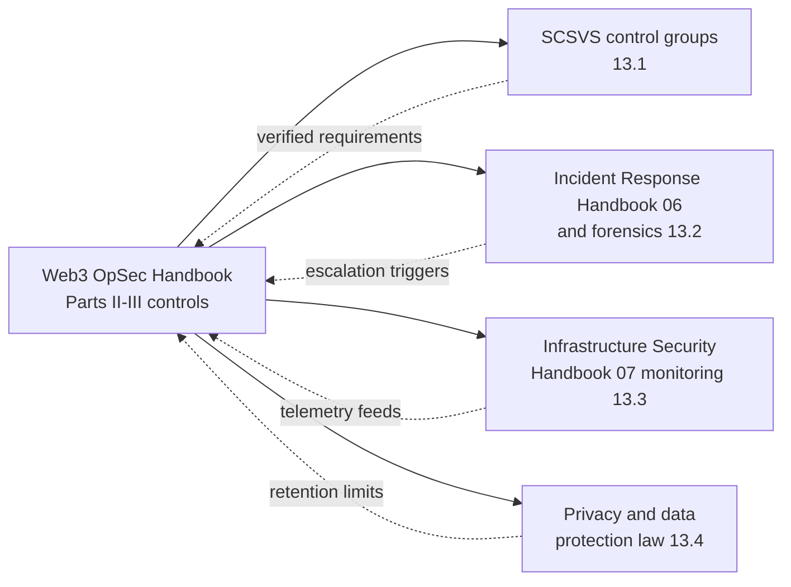
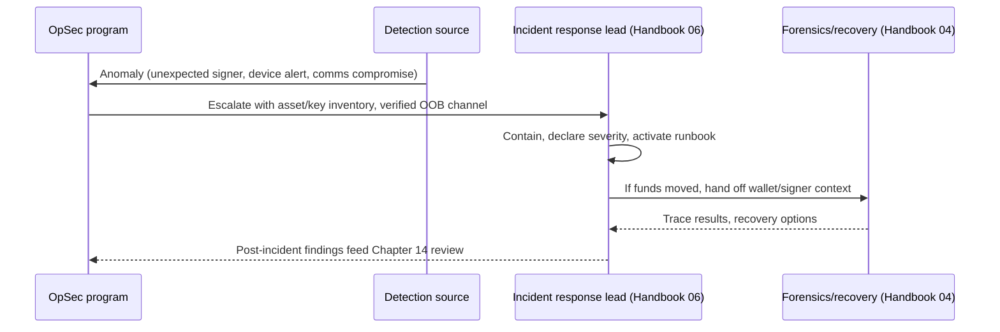
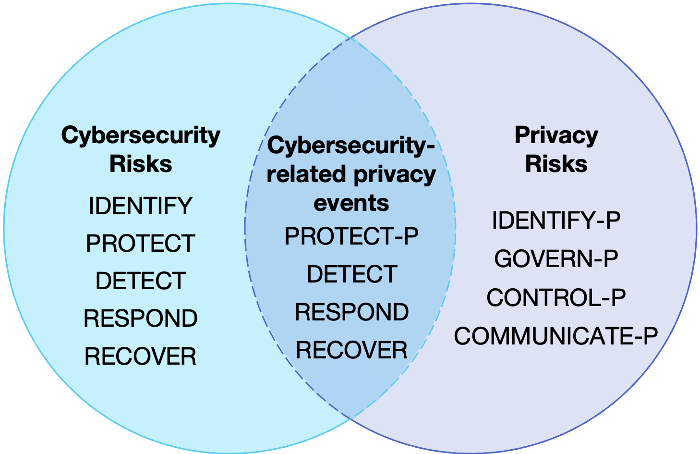
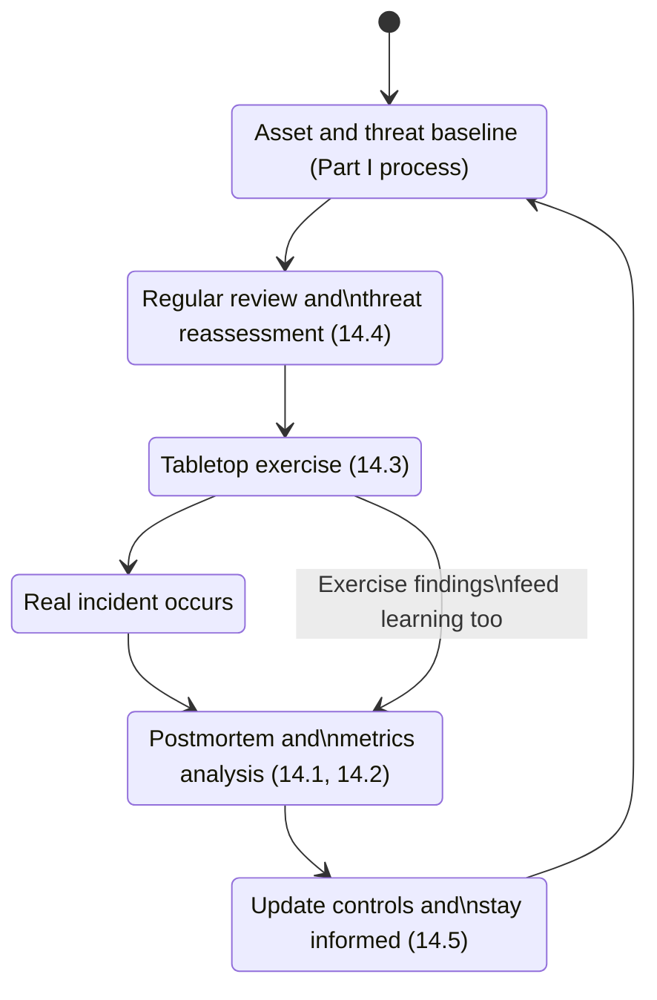

# Part IV: Integration and Continuous Improvement

[Back to Handbook 11 contents](index.md) | [Series index](../index.md)

**Operational security** (**OpSec**) fails as a program the moment it becomes an island: a binder of policies that never touches the incident responders, the infrastructure team's monitoring stack, or the organization's legal obligations. This part connects the controls built in Parts II and III to the rest of the security program and to the standards this handbook is built on, then sets a cadence for revisiting all of it. A control deployed once and never reviewed decays into paperwork; the practices in Chapter 14 are what keep the program current as the team, the threat landscape, and the regulatory environment change under it.

---

## 13. Integration with Other Frameworks

**OpSec** does not run in isolation from verification standards, **incident response**, infrastructure monitoring, or privacy law. Each of the following sections names a specific seam and the handoff that has to work across it.



*Figure 1. Chapter 13 maps four integration seams. Each arrow out of OpSec represents a control this handbook produces; each dashed arrow back represents a requirement the other framework imposes on how that control is built.*

### 13.1 Mapping to SCSVS Control Groups

The [Smart Contract Security Verification Standard (SCSVS)](https://scs.owasp.org/) states verifiable requirements a deployed smart contract system must satisfy: correct **access control** logic, sound cryptographic usage, safe external communication, and defensible business logic and governance. Every one of those requirement families assumes a human and process layer behind it that the code itself cannot verify, and that layer is exactly what this handbook's Parts II and III build. A contract can implement textbook-correct multi-signature access control and still be compromised the moment one signer's laptop is unmanaged, because SCSVS checks the contract's access-control logic, not the operational hygiene of the key that logic trusts.

Treat the mapping as a checklist for the security lead who owns both the contract audit and the **OpSec** program, so that a passing SCSVS review is not mistaken for a complete security posture:

| SCSVS control area | What SCSVS verifies in code | OpSec dependency (this handbook) |
|---|---|---|
| Access control and authentication | Role checks, multi-signature thresholds, admin function gating | Key custody, hardware authenticator enrollment, access review cadence (Chapters 8, 12) |
| Cryptographic implementation | Correct signature schemes, randomness, key derivation | Signing device hardening, seed and key storage, endpoint integrity (Chapters 6, 8) |
| Secure communication | Oracle and cross-contract message validation | Communications platform hardening, verified out-of-band channels (Chapter 9) |
| Architecture and threat modeling | Design-level attack surface review | Threat actor and asset identification process (Part I, Chapter 4) |
| Business logic and governance | Economic invariants, upgrade and pause authority | Governance key custody, multi-party approval workflow (Chapter 12) |

A finding on either side of this table should trigger a look at the other. If an SCSVS review flags an admin function with a single-signer threshold, the OpSec response is not just "raise the threshold in code," it is also "verify every signer's device and key storage meet Chapter 6 and 8 standards," because a higher threshold only helps if each additional signer is independently hard to compromise.

### 13.2 Alignment with Incident Response and Forensics

**OpSec** is preventive; **incident response** (IR) is reactive; forensics reconstructs what happened after the fact. The three disciplines share data and hand off responsibility at defined points, and [NIST SP 800-61 Revision 3, *Incident Response Recommendations and Considerations for Cybersecurity Risk Management: A CSF 2.0 Community Profile* (April 2025)](https://csrc.nist.gov/pubs/sp/800/61/r3/final), frames this explicitly: incident response is not a standalone function but a set of activities threaded through every NIST Cybersecurity Framework (CSF) 2.0 function, from Govern through Recover. The Incident Response Handbook (06) owns the escalation runbooks, containment procedures, and evidence-handling chain of custody; this handbook's job is to make sure the inputs IR needs already exist before an incident starts.

Three handoffs matter most for a Web3 team. First, the asset and key inventory this handbook's controls maintain (Chapters 6 and 8) is what lets an IR lead scope an incident in minutes instead of days: which signer, which device, which key, when it was last rotated. Second, the out-of-band communication channel established under Chapter 9, verified and pre-tested, becomes the IR team's assumption of last resort when the primary channel (email, the usual chat workspace) is itself suspected of compromise. Third, when the incident involves fund movement, IR hands off to the EVM Forensics and DeFi Recovery Handbook (04) for on-chain tracing, and the OpSec-maintained wallet and signer inventory is the starting point for that trace.



*Figure 2. The OpSec-to-IR handoff. OpSec supplies the inventory and channel IR needs at declaration time; IR returns findings that feed the continuous improvement loop in Chapter 14.*

### 13.3 Infrastructure and Monitoring Integration

Every **OpSec** control in Parts II and III generates signal: a device enrolls or is deprovisioned, a hardware key is registered or revoked, a secrets vault is accessed, a comms platform admin role changes. That signal is worthless sitting in the console of the tool that produced it. The Infrastructure Security Handbook (07) owns the organization's monitoring stack, and the integration point is straightforward but frequently skipped: OpSec-owned identity, device, and access events must flow into the same correlation layer as infrastructure **telemetry**, because an attacker who compromises a laptop and an attacker who compromises a cloud role are executing the same kill chain from different starting points. [NIST SP 800-207, *Zero Trust Architecture*](https://csrc.nist.gov/pubs/sp/800/207/final), frames this as continuous, centralized policy evaluation: a Zero Trust Architecture (ZTA) is only as good as the telemetry feeding its policy decision point, and identity and device signals from OpSec controls are core inputs to that decision, not a side channel.

| OpSec event source | What it emits | Where it should land |
|---|---|---|
| Identity provider / single sign-on (SSO) | Login, MFA challenge, session anomaly | Central log pipeline, correlated with device posture |
| Hardware authenticator (FIDO2/YubiKey) registry | Enrollment, revocation, backup-key use | Central log pipeline, alert on out-of-policy revocation |
| Endpoint detection and response (EDR) agent | Process anomaly, unmanaged device flag | Same alerting queue as infrastructure EDR/cloud alerts |
| Secrets manager / key management service (KMS) | Access, rotation, permission change | Central log pipeline, alert on off-hours or new-principal access |
| Comms platform admin audit log | Role change, integration added, export event | Central log pipeline, weekly review minimum |

Building this integration is mostly a routing problem, not a tooling problem: point each source's audit-log export at the same collector the infrastructure team already runs, tag events with an OpSec-specific source field so they are queryable independently, and agree with the infrastructure team on which OpSec event types page someone immediately versus which land in a daily digest.

### 13.4 Privacy and Data Protection Overlap

The **OpSec** program itself is a data controller. Device inventories, travel schedules, hardware key serial numbers, background-check results referenced from the Hiring, Remote Work, and **Insider Threat** Handbook (05), and even the metadata of who has access to which signing key, are personal data about identifiable team members. That data is now a target in its own right: an attacker who obtains the travel calendar of a treasury signer has a head start on timing a physical or SIM-swap attack, and a leak of the device inventory tells an attacker exactly which laptop model and operating system to build an exploit for.


*Figure. Privacy and cybersecurity outcomes overlap but are not interchangeable. Security controls can protect an OpSec data store while the collection itself still creates privacy risk; the Privacy Framework adds explicit Control-P and Communicate-P outcomes for how data is processed and explained. Source: [NIST, Privacy Framework and Cybersecurity Framework Functions](https://www.nist.gov/privacy-framework/getting-started-0), U.S. government work, public domain.*

Two regulatory regimes set the floor. Under the EU's General Data Protection Regulation (GDPR), [Article 33](https://gdpr-info.eu/art-33-gdpr/) requires notifying the competent supervisory authority "without undue delay and, where feasible, not later than 72 hours" after becoming aware of a personal data breach, which means an OpSec data store (the travel log, the device inventory) has the same 72-hour clock as customer data the moment it holds EU personal data. US state laws, principally the California Consumer Privacy Act as amended by the California Privacy Rights Act (CCPA/CPRA), impose parallel obligations on any organization handling California residents' data, including employees'. Treat OpSec records with the same classification discipline as customer data:

- **Minimize collection**: log the fact that a device passed a compliance check, not the full device fingerprint, unless the fingerprint is operationally required.
- **Minimize retention**: travel itineraries and access logs older than the incident-response and audit window (commonly six to eighteen months) should be purged, not archived indefinitely.
- **Restrict access**: the OpSec data store itself needs the access controls described in Chapter 8, not just the assets it protects.
- **Encrypt at rest and in transit**: no exception for "internal" tooling.

This is not a compliance afterthought bolted onto Chapter 13; it is the reason the data-minimization habits taught throughout Part III exist in the first place.

---

## 14. Continuous Improvement

A control set frozen at first deployment is a snapshot of yesterday's **threat model**. This chapter turns the one-time process from Part I, Chapter 4 (identify assets, analyze threats, assess vulnerabilities, evaluate risk, deploy controls) into a loop that runs continuously against a changing team, changing tooling, and a changing adversary.



*Figure 3. The continuous improvement loop. Learning enters from two paths, real incidents and rehearsed tabletop exercises, and both feed the same control-update step before the baseline is reassessed.*

### 14.1 Learning from Incidents

Every incident, whether it lands on this team or a peer organization, is a free lesson if the postmortem process captures it. Adopt a blameless postmortem discipline: the [Google Site Reliability Engineering postmortem culture guidance](https://sre.google/sre-book/postmortem-culture/) is written for infrastructure outages but the principle transfers directly to key-compromise and social-engineering incidents, that a postmortem "assumes everyone involved had good intentions and did the right thing with the information they had," and that fixing systems, not blaming people, is what prevents recurrence. A postmortem that ends with "the signer should have been more careful" produces no control change; one that ends with "the signing workflow allowed a blind-signed transaction to reach a **hardware wallet** with no simulation step" produces one.

External incidents deserve the same rigor, run as a desk review rather than a live postmortem. The February 21, 2025 Bybit exchange theft, roughly $1.5 billion in Ether, remains the largest cryptocurrency theft on record: attackers compromised the workstation of a developer at Safe{Wallet}, the third-party multisignature wallet interface Bybit's signers used, and manipulated the transaction displayed in that interface so that signers approved a transfer of upgrade authority while believing they were approving a routine transfer. US federal investigators and blockchain analytics firms attributed the operation to North Korea's Lazarus Group, operating under the "TraderTraitor" cluster name ([Bybit incident summary](https://en.wikipedia.org/wiki/Bybit)). A team that never touches Safe{Wallet} still learns from this: the failure mode is **blind signing** on a compromised front end, not a Bybit-specific bug, and the applicable defenses (hardware wallet **transaction simulation**, independent verification of calldata before signing, treating the signing workstation itself as in scope for endpoint hardening under Chapter 6) apply to any multisignature workflow.

```markdown
## Postmortem: [incident name], [date]
**Severity**: [Critical/High/Medium/Low]
**Duration**: [detection to resolution]
**Impact**: [funds, data, availability, quantified]

### Timeline
- [UTC timestamp]: [event]

### Root cause
[System and process failure, not individual blame]

### What went well
[Detection, containment, or communication that worked]

### What went wrong
[Gaps, with no names attached to blame]

### Action items
| Action | Owner | Due | Chapter/control affected |
|---|---|---|---|
```

### 14.2 Security Metrics and Effectiveness of Controls

A control nobody measures is a control nobody can prove is working. Split metrics into leading indicators, which predict future exposure, and lagging indicators, which count past failures. NIST CSF 2.0's Govern function ties an organization's risk management strategy directly to measurable outcomes rather than checklist completion, which is the framework-level argument for building this section's metrics program instead of treating Chapter 6 through 12's controls as a one-time deployment ([NIST CSF 2.0](https://csrc.nist.gov/pubs/cswp/29/the-nist-cybersecurity-framework-csf-20/final)).

| Metric | Type | What it signals | Review cadence |
|---|---|---|---|
| Hardware authenticator enrollment rate | Leading | Fraction of privileged accounts still on phishable auth | Monthly |
| Phishing simulation click-through rate | Leading | Susceptibility trend across the team | Quarterly |
| Key/credential rotation SLA adherence | Leading | Whether rotation policy is followed, not just written | Monthly |
| Mean time to detect (MTTD) | Lagging | Monitoring pipeline effectiveness (ties to 13.3) | Per incident, trended quarterly |
| Mean time to respond/contain (MTTR) | Lagging | IR handoff effectiveness (ties to 13.2) | Per incident, trended quarterly |
| Device compliance rate (patched, MDM-enrolled) | Leading | Endpoint fleet exposure (Chapter 6) | Monthly |
| Access review completion rate | Leading | Whether Chapter 12 reviews actually happen on schedule | Per review cycle |

Report these to whoever owns risk decisions, not just to the security team. A metric that only the people who produce it ever see cannot change budget or priority.

### 14.3 Tabletop Exercises and Scenario Walk-Throughs

A tabletop exercise rehearses the **incident response** process against a realistic scenario without a real incident's cost, and it is the single highest-leverage way to find gaps in the OpSec-to-IR handoff described in 13.2 before an adversary finds them first. The Cybersecurity and Infrastructure Security Agency (CISA) publishes structured [Tabletop Exercise Packages (CTEPs)](https://www.cisa.gov/resources-tools/services/cisa-tabletop-exercise-packages) covering ransomware, **insider threat**, and supply chain scenarios with discussion guides and injects; adapt them rather than writing from a blank page, then layer in the scenarios specific to a Web3 team's threat model.

Run at minimum these four Web3-specific scenarios annually, each scripted with timed injects and a designated facilitator who is not also a scenario participant:

| Scenario | Tests | Key question to answer |
|---|---|---|
| Signer device compromise mid-transaction | Endpoint hardening (Ch. 6), signing workflow, IR handoff | Does anyone notice before the signature is broadcast? |
| SIM-swap of a treasury or governance signer | Authentication (Ch. 8), out-of-band verification | Can the team reach the signer through a channel the attacker doesn't control? |
| Deepfake video call requesting emergency key access | Communications security (Ch. 9), verification culture | Does the requested action get independently verified before anyone acts? |
| Malicious insider attempts unauthorized fund movement | Access control (Ch. 12), multi-party approval | Does the approval workflow actually require a second independent party? |

Full scripts, injects, and facilitator notes for each of these scenarios are collected in Appendix C (Part V). Debrief every exercise with the same blameless format used for real incidents (14.1); a tabletop that surfaces a gap and produces no action item was a rehearsal with no payoff.

### 14.4 Regular Reviews and Threat Assessment

The five-step process from Part I, Chapter 4, asset identification, threat actor analysis, vulnerability assessment, risk evaluation, and control deployment, is not a project with an end date. Re-run it on a fixed cadence and, separately, whenever a defined trigger event occurs, because calendar-only reviews miss the risk that shows up between scheduled dates.

**Calendar cadence:**
- **Access and key inventory review:** quarterly (feeds the metric in 14.2)
- **Full threat model refresh:** semi-annual
- Complete **OpSec** program audit, including a walkthrough of every chapter's controls in Parts II and III: annual

**Trigger-based review**, run outside the calendar the moment any of these occur:
- A new chain, product line, or custody model launches (new asset class, new threat surface)
- Personnel change involving anyone with signing authority or admin access (departure, role change, onboarding)
- A merger, acquisition, or major vendor change (new inherited risk)
- Any incident above a defined severity threshold (feeds directly from 14.1)
- A named incident at a peer organization involving a control this team also relies on (as with the Bybit case in 14.1)

Document every review's outcome even when it produces no change; "reviewed, no change required, evidence attached" is itself the audit trail that proves the loop is running.

### 14.5 Staying Informed and Updating Practices

**Threat intelligence** that never reaches the person who can act on it is not intelligence, it is archive material. Build a short, recurring ritual, not an open-ended subscription list nobody reads. A practical monthly digest pulls from a small set of sources chosen for signal density over volume:

- [MITRE ATT&CK](https://attack.mitre.org/), updated on a semi-annual release cycle, for technique-level adversary behavior across the broader threat landscape.
- [MITRE AADAPT](https://aadapt.mitre.org/) (Adversarial Actions in Digital Asset Payment Technologies), the ATT&CK-style knowledge base built specifically for cryptocurrency and digital-asset threat behavior, for techniques ATT&CK's general IT scope does not cover.
- CISA advisories and alerts, for infrastructure-level and nation-state activity with direct relevance to Chapter 13.3's monitoring integration.
- OWASP Smart Contract Security (SCS) project updates, for changes to SCSVS, the Smart Contract Weakness Enumeration (SCWE), and the [Web3 Attack Vectors Top 15](https://scs.owasp.org/sctop10/Web3-Attack-Vectors-Top15/), which tracks the supply-chain and social-engineering vectors most relevant to this handbook.
- **Hardware wallet** and custody vendor advisories (Ledger, Trezor, Safe, and any custody provider actually in use), for vulnerability disclosures affecting the specific tools the team's signers rely on.

Assign the digest to a named owner with a rotation, not to "the security team" collectively, because unowned recurring work is the first thing that lapses under deadline pressure. Each digest item gets one of three dispositions logged: no action needed, tracked for the next scheduled review (14.4), or escalated immediately.

### 14.6 Log Management and Visibility for OpSec

None of the review, metrics, or learning processes in this chapter work without a log record to review, measure, or learn from. [NIST SP 800-92, *Guide to Computer Security Log Management*](https://csrc.nist.gov/pubs/sp/800/92/final), lays out the lifecycle this section applies to OpSec-specific sources: generate, transmit, store, analyze, and dispose, with retention and access decisions made deliberately rather than by whatever the default happens to be in each tool.

The minimum OpSec-relevant log inventory, cross-referenced to where each source is discussed elsewhere in this handbook:

```yaml
opsec_log_sources:
  - source: identity_provider_sso
    events: [login, mfa_challenge, session_anomaly, admin_role_change]
    retention_days: 400
    reference: "Chapter 8, Section 13.3"
  - source: hardware_authenticator_registry
    events: [enrollment, revocation, backup_key_use]
    retention_days: 730
    reference: "Chapter 8"
  - source: endpoint_edr
    events: [process_anomaly, unmanaged_device_flag, compliance_drift]
    retention_days: 400
    reference: "Chapter 6, Section 13.3"
  - source: secrets_manager_kms
    events: [access, rotation, permission_change]
    retention_days: 730
    reference: "Chapter 8, Section 13.2"
  - source: comms_platform_admin_audit
    events: [role_change, integration_added, export_event]
    retention_days: 400
    reference: "Chapter 9"
  - source: travel_and_device_inventory
    events: [record_created, record_accessed, record_purged]
    retention_days: 550
    reference: "Section 13.4 (privacy-restricted)"
```

Retention figures above are illustrative starting points, not a fixed mandate: set them against the incident-response and forensic window the organization actually needs (Section 13.2) and against the minimization obligation from Section 13.4, and document the reasoning either way. The travel and device inventory row deliberately shows the tension between the two sections directly: it needs to exist long enough to support an investigation, and no longer, with access restricted to the smallest group that can justify needing it.

---

**Key controls for Part 4**

- Maintain a mapping between SCSVS control groups and the **OpSec** chapters that support them; review it whenever an SCSVS finding lands.
- Feed OpSec identity, device, and access events into the same monitoring pipeline the infrastructure team runs, tagged for independent query.
- Give the OpSec-to-IR handoff a rehearsed, verified out-of-band channel before an incident, not during one.
- Classify and minimize OpSec's own records (travel, device inventory, access logs) as personal data subject to GDPR Article 33 and equivalent state law.
- Run blameless postmortems on internal incidents and structured desk reviews on major external ones (Bybit, Ledger Connect Kit) with a documented action-item owner and due date.
- Rehearse at least four Web3-specific tabletop scenarios annually and debrief every one the same way as a real incident.
- Re-run the five-step OpSec process on both a fixed calendar and a defined trigger list; log every review's outcome, including "no change required."
