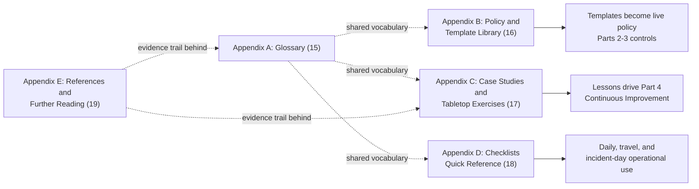
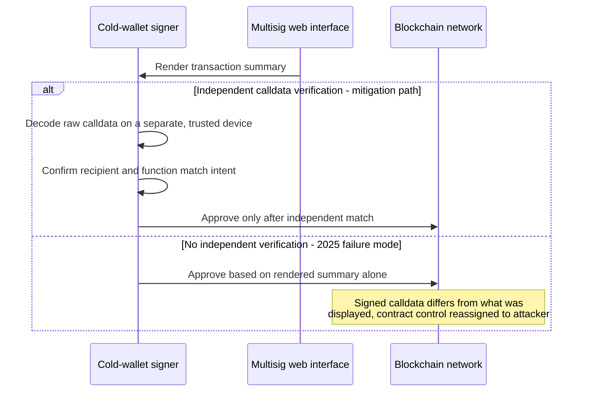
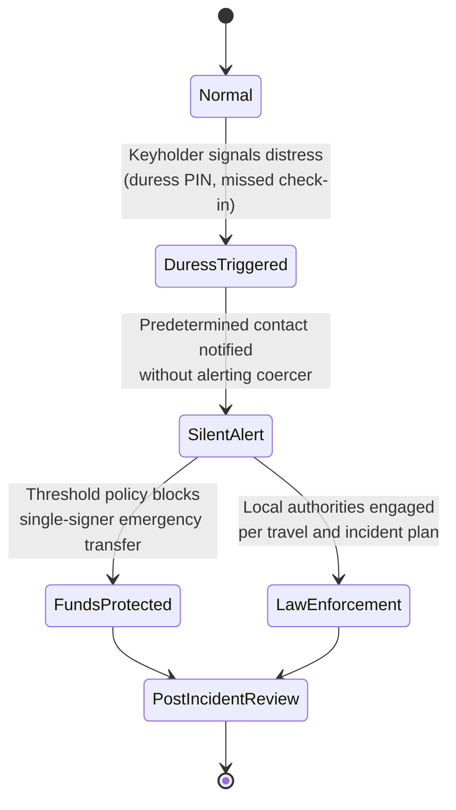

# Part 5: Appendices

[Back to Handbook contents](index.md) | [Series index](../index.md)

This part is the handbook's working reference layer, built to be pulled up mid-incident or mid-onboarding rather than read start to finish. It fixes the vocabulary from Parts 1 through 4 in a single glossary, packages the control set into copy-ready policy templates and printable checklists, and grounds the abstract controls in two named cryptocurrency thefts and a physical-coercion trend so a reader can rehearse the failure before it happens to their own team.



*Figure 1. How the appendices connect. The glossary is a lookup table for everything below it; the policy library turns Part 2 and Part 3 controls into documents you can adopt directly; the case studies feed the Part 4 continuous-improvement cycle; the checklists are the daily operational output; the reference list is the evidence trail behind all of it.*

---

## 15. Appendix A: Glossary

Each entry below is defined the way this handbook uses it, with a pointer to the part and section where the term does its operational work. Acronyms are expanded on first use. Where a term maps to a named external standard or framework, the citation is included so you can verify the definition against the primary source rather than this summary.

**AADAPT.** MITRE's Adversarial Actions in Digital Asset Payment Technologies knowledge base, an ATT&CK-style catalog of adversary tactics specific to blockchain and digital-asset theft, launched in 2024 as a companion to the enterprise ATT&CK matrix ([aadapt.mitre.org](https://aadapt.mitre.org/); Part 4, Section 13.2).

**Blind signing.** Approving a transaction from a rendered summary without independently verifying the underlying calldata, the root failure mode behind the February 2025 Bybit theft (Appendix C, Section 17.2).

**Cold wallet / cold storage.** Key custody kept fully offline with no network-connected signing path, the highest-assurance tier for treasury reserves (Part 2, Sections 5.3.1, 6.5).

**Compartmentalization.** Splitting systems, accounts, and knowledge into isolated domains so compromising one does not automatically expose the rest: network segmentation, dev/test/prod isolation, separate accounts per security domain (Part 1, Section 3.4).

**Critical asset.** Anything whose loss or exposure directly threatens funds or operational continuity, signing keys foremost, mapped and prioritized in the five-step operational process (Part 1, Section 4.1).

**Defense in depth.** Layering independent controls across physical, technical, administrative, and human dimensions so no single failure is fatal (Part 1, Section 3.1).

**Enhanced Identity Governance (EIG).** A **Zero Trust** component tying every access decision to a verified, continuously reassessed identity rather than a network location (Part 1, Section 2.3.1).

**Entry-point centralization.** Concentration of user trust onto a few chokepoints, a front-end domain, a DNS zone, an RPC (Remote Procedure Call) endpoint, that an attacker who compromises one path can use to reach every user regardless of how decentralized the underlying protocol is (Part 2, Section 5.6).

**Ephemeral / just-in-time (JIT) credential.** Access granted for a bounded window and automatically revoked afterward, replacing standing privileged access with access that exists only while actively needed (Part 1, Section 2.3.4).

**FIDO2 / passkey.** A phishing-resistant authentication standard using public-key cryptography bound to the legitimate origin, preferred over one-time-code apps for any treasury-adjacent account ([FIDO Alliance](https://fidoalliance.org/fido2/); Part 2, Section 8.3).

**Hardware wallet.** A dedicated device that generates and stores **private key** material off a general-purpose, internet-connected computer; its independent display is the last line of defense against a compromised signing interface (Part 2, Section 6.4).

**Hot wallet.** An internet-connected wallet for operational flows such as gas top-ups, carrying the tightest balance caps of any custody tier precisely because it is the most exposed (Part 2, Section 5.3.1).

**Identity and Access Management (IAM).** The systems and processes that grant, review, and revoke access by verified identity rather than by shared credential, applied across Web3-specific surfaces such as **multisig** signer lists and RPC provider consoles (Part 2, Section 8.4).

**Identity, Credential, and Access Management (ICAM).** Proving who a user is, issuing the credential that represents that identity, and governing what the credential can access, the backbone of Zero Trust identity governance (Part 1, Section 2.3.1).

**Insider threat.** Risk from a person with legitimate access who uses it, or fails to safeguard it, against the organization's interest, treated in full in the Hiring, Remote Work, and **Insider Threat** Handbook (05) (Part 3, Section 11.2.1).

**Key ceremony.** A witnessed, documented procedure for generating a signer's key material and independently cross-checking the resulting address before it joins a multisig or deploy configuration (Part 2, Section 5.3.2).

**Laptop farm.** A scheme, most publicly linked to Democratic People's Republic of Korea (DPRK) state actors, in which a domestic accomplice hosts company-issued equipment on behalf of a fraudulently hired remote worker to hide their true location, covered in Handbook 05 (Part 3, Section 11.2.1).

**Least privilege (PoLP).** The rule that access matches current, actual need and nothing more, applied through role-based grants and just-in-time elevation rather than standing broad access (Part 1, Section 3.2).

**Log management and visibility.** Collection, retention, and monitoring of security-relevant events across identity, endpoint, and signing infrastructure, the evidence base for continuous improvement and **incident response** (Part 4, Section 14.6).

**Microsegmentation.** Fine-grained network isolation, down to the individual workload, limiting how far an attacker who lands on one system can move laterally (Part 1, Section 2.3.2).

**Multi-Factor Authentication (MFA).** Authentication requiring more than one verification factor; this handbook recommends a phishing-resistant form (FIDO2/passkey) over a one-time-code app for any Tier 1 or Tier 2 account (Part 2, Section 8.1).

**Mnemonic / seed phrase.** The human-readable word sequence encoding a wallet's master private key, a value never typed into a networked device, photographed, or stored in plaintext (Part 2, Section 9.2).

**Multi-Party Computation (MPC).** Threshold cryptography that splits key generation and signing across multiple parties so no single party ever holds the complete private key, an alternative to on-chain multisig (Part 2, Section 5.3.2).

**Multisignature wallet (multisig).** A wallet, most commonly built on [Safe](https://safe.global/) (formerly Gnosis Safe), that executes only once a defined threshold of designated signers approves it on-chain, eliminating unilateral control (Part 2, Section 5.3.2).

**Need-to-know.** Restriction of sensitive information to only those whose role requires it, layered on top of **least privilege** (Part 1, Section 3.3).

**NIST Cybersecurity Framework (CSF) 2.0.** NIST's voluntary framework, published February 26, 2024, structured around six functions: Govern, Identify, Protect, Detect, Respond, Recover ([NIST CSF 2.0](https://www.nist.gov/cyberframework); Part 1, Section 2.2).

**RPC (Remote Procedure Call) endpoint.** The node or gateway a wallet or dApp queries to read chain state and broadcast transactions; a centralized or spoofable endpoint is an entry-point-centralization risk regardless of how decentralized the chain itself is (Part 2, Section 5.6).

**SASE (Secure Access Service Edge).** A converged network-and-security architecture delivering identity-aware access from the cloud edge rather than a fixed office perimeter, a natural fit for distributed Web3 teams (Part 1, Section 2.3.3).

**Signing machine.** A workstation dedicated to preparing and approving transactions, hardened and, where risk warrants, kept separate from general browsing and email (Part 2, Section 6.2).

**SDP (Software-Defined Perimeter).** A Zero Trust control that cloaks internal services from unauthenticated network discovery, granting connectivity only after identity and device posture are verified (Part 1, Section 2.3.2).

**Tabletop exercise.** A discussion-based walkthrough of a simulated incident, run without touching production systems, used to expose gaps in a response plan before a real event forces the same decisions under pressure (Appendix C, Section 17.4; Part 4, Section 14.3).

**Threat actor.** An individual or group with the capability and intent to cause harm, profiled by objective and typical technique to prioritize which controls matter most (Part 1, Section 4.2).

**Threshold.** The minimum number of a multisig's designated signers whose approval is required before a transaction executes (Part 2, Section 5.3.2).

**Wrench attack.** Physical coercion of a keyholder to force a signature, key handover, or fund transfer, a risk that multisig thresholds and signer diversity are specifically designed to blunt (Appendix C, Section 17.3).

**Zero Trust Architecture (ZTA).** A model built on "never trust, always verify," in which no user, device, or location is trusted by default and every request is authenticated, authorized, and continuously evaluated, defined in [NIST SP 800-207](https://csrc.nist.gov/pubs/sp/800/207/final) and expanded with implementation guidance in [SP 1800-35](https://csrc.nist.gov/pubs/sp/1800/35/final), finalized June 10, 2025 (Part 1, Section 2.1).

---

## 16. Appendix B: Policy and Template Library

The templates below turn the control language from Parts 2 and 3 into documents a security lead can adopt with minimal editing. Each is a skeleton, not a finished policy: fill every bracketed field, route the draft through legal and leadership review, and version it so a later audit shows which policy was in force on a given date. None replace the jurisdiction-specific legal review a real deployment requires.

### 16.1 Web3 Operational Security Policy Template

The top-level document the other four templates sit under. It states scope, authority, and the classification tiers everything downstream refers back to.

```markdown
# [Organization Name] Web3 Operational Security Policy
Version: [X.X]  Effective date: [YYYY-MM-DD]  Owner: [Security Lead / Role]
Review cadence: [e.g., every 6 months, or after any Critical/High incident]

## 1. Purpose and Scope
This policy governs operational security for all personnel, contractors, and
systems with access to [organization]'s critical assets, defined in Section 2.

## 2. Asset Classification
| Tier | Examples | Minimum controls |
|------|----------|-------------------|
| Tier 1 (Critical) | Deploy keys, multisig signer keys, treasury cold storage | Hardware-backed auth, dedicated signing machine, dual control |
| Tier 2 (Sensitive) | Admin/IAM consoles, CI/CD secrets, customer PII | Phishing-resistant MFA, logged access, least privilege |
| Tier 3 (Standard) | General SaaS, internal docs | Organization-wide MFA baseline |

## 3. Roles and Authority
- Security Lead: [name/role] - policy ownership, exception approval
- Asset Owners: [named per Tier 1/2 system] - day-to-day control operation
- All personnel: report suspected compromise within [X hours] per Part 4, Section 14.1

## 4. Governing Sub-Policies
- Key and Wallet Custody Policy (Section 16.2)
- Device and Endpoint Hardening Baseline (Section 16.3)
- Communication and Sensitive Data Handling Policy (Section 16.4)
- Travel and Remote Work Security Policy (Section 16.5)

## 5. Exceptions
Any deviation requires written Security Lead approval, a stated expiry date,
and a compensating control. Undocumented exceptions are policy violations.

## 6. Enforcement and Review
Non-compliance is handled per [HR/disciplinary process reference].
This policy is reviewed on the cadence above and after every Medium+ incident.
```

### 16.2 Key and Wallet Custody Policy Template

Operationalizes the cold/hot/**multisig** split from Part 2, Section 5.3, and the key-ceremony requirement from the glossary. This is what a signer reads before joining a multisig, not after.

```markdown
# Key and Wallet Custody Policy
## Custody tiers
| Wallet type | Max balance | Signers required | Storage |
|-------------|-------------|-------------------|---------|
| Hot (operational) | [$ cap] | 1, with monitoring | Hardware-backed, network-connected |
| Working capital | [$ cap] | 2-of-[N] multisig | Hardware wallets, geographically distributed |
| Treasury reserve | No cap / [$ cap] | [M]-of-[N] multisig | Air-gapped cold storage |

## Key ceremony requirements
- New signer key generated on an offline, single-purpose device
- Resulting address verified independently by [role] over a pre-agreed
  out-of-band channel before being added to any multisig
- Ceremony witnessed and logged: date, participants, resulting address

## Signing session requirements
- Never approve a transaction from rendered summary alone; decode and verify
  raw calldata on a device independent of the proposing interface
- Dual control: proposer and approver are different people for any Tier 1 transfer
- Any signer request received via chat/email is independently verified by
  voice or video before action, per Section 16.4

## Rotation triggers
- Signer departure (Employee Lifecycle Handbook 03)
- Suspected device compromise
- Every [interval, e.g., 12 months] as routine hygiene
```

### 16.3 Device and Endpoint Hardening Baseline Template

Applies to any device that touches Tier 1 or Tier 2 assets, per Part 2, Section 6.1.

```markdown
# Endpoint Hardening Baseline
- Full-disk encryption enabled and verified: [Y/N]
- EDR (Endpoint Detection and Response) agent installed and reporting: [Y/N]
- OS and browser patched within [X days] of vendor release
- Screen lock: automatic after [X minutes] idle
- Browser extensions restricted to an approved allowlist; no unreviewed
  wallet-adjacent extensions
- Signing machines (Section 6.2): no general browsing, no personal email,
  no unreviewed software installation
- Device enrolled in MDM (Mobile Device Management) with remote-wipe capability
- Local admin rights: default denied, granted only via [JIT process]
```

### 16.4 Communication and Sensitive Data Handling Policy Template

Governs where Tier 1/Tier 2 information (per Section 16.1) may be discussed, per Part 2, Section 9.

```markdown
# Communication and Sensitive Data Handling Policy
## Approved channels by sensitivity
| Data type | Approved channel | Prohibited channel |
|-----------|-------------------|----------------------|
| Mnemonics / seed phrases | Never transmitted electronically in any form | Chat, email, SMS, screenshare, password manager notes |
| Signing requests | Voice/video call to a pre-known contact, or in-person | Unverified chat message alone |
| Secrets / API keys | Secrets manager, one-time self-destructing link | Persistent chat history, email |
| General business | Company-approved collaboration platform | Personal messaging apps for company business |

## Verification rule
Any request to move funds, change a signer, or share a credential that
arrives over chat, email, or a phone call is independently verified through
a second, pre-agreed channel before action, regardless of apparent urgency
or seniority of the requester.
```

### 16.5 Travel and Remote Work Security Policy Template

Supports Part 2, Section 10 and the physical-coercion lessons in Appendix C, Section 17.3.

```markdown
# Travel and Remote Work Security Policy
## Before travel
- Loaner device issued for high-risk destinations; no Tier 1 credentials
  carried on personal or primary devices
- Signer status and holdings not disclosed in travel-related communications
  or public itineraries
- Emergency/duress contact and check-in schedule confirmed (Appendix C, 17.3)

## During travel
- No signing sessions performed over untrusted or hotel Wi-Fi without a
  managed VPN or SASE (Secure Access Service Edge) connection
- Duress protocol (Appendix D, Section 18.4) reviewed and understood before departure

## On return
- Loaner device wiped and re-imaged before reissue, per NIST SP 800-88 Rev. 1
  media sanitization guidance
- Any anomalous device behavior during travel reported before reconnecting
  to production systems
```

---

## 17. Appendix C: Case Studies and Tabletop Exercises

The two incidents below are the largest cryptocurrency thefts publicly attributed to a named nation-state actor as of this writing, and both trace back to an **operational security** failure rather than a cryptographic one. The physical-coercion trend that follows is a reminder that the strongest key-management design still assumes the keyholder is not under duress. Each case study closes with detection signals and mitigations rather than attack detail beyond what a defender needs to threat-model the failure.

### 17.1 Case Study: Ronin Network Validator Compromise (March 2022)

On March 23, 2022, attackers drained approximately 173,600 Ether and 25.5 million USDC (roughly $625 million at the time) from the Ronin bridge underlying the Axie Infinity game, a theft undetected for six days until a user's failed withdrawal surfaced it ([Ronin Network, Wikipedia summary](https://en.wikipedia.org/wiki/Ronin_Network)). The bridge required five of nine validator signatures. Attackers compromised four validators run directly by Sky Mavis, the game's developer, then used a still-active emergency permission, granted to Sky Mavis months earlier by the Axie DAO to help process a load spike and never revoked, to sign as a fifth validator without compromising it individually. On April 14, 2022, the FBI attributed the theft to the Lazarus Group and APT38, both linked to the Democratic People's Republic of Korea (DPRK).

**Detection signals:** a stale, broad-scope permission (the Axie DAO delegation) with no expiry or periodic re-justification; four of nine validator keys concentrated under one operator instead of independently run; and a six-day detection gap showing no monitoring watched bridge outflows against expected volume.

**Mitigations:** expire every emergency or temporary delegation by default and require active re-approval (Part 1, Section 3.2.3); enforce genuine signer diversity so compromising one operator cannot silently satisfy multiple threshold slots (Part 2, Section 5.3.2); alert on outbound transfers against a modeled baseline rather than waiting on a user to notice (Part 4, Section 14.6).

### 17.2 Case Study: Bybit Multisig Blind-Signing Compromise (February 2025)

On February 21, 2025, approximately 400,000 Ether (roughly $1.4 to $1.5 billion) was stolen from Bybit's cold wallet, the largest cryptocurrency exchange theft on record, attributed by the FBI to DPRK's "TraderTraitor" operation ([Bybit, Wikipedia summary](https://en.wikipedia.org/wiki/Bybit); [FBI/IC3 PSA250226](https://www.ic3.gov/PSA/2025/PSA250226)). Attackers compromised infrastructure belonging to Safe{Wallet}, the third-party **multisig** interface Bybit's signers used, and manipulated what the interface displayed. Signers working from hardware wallets approved what the interface rendered as a routine transfer; the calldata they actually signed reassigned control of the cold wallet's contract logic to an attacker-controlled address.



*Figure 2. The blind-signing failure path versus the independent-verification mitigation. The hardware wallet correctly signed what it was told to sign; the compromise was in what the signer was shown, not in the cryptography.*

**Detection signals:** signers had no independent, out-of-band way to confirm the rendered summary matched the raw calldata their hardware device was about to sign, and the compromise lived entirely in third-party infrastructure the victim did not directly control or monitor.

**Mitigations:** decode and verify raw calldata on a device independent of the proposing interface before every Tier 1 approval (Appendix B, Section 16.2); treat a multisig UI provider as part of your **trust boundary** and monitor its advisories like a direct vendor (Part 3, Section 11.1.3); require the proposer and final approver to use genuinely separate infrastructure, not merely separate accounts on the same interface.

### 17.3 Case Study: Physical Coercion and Wrench Attacks (2025)

Reporting through 2025 documented a rising pattern of physical attacks, kidnapping, coercion, and extortion targeting individuals publicly known or suspected to hold significant cryptocurrency, including keyholders and executives at crypto firms, a trend the Associated Press covered under the informal industry term "wrench attack" ([origin and reporting summarized on Wikipedia](https://en.wikipedia.org/wiki/Rubber-hose_cryptanalysis)). Unlike the two cases above, no cryptographic or software control stops a wrench attack: the adversary's leverage is the keyholder's physical safety, not a technical gap.

**Detection signals:** public disclosure of holdings, signer status, or travel plans (speaker bios, social media, leaked directories) that lets an adversary locate a target; and no pre-agreed duress signal, so a coerced approval looks identical to a voluntary one.

**Mitigations:** minimize public association between an identity and its signer or custody role; set **multisig** thresholds so no single coerced signer can move funds alone, a cryptographic control that addresses the physical threat by making coercion of one person insufficient; establish a duress protocol (Appendix D, Section 18.4) so a coerced keyholder can signal it without the coercer knowing.



*Figure 3. A duress-response protocol. The design goal is that a coerced signer can trigger this path without the coercer being able to tell the difference from a normal approval in progress.*

### 17.4 Tabletop Exercise Scripts

Run each script as a discussion-based exercise per Part 4, Section 14.3: no production system is touched, and the facilitator introduces each inject verbally or in writing, then pauses for the team's decision before revealing the next inject.

| Scenario | Objective | Key injects (in order) | Success criteria |
|----------|-----------|--------------------------|--------------------|
| Validator/engineer targeting (Ronin-pattern) | Catch a social-engineering approach before it reaches infrastructure access | 1. Engineer reports an unsolicited, unusually generous remote-role offer with an attachment. 2. Facilitator reveals the attachment requested unusual permissions when "opened." 3. What standing permissions could this role already reach? | Team names the report-and-verify step (Part 2, Section 9.1) and gives a real answer on standing permissions, not "we'd have to check" |
| Multisig session compromise (Bybit-pattern) | Test whether signers verify calldata independently under time pressure | 1. Routine multisig transfer proposed with a plausible deadline. 2. Facilitator reveals the rendered summary and a separately decoded calldata sample that disagree. 3. Where in your actual process would this be caught? | Team names the specific control (Appendix B, Section 16.2) that catches the mismatch and confirms it is practiced, not just documented |
| Keyholder duress (wrench-attack pattern) | Test the duress protocol without depending on the coerced person acting normally | 1. Signer misses a scheduled check-in while traveling. 2. Facilitator reveals a signing request arrives shortly after, apparently from that signer, under time pressure. 3. Who is authorized to invoke the duress protocol, and on what evidence? | Team names the authorized decision-maker and the threshold control (Appendix C, Section 17.3) that limits damage even if invoked late |

---

## 18. Appendix D: Checklists (Quick Reference)

These are deliberately short: each is meant to fit on a single printed page or a single pinned message in an operations channel. For the full narrative behind any line, follow the section reference back into Parts 2 through 4.

### 18.1 Endpoint and Signing Machine Quick Checklist

- [ ] Full-disk encryption verified on this device (Part 2, 6.1)
- [ ] EDR agent installed and reporting (Appendix B, 16.3)
- [ ] OS and browser fully patched (Part 2, 6.1)
- [ ] No unreviewed browser extensions installed (Part 2, 6.3)
- [ ] Signing machine used for signing only, no general browsing (Part 2, 6.2)
- [ ] **Hardware wallet** firmware current and sourced from vendor directly (Part 2, 6.4)

### 18.2 Authentication and Access Quick Checklist

- [ ] Phishing-resistant MFA (FIDO2/passkey) enabled on every Tier 1/2 account (Part 2, 8.1, 8.3)
- [ ] No shared or reused credentials across systems (Part 2, 8.2)
- [ ] Standing access reviewed against actual current need this quarter (Part 1, 3.2)
- [ ] Just-in-time elevation used for any non-routine privileged action (Part 1, 2.3.4)

### 18.3 Communication and Key-Handling Quick Checklist

- [ ] No mnemonic or **seed phrase** has ever been typed into a networked device or chat (Appendix B, 16.4)
- [ ] Any signing or fund-movement request received via chat/email verified over a second channel (Appendix B, 16.4)
- [ ] Secrets shared only through the approved secrets manager or a self-destructing link (Part 2, 9.2)

### 18.4 Travel and Duress Quick Checklist

- [ ] Loaner device issued for high-risk destinations; no Tier 1 credentials on personal devices (Appendix B, 16.5)
- [ ] Duress signal and check-in schedule confirmed with a named contact before departure (Appendix C, 17.3)
- [ ] VPN/SASE required for any signing-adjacent activity on untrusted networks (Part 1, 2.3.3)
- [ ] Signer status and travel itinerary not disclosed publicly (Appendix C, 17.3)

### 18.5 Control Domain Quick-Reference Matrix

Use this table to sanity-check that a new control lands in the domain it belongs to, per the four-domain structure in Part 3, Section 11.

| Domain | Example control | Typical owner |
|--------|-------------------|----------------|
| Organizational | Written OpSec policy, third-party assurance review | Security Lead |
| People and personnel | Insider-threat vetting, security training cadence | HR + Security |
| Physical and environmental | Tamper-evident hardware storage, travel protocol | Facilities + Security |
| Technical and digital | MFA, endpoint hardening, encrypted backups | Engineering + Security |

---

## 19. Appendix E: References and Further Reading

The full, deduplicated bibliography for this handbook lives in a separate file, [`references.md`](references.md), maintained independently of the narrative parts so sources can be updated as incident reporting and standards revisions mature. Every inline citation across Parts 1 through 4 and the appendices above points to a primary source: a standard's publication page, a government **attribution** statement, or a named incident's own disclosure.

| Category | What it holds | Representative sources |
|----------|----------------|--------------------------|
| Standards and Frameworks | NIST and MITRE publications this handbook's controls trace back to | NIST SP 800-207, NIST SP 1800-35, NIST CSF 2.0, NIST SP 800-53 Rev. 5, NIST SP 800-88 Rev. 1, MITRE ATT&CK, MITRE AADAPT |
| Incidents and Case Studies | Named thefts and physical-security incidents cited as evidence for a control | Ronin Network (March 2022), Bybit (February 2025), the 2025 wrench-attack reporting trend |
| Tools | Vendor and project documentation for named tools referenced in templates | Safe (formerly Gnosis Safe), FIDO Alliance passkey documentation |
| Further Reading | Cross-references to companion OWASP SCS handbooks and standards | OWASP SCSVS, SCSTG, SCWE, Web3 Attack Vectors Top 15, Handbooks 03, 05, and 06 |

Treat `references.md` as the place to verify a claim before repeating it externally, particularly for the incident case studies in Appendix C: public and forensic reporting on both thefts was still being refined after initial disclosure, and figures cited here reflect the sources linked at the point of each claim.

---

**Key controls for Part 5**

- Keep the glossary within reach for any reader joining mid-process, new to the security function or running their first key ceremony.
- **Adopt the Appendix B templates as living documents:** version them, route exceptions through written approval, re-review after any Medium-or-higher incident.
- Run at least one Appendix C tabletop script per year per scenario type; a team's inability to answer the facilitator's question is the finding, not a failed test.
- Use the Appendix D checklists as the actual pre-flight gate for signing sessions and travel, not retrospective documentation.
- Verify a claim against `references.md` before repeating it outside the handbook, especially incident details that may be updated as investigations continue.

---

This is the final part of the OWASP SCS Web3 **Operational Security** Handbook. [Back to Handbook contents](index.md) | [Series index](../index.md)
