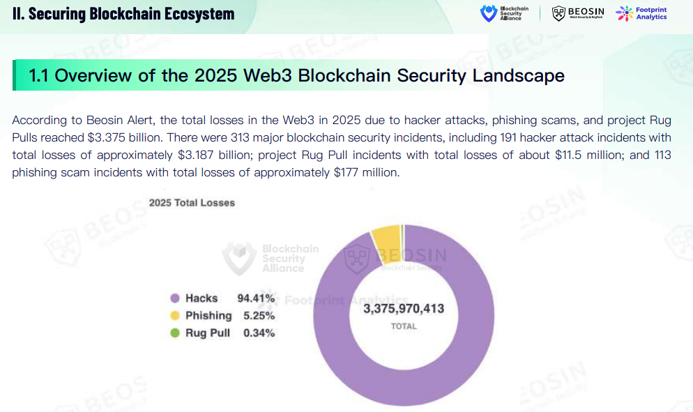
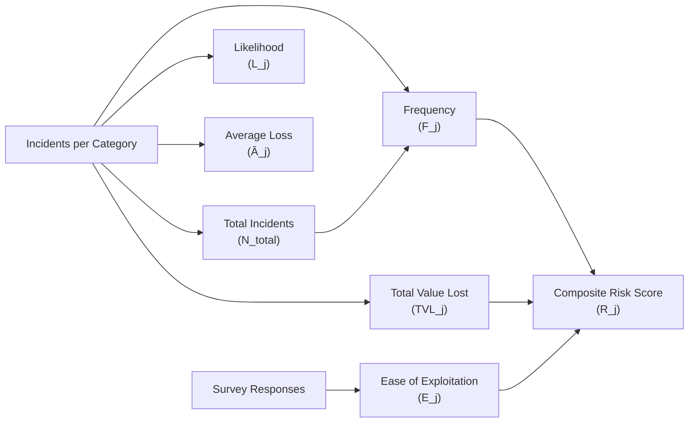

# Data Sources for the 2026 Ranking

The OWASP Smart Contract Top 10 2026 draws on multiple data sources to ensure the ranking reflects both practitioner judgment and real-world incident trends. This page documents those sources and how they inform the final list.

## Primary: Practitioner Survey

### Survey Design

A structured, anonymised survey was conducted by OWASP SCS Team to collect practitioner rankings of risk categories. The survey targeted:

| Primary Contributors | Secondary Contributors |
|---------------------|------------------------|
| Smart contract auditors | Incident response teams |
| Protocol security leads | Bug bounty triagers |
| L1/L2 infrastructure security teams | Red team / blue team practitioners |
| Wallet and custody security engineers | |

### Survey Content

Respondents were asked to:

1. Assign ranks (1–10) to each risk category, where 1 = highest risk.
2. Describe factors that influenced their ranking (e.g., frequency in production, ease of exploitation, size of losses).
3. Suggest additional or emerging risk categories not captured by the current list.
4. Indicate their confidence in the ranking provided.

### Survey Link

The survey remains open for ongoing data collection:

[Participate in the 2026 Top 10 Survey](https://forms.gle/1vCRSrjYvhUgBonr8){ .md-button }

### Data Handling

- Responses are anonymised for public reporting.
- Aggregated insights (e.g., mean ranks, tier distributions) are used to inform the ranking.
- Individual responses or identities are not shared publicly unless explicitly consented.

## Secondary: 2025 Incident Data

### Real-World Incidents

The 2026 list is **forward-looking** and grounded in **2025 security incidents**. High-impact breaches and exploit classifications from 2025 were used to:

- Validate and refine the ordering suggested by survey responses
- Identify emerging categories (e.g., Proxy & Upgradeability, Arithmetic Errors)
- Assign appropriate prominence to categories that drove large losses

### Incident Databases

#### 1. SolidityScan Web3HackHub

Comprehensive database of blockchain-related incidents, attack vectors, and financial losses. Documents breaches from 2011 onward.

[Learn about Hacks & Prevent Attacks](https://solidityscan.com/web3hackhub){ .md-button }

#### 2. SlowMist Web3 Hacked

SlowMist's curated database of Web3 security incidents and hacks.

[SlowMist Hacked](https://hacked.slowmist.io/){ .md-button }

#### 3. DeFi Attack Vectors for 2025 (Video)

Video analysis of the top DeFi attack vectors by risk for 2025.

[Watch on YouTube](https://www.youtube.com/watch?v=0S-Au1VEFfM){ .md-button }

<iframe src="https://www.youtube.com/embed/0S-Au1VEFfM" width="100%" height="400" style="border: none;" title="DeFi Attack Vectors 2025"></iframe>

#### 4. DeFiHackLabs Incident Explorer

Explore and analyse DeFi hack incidents. Reproduce incidents using Foundry via [GitHub](https://github.com/SunWeb3Sec/DeFiHackLabs).

[DeFi Hack Incidents Explorer](https://defihacklabs.io/explorer/index.html){ .md-button }

<iframe src="https://defihacklabs.io/explorer/index.html" width="100%" height="420" style="border: none;" title="DeFiHackLabs Explorer"></iframe>

#### 5. BlockSec Security Incident Library

Crypto security incidents library with searchable incident data.

[BlockSec Security Incidents](https://blocksec.com/security-incident){ .md-button }

!!! note "Embedding notice"
    Some external sites may block embedding (X-Frame-Options). If a preview does not load, use the link above to open the source directly.

### Other References

| Source | Description |
|--------|--------------|
| Public breach reports and post-mortems | Protocol-specific incident analyses (e.g., Balancer, GMX, Cetus, zkLend, Bunni, Abracadabra, Yearn, ResupplyFi, Cork Protocol, Ionic Money, NGP Token). |
| Security research and DeFi attack summaries | Community and vendor analyses of prevalent attack vectors and trends. |

### 2025 Incident Categories (Illustrative)

Incident data from 2025 highlighted the following categories as drivers of major losses:

- **Access Control:** Balancer V2 (~$128M), Zoth ($8.4M)
- **Business Logic:** Abracadabra ($12.9M), Yearn Finance ($9M)
- **Price Oracle Manipulation:** NGP Token (~$2M), GMX (oracle component of $42M)
- **Flash Loan–Facilitated:** Bunni ($8.4M), zkLend ($9.5M)
- **Lack of Input Validation:** Cetus ($223M), Ionic Money (~$6.9M)
- **Unchecked External Calls / Reentrancy:** GMX ($42M), Cork Protocol ($12M)
- **Arithmetic Errors:** zkLend ($9.5M), Bunni ($8.4M)
- **Integer Overflow:** Cetus ($223M on Sui/Move)
- **Proxy & Upgradeability:** ResupplyFi ($9.8M)

These figures informed the relative weighting and inclusion of categories in the final 2026 Top 10.

## Total Lost Value (TLV) Reports

The following reports provide aggregated data on total value lost to exploits, hacks, and fraud in Web3. They are used to contextualise incident impact and validate category prominence.

### 1. SolidityScan / CredShields 2025 Annual Report — State of Web3 Security 2025

[View on Google Drive](https://drive.google.com/file/d/1vfsPUjBApklSRtrkPJ2e4SO922b3ORdQ/view){ .md-button }

<iframe src="https://drive.google.com/file/d/1vfsPUjBApklSRtrkPJ2e4SO922b3ORdQ/preview" width="100%" height="500" style="border: none;" title="SolidityScan CredShields 2025 Report"></iframe>

### 2. Beosin 2025 Global Web3 Security Report

[Download PDF](https://www.beosin.com/resources/2025_Global_Web3_Security_Report.pdf){ .md-button }

*2025 Web3 total losses: $3.375B across 313 incidents (hacks, phishing, rug pulls).*

### 3. SlowMist Blockchain Security and AML Annual Report 2025

[Download PDF](https://www.slowmist.com/report/2025-Blockchain-Security-and-AML-Annual-Report(EN).pdf){ .md-button }

*Distribution of causes for security incidents in 2025—contract vulnerability, account compromise, oracle attacks, and more.*

### 4. HackenProof Web3 Security Report 2025

HackenProof's Web3 security report for 2025. DocSend viewer—open in new tab for full document preview.

[View HackenProof Report](https://docsend.com/view/ag6xihzmxrazz9ct){ .md-button .md-button--primary }

### 5. QuillAudits Exploited Ledgers: The Web3 Hack Report 2025

QuillAudits' annual report on exploited DeFi protocols. DocSend viewer—open in new tab for full document preview.

[View QuillAudits Report](https://docsend.com/view/5kbhfsunn8k9k7n5){ .md-button .md-button--primary }

### 6. ScamSniffer 2025: Crypto Phishing Losses Fall 83% to $84 Million

[Read on Scam Sniffer](https://drops.scamsniffer.io/scam-sniffer-2025-crypto-phishing-losses-fall-83-to-84-million/){ .md-button }

<iframe src="https://drops.scamsniffer.io/scam-sniffer-2025-crypto-phishing-losses-fall-83-to-84-million/" width="100%" height="500" style="border: none;" title="ScamSniffer 2025 Report"></iframe>

## Tertiary: Qualitative and Expert Input

### Free-Text Survey Responses

Qualitative responses from the survey were analysed for recurring themes:

- Upgradeability and proxy risk
- Economic and incentive design flaws
- Cross-chain and bridge failures
- Supply-chain and dependency risks
- Operational and governance failures

### Expert Review

Community maintainers and contributors reviewed the preliminary statistical ordering against:

- Practitioner narratives from the survey
- Published security research and DeFi attack summaries
- Alignment with OWASP and industry terminology

## 2025 Incident Data Summary

### Data Sources

| Source | Incidents | Description | Role in Analysis |
|--------|-----------|-------------|------------------|
| **SolidityScan Web3HackHub** | 130+ | Primary incident database with attack type classifications | Primary source for calculated totals |
| **BlockSec Security Incidents** | 74 | Root-cause classified incidents (Precision Loss, Access Control Issue, etc.) | Primary source; provides precise root-cause labels |
| **SlowMist Hacked** | 200+ (filtered) | Annotated database; filtered to smart-contract-vector incidents only | Primary source; adds smart-contract-filtered incidents |
| **DeFiHackLabs** | 88+ | PoC-focused repository; Foundry-based incident reproductions | Reference/comparison; validates incident coverage |

**Total analyzed:** 122 unique protocols (deduplicated across SolidityScan, BlockSec, SlowMist)  
**Total loss:** $905.4M (smart-contract-vector only; excludes phishing, CEX, rugpulls)

**Note:** DeFiHackLabs provides proof-of-concept reproductions and incident documentation but is not included in the calculated totals table. It serves as a validation source—incidents appearing in DeFiHackLabs (e.g., HegicOptions $104M, MIM_Spell $1.7M–$13.4M) are cross-referenced with other sources. Many incidents documented in SolidityScan, BlockSec, or SlowMist are not present in DeFiHackLabs (e.g., Cetus $260M, UPCX $70M, Stream Finance $93M), indicating complementary coverage across databases.

### Major Hacks (2025)

| Protocol | Loss | Category | Source |
|----------|------|----------|--------|
| Cetus | $260M | SC09 (Integer Overflow) | SolidityScan, BlockSec, SlowMist |
| Balancer V2 | $128M | SC07 (Precision Loss) | SolidityScan, BlockSec |
| UPCX | $70M | SC01 (Access Control) | SolidityScan |
| Infini | $50M | SC01 (Access Control) | SolidityScan, SlowMist |
| UXLINK | $48M | SC01 (Access Control) | SolidityScan |
| GMX | $42M | SC08 (Reentrancy) | SolidityScan, BlockSec, SlowMist |
| Stream Finance | $93M | SC02 (Business Logic) | SolidityScan |
| zkLend | $9.5M | SC07 (Precision Loss) | BlockSec, SolidityScan |
| Yearn Finance | $9M | SC02 (Business Logic) | BlockSec, SlowMist |
| Resupply | $9.5M | SC07 (Precision Loss) | All sources |
| Cork Protocol | $12M | SC01 (Access Control) | All sources (including DeFiHackLabs) |
| Abracadabra | $13M | SC04 (Flash Loan) | BlockSec, SlowMist |
| MIM_Spell | $13.4M | SC02 (Business Logic) | BlockSec, DeFiHackLabs |
| HegicOptions | $104M | SC02 (Business Logic) | DeFiHackLabs, BlockSec |

### Calculated Totals by Category

| OWASP Category | Total Loss | Major Incidents |
|----------------|------------|-----------------|
| SC01 - Access Control | $220.0M | UPCX, Infini, UXLINK, Cork |
| SC02 - Business Logic | $188.7M | Stream Finance, GMX, MIM_Spell, Yearn |
| SC09 - Integer Overflow | $260.4M | Cetus, LeverageSIR, Bankroll |
| SC07 - Arithmetic Errors | $138.1M | Balancer, Resupply, zkLend |
| SC04 - Flash Loan | $27.8M | Abracadabra, zkLend, Shibarium |
| SC08 - Reentrancy | $42.1M | GMX, StepHeroNFTs |
| SC03 - Price Oracle | $20.7M | Odin.fun, Loopscale, Moonwell |
| SC05 - Input Validation | $4.1M | Arcadia, ZeUSD |
| SC10 - Proxy & Upgradeability | $2.9M | Morpho Blue, iEarn |
| SC06 - Unchecked External Calls | $552K | Silo |

### Ranking Justification

The OWASP Top 10 2026 ranking is **primarily driven by practitioner survey mean rank**, with 2025 incident data serving as validation:

- **SC01 (Access Control)** — Ranked #1 by survey; #2 in total loss ($220M), #2 in frequency (30 incidents) → **Strong alignment**
- **SC02 (Business Logic)** — Ranked #2 by survey; #3 in total loss ($188.7M), #1 in frequency (58 incidents, 47.5%) → **Strong alignment**
- **SC09 (Integer Overflow)** — Ranked #9 by survey; #1 in total loss ($260.4M) but only 3 incidents → **Ranking reflects low frequency despite high impact**

**Key insight:** Survey prioritizes **frequency and pervasiveness** (SC01, SC02) over **single-incident outliers** (SC09, SC07). This aligns with practitioner focus on preventing common vulnerabilities rather than rare but catastrophic events.

### Calculation Methodology

1. **Data Collection:** Incidents extracted from SolidityScan, BlockSec, and SlowMist Datasets. DeFiHackLabs used for reference and validation (not included in totals).
2. **Deduplication:** Protocols appearing in multiple sources use the maximum reported amount; category preference: BlockSec > SlowMist > SolidityScan when amounts equal.
3. **Filtering:** Excludes phishing, CEX infrastructure breaches, rugpulls, and private-key-compromise incidents (non–smart-contract vectors).
4. **Mapping:** Attack types mapped to OWASP categories using source-specific root-cause labels (e.g., "Access Control Issue" → SC01, "Precision Loss" → SC07, "Contract Vulnerability" → SC02).
5. **Aggregation:** Totals calculated per category; incident counts reflect unique protocols.

**DeFiHackLabs Analysis:** DeFiHackLabs provides 88+ 2025 incidents with Foundry PoCs. Key incidents include HegicOptions ($104M, SC02), MIM_Spell/Abracadabra ($1.7M–$13.4M, SC02), Cork Protocol ($12M, SC01), Resupply ($9.5M, SC07), and others. These are cross-referenced with other sources for validation. DeFiHackLabs focuses on reproducible PoCs rather than comprehensive incident coverage, which is why SolidityScan, BlockSec, and SlowMist are used for the primary calculated totals.

### Risk Metrics and Formulae

The following metrics are calculated for each OWASP category to inform ranking decisions.

#### Metric Definitions

| Metric | Formula (plain-text) | What it means |
|--------|----------------------|----------------|
| **Total Value Lost (TVL)** | `TVL_j = Σ A_i,j  for i = 1..n_j` | Sum of all losses in USD for category `j` across its `n_j` incidents. |
| **Total Incidents** (smart-contract only) | `N_total = Σ n_j  for j = 1..10` | Count of unique smart contract incidents across all OWASP categories (after dedup). For 2025, `N_total = 122`. |
| **Frequency** | `F_j = (n_j / N_total) × 100%` | Share of 2025 smart contract incidents that fall into category `j` (percentage). |
| **Likelihood (annual)** | `L_j = n_j / T` | Incidents per year for category `j` over period `T` (here, `T = 1` year for 2025). |
| **Relative Likelihood** | `L_rel,j = n_j / max(n_1, …, n_10)` | Likelihood of category `j` relative to the most frequent category (0–1 scale). |
| **Average Loss per Incident** | `Ā_j = TVL_j / n_j` | Mean loss size for incidents in category `j`. |
| **Ease of Exploitation (proxy)** | `E_j = (count of \"ease of exploitation\" mentions for j) / (total survey responses)` | How often practitioners cite a category as easy to exploit (0–1 scale, derived from survey). |
| **Composite Risk Score** | `R_j = w_1·F_j + w_2·(TVL_j / TVL_max) + w_3·E_j` | Combined score using frequency, impact, and ease of exploitation (example weights: `w_1 = 0.4`, `w_2 = 0.3`, `w_3 = 0.3`). |

**Examples (2025 data):**

- **SC01 (Access Control)**: `TVL_01 ≈ $220.0M`, `n_01 = 30`.  
- **SC02 (Business Logic)**: `n_02 = 58`, so `F_02 ≈ 58 / 122 ≈ 47.5%` (highest frequency / likelihood).  
- **SC09 (Integer Overflow)**: `TVL_09 ≈ $260.4M`, `n_09 = 3`, so `Ā_09 ≈ $86.8M` per incident (high impact, low frequency).

#### Visual Relationship of Metrics (Conceptual)

The OWASP Smart Contract Top 10 2026 ultimately **prioritises survey mean rank** as the primary ordering signal, with these quantitative metrics used to validate and explain the final ranking.

## Attribution

The survey and data collection for the 2026 ranking were coordinated by **CredShields** in collaboration with the OWASP Smart Contract Top 10 project. Data sources are attributed where applicable; methodology and statistics are documented in [Methodology](methodology.md).
